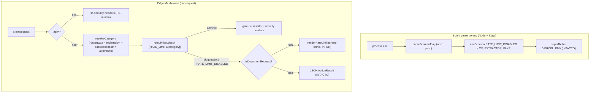

# USP-050 — Rate limiting (parse/classificação/429 PT-BR) — Design

**Spec**: `.specs/features/ajustes-uat/usp-050-rate-limiting/spec.md`
**Status**: Draft

> **Adaptar, não re-derivar (design upstream).** As decisões de arquitetura do rate limit estão fixadas em
> **technical-design §8** (tetos/janelas), **ADR-0029** (hardening/anti-brute-force), **ADR-0014** (CAPTCHA como
> defesa complementar) e no design da US #200/#201. Este design **não re-decide** nenhuma delas — só ajusta a
> **classificação** (que categoria/quando conta) e o **parse** de uma flag. Buckets, tetos e janelas **herdados**
> (`anonymous`/`authenticated`/`registration`/`passwordReset`/`responsibleLookup`) e o algoritmo de janela
> deslizante (`rateLimit.ts`) ficam **intactos** (RL-MN-07). **Iteração 3 (achado adversarial do Verifier)**:
> uma categoria nova, `routerData`, foi adicionada — reusa o mesmo algoritmo/lib, só amplia o `Record` de
> categorias (ver RL-MN-08); não é uma re-decisão da arquitetura herdada.

## Decisões de projeto ativas (STATE.md `## Decisions`)

Nenhuma AD ativa conflita com esta unidade. Relevantes/conformadas:
- **Memória do projeto — guard `RATE_LIMIT_DISABLED` mira `VERCEL_ENV` (não `NODE_ENV`)**: o `superRefine` de
  `env.ts` permanece **textualmente intacto**; a mudança toca só o `preprocess` do campo (RL-MN-05).
- **Fase 8 (dossiê UAT)**: correção de fluxo sem alterar arquitetura/premissas técnicas — conformado.
- **AD-025 (casca pública)** e lição "anonimizar no View Model não basta": não há PII nesta unidade; a página 429
  é estática/sem dados de Pessoa. Nenhuma interação.

Nenhuma decisão nova de projeto é criada (mudanças são feature-local). Nenhuma AD é superseded.

## Architecture Overview

Três pontos de mudança, todos **medidos pela cobertura** (`src/shared/**`, `src/middleware.ts`) — nenhum arquivo
em `src/app/**` (a página 429 é servida **do Edge**, evitando a regressão de branch-gate do projeto):



**Fluxo de decisão do 429** (PUB-1c): `isDocumentRequest` = `Accept` contém `text/html`. Só o ramo de documento
vira HTML; RSC/fetch/Server Action seguem JSON (RL-MN-06). **Correção pós-Verifier**: o check `rsc !== '1'` era
código morto (`rsc` nunca chega ao middleware no servidor real) — removido; `Accept` sozinho é suficiente.

**Fluxo de classificação** (PUB-2/SOC-1/PUB-1b): `resolveCategory` roteia, em ordem —
1. `routerData` (iteração 3): GET/HEAD com `Next-Url` presente (fetch de dados do client router — prefetch ou
   soft-nav, indistinguíveis nesta versão do Next).
2. `registration`: `path` é o segmento público `/cadastro` (exato ou `/cadastro/…`) **e** o método é mutação
   (POST).
3. `passwordReset`: `/recuperar-senha`/`/reivindicar-credencial`.
4. `authenticated`/`anonymous`: default, por cookie de sessão.

`/cadastro-assistido` nunca casa (2) — cai em (4). Uma mutação nunca cai em (1) — gate de método explícito.

**Fluxo `routerData`** (PUB-1b — **corrigido duas vezes**): iteração 2 tentou um bypass total (nunca entra no
`rateLimiter`); **refutado pela verificação adversarial (iteração 3)** — `Next-Url` é forjável, então um bypass
total é um opt-out gratuito e não-autenticado da proteção anti-scraping (ADR-0029). Correção final: `routerData`
passa pelo **mesmo** `rateLimiter.check`/429/headers que qualquer outra categoria, só que com um teto
generoso-mas-finito (`RATE_LIMITS.routerData`, 60/min) — ver Tech Decisions para a justificativa do número. O
gate de método garante que uma mutação nunca cai nessa categoria.

---

## Code Reuse Analysis

### Existing Components to Leverage

| Component | Location | How to Use |
| --- | --- | --- |
| `envSchema` + `parseEnv` + `superRefine` | `src/shared/env.ts` | Editar **só** o `preprocess` de `RATE_LIMIT_DISABLED` e `CV_EXTRACTOR_FAKE` para chamar `parseBooleanFlag`. `superRefine` e `AUTH_LOGIN_ENABLED` **inalterados**. |
| `middleware` + `resolveCategory` + `isAuthenticated` + `applyRateLimitHeaders` + `logRateLimited` | `src/middleware.ts` | `resolveCategory` passa a considerar método + segmento + `Next-Url` (categoria `routerData`, testada antes das demais); ramo 429 decide HTML×JSON. Helpers de header/log reusados. Sem ramo de bypass — todo request passa pelo mesmo `check`. |
| `rateLimiter` (singleton) + `RATE_LIMITS` + `RateLimitResult` | `src/shared/lib/rateLimit.ts` | Algoritmo/singleton **consumidos como estão** (RL-MN-07). `RATE_LIMITS` ganha a chave nova `routerData` (iteração 3, adição explicitamente autorizada) — categorias herdadas byte-a-byte inalteradas. |
| `applySecurityHeaders` / `securityHeaders` | `src/shared/lib/securityHeaders.ts` | Aplicado à resposta 429 (HTML e JSON) e às respostas normais — **inalterado**. A CSP `style-src 'unsafe-inline'` já permite o `<style>` inline da página 429. |
| `clientIp` | `src/shared/lib/clientIp.ts` | Reusado para a chave do bucket — **inalterado**. |
| base `validEnv` + testes `parseEnv` | `src/shared/__tests__/env.test.ts` | Estender com as variações de flag (fail-loud, Vercel-guard, CI-path). |
| padrão de teste do middleware (`req()` helper, `rateLimiter.reset()`, mock `Math.random`) | `src/middleware.test.ts` | Estender: `reqPost`/opção de método, header de prefetch, header `rsc`, `Accept`. |

### Integration Points

| System | Integration Method |
| --- | --- |
| Edge Runtime (Next 15) | Todos os helpers novos são **Edge-safe** (só `Request`/`Headers`/strings; sem Node/`Buffer`/fs). |
| Next App Router | Sinais de request lidos dos headers (`Next-Router-Prefetch`, `rsc`, `Accept`) confirmados via Context7 (doc do Next 15). |
| CSP (`securityHeaders`) | A resposta HTML 429 usa `<style>` inline coberto por `style-src 'unsafe-inline'`; sem asset externo (`default-src 'self'`). |

---

## Components

### 1. `parseBooleanFlag` — parser de flag booleana fail-loud (novo, puro)

- **Purpose**: Converter uma env string em `boolean` reconhecendo as grafias usuais e devolvendo o valor **cru**
  (sentinela) para qualquer string não reconhecida, de modo que `z.boolean()` reprove e o boot **falhe ruidoso**.
- **Location**: `src/shared/lib/env-flags.ts` (+ export nomeado; usado por `src/shared/env.ts`)
- **Interfaces**:
  - `parseBooleanFlag(raw: unknown): unknown` — `boolean` in → devolve o próprio boolean; `string` in → `trim()`+
    `toLowerCase()`: `'true'|'1'|'yes'|'on'` → `true`; `'false'|'0'|'no'|'off'|''` → `false`; **qualquer outra
    string** → devolve a string **inalterada** (reprova em `z.boolean()`); qualquer outro tipo (ex.: `undefined`)
    → devolve inalterado (deixa o `.default()` agir).
- **Dependencies**: nenhuma (função pura).
- **Reuses**: idioma de preprocess já usado em `env.ts` (`typeof v === 'string' ? … : v`).

> **Nota de ordem Zod**: em `z.preprocess(parseBooleanFlag, z.boolean()).default(false)`, o `ZodDefault`
> curto-circuita quando o input é `undefined` (chave ausente) → `false`; para chave presente, `parseBooleanFlag`
> roda antes de `z.boolean()`. `''` é mapeado explicitamente a `false` (linha vazia = não-setada).

### 2. `rateLimitResponse` — sinais de request + página 429 (novo, Edge-safe)

> **Ciclo de fix pós-Verifier (2026-07-12, achado empírico do live outcome-check).** O live outcome-check
> (`npm run build && npm run start` real + `curl -v` + browser Chromium real via Playwright) refutou a premissa
> original: `Next-Router-Prefetch`, `RSC` e o query `_rsc` **nunca chegam** a `request.headers`/`request.nextUrl`
> dentro do Edge Middleware no Next 15.5.18 real (consumidos internamente antes de invocar o middleware do
> usuário — confirmado com instrumentação temporária revertida). O sinal `Next-Url` **sobrevive** e é usado no
> lugar de `Next-Router-Prefetch`; `rsc==='1'` foi removido de `isDocumentRequest` (mesma raiz, dead code).
> `isPrefetchRequest` foi renomeado para `isRouterDataRequest` (escopo ampliado: cobre prefetch + navegação
> client-side real, indistinguíveis no middleware real — ver spec.md Assumptions).

- **Purpose**: Isolar (a) o reconhecimento de **fetch de dados do client router** (prefetch + navegação
  client-side real) e de **navegação de documento** a partir dos headers e (b) a renderização da **página 429
  PT-BR**, mantendo o `middleware.ts` enxuto e os predicados unit-testáveis.
- **Location**: `src/shared/lib/rateLimitResponse.ts` (+ exports nomeados)
- **Interfaces**:
  - `isRouterDataRequest(headers: Headers): boolean` — `headers.get('next-url') !== null`
    (fallback secundário: `headers.get('purpose') === 'prefetch'`).
  - `isDocumentRequest(headers: Headers): boolean` — `(headers.get('accept') ?? '').includes('text/html')`.
  - `renderRateLimitedHtml(retryAfterSeconds: number): string` — HTML PT-BR **self-contained**: `<!doctype html>`,
    `<html lang="pt-BR">`, `<title>Muitas requisições — Portal ASONSEG</title>`, `<h1>` + parágrafo de
    "aguarde ~N segundos e tente novamente", `<a href="/">Voltar ao início</a>`; `<style>` inline mínimo; **sem**
    `http(s)://` externo, fonte/CDN ou imagem remota.
- **Dependencies**: nenhuma (funções puras de `Headers`/número → string/boolean).
- **Reuses**: strings PT-BR no mesmo tom das mensagens de erro existentes; casca mínima (não a casca `(public)`,
  que é de rota — indisponível no Edge).

### 3. `middleware` — wiring da classificação (routerData/registration/passwordReset/auth) e 429 (editar)

- **Purpose**: Classificar todo request numa categoria (incluindo a nova `routerData`) e decidir HTML×JSON no
  429, sem tocar o algoritmo de rate limit nem introduzir um ramo de bypass.
- **Location**: `src/middleware.ts`
- **Interfaces** (mudanças internas):
  - **Sem bypass** (revertido da iteração 2 após o achado adversarial): todo request, após o branch `/api`, passa
    por `resolveCategory` → `rateLimiter.check` → 429/headers, igual para qualquer categoria. `result` volta a
    ser não-nulo sempre (simplifica de volta à estrutura anterior à USP-050).
  - `resolveCategory(request)`:
    ```
    const path = request.nextUrl.pathname;
    const isMutation = request.method !== 'GET' && request.method !== 'HEAD';

    if (!isMutation && isRouterDataRequest(request.headers)) return 'routerData';

    const isPublicCadastro = path === '/cadastro' || path.startsWith('/cadastro/');
    if (isPublicCadastro && isMutation) return 'registration';
    if (path.startsWith('/recuperar-senha') || path.startsWith('/reivindicar-credencial')) return 'passwordReset';
    return isAuthenticated(request) ? 'authenticated' : 'anonymous';
    ```
    `routerData` é testada **primeiro** (antes de `registration`) mas só para GET/HEAD — o gate de método é
    defesa em profundidade: confirmado empiricamente que um Server Action POST real não carrega `Next-Url`, mas
    o gate explícito remove qualquer ambiguidade futura (PUB-2 exige que mutações sempre contem). (Remove o ramo
    morto `startsWith('/cadastrar')`.)
  - Ramo 429 (`!result.allowed && !env.RATE_LIMIT_DISABLED`): se `isDocumentRequest(request.headers)` →
    `new NextResponse(renderRateLimitedHtml(result.retryAfterSeconds), { status: 429 })` com
    `Content-Type: text/html; charset=utf-8`; senão → o `NextResponse.json({ ok:false, … })` **atual** (intacto).
    Ambos setam `Retry-After`, `Cache-Control: no-store`, `applyRateLimitHeaders(…, 0, resetAt)` e
    `applySecurityHeaders(…)`.
- **Dependencies**: `rateLimitResponse` (novo), `rateLimit`/`securityHeaders`/`clientIp`/`env` (existentes).
- **Reuses**: `logRateLimited`, `applyRateLimitHeaders`, `applySecurityHeaders`, `isAuthenticated`.

### 4. `env.ts` — wiring do parser (editar)

- **Purpose**: Trocar o `preprocess` frágil de `RATE_LIMIT_DISABLED` e `CV_EXTRACTOR_FAKE` por `parseBooleanFlag`.
- **Location**: `src/shared/env.ts`
- **Interfaces**: `RATE_LIMIT_DISABLED: z.preprocess(parseBooleanFlag, z.boolean()).default(false)` (idem
  `CV_EXTRACTOR_FAKE`). `superRefine` e `AUTH_LOGIN_ENABLED` **inalterados**.
- **Dependencies**: `parseBooleanFlag` (comp. 1).
- **Reuses**: `envSchema`/`runtimeEnvSchema`/`parseEnv` existentes.

---

## Data Models

Nenhum. Sem schema/migração. Sem novo tipo persistido (`rateLimiter` continua em memória, `Map` por processo).
`RateLimitResult` inalterado. `RateLimitCategory` (`keyof typeof RATE_LIMITS`) ganha `'routerData'` automaticamente
ao adicionar a chave — nenhuma mudança manual de tipo. `RATE_LIMITS`: categorias herdadas byte-a-byte inalteradas;
`routerData` é a única adição (iteração 3, autorizada explicitamente — ver RL-MN-07/08 em spec.md).

---

## Error Handling Strategy

| Error Scenario | Handling | User Impact |
| --- | --- | --- |
| `RATE_LIMIT_DISABLED`/`CV_EXTRACTOR_FAKE` com valor não reconhecido | `parseBooleanFlag` devolve a string crua → `z.boolean()` reprova → `parseEnv` lança a mensagem agregada PT-BR citando o campo (fail-fast no boot) | Boot falha ruidoso (dev/deploy) em vez de proteção silenciosamente errada |
| `RATE_LIMIT_DISABLED=true` num deploy Vercel real | `superRefine` (intacto) adiciona issue `VERCEL_ENV` → boot falha | Deploy real nunca sobe com rate limit desligado (fail-closed) |
| 429 em navegação de documento | Página HTML PT-BR + `Retry-After` + `no-store` | Usuário lê explicação em português, sabe quanto esperar |
| 429 em RSC/fetch/Server Action | JSON `{ok:false, error:{code:'RATE_LIMITED', message}}` (intacto) | Cliente RSC/Action recebe o shape esperado, sem quebrar |
| Fetch de dados do client router (prefetch ou soft-nav) do volume típico de navegação | Roteado para a categoria `routerData` (60/min — GET/HEAD com `Next-Url`); conta, mas fica bem abaixo do teto | Navegação real não é penalizada; documento (bucket independente) também não |
| `Next-Url` forjado em loop pelo mesmo IP (achado adversarial, iteração 3) | `routerData` bloqueia com 429 ao exceder 60/min — mesmo pipeline de qualquer categoria | Scraper limitado a ~1 req/s sustentado; não é mais um opt-out gratuito |
| Request sem `Accept` no 429 | Ramo JSON (falha segura) | Sem HTML indevido; comportamento previsível |

---

## Risks & Concerns

| Concern | Location (file:line) | Impact | Mitigation |
| --- | --- | --- | --- |
| Teste-âncora `middleware.test.ts:63-70` fixa o comportamento **bugado** (GET `/cadastro` = `registration`) | `src/middleware.test.ts:63` | Ao corrigir PUB-2, esse teste quebra | **Atualizar** o teste para POST (mantém a asserção 3/15min sob submissão) + teste novo GET→anônimo. É adequação de contrato deliberada (spec Assumptions), não enfraquecimento — documentado em tasks (T4). |
| ~~Confiar só em `RSC: 1`/`?_rsc=` para detectar prefetch classificaria navegações soft como prefetch~~ **MATERIALIZADO NO LIVE OUTCOME-CHECK** (iteração 2) | `src/shared/lib/rateLimitResponse.ts` | O sinal documentado (`Next-Router-Prefetch: 1`) confirmado Context7 **nunca chega** a `request.headers` no servidor real (Next 15.5.18) — o risco anotado aqui na fase de design se concretizou; `PREF-01/RL-MN-01` falharam no live outcome-check do Verifier. | **Corrigido na iteração 2**: sinal trocado para `Next-Url` (confirmado empiricamente sobrevivente); escopo ampliado para cobrir prefetch + soft-nav. |
| ~~Um bypass total baseado em `Next-Url` seria seguro~~ **REFUTADO PELA VERIFICAÇÃO ADVERSARIAL** (iteração 3) | `src/middleware.ts` (`resolveCategory`, iteração 2) | `Next-Url` é um header comum, forjável por qualquer cliente HTTP — o bypass total virou um opt-out gratuito e não-autenticado do rate limit anônimo para toda rota GET pública, anulando ADR-0029/US #200. Confirmado ao vivo: `curl -H "Next-Url: /" ...` em loop nunca gerava 429. Lição L-016. | **Corrigido na iteração 3**: bypass total substituído pela categoria `routerData` (teto 60/min, generoso-mas-finito) — conta e bloqueia como qualquer categoria; RL-MN-08 é o sensor. |
| Servir HTML a um request RSC quebraria o cliente Flight | `src/middleware.ts` (ramo 429) | Server Actions/RSC receberiam HTML e falhariam | `isDocumentRequest` exige `Accept: text/html`; `rsc==='1'` era dead code (removido no ciclo de fix — nunca chega ao middleware real). RL-MN-06 é o sensor; confirmado ao vivo que um Server Action POST real (`Accept: text/x-component`) segue no ramo JSON. |
| CSP bloquear a página 429 se usasse asset externo | `renderRateLimitedHtml` | Página 429 quebrada | Página 100% self-contained; `<style>` inline coberto por `style-src 'unsafe-inline'`; `default-src 'self'`. |
| Singleton `rateLimiter` compartilhado entre testes | `src/middleware.test.ts` | Contaminação de estado entre casos | `rateLimiter.reset()` no `beforeEach` (padrão já existente); vitest isola módulos por arquivo. |
| Regredir o guard `VERCEL_ENV` (memória do projeto) ao mexer no parse | `src/shared/env.ts:92-120` | Quebra do E2E de CI ou fail-closed | Mudança cirúrgica **só** no `preprocess`; `superRefine` textualmente intacto; RL-MN-05 cobre ambos os lados. |

> Nenhuma outra fragilidade nova encontrada nas áreas tocadas.

---

## Tech Decisions (only non-obvious ones)

| Decision | Choice | Rationale |
| --- | --- | --- |
| Onde servir a página 429 | **Do Edge Middleware** (string HTML), não de uma rota Next | O middleware retorna antes do roteamento; `not-found.tsx`/`error.tsx` só chegam na USP-059. Mantém a correção auto-contida e **fora de `src/app/**`** (evita a regressão de branch-gate: `src/app` não entra no coverage include). |
| ~~Sinal de prefetch~~ Sinal de fetch do client router | ~~`Next-Router-Prefetch: 1`~~ → **`Next-Url`** (revisado na iteração 2) | O sinal documentado (`Next-Router-Prefetch: 1`) **nunca chega** a `request.headers` no servidor real (Next 15.5.18) — refutado empiricamente (curl -v + browser real). `Next-Url` é o sinal que sobrevive, presente em toda fetch de dados RSC (prefetch **e** navegação client-side real — as duas indistinguíveis no middleware desta versão). |
| ~~Tratamento do fetch de dados do client router~~ Bypass total → **categoria `routerData` (60/min)** (revisado na iteração 3, verificação adversarial) | ~~Excluir da contagem~~ → Rotear para `RATE_LIMITS.routerData = { limit: 60, windowMs: 60_000 }`, testado antes de `registration` em `resolveCategory`, restrito a GET/HEAD | `Next-Url` é forjável — um bypass total anulava a proteção anti-scraping de toda rota GET pública (ADR-0029). 60/min é ~4-7x o volume medido de uma navegação real (8-15 router-fetches/load — dossiê PUB-1b e outcome-check da iteração 2) e reusa o teto já aceito de `authenticated` (não é um número novo); ainda limita um scraper forjando o header a ~1 req/s sustentado. Confirmado ao vivo: 60 requests forjados → 200, a 61ª → 429. |
| Sinal HTML×JSON | `Accept: text/html` (check `rsc` removido) | Casa exatamente o dossiê ("Accept text/html → HTML; RSC/fetch → JSON") e falha segura (sem Accept → JSON). O check `!== 'rsc:1'` era código morto (mesma raiz do achado acima) — removido no ciclo de fix; `Accept` sozinho já discriminava corretamente. |
| `registration` por método | Mutação = método ≠ GET/HEAD (POST) | A cota foi dimensionada para submissões (TD §8). Server Actions são sempre POST. |
| Matcher por segmento exato | `=== '/cadastro' || startsWith('/cadastro/')` | Exclui `/cadastro-assistido` (SOC-1) e mantém `/cadastro/consentimento`. Remove o ramo morto `/cadastrar`. |
| Estender o parser a `CV_EXTRACTOR_FAKE` | Sim (mesmo idioma/guard); **não** a `AUTH_LOGIN_ENABLED` | Consistência sem inventar regra; `AUTH_LOGIN_ENABLED` tem semântica oposta (default-on). |
| Helper puro `parseBooleanFlag` em `shared/lib` | Arquivo próprio, medido, unit-testável | Evita lógica não-testada em `env.ts`; segue a lição do projeto (núcleo puro em módulo medido). |

> **Project-level decisions:** nenhuma — todas as decisões acima são feature-local (não viram AD-NNN).
