# USP-051 — Robustez de Formulários — Design

**Spec**: `.specs/features/ajustes-uat/usp-051-robustez-forms/spec.md`
**Status**: Draft

---

## Architecture Overview

Seis correções pontuais e independentes, cada uma num arquivo já existente. Nenhuma
introduz módulo, rota, migração, dependência ou padrão novo — são edições
comportamentais de robustez em formulários e config. Não há decisão arquitetural: o
design existe para fixar **onde** e **como** cada fix entra e **quais contratos de
teste** preservar.

```mermaid
graph TD
    subgraph "Credencial (ORQ-3 / RF-01)"
      A[LoginForm.tsx] -->|method=post| A1[sem GET fallback]
      B[ChangePasswordForm / PasswordResetForm / PasswordResetRequestForm] -->|method=post| A1
    end
    subgraph "CSP (ORQ-2 / RF-02)"
      C[securityHeaders.ts buildCsp] -->|+unsafe-eval se NODE_ENV=development| C1[dev hidrata / prod inalterada]
    end
    subgraph "Vaga (EMP-1+EMP-6 / RF-03,RF-04)"
      D[publish-job.schema.ts superRefine] -->|guarda data inválida antes de validadeStatus| D1[sem RangeError]
      E[job-form.tsx form] -->|noValidate| E1[erro PT-BR do Zod]
    end
    subgraph "CV (CAND-5 / RF-05)"
      F[next.config.ts] -->|serverActions.bodySizeLimit=6mb| F1[CV 1-5MB passa]
      G[CvUploadForm.tsx onUploadClick] -->|guard MAX_CV_BYTES| F1
    end
    subgraph "Trocar senha (AUTH-7 / RF-06)"
      H[trocar-senha/page.tsx] -->|getCurrentPerson primeiroAcesso| H1[texto condicional]
    end
```



---

## Code Reuse Analysis

### Existing Components to Leverage

| Component | Location | How to Use |
| --- | --- | --- |
| `buildCsp` (memoizado) | `src/shared/lib/securityHeaders.ts:37` | Estender `script-src` condicionalmente por `process.env.NODE_ENV`; incluir o flag de ambiente na `cacheKey` |
| `publishJobSchema.superRefine` | `src/modules/jobs/schemas/publish-job.schema.ts:101` | Guardar `new Date(data.validUntil)` inválida antes de chamar `validadeStatus` |
| `validadeStatus` | `src/modules/jobs/domain/validade.ts:26` | **Não alterar** — a causa é o `superRefine` chamá-la com `Invalid Date`; `formatInTimeZone` lança `RangeError` sobre data inválida |
| `MAX_CV_BYTES` / `isWithinCvSizeLimit` | `src/modules/cv-extraction/domain/mime.ts:14,58` | Reusar no guard client do `CvUploadForm` (módulo-leaf puro, mesma fonte de verdade que a Server Action `upload-cv.ts` já usa — sem duplicar constante) |
| `getCurrentPerson` (retorna `primeiroAcesso`) | `src/modules/identity/server/session.ts:41` (barrel `@/modules/identity`) | Ler na page `/trocar-senha` (Server Component) para condicionar o texto |
| RHF `handleSubmit` (`preventDefault`) | todos os forms | Garante que `method="post"` fica **inerte** pós-hidratação — nenhum submit nativo ocorre |
| Primitivos `FormHeader`/`FormCard`/`StepIcon` | `@/shared/ui` | `/trocar-senha` mantém a composição; só a prop `description` vira condicional |

### Integration Points

| System | Integration Method |
| --- | --- |
| Edge Middleware (`src/middleware.ts`) | Já chama `applySecurityHeaders` → `buildCsp`; o fix da CSP é transparente ao middleware (nenhuma mudança lá) |
| Next.js Server Actions transport | `experimental.serverActions.bodySizeLimit` (Next 15.5 — verificado via Context7: fica sob `experimental.serverActions`, aceita string `'6mb'`; limite efetivo = `state + body`) |
| Supabase Auth / Prisma | `getCurrentPerson` já resolve sessão + `credential.primeiroAcesso`; `/trocar-senha` é `force-dynamic`, então a leitura extra é aceitável |

---

## Components

### 1. `securityHeaders.ts` — CSP `unsafe-eval` só em dev (RF-02, RF-MN-02)

- **Purpose**: Liberar `'unsafe-eval'` no `script-src` **apenas** em desenvolvimento.
- **Location**: `src/shared/lib/securityHeaders.ts` (função `buildCsp`).
- **Change**:
  - Dentro de `buildCsp`, computar `const isDev = process.env.NODE_ENV === 'development';`
  - Montar `script-src` como `["'self'", "'unsafe-inline'", TURNSTILE_ORIGIN]` e
    `if (isDev) scriptSrc.push("'unsafe-eval'")`.
  - **Cache**: alterar `cacheKey` para `` `${supabaseOrigin ?? ''}|${isDev}` `` — a
    política passa a variar por ambiente; sem isso a memoização retornaria valor
    obsoleto ao alternar `NODE_ENV` (e os testes com `vi.stubEnv` falhariam).
- **Edge-safe**: `process.env.NODE_ENV` é inlinado pelo Next no Edge — sem dep de Node
  (mantém o invariante do arquivo).
- **Reuses**: estrutura e memoização existentes.
- **Preserva**: `securityHeaders.test.ts` (roda sob `NODE_ENV='test'` → sem
  `unsafe-eval`; nenhum assert existente checa `unsafe-eval`).

### 2. `publish-job.schema.ts` — guardar data inválida no `superRefine` (RF-03, RF-MN-03)

- **Purpose**: Não lançar `RangeError` quando `validUntil` é vazia/inválida.
- **Location**: `src/modules/jobs/schemas/publish-job.schema.ts` (bloco `superRefine`, ~linha 114).
- **Change**: substituir
  ```ts
  const status = validadeStatus(new Date(data.validUntil), new Date());
  if (status === 'passado') { … } else if (status === 'excede_teto') { … }
  ```
  por um guard que só chama `validadeStatus` quando a data é parseável:
  ```ts
  const parsed = new Date(data.validUntil);
  if (!Number.isNaN(parsed.getTime())) {
    const status = validadeStatus(parsed, new Date());
    if (status === 'passado') { … } else if (status === 'excede_teto') { … }
  }
  ```
- **Rationale**: para `validUntil === ''`, o campo-level `validUntilStr` (`.min(1)` +
  `.refine`) já emite "Data de validade é obrigatória."/"…inválida."; o objeto entra
  no `superRefine` com status *dirty* (não *aborted*), então o callback roda com
  `data.validUntil = ''` → `new Date('')` = `Invalid Date` → `validadeStatus` →
  `formatInTimeZone(Invalid Date,…)` **lança `RangeError`**. O guard evita a chamada;
  a mensagem de campo já cobre o caso vazio/inválido.
- **Reuses**: `validadeStatus` (intacta), mensagens existentes.
- **Preserva**: `publish-job.schema.spec.ts` — passado (`'2020-01-01'`), teto e happy
  path usam datas válidas → passam pelo guard → comportamento idêntico.

### 3. `job-form.tsx` — `noValidate` no formulário (RF-04)

- **Purpose**: Suprimir a validação nativa (tooltip em inglês) e deixar o Zod PT-BR
  assumir.
- **Location**: `src/modules/jobs/components/job-form.tsx` (`<form onSubmit={handleSubmit(onPublish)} …>`, ~linha 184).
- **Change**: adicionar `noValidate` ao `<form>` (mesmo padrão já usado em
  `LoginForm`/`ChangePasswordForm`/`PasswordResetForm`). Os atributos `min`/`max` do
  `<input type="date">` **permanecem** (afordância do date picker; não validam mais
  nativamente porque o form é `noValidate`).
- **Reuses**: padrão `noValidate` dos forms de auth.
- **Preserva**: `job-form.spec.tsx` (nenhum assert sobre `noValidate`; submit segue via
  RHF). Depende do fix #2 para que o submit com data vazia renderize erro sem crash.

### 4. `LoginForm.tsx` — `method="post"` (RF-01, RF-MN-01)

- **Purpose**: Fallback nativo pré-hidratação vira POST → sem credencial na URL.
- **Location**: `src/modules/identity/components/LoginForm.tsx` (`<form onSubmit={handleSubmit(onSubmit)} noValidate …>`, ~linha 66).
- **Change**: adicionar `method="post"` ao `<form>` (fica inerte pós-hidratação — RHF
  `handleSubmit` chama `preventDefault`). Sem `action` (não há rota POST; o objetivo é
  só impedir o GET com query string).
- **Preserva**: `LoginForm.test.tsx` (caminho feliz, CAPTCHA adaptativo, mensagem única
  — nada muda no fluxo hidratado).

### 5. `ChangePasswordForm.tsx` + `PasswordResetForm.tsx` + `PasswordResetRequestForm.tsx` — `method="post"` (RF-01, RF-MN-01)

- **Purpose**: Mesma proteção nos demais formulários de credencial/senha.
- **Location**: `src/modules/identity/components/{ChangePasswordForm,password-reset-form,password-reset-request-form}.tsx`.
- **Change**: adicionar `method="post"` ao `<form>` de cada um (mudança de uma linha,
  idêntica). `PasswordResetRequestForm` (só e-mail) entra por defesa em profundidade.
- **Preserva**: `ChangePasswordForm.test.tsx`, `PasswordResetForms.test.tsx`.

### 6. `next.config.ts` — `serverActions.bodySizeLimit` (RF-05, RF-MN-04)

- **Purpose**: Permitir CVs de até 5 MB (CVE-01) no transporte de Server Action.
- **Location**: `src/../next.config.ts` (objeto `nextConfig`).
- **Change**: adicionar
  ```ts
  experimental: { serverActions: { bodySizeLimit: '6mb' } },
  ```
  (preservar `outputFileTracingRoot`/`outputFileTracingIncludes` existentes).
- **Rationale**: default 1 MB < 5 MB → CV válido estoura (HTTP 413) antes da action;
  `'6mb'` cobre 5 MB + folga do `state` do RSC. Verificado via Context7 que em Next
  15.x o parâmetro fica sob `experimental.serverActions`.

### 7. `CvUploadForm.tsx` — guard de tamanho no cliente (RF-05, RF-MN-04)

- **Purpose**: Barrar CV > 5 MB antes de despachar a action, com mensagem PT-BR.
- **Location**: `src/modules/cv-extraction/components/CvUploadForm.tsx` (função `onUploadClick`, ~linha 79).
- **Change**: após obter `file` e antes de `startTransition`/`uploadCv`, checar o
  tamanho reusando o domínio:
  ```ts
  import { MAX_CV_BYTES, isWithinCvSizeLimit } from '../domain/mime';
  // …
  if (!isWithinCvSizeLimit(file.size)) {
    setServerError('O arquivo excede o limite de 5 MB. Envie um currículo menor.');
    return; // não chama uploadCv
  }
  ```
- **Rationale**: `domain/mime.ts` é módulo-leaf puro (sem IO/Prisma) — a mesma fonte
  de verdade usada por `upload-cv.ts` (server). Sem duplicar a constante (diferente do
  carve-out de `EDUCATION_LEVELS`, que existe porque o *barrel* arrasta Prisma; aqui o
  import é do leaf direto).
- **Preserva**: `CvUploadForm.test.tsx` (o `pdfFile()` de teste é pequeno → passa pelo
  guard; nenhum fluxo existente muda).

### 8. `trocar-senha/page.tsx` — texto condicional (RF-06, RF-MN-05)

- **Purpose**: Só afirmar "primeiro acesso" quando de fato é 1º acesso.
- **Location**: `src/app/(auth)/trocar-senha/page.tsx`.
- **Change**: tornar a page `async`, ler `const person = await getCurrentPerson()`
  (barrel `@/modules/identity`), e escolher a `description` do `FormHeader`:
  - `person?.primeiroAcesso` → "Este é seu primeiro acesso. Por segurança, escolha uma
    nova senha para continuar."
  - senão → "Por segurança, escolha uma nova senha para continuar."
  - Título "Defina sua nova senha" e a composição (`StepIcon`/`FormCard`/
    `ChangePasswordForm`) permanecem. A page **não** confina (sem `redirect`) — ADR-0030.

---

## Data Models

N/A — nenhuma mudança de modelo, schema Prisma ou migração.

---

## Error Handling Strategy

| Error Scenario | Handling | User Impact |
| --- | --- | --- |
| Submit de credencial pré-hidratação | `<form method="post">` → POST nativo (corpo), sem query string | Sem vazamento de credencial na URL (RF-MN-01) |
| Validade vazia/inválida no submit de vaga | `superRefine` guarda a data; campo-level emite mensagem PT-BR | "Data de validade é obrigatória." inline; botão responsivo |
| CV > 5 MB selecionado | Guard client bloqueia antes da action | Mensagem PT-BR de tamanho; sem "Application error" |
| CV 1–5 MB | `bodySizeLimit: '6mb'` deixa passar | Upload prossegue normalmente |
| `/trocar-senha` sem sessão | `getCurrentPerson()` retorna `null` → copy neutra | Sem texto enganoso de 1º acesso |
| Dev hidratação React | `'unsafe-eval'` liberado só em `development` | Login operante em `npm run dev`; prod inalterada |

---

## Risks & Concerns

| Concern | Location (file:line) | Impact | Mitigation |
| --- | --- | --- | --- |
| Memoização da CSP pode servir valor obsoleto ao variar ambiente | `securityHeaders.ts:38` (`cspCache`) | Testes com `vi.stubEnv` e/ou runtime poderiam ler CSP de outro ambiente | Incluir o flag `isDev` na `cacheKey`; testes fazem `vi.stubEnv('NODE_ENV', …)` + `vi.unstubAllEnvs()` no `afterEach` |
| `method="post"` pré-hidratação faz o navegador POSTar para a rota-página (sem handler POST → 405) | forms de credencial | Numa janela rara pré-hidratação, um 405 aparece — mas **sem vazamento** (objetivo do must-not) | Aceito: o must-not é sobre o vazamento na URL, não sobre servir a página; pós-hidratação o RHF impede qualquer submit nativo |
| `RangeError` de data podia mascarar outros pontos que chamam `validadeStatus` com data crua | `publish-job.schema.ts:114` | Só o `superRefine` chama com input de cliente não sanitizado; os demais usos partem de `@db.Date` | Fix contido no `superRefine`; `validadeStatus` permanece intacta (é o chamador que sanitiza) |
| Import de `domain/mime` no Client Component | `CvUploadForm.tsx` | Se `mime.ts` puxasse algo server-only quebraria o bundle client | `domain/mime.ts` é leaf puro (só `MAX_CV_BYTES`/`detectCvMime`/`isWithinCvSizeLimit`, sem IO) — o Implementer confirma que não há import server-only antes de commitar |
| `/trocar-senha` passa a fazer leitura de sessão/DB no render | `trocar-senha/page.tsx` | +1 read por render | Página `force-dynamic`, baixíssimo tráfego (1º acesso/troca) — custo desprezível |

> Nenhuma outra fragilidade nova introduzida — todas as mudanças são localizadas.

---

## Tech Decisions (only non-obvious ones)

| Decision | Choice | Rationale |
| --- | --- | --- |
| Anti-GET-fallback | `method="post"` inerte (não disable-até-hidratar) | Impede o vazamento independente do timing de hidratação; sem flash de botão nem efeito de estado de hidratação |
| CSP dev flag | `process.env.NODE_ENV === 'development'` dentro de `buildCsp` + na `cacheKey` | `NODE_ENV` é constante por processo e Edge-safe; incluir na chave torna o contrato testável |
| Fix de EMP-1 no schema (não no componente) | Guardar a data no `superRefine` | A causa raiz é o `superRefine`; corrigir lá cobre qualquer consumidor do schema (form, action) |
| EMP-6 via `noValidate` (não remover `min`/`max`) | `noValidate` no `<form>` | Mantém a afordância do date picker; alinhado ao padrão já usado nos forms de auth |
| `bodySizeLimit: '6mb'` | Folga de ~1 MB sobre 5 MB | Cobre `state + body` do RSC sem afrouxar demais a proteção a DDoS |
| Reuso de `MAX_CV_BYTES` no cliente | Import do leaf `domain/mime` | Fonte única do limite (mesma que a action); sem duplicar constante |

> **Project-level decisions:** nenhuma. Todas as escolhas são feature-local
> (correções pontuais); não estabelecem convenção nova para o STATE (`AD-NNN`).
> Conformam às decisões ativas (AD-014 Design System, ADR-0030 sessão/1º acesso,
> ADR-0014 CSP/Turnstile, CVE-01 limite de 5 MB, L-007 E2E diferido).
