# USP-054 — Ciclo de vida da vaga no painel (Design)

**Spec**: `.specs/features/ajustes-uat/usp-054-ciclo-vida-vaga/spec.md`
**Status**: Draft

> Quatro correções ortogonais sobre superfícies existentes. **Sem mudança de arquitetura**: FSM via
> `transitionContent` (ADR-0011), View Models, adapters e ADR-0013 preservados. **Zero migração, zero
> dep nova.** Cada correção reusa mecanismo já no repo. Facts de código confirmados por investigação
> (paths e assinaturas abaixo são reais, não presumidos).

## Decisões de projeto ativas conformadas (STATE.md `## Decisions`)

| AD / ADR | Constraint | Como este design conforma |
| --- | --- | --- |
| **AD-011 / ADR-0011** | `transitionContent` é a **única via** de mudança de `Job.status` | Submeter/reenviar chamam `submitJobForModeration`→`transitionContent`. `updateJobDraft` (novo) **não** escreve `status` (só campos). Guarda estática U23-MN-07 preservada. |
| **AD-009** | status/dados **na entidade** (`Job`), padrão `CandidateProfile` | Leitura do motivo vem do `AuditLog` (já é onde o status-history vive); nenhuma tabela nova. |
| **ADR-0013** | ISR longo + on-demand `revalidateAfterTransition` | Correção reusa o adapter `next-cache-invalidation`; só destrava o early-return. TTL de vagas alinhado a 600s (**supersede** o fragmento `1800` do ADR — ver Tech Decisions). |
| **ADR-0010 / ADR-0014** | View Models controlam visibilidade por papel; DS em `@/shared/ui` | Motivo lido owner-scoped; UI reusa `Button`/`Card`/`Badge`. |
| **AD-023 (L-006)** | fuso na fixture `validUntil` (`@db.Date` truncado em UTC) já mordeu o projeto | MOD-5 é a mesma classe: `@db.Date` não passa por fuso. |

## Architecture Overview

```mermaid
graph TD
  subgraph EMP2_MOD3[EMP-2 + MOD-3 — painel do autor]
    VM[actionsForStatus + returnReason<br/>company-job-row.view.ts] --> LIST[company-job-list.tsx]
    UPD[updateJobDraft action NOVA] --> FORM[JobEditForm mode=draft-edit]
    Q[listLatestReturnReasons query NOVA<br/>lê AuditLog CONTENT_RETURNED_FOR_ADJUSTMENTS] --> PAGE[vagas/page.tsx]
    PAGE --> VM
    LIST --> ACT[company-job-actions.tsx<br/>botão Submeter/Reenviar]
    ACT --> SUBMIT[submitJobForModeration jobId<br/>JÁ EXISTE — sem mudança]
    SUBMIT --> TC[transitionContent → IN_MODERATION]
    FORM --> UPD
  end
  subgraph EMP3[EMP-3 — cache público]
    TC2[transition-content.ts:109<br/>passa from+to] --> ADP[next-cache-invalidation<br/>guarda: from===ACTIVE OU to∈ACTIVE/INACTIVATED]
    ADP --> RV["/vagas + /vagas/[id]"]
    PG600["(public)/vagas/*.tsx<br/>revalidate 1800→600"]
  end
  subgraph MOD5[MOD-5 — data]
    FMT[formatDateOnly UTC<br/>shared/lib/time.ts NOVO] --> LIST2[company-job-list.tsx:49]
    FMT --> DET[job-detail.tsx:133-139]
  end
```

**Fluxo do autor (EMP-2/MOD-3):** vaga em `DRAFT`/`AWAITING_ADJUSTMENTS` no painel → vê **Editar**
(abre `JobEditForm` em modo draft → `updateJobDraft`, salva sem transicionar) e **Submeter/Reenviar**
(botão direto → `submitJobForModeration` → FSM → `IN_MODERATION`). Para `AWAITING_ADJUSTMENTS`, o
painel exibe o **motivo** da última devolução (lido do `AuditLog`).

---

## Code Reuse Analysis

### Existing Components to Leverage

| Componente / util | Location | How to Use |
| --- | --- | --- |
| `submitJobForModeration({ jobId })` | `src/modules/jobs/actions/submit-job-for-moderation.ts` | **Reusar sem mudança** — já aceita `{ jobId }` e transiciona via FSM; a FSM já declara `DRAFT→IN_MODERATION` **e** `AWAITING_ADJUSTMENTS→IN_MODERATION`. Submeter=Reenviar. |
| `editJobSchema` / `publishJobSchema` | `src/modules/jobs/schemas/publish-job.schema.ts` | Base do `updateJobDraftSchema` (campos informativos do rascunho, incl. `validUntil`; sem `companyId`). |
| `withAudit` + `AuditEvent.JOB_DRAFT_SAVED` | `@/modules/audit` | `updateJobDraft` grava campos + audit `JOB_DRAFT_SAVED` (evento já existe, usado no ramo-form do submit). Sem evento novo. |
| `requireActiveResponsible(personId, companyId)` | `src/modules/jobs/server/…` (usado por `submitJobForModeration`, `editJob`) | Gate P-005 do `updateJobDraft` e da leitura do motivo. |
| `listCompanyRejections` (padrão) | `src/modules/companies/queries/list-company-rejections.ts` | **Molde** da nova query: `prisma.auditLog.findMany({ where:{ action, entityType:'JOB', entityId:{in} }, orderBy:{occurredAt:'desc'}, take })`. Troca `CONTENT_REJECTED`→`CONTENT_RETURNED_FOR_ADJUSTMENTS`. |
| `next-cache-invalidation` adapter + `CACHE_INVALIDATION_TOKEN` | `src/modules/moderation/adapters/next-cache-invalidation.ts`, `ports/cache-invalidation.port.ts` | Destravar o early-return; adicionar `from` ao target. Mesmos `revalidatePath`. |
| `formatInTimeZone` + `formatSaoPaulo` (padrão) | `src/shared/lib/time.ts` | Molde do `formatDateOnly` (usa `'UTC'` em vez de `America/Sao_Paulo`). `date-fns-tz` já importado. |
| `diasAteExpiracao`/`validadeStatus` | `src/modules/jobs/domain/validade.ts` | Precedente: já lê `validUntil` com `formatInTimeZone(..., 'UTC', ...)` — confirma o approach do MOD-5. |
| `JobEditForm` / edit route | `src/modules/jobs/components/job-edit-form.tsx`, `(app)/empresa/[empresaId]/vagas/[jobId]/editar/page.tsx` | Reusar com prop `mode` (`active-edit` existente | `draft-edit` novo). |
| `CompanyJobActions` | `src/modules/jobs/components/company-job-actions.tsx` | Adicionar o botão `canSubmit` (hoje só trata pause/unpause/extend/archive). |

### Integration Points

| Sistema | Integração |
| --- | --- |
| `AuditLog` (append-only, ADR-0008/0023) | Leitura read-only do motivo (`justification`) — nada escrito além do já gravado por USP-016. |
| FSM de moderação | `submitJobForModeration`→`transitionContent`; `updateJobDraft` **não** toca FSM. |
| ISR do Next (App Router) | Adapter `revalidatePath`; `export const revalidate` das páginas de vagas. |

---

## Components

### C1 — `actionsForStatus` (EMP-2) + `returnReason` no view model (MOD-3)

- **Purpose**: habilitar Editar/Submeter para `DRAFT`/`AWAITING_ADJUSTMENTS` e carregar o motivo da devolução.
- **Location**: `src/modules/jobs/views/company-job-row.view.ts`
- **Interfaces**:
  - `actionsForStatus('DRAFT')` → `{ canEdit:true, canSubmit:true, canPause:false, canUnpause:false, canArchive:false, canExtend:false }`
  - `actionsForStatus('AWAITING_ADJUSTMENTS')` → idem (`canEdit:true, canSubmit:true`, resto `false`)
  - `viewCompanyJobRow(row, returnReason?: string | null)` → adiciona `returnReason: string | null` ao `CompanyJobRowView` (só relevante em `AWAITING_ADJUSTMENTS`).
- **Reuses**: estrutura existente do `switch`; `STATUS_LABEL['AWAITING_ADJUSTMENTS']='Aguardando ajustes'` já existe.
- **Guard**: terminais (`ARCHIVED`/`EXPIRED`/`INACTIVATED`/`REJECTED`/`IN_MODERATION`) permanecem no `default` all-false (USP054-06, preserva P-006).

### C2 — `updateJobDraft` (EMP-2, action nova)

- **Purpose**: salvar edições de campos de uma vaga `DRAFT`/`AWAITING_ADJUSTMENTS` **sem** transicionar.
- **Location**: `src/modules/jobs/actions/update-job-draft.ts` (barrel `@/modules/jobs`)
- **Interfaces**:
  - `updateJobDraft(input: UpdateJobDraftInput): Promise<ActionResult<{ jobId: string; status: ContentStatus }>>`
  - Zod: `updateJobDraftSchema` = `{ jobId: uuid, ...campos informativos incl. validUntil }` (deriva de `publishJobSchema` sem `companyId`).
- **Sequência** (padrão Server Action, CLAUDE.md):
  1. Valida input (Zod).
  2. `findUnique(jobId)` → `{ id, companyId, status }`; `NOT_FOUND` se ausente.
  3. `requireActiveResponsible(person.id, job.companyId)` → `FORBIDDEN` (P-005).
  4. Precondição: `status ∈ {DRAFT, AWAITING_ADJUSTMENTS}` senão `CONFLICT` ("só rascunho/aguardando ajustes é editável por este fluxo").
  5. `withAudit(JOB_DRAFT_SAVED, tx => tx.job.updateMany({ where:{ id, status:{ in:['DRAFT','AWAITING_ADJUSTMENTS'] } }, data:{ ...fields /* SEM status */ } }))`; `count!==1` → conflito otimista (`CONFLICT`), before/after no audit.
- **Dependencies**: `withAudit`, `requireActiveResponsible`, `prisma`.
- **Reuses**: mesmo shape do ramo-form de `submitJobForModeration`/`editJob`.
- **Must-not**: **não** inclui `status` no `data:` → a guarda `no-out-of-band-status-write.test.ts` (que só varre `status:` dentro de `data:`) permanece verde. `status` só aparece no `where` (permitido, como `extend-job-validity.ts`).

### C3 — `listLatestReturnReasons` (MOD-3, query nova)

- **Purpose**: motivo da **última** devolução por vaga, owner-scoped.
- **Location**: `src/modules/jobs/queries/list-latest-return-reasons.ts` (barrel `@/modules/jobs`)
- **Interfaces**:
  - `listLatestReturnReasons(jobIds: string[]): Promise<Map<string, { reason: string | null; returnedAt: Date }>>`
  - `prisma.auditLog.findMany({ where:{ action:'CONTENT_RETURNED_FOR_ADJUSTMENTS', entityType:'JOB', entityId:{ in: jobIds } }, select:{ entityId, justification, occurredAt }, orderBy:{ occurredAt:'desc' }, take })`; reduz para o mais recente por `entityId` (USP054-08).
- **Owner-scope**: `jobIds` vêm **só** de `listCompanyJobs(companyId)` (já company-scoped) → sem vazamento cross-tenant (MN-03). `take` obrigatório (`≤ jobIds.length` do dia; ex.: `jobIds.length * K`).
- **Reuses**: `list-company-rejections.ts` verbatim (troca a `action`).

### C4 — Fiação da UI (EMP-2/MOD-3)

- **`company-job-actions.tsx`** (client): adicionar tratamento de `canSubmit` → botão **"Enviar para moderação"** (`DRAFT`) / **"Reenviar para moderação"** (`AWAITING_ADJUSTMENTS`) chamando `submitJobForModeration({ jobId })`; `router.refresh()` no sucesso; erro exibido inline (padrão dos outros botões). Recebe `status` como prop nova (para o rótulo).
- **`company-job-list.tsx`**: **remover** o `Link` de `canSubmit` (hoje aponta p/ `…/editar` — errado para submit direto); manter o `Link` de `canEdit`; **adicionar** bloco de motivo quando `row.status==='AWAITING_ADJUSTMENTS'` exibindo `row.returnReason ?? 'Sem motivo registrado'` (fallback E2); trocar `formatDate`→`formatDateOnly` (MOD-5, ver C6); passar `status` ao `CompanyJobActions`.
- **`(app)/empresa/[empresaId]/vagas/[jobId]/editar/page.tsx`**: rotear por status — `ACTIVE`→`JobEditForm mode="active-edit"` (inalterado); `DRAFT`/`AWAITING_ADJUSTMENTS`→`JobEditForm mode="draft-edit"`; demais → o `Card` "não editável" atual.
- **`job-edit-form.tsx`**: prop `mode`. `active-edit` (atual): submit→`editJob`→`submitJobForModeration`. `draft-edit` (novo): submit→`updateJobDraft` **apenas** (sem chain de submit); renderiza o campo `validUntil` (para não criar beco de validade — D-1). 
- **`(app)/empresa/[empresaId]/vagas/page.tsx`**: após `listCompanyJobs`, coletar os `jobId` `AWAITING_ADJUSTMENTS`, chamar `listLatestReturnReasons`, e mapear `viewCompanyJobRow(row, reasons.get(row.id)?.reason ?? null)`.

### C5 — Cache invalidation ao sair de ACTIVE (EMP-3)

- **Purpose**: revalidar `/vagas` e `/vagas/[id]` quando a vaga **sai** de `ACTIVE`.
- **Locations / mudanças**:
  - `src/modules/moderation/ports/cache-invalidation.port.ts`: `CacheInvalidationTarget` ganha `from: ContentStatus`.
  - `src/modules/moderation/actions/transition-content.ts:109`: passar `{ contentKind, contentId, from, to }` (o `from` já está em escopo, linha 58).
  - `src/modules/moderation/adapters/next-cache-invalidation.ts`: guarda vira
    `if (target.to !== ACTIVE && target.to !== INACTIVATED && target.from !== ACTIVE) return;`
    (mesmos `revalidatePath('/vagas')` + `/vagas/${contentId}` já existentes).
- **Reuses**: mecanismo de revalidação intacto (soft-fail, ADR-0011 R2 — E4).
- **Nota**: `eventTypeFor` **já** emite `JOB_PAUSED`/`JOB_ARCHIVED`/`JOB_EXPIRED`/etc — nenhuma mudança no catálogo de eventos nem no `transitionContent` além do payload de cache.

### C6 — `formatDateOnly` (MOD-5)

- **Purpose**: formatar DATE date-only sem deslocar o dia.
- **Location**: `src/shared/lib/time.ts` (barrel `@/shared/lib/time`)
- **Interface**: `formatDateOnly(d: Date, fmt = 'dd/MM/yyyy'): string` = `formatInTimeZone(d, 'UTC', fmt)`.
- **Uso**: `company-job-list.tsx:49` e `job-detail.tsx:133-139` trocam `formatDate(validUntil)`→`formatDateOnly(validUntil)`. `formatDate` **inalterado** (outros callers dependem dele).

### C7 — TTL das páginas de vagas (EMP-3)

- **Location**: `src/app/(public)/vagas/page.tsx:17` e `src/app/(public)/vagas/[id]/page.tsx:18` — `export const revalidate = 1800` → `600`.
- **Nota**: serviços (`/servicos`, `/servicos/[id]`, também `1800`) ficam **fora** (Out of Scope; follow-up documentado).

---

## Data Models

Nenhum modelo novo. Leitura read-only de `AuditLog` (append-only). `Job.validUntil` segue `@db.Date`
(date-only, por design). Aditivo ao port `CacheInvalidationTarget`: campo `from`.

---

## Error Handling Strategy

| Cenário | Handling | User Impact |
| --- | --- | --- |
| Editar/submeter/reenvio por não-responsável | `updateJobDraft`→`FORBIDDEN`; rota→`notFound()`; `submitJobForModeration` já nega (P-006) | 404 / mensagem PT-BR; nada escrito |
| Editar vaga já não-`DRAFT`/`AWAITING` (corrida) | `updateMany count!==1`→`CONFLICT` | Mensagem "já atualizada"; sem escrita parcial |
| Reenvio de status ilegal (corrida) | `transitionContent`→`INVALID_TRANSITION` | Mensagem PT-BR; 1 só transição |
| Devolução sem `justification` (legado) | Query devolve `null`; UI mostra "Sem motivo registrado" | Sem crash (E2 — defende contra padrão EMP-1) |
| `revalidatePath` falha | Soft-fail (try/catch existente) | Transição conclui; ISR de 600s é o backstop (E4) |
| `validUntil` null | `company-job-list` já trata (`'Sem data de validade'`); `formatDateOnly` só chamado quando não-null | Sem crash |

---

## Risks & Concerns

| Concern | Location (file:line) | Impact | Mitigation |
| --- | --- | --- | --- |
| **Teste `adapters.test.ts` codifica o bug**: assere "PAUSED faz early-return (sem revalidate)" | `src/modules/moderation/adapters/__tests__/adapters.test.ts` | O comportamento **muda de propósito** (PAUSED vindo de ACTIVE agora revalida) → o teste falharia | **Atualizar** (não deletar/enfraquecer): o caso PAUSED passa `from:ACTIVE` e passa a **asserir revalidação**; adicionar caso de early-return **real** (transição entre 2 status não-ACTIVE, ex. `from:DRAFT,to:IN_MODERATION`). Correção de teste que encodava o defeito — sinalizar ao Verifier (T1). |
| **Guarda U23-MN-07** pode falso-positivar se `updateJobDraft` puser `status` no `data` | `src/modules/jobs/__tests__/no-out-of-band-status-write.test.ts:47-58` | Quebra o build/guarda | `updateJobDraft` grava **só campos** (`status` só no `where`). A guarda já ignora `where` (comentário explícito linhas 42-46). Verificar guarda verde no T2 (updateJobDraft). |
| **`editar/page.test.tsx`** assere não-ACTIVE→Card | `(app)/empresa/[empresaId]/vagas/[jobId]/editar/page.test.tsx` | Falha ao rotear `DRAFT`/`AWAITING`→form | Atualizar o teste: `DRAFT`/`AWAITING_ADJUSTMENTS`→form; demais status→Card (T7). |
| **`CacheInvalidationTarget` sem `from`** — todos os call sites e testes que constroem o target precisam do campo novo | port + `transition-content.ts:109` + `adapters.test.ts` | Erro de tipo se incompleto | Adicionar `from` ao port e a **todos** os alvos de teste (ACTIVE/INACTIVATED cases também ganham `from`) num só commit (T1). |
| **Beco de validade** de rascunho: se `updateJobDraft` não editar `validUntil`, um rascunho com data vencida não submete nem corrige | — | Novo beco sem saída (irônico p/ EMP-2) | `updateJobDraftSchema` **inclui** `validUntil` e o form draft o renderiza (D-1). |
| **`viewCompanyJobRow` ganha 2º parâmetro** | `company-job-row.view.spec.ts` | Assinatura muda | Parâmetro **opcional** (`returnReason?`) — chamadas existentes seguem válidas; specs existentes intactas; adicionar asserções novas (T4). |

> Sem outros concerns nas áreas tocadas.

---

## Tech Decisions

| Decisão | Escolha | Rationale |
| --- | --- | --- |
| Editar rascunho: extend `editJob` × action nova | **Action nova `updateJobDraft`** | `editJob` é a exceção documentada `ACTIVE→DRAFT` (re-moderação) e seu int-test asserta `DRAFT→CONFLICT`; estendê-lo quebraria o contrato e a semântica. `updateJobDraft` não transiciona (MN-02). |
| Submeter × Reenviar | **Mesma action** `submitJobForModeration({jobId})` | FSM já cobre `DRAFT→IN_MODERATION` e `AWAITING_ADJUSTMENTS→IN_MODERATION`; só o rótulo do botão muda. Zero backend novo. |
| Botão Submeter: link p/ editar × action direta | **Action direta** em `company-job-actions.tsx` | USP-023 AC1 trata editar e submeter como ações **distintas**; submeter não exige editar. Remove o `Link` morto de `canSubmit`. |
| Onde ler o motivo | **`AuditLog.justification`** (`CONTENT_RETURNED_FOR_ADJUSTMENTS`) | Única fonte (não há tabela de moderação); reusa o padrão `list-company-rejections`. Sem migração. |
| `formatDate` global × util novo | **`formatDateOnly` novo** | `formatDate` é usado por outros callers com semântica local; um util dedicado a date-only evita regressão. |
| TTL de vagas: 1800 (ADR-0013) × 600 (CLAUDE.md) | **600** nas 2 páginas de vagas | Conflito real de doc; CLAUDE.md "OVERRIDES" + dossiê Fase 8 mandam 600. **Supersede** o fragmento `1800` do ADR-0013 §"Páginas de listagem e detalhe" **para as páginas de vagas** — débito de doc a reconciliar (flag). |

> **Project-level decision (flag ao orquestrador):** o alinhamento de TTL (600s) diverge do
> ADR-0013 literal (`1800`). Recomenda-se registrar um `AD-NNN` de supersessão em `.specs/STATE.md`
> ao fechar a unidade (owner: orquestrador). Não bloqueia o desenvolvimento (decisão de doc já
> resolvida pelo dossiê + CLAUDE.md).
