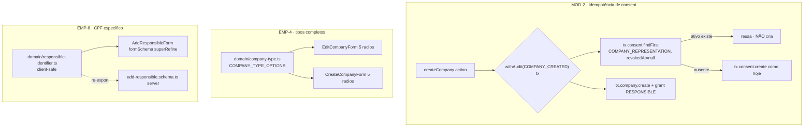

# USP-055 — Empresas (remediação UAT) — Design

**Spec**: `.specs/features/ajustes-uat/usp-055-empresas/spec.md`
**Status**: Draft

> **Upstream design (adapt, don't re-derive):** conforma às decisões e docs vigentes — não re-decide
> nada. Referências: `CLAUDE.md` (Server Action pattern, barrel imports, LGPD consents), ADR-0020
> (atomicidade consent+grant na mesma tx), ADR-0030 (`getCurrentPerson` revalida sessão), AD-009
> (status/dados-na-entidade), AD-014/AD-015 (Design System / primitivos `@/shared/ui`), USP-043 #37
> (unique parcial `consents_active_purpose_unique`). STATE `## Decisions`: nenhuma decisão ativa
> conflita — esta feature é remediação de bugs dentro dos padrões existentes; **não** cria `AD-NNN`.

---

## Architecture Overview

Três correções cirúrgicas no módulo `companies`, sem tocar schema/DB, sem dep nova. A espinha é
reuso de mecânica já presente no código:

Cada correção é independente das outras (arquivos distintos), exceto os dois forms de EMP-4 que
compartilham a fonte única `domain/company-type.ts`.

---

## Code Reuse Analysis

### Existing Components to Leverage

| Component | Location | How to Use |
| --------- | -------- | ---------- |
| Padrão de consent idempotente na tx | `src/modules/persons/actions/ensure-client-role.ts:90-120` (Passo 4) | **Espelhar**: `findFirst({purpose, revokedAt:null})` na tx → `create` só se ausente. Modelo exato p/ MOD-2. |
| `createCompany` (fluxo canônico + `withAudit`) | `src/modules/companies/actions/create-company.ts` | **Modificar** o bloco `Promise.all` (linhas 108-129): tornar o `tx.consent.create` condicional. |
| Unique parcial de consent ativo | `prisma/migrations/20260602190000_consents_active_unique/migration.sql` | Rede de segurança sob concorrência (P2002) — permanece; a app deixa de depender do catch genérico. |
| `domain/cnpj.ts` (validador puro client-safe do módulo) | `src/modules/companies/domain/cnpj.ts` | **Padrão de referência** p/ os novos arquivos `domain/` client-safe (sem imports server/Prisma). |
| Enum `CompanyType` (5 valores) | `prisma/schema.prisma:382` | Fonte de verdade dos 5 valores; o mapa de rótulos deriva dele (guard de completude). |
| `EditCompanyForm` / `CreateCompanyForm` (radios `type`) | `src/modules/companies/components/{edit,create}-company-form.tsx` | **Substituir** os 2 radios hardcoded por render dos `COMPANY_TYPE_OPTIONS`. |
| `classifyIdentifier` (CPF/e-mail) | `src/modules/companies/schemas/add-responsible.schema.ts:13-21` | **Relocar** p/ `domain/responsible-identifier.ts` (client-safe) e re-exportar daqui (back-compat). |
| Mensagem canônica de CPF | `src/modules/identity/schemas/registerPerson.ts:29` (`cpfSchema.refine`) | **Reusar o texto** "CPF inválido (formato ou dígito verificador)" no `superRefine` do form. |
| Barrel do módulo | `src/modules/companies/index.ts` | Adicionar exports de `COMPANY_TYPE_OPTIONS`/`COMPANY_TYPE_LABELS`; `classifyIdentifier` continua exportado (re-export). |

### Integration Points

| System | Integration Method |
| ------ | ------------------ |
| Consent (`consents`) | MOD-2 lê o consent ativo dentro da tx; nenhum novo modelo/coluna; append-only preservado. |
| Audit (`audit`) | `withAudit(COMPANY_CREATED)` inalterado; `audit.after` continua descrevendo a Empresa. |
| Design System (`@/shared/ui`) | Radios seguem os primitivos/tokens já usados nos forms (AD-014/015). |

---

## Components

### `domain/company-type.ts` (novo — client-safe)

- **Purpose**: Fonte única dos rótulos PT-BR e da ordem de exibição dos 5 tipos de Empresa.
- **Location**: `src/modules/companies/domain/company-type.ts`
- **Interfaces**:
  - `COMPANY_TYPE_LABELS: Record<CompanyType, string>` — mapa valor→rótulo (A2 da spec).
  - `COMPANY_TYPE_OPTIONS: ReadonlyArray<{ value: CompanyType; label: string }>` — ordem: `MEI`,
    `SIMPLES_NACIONAL`, `LUCRO_PRESUMIDO`, `LUCRO_REAL`, `SA`.
  - Tipo `CompanyType` derivado dos literais (mesma união usada em `editCompanySchema`/`EditCompanyFormProps`),
    **sem** importar `@prisma/client` no client (usar o array literal local, padrão `EDUCATION_LEVELS`/AD-019).
- **Dependencies**: nenhuma (puro).
- **Reuses**: valores do enum `CompanyType` (`schema.prisma:382`); padrão client-safe de `domain/cnpj.ts`.
- **Guard de completude (EMP055-MN-02)**: teste unit afirma que `COMPANY_TYPE_LABELS` cobre exatamente
  os 5 literais (chaves === união de tipos), quebrando se o enum e a UI divergirem.

### `EditCompanyForm` (modificar) — EMP-4

- **Purpose**: Editar Empresa; controle "Tipo" passa a listar os 5 radios.
- **Location**: `src/modules/companies/components/edit-company-form.tsx`
- **Interfaces**: mapear `COMPANY_TYPE_OPTIONS` → `<input type="radio" value={opt.value} {...register('type')}>`
  no bloco "Tipo" (linhas 132-150), rótulo = `opt.label`. `defaultValues.type` (já vindo de
  `empresa.type`) pré-seleciona; nada mais muda (submit/RHF/diálogo de re-verificação intactos).
- **Dependencies**: `domain/company-type.ts`.
- **Reuses**: `editCompanySchema` (já aceita os 5 — `schemas/edit-company.schema.ts:33`).

### `CreateCompanyForm` (modificar) — EMP-4 / A1

- **Purpose**: Cadastrar Empresa; mesmo controle de 5 radios (consistência).
- **Location**: `src/modules/companies/components/create-company-form.tsx`
- **Interfaces**: idem `EditCompanyForm` no bloco "Tipo" (linhas 88-106). **Preserva**
  `defaultValues.type = 'SIMPLES_NACIONAL'` (create default).
- **Dependencies**: `domain/company-type.ts`.
- **Reuses**: `createCompanySchema` (já aceita os 5).

### `createCompany` (modificar) — MOD-2

- **Purpose**: Cadastro de Empresa idempotente quanto ao consent `COMPANY_REPRESENTATION`.
- **Location**: `src/modules/companies/actions/create-company.ts`
- **Interfaces / mudança**: dentro do `withAudit` (antes/ao montar as escritas), ler
  `const activeRep = await tx.consent.findFirst({ where: { personId: person.id, purpose:
  'COMPANY_REPRESENTATION', revokedAt: null }, select: { id: true } });` e criar o consent **apenas
  quando `!activeRep`**. O grant `RESPONSIBLE` é sempre criado. `audit.after` inalterado. O `catch`
  P2002 de CNPJ permanece; o caminho de consent duplicado deixa de ocorrer (idempotência), logo some
  o `INTERNAL` espúrio.
- **Ordem preservada**: passo 3b (validação de hash) **antes** da releitura; passo 4 (pré-checagem de
  CNPJ) intocado — mantém U12-MN-02 e U12-MN-03.
- **Dependencies**: `tx.consent` (já no escopo do `withAudit`).
- **Reuses**: mecânica de `ensure-client-role.ts` Passo 4.

### `domain/responsible-identifier.ts` (novo — client-safe) — EMP-8

- **Purpose**: Classificar "CPF ou e-mail" de forma client-safe, para o form validar o campo antes do submit.
- **Location**: `src/modules/companies/domain/responsible-identifier.ts`
- **Interfaces**:
  - `classifyIdentifier(raw): { kind:'cpf'|'email'; value:string } | null` (relocado do schema, lógica
    idêntica).
  - Checagem pura de CPF **local** (client-safe) — mesmo algoritmo canônico; evita importar o barrel
    `@/modules/identity` (server/Prisma) no Client Component (A5).
- **Dependencies**: `zod` (para `.email()`), nenhuma server.
- **Reuses**: algoritmo de dígito verificador de CPF (idêntico a `identity/schemas/registerPerson.ts:8`).
- **Back-compat**: `add-responsible.schema.ts` passa a `import { classifyIdentifier } from
  '../domain/responsible-identifier'` e continua re-exportando `classifyIdentifier` (o barrel
  `companies/index.ts:28` e testes que o importam do schema seguem válidos).

### `AddResponsibleForm` (modificar) — EMP-8

- **Purpose**: Validar o campo "CPF ou e-mail" no client com mensagem específica.
- **Location**: `src/modules/companies/components/add-responsible-form.tsx`
- **Interfaces**: estender o `formSchema` (linhas 20-24) com um `superRefine`:
  - trim; se contém "@" e não é e-mail válido → issue no path `cpfOuEmail` com "E-mail inválido";
  - senão, se `classifyIdentifier` não reconhece como CPF → issue "CPF inválido (formato ou dígito
    verificador)".
  - Vazio segue coberto por `.min(1, 'Informe um CPF ou e-mail.')`.
  Fluxo de submit (RHF/`adicionarResponsavel`/mensagem neutra) inalterado; com o campo inválido o RHF
  bloqueia o submit → a action não é chamada (EMP055-11 preserva o caminho válido).
- **Dependencies**: `domain/responsible-identifier.ts` (client-safe).
- **Reuses**: `classifyIdentifier`; texto canônico de CPF.

---

## Data Models (if applicable)

Nenhum. Zero mudança de schema/DB, zero migração. Enum `CompanyType` e modelo `Consent`
(com a unique parcial) permanecem exatamente como estão.

---

## Error Handling Strategy

| Error Scenario | Handling | User Impact |
| -------------- | -------- | ----------- |
| Pessoa já tem consent `COMPANY_REPRESENTATION` ativo (2ª Empresa) | Releitura na tx → reusa; sem `create` → sem P2002 | 2ª Empresa cadastrada com sucesso (antes: "erro interno") |
| Corrida de duplo submit (2 × 2ª Empresa) | Releitura na tx + unique parcial como rede (P2002 → catch existente) | No máximo 1 consent ativo; sem estado inconsistente |
| CNPJ duplicado na 2ª Empresa | Pré-checagem (passo 4) + P2002 (catch) → CONFLICT | Mensagem "solicitar sua inclusão" (U12-MN-03 preservado) |
| CPF mal formatado no add-responsible | `superRefine` client → erro de campo | "CPF inválido (formato ou dígito verificador)" no campo (antes: "Dados inválidos.") |
| E-mail mal formatado no add-responsible | `superRefine` client → erro de campo | "E-mail inválido" no campo |

---

## Risks & Concerns

| Concern | Location (file:line) | Impact | Mitigation |
| ------- | -------------------- | ------ | ---------- |
| Importar o barrel `@/modules/identity` num Client Component arrasta código server/Prisma p/ o bundle | hazard documentado (AD-019; memória "barrel arrasta Prisma p/ client") | Build client quebra ou incha | A5: classificador CPF/e-mail vira `companies/domain/responsible-identifier.ts` client-safe; o form **não** importa `@/modules/identity`. Gate de `build` confirma. |
| Radios hardcoded (2 valores) são código copiado nos dois forms → re-divergência | `create-company-form.tsx:88-106`, `edit-company-form.tsx:132-150` | EMP-4 pode reaparecer se o enum crescer | Fonte única `COMPANY_TYPE_OPTIONS` + teste de completude do domínio (EMP055-MN-02) que falha na divergência enum↔UI. |
| Releitura de consent mal posicionada poderia rebaixar U12-MN-02 (hash) | `create-company.ts` passo 3b | Consent com hash arbitrário | Releitura **após** a validação de hash; a decisão de reuso não regrava versão/hash. Testes U12-MN-02/03 permanecem (regressão). |
| Relocar `classifyIdentifier` pode quebrar imports/tests | `add-responsible.schema.ts:28`, `companies/index.ts:28` | Falha de import em testes | Re-exportar `classifyIdentifier` do schema (e via barrel); comportamento e assinatura idênticos. |

> Nenhum outro concern encontrado nas áreas tocadas.

---

## Tech Decisions (only non-obvious ones)

| Decision | Choice | Rationale |
| -------- | ------ | --------- |
| Onde ler o consent ativo (MOD-2) | Dentro da tx `withAudit`, antes de decidir criar | Fecha corrida de duplo submit; espelha `ensure-client-role.ts` Passo 4; mantém atomicidade |
| Escopo dos radios (EMP-4) | Corrigir **ambos** os forms via fonte única | Create tem o defeito idêntico (SA/Lucro não criável); DRY previne re-divergência (A1) |
| Rótulos PT-BR (EMP-4) | Expansões canônicas do enum (A2) | Não inventa semântica; deriva do regime fiscal/tipo societário já estabelecido (USP-010/ADR-0031) |
| EMP-8 corrigido no client | `superRefine` no `formSchema` do form | Dossiê pede "mensagem no campo"; mensagem canônica reusada; server inalterado (defesa em profundidade) |
| Classificador client-safe (EMP-8) | Novo `domain/responsible-identifier.ts` + re-export | Evita hazard do barrel identity no bundle client (A5); carve-out client/server é precedente |

> **Project-level decisions:** nenhuma. São correções locais dentro de padrões vigentes; não se
> adiciona `AD-NNN` ao STATE.
