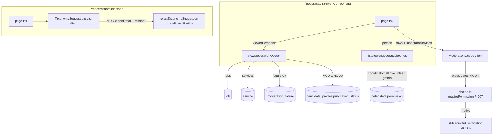

# USP-056 — Moderação (remediação do UAT) — Design

**Spec**: `.specs/features/ajustes-uat/usp-056-moderacao/spec.md`
**Status**: Done

> **💠 Upstream design (adapt, don't re-derive).** Conforma a: máquina de estados de moderação e `transitionContent` como única via (ADR-0011 / USP-016); **adapter por `ContentKind` no container** (GAP-8 / memória "status mora na entidade `CandidateProfile`; conteúdo novo = adapter por `ContentKind`") — já existe `PrismaCandidateProfileStatusRepository` no `DispatchingContentStatusRepository`; RBAC `requirePermission` + catálogo de permissões (USP-008); `audit_log` append-only; View Models (ADR-0010); Design System `@/shared/ui` + tokens, **sem** dep de Dialog (AD-014 / DS-MN-05). **STATE.md `## Decisions` lidas — nenhuma decisão ativa (AD-021..AD-026) conflita.** Sem `AD-NNN` novo (correções conformam, não estabelecem convenção).

---

## Architecture Overview

Quatro correções cirúrgicas no módulo `moderation` (+ um helper de leitura no acesso de moderação). Nenhuma toca o write-path de status, o schema ou o container.



**Fluxo por achado:**
- **MOD-1** — nova 4ª fonte (`prisma.candidateProfile.findMany`) dentro de `viewModerationQueue`, unida às três atuais. Read-only; não altera status.
- **MOD-6** — reforço da função pura `isMeaningfulJustification` (domínio). Propaga automaticamente a schema + `transitionContent` + `inactivate` (fonte única).
- **MOD-7** — novo helper server `listViewerModeratableKinds(person)` + novo prop opcional no `ModerationQueue` que oculta/desabilita ações por tipo. Server-side `requirePermission` inalterado.
- **MOD-8** — `TaxonomySuggestionsList`: "Rejeitar" passa a abrir etapa inline de confirmação com motivo opcional (padrão de `PublishedContentManager`), chamando a action existente com `reason`.

---

## Code Reuse Analysis

### Existing Components to Leverage

| Component | Location | How to Use |
|---|---|---|
| `viewModerationQueue` (une jobs+services+fixture) | `src/modules/moderation/queries/moderation-queue.ts` | **Estender**: adicionar 4ª leitura `candidateProfile.findMany` ao `Promise.all` + mapear `QueueRow` com `ContentKind.CANDIDATE_PROFILE`. Padrão de `jobItems`/`serviceItems` (linhas 81–108). |
| `PrismaCandidateProfileStatusRepository` | `src/modules/persons/adapters/prisma-candidate-profile-status.ts` | **Referência de contrato**: confirma `contentId = personId`, coluna `publicationStatus`, valores idênticos ao enum Prisma. (A fila lê a tabela direto, como faz com `job`/`service`.) |
| `isMeaningfulJustification` + `NON_MEANINGFUL` | `src/modules/moderation/domain/justification.ts` | **Reforçar** a função pura; mensagens PT-BR (`JUSTIFICATION_NOT_MEANINGFUL_MESSAGE`) **inalteradas**. |
| `checkPermission` / `isCoordinator` / `ROLE_PERMISSIONS` / `DELEGABLE_PERMISSIONS` | `src/modules/identity/domain/permissions.ts` | Base para computar os `ContentKind` moderáveis do viewer. |
| `canAccessModerationQueue` (query de `delegated_permission`) | `src/modules/moderation/server/moderation-access.ts` | **Padrão** para o novo `listViewerModeratableKinds` (mesma tabela, mesmo `where revokedAt: null`). |
| `PERMISSION_BY_KIND` (JOB→MODERATE_JOB, CV/CANDIDATE_PROFILE→MODERATE_CV, SERVICE→MODERATE_SERVICE) | `src/modules/moderation/actions/decide.ts` | **Fonte única** do mapa tipo→permissão. Extrair para reuso no helper de MOD-7 e no `decide.ts` (evita divergência). |
| `PublishedContentManager` (inline-expandível Confirmar/Cancelar + Textarea) | `src/modules/moderation/components/published-content-manager.tsx` | **Padrão de UI** para a confirmação de MOD-8 (sem overlay — DS-MN-05). |
| `rejectTaxonomySuggestion({kind,id,reason})` + `resolveTaxonomySuggestionSchema` | `src/modules/moderation/actions/resolve-taxonomy-suggestion.ts`, `schemas/taxonomy-suggestion.ts` | **Já pronto**: `reason` opcional → `audit.justification`. MOD-8 só liga a UI ao `reason`. |
| `@/shared/ui` (`Button`, `Textarea`, `Label`, `Card`, `Badge`) | `src/shared/ui` | Primitivos DS para a confirmação MOD-8 e a nota MOD-7. |

### Integration Points

| System | Integration Method |
|---|---|
| `candidate_profiles` (Prisma) | Leitura via `prisma.candidateProfile.findMany` com `select`/`orderBy`/`take` (sem migração; índice `@@index([publicationStatus])` já existe). |
| `delegated_permission` (Prisma) | Leitura no helper de MOD-7 (mesma consulta de `canAccessModerationQueue`). |
| `audit_log` | Inalterado — `rejectTaxonomySuggestion` já grava `justification` do `reason`. |
| `container.ts` | **Não tocado** — `CANDIDATE_PROFILE` já registrado; MOD-1 é leitura de fila, não write-path. |

---

## Components

### 1. `viewModerationQueue` (estender) — MOD-1

- **Purpose**: Incluir perfis de candidato IN_MODERATION na fila.
- **Location**: `src/modules/moderation/queries/moderation-queue.ts` (modificar)
- **Interfaces**: mesma assinatura `viewModerationQueue({ viewerPersonId }): Promise<ModerationQueueItem[]>`.
- **Mudança**: acrescentar ao `Promise.all` uma 4ª leitura:
  ```ts
  prisma.candidateProfile.findMany({
    where: {
      publicationStatus: PrismaContentStatus.IN_MODERATION,
      personId: { not: viewerPersonId }, // P-005 / USP056-MN-01
    },
    select: { personId: true, headline: true, lastStatusChangeAt: true },
    orderBy: { lastStatusChangeAt: 'asc' },
    take: QUEUE_PAGE_SIZE,
  })
  ```
  e mapear `candidateItems: QueueRow[]` → `{ contentKind: CANDIDATE_PROFILE, contentId: personId, title: headline ?? 'Perfil de candidato', authorPersonId: personId, submittedAt: lastStatusChangeAt }`. Unir ao `rows` (mesma linha do sort/slice). Atualizar o comentário do cabeçalho (CV/CANDIDATE_PROFILE já não usam só o fixture).
- **Dependencies**: `prisma`, `ContentKind`, `viewStaffPersonNames` (já importados).
- **Reuses**: padrão `jobItems`/`serviceItems`.

### 2. `isMeaningfulJustification` (reforçar) — MOD-6

- **Purpose**: Rejeitar motivo de baixa diversidade (caractere repetido) mantendo motivos legítimos.
- **Location**: `src/modules/moderation/domain/justification.ts` (modificar)
- **Interfaces**: `isMeaningfulJustification(text): boolean` (assinatura inalterada). Nova constante `MIN_DISTINCT_LETTERS = 5`.
- **Regra** (após `trim`, além dos checks atuais de `length` e `NON_MEANINGFUL`): contar letras distintas normalizando `toLowerCase()` + `normalize('NFD')` removendo diacríticos, mantendo `[a-z]`; se `distinct < MIN_DISTINCT_LETTERS` → `false`.
  ```ts
  const letters = new Set(
    trimmed.toLowerCase().normalize('NFD').replace(/[^a-z]/g, ''),
  );
  if (letters.size < MIN_DISTINCT_LETTERS) return false;
  ```
- **Dependencies**: nenhuma (puro).
- **Reuses**: propaga a `schemas/decision.ts`, `transitionContent`, `inactivate` sem mudança neles.

### 3. `listViewerModeratableKinds` (novo helper server) — MOD-7 (backend)

- **Purpose**: Conjunto de `ContentKind` que o viewer pode moderar.
- **Location**: `src/modules/moderation/server/moderation-access.ts` (adicionar) + export no barrel `index.ts`.
- **Interfaces**: `listViewerModeratableKinds(person: CurrentPerson): Promise<ContentKind[]>`.
- **Lógica**: coordenador → `[JOB, SERVICE, CV, CANDIDATE_PROFILE]`. Voluntário → consulta `delegated_permission` (`revokedAt: null`, `permission in [MODERATE_JOB, MODERATE_CV, MODERATE_SERVICE]`) e mapeia: `MODERATE_JOB→[JOB]`, `MODERATE_SERVICE→[SERVICE]`, `MODERATE_CV→[CV, CANDIDATE_PROFILE]`. Reusa o mapa inverso de `PERMISSION_BY_KIND`.
- **Dependencies**: `prisma`, `isCoordinator`, `ContentKind`, `PERMISSION_BY_KIND` (extraído para local reutilizável).
- **Reuses**: consulta idêntica à de `canAccessModerationQueue`.

### 4. `ModerationQueue` (prop opcional de gating) — MOD-7 (UI)

- **Purpose**: Não oferecer ações para tipos fora da permissão do viewer.
- **Location**: `src/modules/moderation/components/moderation-queue.tsx` (modificar) + `app/(app)/moderacao/page.tsx` (passar o prop).
- **Interfaces**: novo prop **opcional** `viewerModeratableKinds?: readonly ContentKind[]`. Quando `undefined` → todos moderáveis (backward-compat; preserva os testes existentes que não passam o prop e a UX de coordenador). Por linha: `const canModerate = !viewerModeratableKinds || viewerModeratableKinds.includes(row.contentKind);` — se `false`, no lugar do bloco de ações renderiza uma nota PT-BR (`text-fg-muted`, ex.: "Você não tem permissão para moderar este tipo.") e não renderiza os botões nem o formulário de motivo.
- **Página**: `const moderatableKinds = await listViewerModeratableKinds(person);` passado como `viewerModeratableKinds={moderatableKinds}`.
- **Dependencies**: `ContentKind`.
- **Reuses**: estrutura de render atual (só envolve o bloco de ações num condicional).

### 5. `TaxonomySuggestionsList` (confirmação inline) — MOD-8

- **Purpose**: Rejeitar só após confirmação, com motivo opcional.
- **Location**: `src/modules/moderation/components/taxonomy-suggestions-list.tsx` (modificar)
- **Interfaces**: props inalterados. Novo estado local: `rejectingId: string | null` + `reasonText: string` (espelha `PublishedContentManager`).
- **Comportamento**: "Rejeitar" → `openReject(id)` (abre etapa inline, não chama action — MOD8-01/USP056-MN-05). Etapa exibe `<Textarea>` opcional (`placeholder` "Motivo (opcional) enviado à auditoria.") + `Confirmar rejeição` (variant danger) + `Cancelar`. `Confirmar` → `rejectTaxonomySuggestion({ kind, id, ...(reason.trim() ? { reason: reason.trim() } : {}) })`. `Aprovar` permanece **1 clique** (inalterado).
- **Dependencies**: `@/shared/ui` (`Textarea`, `Label`).
- **Reuses**: padrão inline-expandível de `PublishedContentManager` (open/close/reason state).

---

## Data Models

Nenhum novo. Campos existentes lidos:

- `CandidateProfile`: `personId` (PK, = `contentId`), `headline: String?`, `publicationStatus: ContentStatus`, `lastStatusChangeAt: DateTime`, índice `@@index([publicationStatus])`.
- `DelegatedPermission`: `personId`, `permission: PermissionId`, `revokedAt: DateTime?`.

---

## Error Handling Strategy

| Error Scenario | Handling | User Impact |
|---|---|---|
| `headline` nulo (MOD-1) | Fallback `"Perfil de candidato"` no map | Item legível na fila |
| Autor não resolvido (MOD-1) | `authorName = null` (comportamento atual) | Exibe "—" |
| Voluntário sem nenhum tipo moderável abre a fila | `canAccessModerationQueue` já barra (404) antes; se acessar, `viewerModeratableKinds = []` → nenhuma ação em nenhum item | Fila só-leitura (não deve ocorrer na prática) |
| Motivo MOD-8 > 280 chars | Schema Zod rejeita (existente) → erro inline | Mensagem PT-BR existente |
| Decisão submetida sem permissão (MOD-7 contornado) | `requirePermission` nega (P-007) → erro inline | Backend continua autoritativo |

---

## Risks & Concerns

| Concern | Location (file:line) | Impact | Mitigation |
|---|---|---|---|
| Prop novo em `ModerationQueue` poderia quebrar os testes existentes que não o passam | `components/moderation-queue.tsx` | Regressão de suíte | Prop **opcional**, default = todos moderáveis; MOD7-03 exige backward-compat (testes atuais permanecem verdes). |
| Mock de Prisma no unit test da fila não tem `candidateProfile.findMany` | `queries/__tests__/moderation-queue.test.ts` | Crash `undefined.findMany` ao adicionar a 4ª fonte | T2 atualiza o mock (adiciona `candidateProfile: { findMany }`) + novo caso de teste; asserts existentes seguem válidos. |
| Teste "clicar Rejeitar chama a action em 1 clique" contradiz MOD-8 | `components/__tests__/taxonomy-suggestions-list.spec.tsx:73-83` | Falso vermelho se não atualizado | **Mudança de comportamento intencional** (SUGG-04): T5 atualiza esse teste para o fluxo de 2 etapas (não é enfraquecimento — é o novo AC) e adiciona o teste negativo USP056-MN-05. |
| Limiar `MIN_DISTINCT_LETTERS` alto poderia rejeitar motivo legítimo | `domain/justification.ts` | Falso-positivo (bloqueia moderador) | Limiar = 5, bem abaixo de qualquer motivo PT-BR real de 20 chars; USP056-MN-03 tem teste negativo com amostras reais + `decision.test.ts` como testemunha. |
| Exposição de `headline`/nome do candidato ao voluntário só-JOB (MOD-7 mantém item listado) | `moderation-queue.ts` / UI | PII mínima (título+autor) visível a quem não modera CV | Aceito no MVP: View Model já limita a título+autor (ADR-0010); o dossiê pede gating de **ação**, não de listagem. Alternativa (filtrar item) registrada em Tech Decisions; reavaliável sem migração. |

> Nenhum outro concern encontrado nos arquivos tocados.

---

## Tech Decisions (only non-obvious ones)

| Decision | Choice | Rationale |
|---|---|---|
| Onde MOD-1 lê o perfil | Direto de `prisma.candidateProfile` dentro de `viewModerationQueue` (4ª fonte no `Promise.all`) | Espelha exatamente como a fila já lê `job` e `service` reais (não via port). O port `ContentStatusRepository` é para **write-path** de status (`transitionContent`), não para a leitura de fila. Sem inventar abstração nova. |
| Título do item de perfil | `headline ?? "Perfil de candidato"` | View Model expõe só título+autor (ADR-0010); `headline` é público na busca, não é PII sensível. |
| MOD-7: desabilitar ação vs. filtrar item | **Desabilitar/ocultar a ação** por tipo (item permanece listado com nota) | Literal do dossiê ("desabilitar/ocultar as ações"); preserva E-001 (fila lista todos os IN_MODERATION com indicador de tipo). Filtrar o item é alternativa aceitável (fecha exposição de PII ao não-moderador daquele tipo) — não adotada para não sub-listar a fila; reavaliável. |
| Prop `viewerModeratableKinds` opcional | Default = todos moderáveis | Backward-compat com testes/uso atuais; coordenador (caso comum) inalterado. |
| MOD-8: confirmação inline vs. modal | **Inline-expandível** (padrão `PublishedContentManager`) | DS-MN-05 proíbe dep de Dialog; consistência com a fila e o gerenciador de publicados; menor superfície de a11y. |
| Limiar de diversidade MOD-6 | `MIN_DISTINCT_LETTERS = 5` letras distintas (acento-dobrado) | Barra mashes de caractere repetido/alfabeto curto; não barra motivos PT-BR reais. Complementa (não substitui) `NON_MEANINGFUL` e `MIN_JUSTIFICATION_LENGTH`. |
| Mapa tipo→permissão único | Extrair/compartilhar `PERMISSION_BY_KIND` entre `decide.ts` e o helper MOD-7 | Evita divergência entre a permissão exigida na action e a inferida na UI. |

> **Project-level decisions:** nenhuma — todas as escolhas são feature-local (conformam a ADR-0011/AD-009/AD-014/DS-MN-05 existentes). Sem `AD-NNN` novo.
