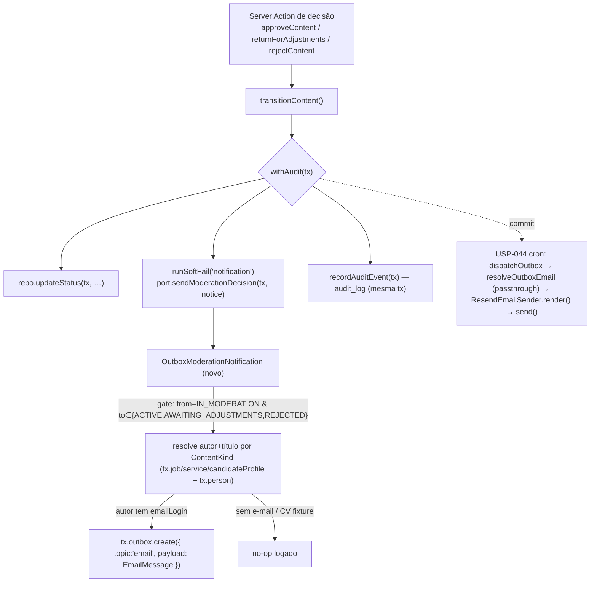

# USP-057 — E-mails de decisão de moderação — Design

**Spec**: `.specs/features/ajustes-uat/usp-057-emails-moderacao/spec.md`
**Status**: Draft

> **💠 Adapt, don't re-derive.** Design conforma aos artefatos upstream já fixados: **ADR-0011** (`transitionContent` única via + side effects soft-fail R2), **AD-007** (`Outbox` + enqueue na tx; dispatcher = USP-044), **AD-023/USP-044** (dispatcher `topic='email'`, passthrough de `EmailMessage` conhecido, PII mínima), **ADR-0012** (port→adapter via `container.ts`). Nada aqui re-decide esses documentos — apenas os aplica. **STATE `## Decisions` lido:** AD-007 (l.188, tabela `Outbox` + enqueue na tx da origem), AD-023/U2 (l.67, dispatcher + passthrough de `EmailMessage` + "sem migração"), AD-005/l.207 (GAP-3 = trocar o stub no-op pelo adapter real na USP-044) — todos **active**; este design os **realiza**, não os supera.

---

## Architecture Overview

O ponto de decisão (`transitionContent`) já chama o `ModerationNotificationPort` dentro da tx de `withAudit`, embrulhado em `runSoftFail`. Hoje o binding é o **stub no-op**. A mudança é cirúrgica: **(1)** threadar `tx` pelo port; **(2)** trocar o stub por um adapter real que resolve o autor + título por `ContentKind` e **enfileira** um `EmailMessage` completo via `tx.outbox.create` (padrão eager de `apply-to-job`/`create-referral`); **(3)** adicionar os 3 templates PT-BR e registrá-los nos 3 pontos de registro do subsistema de e-mail. O **envio** continua 100% na USP-044 (cron drena o Outbox e faz passthrough do template conhecido).



**Propriedades preservadas:** enqueue **na mesma tx** (rollback ⇒ sem órfão, P-007) **e** soft-fail (falha do enqueue não reverte a decisão, NOT-12/R2). Ambas já valem na estrutura atual de `transition-content.ts` — o enqueue via `tx` roda **dentro** do callback do `withAudit` (antes do `recordAuditEvent`), embrulhado em `runSoftFail`.

---

## Code Reuse Analysis

### Existing Components to Leverage

| Component | Location | How to Use |
|---|---|---|
| Sítio de enqueue eager (precedente-alvo) | `src/modules/jobs/actions/apply-to-job.ts:110-121` | **Espelhar**: `{ to, template, data } satisfies EmailMessage` → `tx.outbox.create({ data: { topic:'email', payload } })`; `if (person.emailLogin)` guard = no-op. |
| Sítio de enqueue eager (precedente-alvo) | `src/modules/referrals/actions/create-referral.ts:177-188` | Idem — mesmo shape. |
| Thread `tx` por port de moderação | `src/modules/moderation/ports/company-verify-hook.port.ts` + `transition-content.ts:117-129` | **Espelhar** `onContentActivated(tx, …)`: adicionar `tx` como 1º param de `sendModerationDecision`. Type de `tx` = o mesmo (`AuditTx`). |
| Renderers de template PT-BR | `src/shared/lib/email/templates/referral-notification.ts`, `password-reset.ts` | **Espelhar**: `render…Email(data): RenderedEmail`; `wrapHtml`/`escapeHtml`/`ctaButton` de `templates/layout.ts`; versão `text` + `html`. |
| União + registro de template | `src/shared/lib/email/email-sender.port.ts` (`EmailMessage`), `resend-email-sender.ts` (`render()` switch), `outbox/resolve-outbox-email.ts` (`KNOWN_TEMPLATES`) | **Estender aditivamente** os 3 pontos com os 3 novos templates (necessário juntos p/ o `switch` exaustivo compilar). |
| Enqueue transacional | `Outbox` (`prisma/schema.prisma:918-929`) via `tx.outbox.create` | Reusar a tabela existente — **sem migração**. |
| Soft-fail + tx | `withAudit` (`src/modules/audit/withAudit.ts`), `runSoftFail` (`transition-content.ts:211`) | Reusar intactos — callback roda antes do `recordAuditEvent`; ambos na mesma tx. |
| URL base p/ links absolutos | `NEXT_PUBLIC_SITE_URL` (`src/shared/env.ts:36`) | Montar o CTA "área do autor" (precedente `password-reset`). |
| Stub a substituir | `src/modules/moderation/adapters/stub-moderation-notification.ts` + `container.ts:138` | Manter o stub (usado por `adapters.test.ts`); trocar só o **binding** no container. |

### Integration Points

| System | Integration Method |
|---|---|
| Dispatcher USP-044 (`resolveOutboxEmail`) | **Passthrough**: adicionar os 3 `template` ao `KNOWN_TEMPLATES` → o payload eager passa direto (AC-044-D2). **Sem** ramo `kind` novo. |
| `ResendEmailSender` | 3 `case` novos no `switch(message.template)` + imports dos renderers. |
| `transitionContent` | Call-site passa `tx` ao port; container resolve o adapter real. |
| Prisma (`tx.job`/`tx.service`/`tx.candidateProfile`/`tx.person`) | Leitura via o cliente transacional recebido — sem import de módulos `jobs`/`services` (sem ciclo). |

---

## Components

### 1. Templates de decisão (3)
- **Purpose**: Renderizar, em PT-BR, os e-mails de aprovação, devolução e rejeição.
- **Location**: `src/shared/lib/email/templates/moderation-approved.ts`, `moderation-returned.ts`, `moderation-rejected.ts`.
- **Interfaces**:
  - `renderModerationApprovedEmail(data: ModerationApprovedEmailData): RenderedEmail`
  - `renderModerationReturnedEmail(data: ModerationReturnedEmailData): RenderedEmail`
  - `renderModerationRejectedEmail(data: ModerationRejectedEmailData): RenderedEmail`
- **Dependencies**: `layout.ts` (`wrapHtml`, `escapeHtml`, `ctaButton`), `email-sender.port.ts` (types).
- **Reuses**: estrutura de `referral-notification.ts` (aprovação, sem motivo/CTA informativo) e `password-reset.ts` (CTA com URL absoluta).
- **Copy (PT-BR, minimizada — USP057-MN-04/NOT-13)**: saudação `Olá, {autorNome}!`; frase com `{tipoConteudo}` + `<strong>{tituloConteudo}</strong>`; devolução/rejeição incluem bloco "Motivo informado pela moderação: {motivo}"; CTA `Acessar minha área` → `{areaUrl}`. Nenhum campo do moderador, sem CPF/PII sensível.

### 2. `ModerationDecisionNotice` + port (extensão de `tx`)
- **Purpose**: Contrato do port passa a receber o `tx` da decisão.
- **Location**: `src/modules/moderation/ports/moderation-notification.port.ts`.
- **Interfaces**: `sendModerationDecision(tx: AuditTx, notice: ModerationDecisionNotice): Promise<void>` (adiciona `tx` como 1º param; `ModerationDecisionNotice` inalterado — já carrega `contentKind`, `contentId`, `from`, `to`, `justification`, `actorPersonId`).
- **Dependencies**: `type { AuditTx } from '@/modules/audit'` (type-only; já é dep de `moderation`).
- **Reuses**: assinatura `(tx, …)` de `CompanyVerifyHookPort`.

### 3. `OutboxModerationNotification` (adapter real — NOVO)
- **Purpose**: Resolver autor+título por tipo, montar o `EmailMessage` e **enfileirar** na tx; substitui o stub.
- **Location**: `src/modules/moderation/adapters/outbox-moderation-notification.ts` (export no barrel `moderation/index.ts`).
- **Interfaces**: `implements ModerationNotificationPort` → `sendModerationDecision(tx, notice)`.
- **Lógica**:
  1. **Gate (USP057-MN-01)**: retorna cedo se `notice.from !== IN_MODERATION` **ou** `notice.to ∉ {ACTIVE, AWAITING_ADJUSTMENTS, REJECTED}`.
  2. **Resolver por `ContentKind`** (via `tx`): JOB → `tx.job.findUnique({ where:{id:contentId}, select:{ title, authorPersonId } })`; SERVICE → `tx.service.findUnique(... select:{ title, authorPersonId })`; CANDIDATE_PROFILE → `authorPersonId = contentId`, `tx.candidateProfile.findUnique({ where:{ personId:contentId }, select:{ headline } })`; CV → `null` (no-op). Depois `tx.person.findUnique({ where:{id:authorPersonId}, select:{ emailLogin, fullName } })`.
  3. **No-op (USP057-07)**: se sem entidade / sem `emailLogin` → `return` (log info, sem throw).
  4. **Montar** `EmailMessage` por `to`: `ACTIVE`→`moderation-approved` (sem motivo); `AWAITING_ADJUSTMENTS`→`moderation-returned` (com `notice.justification`); `REJECTED`→`moderation-rejected` (com `notice.justification`). `data` = `{ autorNome, tipoConteudo, tituloConteudo, [motivo], areaUrl }`. **Nunca** inclui `actorPersonId`/moderador (USP057-MN-04).
  5. **Enqueue (USP057-MN-02)**: `await tx.outbox.create({ data: { topic:'email', payload: message } })` — **`tx`**, nunca `prisma` global. **Nunca** resolve `EMAIL_SENDER_TOKEN` (USP057-MN-03).
- **Dependencies**: `tx` (Prisma), `NEXT_PUBLIC_SITE_URL`, `EmailMessage` types, `childLogger`.
- **Reuses**: shape de payload de `apply-to-job.ts`; mapa tipo/área do dossiê + USP-056.

### 4. `transitionContent` call-site + container binding
- **Purpose**: Passar `tx` ao port e ligar o adapter real.
- **Location**: `src/modules/moderation/actions/transition-content.ts:98-107` (passar `tx`), `src/shared/container.ts:138` (binding).
- **Interfaces**: `runSoftFail('notification', () => container.resolve(MODERATION_NOTIFICATION_TOKEN).sendModerationDecision(tx, { … }))` — **mantém** o `runSoftFail` (USP057-MN-06). Container: `new OutboxModerationNotification()`.
- **Dependencies**: adapter (comp. 3), port (comp. 2).
- **Reuses**: estrutura existente do callback (o hook de Empresa já usa `tx`).

---

## Data Models

Aditivo em `src/shared/lib/email/email-sender.port.ts` (novos membros da união + Data interfaces). Sem mudança de schema/DB.

```typescript
export interface ModerationApprovedEmailData {
  autorNome: string;        // saudação (nome do AUTOR — não é PII de terceiro)
  tipoConteudo: string;     // "vaga" | "serviço" | "perfil de candidato"
  tituloConteudo: string;   // título público / headline
  areaUrl: string;          // URL absoluta da área do autor
}
export interface ModerationReturnedEmailData extends ModerationApprovedEmailData {
  motivo: string;           // notice.justification (obrigatório — NOT-04)
}
export interface ModerationRejectedEmailData extends ModerationApprovedEmailData {
  motivo: string;           // notice.justification (obrigatório — NOT-05)
}

export type EmailMessage =
  | /* …9 membros atuais… */
  | { to: string; template: 'moderation-approved'; data: ModerationApprovedEmailData }
  | { to: string; template: 'moderation-returned'; data: ModerationReturnedEmailData }
  | { to: string; template: 'moderation-rejected'; data: ModerationRejectedEmailData };
```

Payload enfileirado (reconhecido pelo passthrough do dispatcher, AC-044-D2): `{ topic: 'email', payload: <EmailMessage acima> }`.

---

## Error Handling Strategy

| Error Scenario | Handling | User Impact |
|---|---|---|
| Autor sem `emailLogin` / CV fixture | Adapter retorna sem enqueue (log info) | Nenhum e-mail; decisão conclui normalmente (USP057-07) |
| Falha do `tx.outbox.create` / resolução | `runSoftFail` loga e engole; decisão conclui `ok` (USP057-08/MN-06) | Autor não recebe o e-mail dessa decisão; decisão vale |
| Rollback da decisão (conflito R3 / erro na tx) | A linha do Outbox (mesma tx) não persiste | Nenhum e-mail órfão (P-007 / USP057-MN-02) |
| Transição não-decisão | Gate retorna cedo (sem enqueue) | Comportamento atual preservado (USP057-MN-01) |
| Template com valor perigoso (`<`, `&`) | `escapeHtml` em todos os interpolados | Sem injeção; corpo íntegro |

---

## Risks & Concerns

| Concern | Location (file:line) | Impact | Mitigation |
|---|---|---|---|
| **Poison de tx pós-erro engolido**: se `tx.outbox.create` lançar dentro da tx e o `runSoftFail` engolir, o Postgres pode deixar a tx em estado abortado → o `recordAuditEvent` seguinte falha → rollback da decisão (deixaria de ser soft). | `transition-content.ts:98-107,211` | Raro (insert simples com defaults). Se ocorrer, degrada para "decisão revertida" — pior que soft-fail, mas **atômico** (nunca e-mail órfão). | Adapter faz **todas as leituras/resolução antes** do único `tx.outbox.create` e trata "sem destinatário" com `return` (não throw). O `runSoftFail` é preservado (comportamento de teste R2 intacto). Risco documentado; caminho de falha do insert é o único throw possível e é altamente improvável. Sem introduzir novo comportamento — é o mesmo local onde o stub já rodava. |
| **Acoplamento do adapter de moderação a `tx.job`/`tx.service`/`tx.candidateProfile`** | `outbox-moderation-notification.ts` (novo) | Adapter conhece o shape de 3 tabelas de conteúdo. | Já é precedente no módulo (a fila `moderation-queue.ts` lê os mesmos por apresentação; USP-056). Uso de `tx.<model>` (runtime), **sem** import de módulos → sem ciclo. `select` explícito e mínimo. |
| **Assinatura do port muda (`tx` novo param)** quebra implementadores/fakes | `moderation-notification.port.ts`, `stub-*.ts`, `transition-content.test.ts`, `transition-content.int.test.ts` | Build/tests quebram se atualizados em tempos diferentes. | Port + stub + call-site atualizados **na mesma task** (T2, build-green). Fakes dos testes são `as unknown as Port` com `vi.fn()` que ignora args → asserções (`toHaveBeenCalledTimes`) seguem válidas; atualização é mecânica. |
| **Churn em arquivos owned pela USP-044** (`email-sender.port.ts`, `resend-email-sender.ts`, `resolve-outbox-email.ts`) | subsistema de e-mail | Regressão no dispatcher. | Mudanças **aditivas** (novos membros/cases/entries); `switch` exaustivo continua exaustivo (adicionamos os cases junto). Testes existentes de dispatcher/templates preservados + estendidos. |

> Nenhum concern bloqueia. Todos com mitigação.

---

## Tech Decisions (only non-obvious ones)

| Decision | Choice | Rationale |
|---|---|---|
| Enqueue **eager** vs. payload leve `{kind}` | **Eager** (`EmailMessage` completo) | Espelha os dois precedentes que o dossiê aponta (`apply-to-job`/`create-referral`); evita tocar o resolver do dispatcher (código USP-044) — só registro aditivo no `KNOWN_TEMPLATES`. Menor superfície e risco; respeita "não implementar dispatch novo". Trade-off: leituras de autor/título entram na tx da decisão (bounded `select`, soft-fail). |
| **3 templates** vs. 1 com discriminador | **3** (`moderation-approved`/`-returned`/`-rejected`) | Convenção do projeto (1 `template`/evento; `switch` exaustivo); assuntos/corpos distintos; rastreabilidade 1:1 com NOT-03/04/05. |
| Manter `runSoftFail` no enqueue | **Sim** (não-crítico) | É o comportamento atual e há teste que o exige ("R2"). A decisão de moderação > o e-mail. Atomicidade (P-007) segue via `tx`. (USP057-MN-06 / NOT-12) |
| Gate por `from/to` (não por `trigger`) | `from===IN_MODERATION && to∈{ACTIVE,AWAITING_ADJUSTMENTS,REJECTED}` | Suficiente e único: só as 3 decisões do moderador satisfazem isso (unpause é `PAUSED→ACTIVE`; AWAITING/REJECTED só vêm de IN_MODERATION). Evita adicionar `trigger` ao notice — contrato do port muda o mínimo. |
| Link "área do autor" por tipo | `/empresa` · `/prestador` · `/candidato` (via `NEXT_PUBLIC_SITE_URL`) | Rotas confirmadas por USP-049/054 (evita 404); dossiê pede o link; precedente `password-reset` (`ctaButton` + URL absoluta). |

> **Project-level decisions:** nenhuma nova convenção de projeto — esta unidade **realiza** GAP-3/AD-007/AD-023 (troca do stub pelo adapter real de notificação de moderação). Não requer novo `AD-NNN`.
