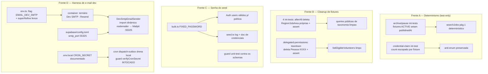

# USP-060 — Higiene de dev/seed Design

**Spec**: `.specs/features/ajustes-uat/usp-060-higiene-dev/spec.md`
**Status**: Draft

> Quatro frentes independentes, todas dev/seed-only. Nenhuma toca a arquitetura ou o comportamento de
> produção. Sem migração de schema. Design ancorado na investigação de terreno (paths + linhas exatos abaixo).

---

## Architecture Overview

---

## Code Reuse Analysis

### Existing Components to Leverage

| Component | Location | How to Use |
| --------- | -------- | ---------- |
| Padrão de cleanup per-file (delete por id/nome em `afterAll`) | `src/modules/services/__tests__/submit-service.int.test.ts:166-180` (canônico) | Espelhar: adicionar os deletes de Region/JobArea/Person faltantes nos 5 arquivos, na ordem correta (jobs/services → companies → persons → taxonomia). |
| Seam de seleção de adapter por env-flag guardada por `VERCEL_ENV` | `src/shared/container.ts:143-155` (CV extractor: `env.CV_EXTRACTOR_FAKE ? new FakeCVExtractor() : new AnthropicCVExtractor()`) | Copiar exatamente para o `EMAIL_SENDER_TOKEN` (linha 83, hoje incondicional). |
| Flag booleana dev-only fenced no boot | `src/shared/env.ts:88` (`CV_EXTRACTOR_FAKE`) + `superRefine` `:96-124` (`isVercelDeploy && flag → issue`) | Adicionar `EMAIL_DEV_SMTP` no mesmo molde: `z.preprocess(parseBooleanFlag, z.boolean()).default(false)` + cláusula `superRefine`. |
| Port `EmailSender` (nunca lança; `{ok:false}` em falha) | `src/shared/lib/email/email-sender.port.ts:159-163` (`EMAIL_SENDER_TOKEN`, `EmailMessage`, `EmailSendResult`) | O adapter dev implementa a interface; reusa o discriminated union `EmailMessage` e os renderizadores de template existentes. |
| Adapter Resend com client injetável no construtor | `src/shared/lib/email/resend-email-sender.ts:74-97` | Modelo de estrutura (classe + client injetável) p/ testar o adapter dev sem SMTP real. |
| `verifyCronSecret` fail-closed (todo ambiente) | `src/shared/lib/cron-secret.ts:33-38` + rota `src/app/api/cron/dispatch-outbox/route.ts:23-27` | **Nenhuma mudança** — apenas documentar `CRON_SECRET` local. |
| Guarda canônica de taxonomia idempotente | `prisma/__tests__/seed.integration.test.ts:29-150` | Continua sendo o regression-guard de HYG-MN-01; deve permanecer verde. |
| Schemas de política de senha (tier estrito) | `src/modules/identity/schemas/changePassword.ts:12-17` e `password-reset.schema.ts:39-44` | O teste-guarda da senha do seed importa e valida `FIXED_PASSWORD` contra eles. |
| Mailpit local (inbucket) | `supabase/config.toml` `[inbucket]` (UI :55324; `smtp_port = 55325` comentado, linha 104) | Descomentar `smtp_port`; adapter conecta em 127.0.0.1:55325; testers veem em :55324. |

### Integration Points

| System | Integration Method |
| ------ | ------------------ |
| DI container (`shared/container.ts`) | Nova binding condicional para `EMAIL_SENDER_TOKEN`; `dispatchOutbox` já resolve a porta lazily (`dispatch-outbox.ts:58`) ⇒ swap invisível ao cron e aos fluxos de auth síncronos. |
| Env (`shared/env.ts`) | Nova flag `EMAIL_DEV_SMTP` (default false, fenced) + doc de `CRON_SECRET` (já opcional). |
| Supabase local | `supabase/config.toml`: expor `smtp_port = 55325`. |
| Prisma seed | `bulk.ts` (constante + comentário), `seed.ts` (log), doc de credenciais. |

---

## Components

### Frente A — Determinismo (test-only)

- **Purpose**: Tornar a suíte de integração determinística sob volume, sem enfraquecer asserções.
- **Location**: `src/modules/jobs/__tests__/archive-job.int.test.ts`, `.../pause-job.int.test.ts`, `src/modules/identity/__tests__/credential-claim.int.test.ts`.
- **Mudanças**:
  - `archive-job` `createJob` (linhas 104-115) e `pause-job` `createJob` (linhas 101-112): incluir `publishedAt: new Date()` ao inserir vaga ACTIVE (e no ramo despausa de `pause-job` que vira ACTIVE). Espelha a invariante de produção (toda vaga ACTIVE tem `publishedAt`, setado na 1ª ativação — `schema.prisma:501`). Com `publishedAt` = agora, a fixture é a mais recente ⇒ topo da página 1 sob `ORDER BY published_at DESC NULLS LAST` (determinístico).
  - `credential-claim.int.test.ts:189`: trocar `prisma.credentialClaim.count()` (global) por contagem escopada às fixtures do teste (ex.: `count({ where: { requestedEmail: REQUESTED_EMAIL } })` ou por `personId`) — padrão já usado na linha 207 do mesmo arquivo.
- **Reuses**: a query de produção `search-jobs.ts:125-131` fica **intocada** (já determinística).

### Frente B — Cleanup de fixtures per-file

- **Purpose**: Cada int-test deleta a taxonomia/Pessoas que cria, com asserção de remoção.
- **Location**:
  - `src/modules/jobs/__tests__/search-jobs.int.test.ts` (afterAll ~227-230): + delete de JobArea `"Busca Int Área"` e Regions `"Busca Int Região A/B"`.
  - `src/modules/services/__tests__/search-services.int.test.ts` (afterAll ~172-176): + delete das Regions `"Busca Int Serviço Região A/B"`.
  - `src/modules/jobs/__tests__/submit-job-for-moderation.int.test.ts` (afterAll ~160-163): + delete da Region `"Centro Int Submit"`.
  - `src/modules/services/__tests__/submit-service.int.test.ts` (afterAll ~166-179): + delete da Region `"Centro Int Submit Service"`.
  - `src/modules/identity/__tests__/delegated-permissions.int.test.ts` (hoje SEM teardown): + `afterAll`/`afterEach` que deleta as Pessoas `Pessoa-XXXX` criadas (rastrear ids ou por prefixo de nome exclusivo do arquivo), cascateando roleGrants/consents.
- **Interfaces / contrato de verificação**: cada cleanup adiciona uma **asserção de remoção** (ex.: `expect(await prisma.region.count({ where: { name: { in: TEST_REGION_NAMES } } })).toBe(0)`) para que a limpeza seja gate-checkable e o sensor de mutação do Verifier tenha o que matar (comentar o delete ⇒ asserção falha).
- **Ordem**: deletar entidades filhas (Jobs/Services/Companies/Persons) ANTES da taxonomia (evita FK violation).
- **Reuses**: padrão de `submit-service.int.test.ts:166-180`.

### Frente C — Senha do seed

- **Purpose**: Senha do seed válida pela política estrita; docs e guard.
- **Location**:
  - `prisma/seeds/bulk.ts:34` — `FIXED_PASSWORD = 'asonseg2026'`; corrigir o comentário stale linha 33.
  - `prisma/seed.ts:59` — log passa a citar a nova senha (idealmente derivar do módulo em vez de hardcode, para não voltar a divergir).
  - `docs/operacao/contas-de-teste-seed.md:9,13` — nova senha; nota sobre re-seed/`db reset` para propagar a contas de Auth pré-existentes.
- **Guard**: novo teste unit que importa `FIXED_PASSWORD` (export leve) e valida contra `changePassword` + `password-reset` schemas — falha se a senha voltar a violar a política (HYG-MN-05).
- **Reuses**: schemas de identity.

### Frente D — Harness de e-mail dev

- **`DevSmtpEmailSender`**
  - **Purpose**: adapter `EmailSender` dev-only que entrega ao Mailpit via SMTP.
  - **Location**: `src/shared/lib/email/dev-smtp-email-sender.ts`.
  - **Interfaces**: `send(message: EmailMessage): Promise<EmailSendResult>` — renderiza (reusa os renderizadores de template existentes), faz `const { createTransport } = await import('nodemailer')` (dinâmico), envia p/ `127.0.0.1:55325` (host/port de env ou default), retorna `{ ok: true, id }` ou `{ ok: false }` (nunca lança). **Não** loga corpo/PII (HYG-MN-04/U44-MN-04) — só metadados.
  - **Dependencies**: `nodemailer` (devDependency, import dinâmico), `EmailMessage`, logger.
  - **Reuses**: renderizadores de template + `childLogger`.
- **`env.ts`**: `EMAIL_DEV_SMTP` (default false) + `superRefine` (`isVercelDeploy && EMAIL_DEV_SMTP → issue`). Opcional: `EMAIL_DEV_SMTP_HOST`/`PORT` com defaults 127.0.0.1/55325.
- **`container.ts:83`**: `container.register(EMAIL_SENDER_TOKEN, () => env.EMAIL_DEV_SMTP ? new DevSmtpEmailSender() : new ResendEmailSender())`. `DevSmtpEmailSender` importado estaticamente (classe leve; `nodemailer` fica fora do grafo estático por ser import dinâmico interno).
- **`supabase/config.toml`**: descomentar `smtp_port = 55325`.
- **Docs/env**: `CRON_SECRET` + `EMAIL_DEV_SMTP` em `.env.example` e `.env.local`; doc de operação de como rodar o cron local (header `x-cron-secret`) e ver os e-mails no Mailpit.

---

## Data Models

Nenhum. **Sem migração de schema.** `Job.publishedAt` já existe (`schema.prisma:501`, nullable).

---

## Error Handling Strategy

| Error Scenario | Handling | User Impact |
| -------------- | -------- | ----------- |
| Mailpit SMTP indisponível com flag ligada | `DevSmtpEmailSender.send` retorna `{ ok: false }` sem lançar | E-mail marcado como falho no outbox (re-tentável); dev vê no log de metadados |
| `EMAIL_DEV_SMTP=true` em deploy Vercel | `env` parse LANÇA (superRefine) — boot falha ruidoso | Impossível vazar transporte dev p/ prod |
| Region com FK ainda referenciada no cleanup | Deletar filhos antes (ordem no teardown) | Teste não quebra por FK violation |
| Re-seed com Auth users pré-existentes | Supabase reusa por e-mail (não re-aplica senha) | Doc orienta `db reset`/recriar Auth p/ propagar a nova senha |
| `nodemailer` traçado no bundle de prod | Import dinâmico + flag fenced ⇒ nunca executado; contingência promover a `dependency` | Nenhum (só peso de trace, se ocorrer) |

---

## Risks & Concerns

| Concern | Location (file:line) | Impact | Mitigation |
| ------- | -------------------- | ------ | ---------- |
| **devDependency nova (`nodemailer`)** pode vazar no grafo/nft e, no limite, quebrar o build de prod | `container.ts:83` + novo `dev-smtp-email-sender.ts` | Build de prod | Import **dinâmico** de `nodemailer` dentro de `send()`; classe do adapter leve importada estaticamente; flag fenced por `superRefine`; **gate `NODE_ENV=production build`** prova que não quebra. Contingência documentada: promover a `dependency`. Lição de leak conhecida (`@react-pdf`, MEMORY) é de trace-size, não de falha de build. |
| Cleanup deletar taxonomia canônica por engano | `search-*/submit-* int-tests` | Quebra seed/E2E | HYG-MN-01: deletes keyed por nomes de fixture do teste; `seed.integration.test.ts` como regression-guard. |
| Person leaker sem teardown acumula ilimitadamente | `delegated-permissions.int.test.ts:33-71` (sem `afterEach`/`afterAll`) | Poluição crescente do select de voluntários | Adicionar teardown rastreando ids criados; asserção de remoção. |
| `search-services.ts:121` tem o mesmo `NULLS LAST` — trap latente | `services/queries/search-services.ts:121` | Testes de serviço podem falhar sob volume futuramente | Não está entre os testes que falham hoje; a correção de determinismo (setar `publishedAt` em fixtures ACTIVE) é o mesmo padrão a aplicar caso algum int-test de serviço venha a falhar — documentado como preventivo, **não** alterado agora (fora de escopo até falhar). |
| Adapter dev logar corpo/PII (viola U44-MN-04) | novo `dev-smtp-email-sender.ts` | Vazamento de PII em log dev | O corpo vai por SMTP ao Mailpit; o adapter loga só metadados (to/template/status), nunca o corpo renderizado. |
| Log do seed hardcoda a senha e volta a divergir | `prisma/seed.ts:59` | Doc/log stale futuro | Derivar o log do valor exportado por `bulk.ts` em vez de re-hardcodar, quando viável. |

---

## Tech Decisions (only non-obvious ones)

| Decision | Choice | Rationale |
| -------- | ------ | --------- |
| Determinismo é correção de produto? | **Não** — fix test-only (`publishedAt` em fixtures ACTIVE) | Query de produção já ordena determinística; vaga ACTIVE sem `publishedAt` é estado irreal. Corrigir a query mascararia fixture irrealista e violaria "não alterar produção". |
| Cleanup: per-file vs. helper global | **Per-file** (adiciona deletes faltantes) | 110/111 arquivos já fazem per-file; helper global = infra nova, blast-radius, risco aos testes existentes. |
| Harness de e-mail: SMTP→Mailpit vs. console/log | **SMTP→Mailpit** (nodemailer devDep) | O objetivo do achado é verificação VISUAL no Mailpit; console/log não entrega ao Mailpit e arriscaria U44-MN-04. |
| `nodemailer` como dep ou devDep | **devDependency** + import dinâmico | Dev-only; nunca no caminho de prod (flag fenced). Import dinâmico mantém fora do grafo estático. |
| Cron local | **Só documentar `CRON_SECRET`** (zero código) | `verifyCronSecret` já fail-closed em todo ambiente; enfraquecê-lo violaria U44-MN-02. |
| Verificabilidade do cleanup | Cada cleanup ganha **asserção de remoção** co-locada | Cleanup sem asserção é invisível ao gate/sensor; a asserção dá ao Verifier uma mutação killável. |

> **Project-level decisions (candidatas a AD-NNN, a cargo do orquestrador no fechamento):**
> (1) o seam de EmailSender por env-flag fenced (espelha CV_EXTRACTOR_FAKE/AD-023) vira convenção de harness dev;
> (2) o registro de que o determinismo do `search-jobs` **não** foi correção de produto (a query já era determinística) — evita re-litigar. Não editei `STATE.md`.

---

## Tips

- Não tocar a query `search-jobs.ts`/`search-services.ts` — o fix é nos fixtures.
- Ordem de delete no teardown: filhos antes de taxonomia.
- Nunca `deleteMany({})` amplo — sempre keyed por nome/id da própria fixture.
- Import dinâmico de `nodemailer`; flag fenced no `superRefine`; provar com o build de prod.
- Derivar a senha citada no log/doc do valor único em `bulk.ts` quando possível.
