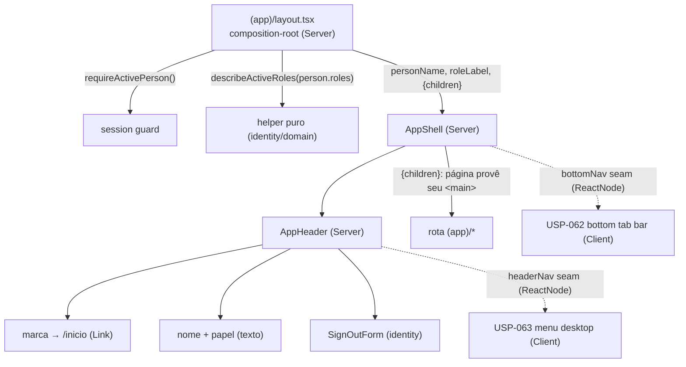

# USP-061 — Casca de navegação da área logada (Header persistente) Design

**Spec**: `.specs/features/app-shell-logado/usp-061-casca-header/spec.md`
**Status**: Draft

---

## Architecture Overview

Espelha a casca pública da Fase 7 (AD-025), invertendo a fronteira de privacidade:
lá a casca **não podia** ver sessão/PII (chrome público estático); aqui a casca **deve**
mostrar a identidade da própria sessão — mas **sem** buscá-la: o **layout é o
composition-root** (padrão ADR-0030 / AD-022, já usado no hub `/inicio`) e passa dados
prontos a componentes de casca **puramente apresentacionais**.

Divisão Server/Client (decisão-chave desta USP, análoga a SiteHeader/PublicNav):

- **USP-061 = 100% Server Component.** Não há interatividade (sem `usePathname`, sem
  toggle de menu). `SignOutForm` já é Server Component (`<form action={signOutAction}>`).
- **A navegação interativa (Client, `usePathname`/estado) chega em USP-062/063**, injetada
  nos seams — como `PublicNav` (Client) é injetado no `SiteHeader` (Server) via `actions`.



Fluxo de renderização por request: middleware Edge (cookie) → `(app)/layout.tsx`
(`requireActivePerson()` revalida status + redireciona 1º acesso) → `AppShell` recebe
`personName`/`roleLabel` (string) → `AppHeader` renderiza chrome estática → a página
provê seu próprio `<main>`.

---

## Code Reuse Analysis

### Existing Components to Leverage

| Component | Location | How to Use |
| --------- | -------- | ---------- |
| `SiteHeader` (visual/estrutura de header sticky) | `src/app/(public)/_components/site-header.tsx` | **Referência** de layout: `sticky top-0 z-40 border-b border-border bg-surface/95 backdrop-blur`, marca (badge "A" + wordmark), container `mx-auto max-w-6xl` |
| `PublicNav` (padrão de seam) | `src/app/(public)/_components/public-nav.tsx` | **Referência** do seam `actions?: React.ReactNode` — replicado como `headerNav`/`bottomNav` |
| `SignOutForm` | `@/modules/identity` (barrel) | **Importar e compor** dentro do `AppHeader` — não reescrever. É Server Component (`<form action={signOutAction}>`) |
| `signOutAction` | `@/modules/identity` (via `SignOutForm`) | Reusado transitivamente pelo `SignOutForm`; a casca **não** o importa direto |
| `ALL_ROLE_LABELS` | `@/modules/identity` (`domain/roles.ts`) | Base do novo helper puro `describeActiveRoles` (mesmo arquivo) |
| `requireActivePerson` / `CurrentPerson` | `@/modules/identity` (`server/session.ts`) | Já chamado no layout (guard); agora seu retorno alimenta a casca. `fullName` + `roles` são os campos usados |
| `Button`, `cn` | `@/shared/ui` | Botão "Sair" (via `SignOutForm`) e composição de classes — tokens-only |
| `Link` | `next/link` | Marca → `/inicio`; navegação declarativa (funciona em Server Component) |
| `casca-no-auth-pii.test.ts` | `src/shared/__tests__/` | **Molde** do guard estático MN-03 (varredura de imports proibidos, recursiva) |
| `casca-uses-tokens.test.ts` / `casca-no-external-cdn.test.ts` | `src/shared/__tests__/` | **Molde** do guard estático MN-04 (tokens-only) |
| `inicio/page.test.tsx` | `src/app/(app)/inicio/` | **Molde** de teste de rota-servidor com `vi.mock('@/modules/identity')` (para o `layout.test.tsx` e a migração MN-02) |

### Integration Points

| System | Integration Method |
| ------ | ------------------ |
| `(app)/layout.tsx` (existente) | Passa a montar `<AppShell>` em vez de renderizar `{children}` puro; mantém `requireActivePerson()` e `export const dynamic = 'force-dynamic'` |
| `(app)/inicio/page.tsx` (existente) | Remove o `<SignOutForm />` solto do rodapé + o import (migração MN-02); resto intacto |
| `@/modules/identity` (barrel) | +1 export: `describeActiveRoles` |
| ~30 páginas `(app)/*` | **Nenhuma alteração** — mantêm seu próprio `<main>` (Assumption A2) |

---

## Components

### `describeActiveRoles` (helper puro)

- **Purpose**: Converter `roles: string[]` da sessão no rótulo PT-BR exibido no header.
- **Location**: `src/modules/identity/domain/roles.ts` (junto de `ALL_ROLE_LABELS`); export no barrel `src/modules/identity/index.ts`.
- **Interfaces**:
  - `describeActiveRoles(roles: readonly string[]): string` — itera as chaves de
    `ALL_ROLE_LABELS` **na ordem de declaração** e inclui os rótulos dos papéis presentes
    em `roles`; junta com `' · '`. Papel desconhecido (fora do mapa) é ignorado.
    `roles` vazio → `''`.
- **Dependencies**: `ALL_ROLE_LABELS` (mesmo arquivo). Nenhum IO.
- **Reuses**: `ALL_ROLE_LABELS`.
- **Requirements**: APP-SHELL-03, APP-SHELL-04.
- **Nota**: ordem determinística vem de `ALL_ROLE_LABELS` (não da ordem do DB) → teste estável.

### `AppHeader` (Server Component, apresentacional)

- **Purpose**: O `<header>` persistente — marca→`/inicio`, identidade da pessoa, seam de
  nav de header, e "Sair".
- **Location**: `src/app/(app)/_components/app-header.tsx`.
- **Interfaces (props)**:
  - `personName: string` — `fullName` da sessão (vem do layout).
  - `roleLabel: string` — rótulo já computado (`''` quando sem papel → linha omitida).
  - `nav?: React.ReactNode` — seam do menu desktop (USP-063); default `undefined` → nada.
- **Dependencies**: `Link` (next), `cn`/`Button` (shared/ui), `SignOutForm` (identity barrel).
- **Reuses**: visual do `SiteHeader`; `SignOutForm`.
- **Requirements**: APP-SHELL-01, -02, -03, -04, -05; MN-01, MN-04.
- **Regras**: `<header className="sticky top-0 z-40 border-b border-border bg-surface/95 backdrop-blur">`;
  container `mx-auto max-w-6xl … px-4 sm:px-6`; marca com `aria-label`/wordmark igual ao
  SiteHeader mas `href="/inicio"`; identidade em texto tokens-only; **não** importa sessão/Prisma.

### `AppShell` (Server Component, apresentacional) — o ponto de extensão

- **Purpose**: A casca montada pelo layout — compõe `AppHeader` + `{children}` + o seam
  `bottomNav`. É o **único ponto de extensão** (ambos os seams vivem aqui).
- **Location**: `src/app/(app)/_components/app-shell.tsx`.
- **Interfaces (props)**:
  - `personName: string`, `roleLabel: string` — repassados ao `AppHeader`.
  - `children: React.ReactNode` — a página (que provê seu próprio `<main>`).
  - `headerNav?: React.ReactNode` — repassado a `AppHeader.nav` (seam USP-063).
  - `bottomNav?: React.ReactNode` — renderizado após `{children}` (seam USP-062).
- **Structure**:
  ```
  <div className="flex min-h-screen flex-col">
    <AppHeader personName={personName} roleLabel={roleLabel} nav={headerNav} />
    {children}          {/* página provê seu <main> */}
    {bottomNav}         {/* USP-062 preenche aqui; undefined → nada */}
  </div>
  ```
- **Dependencies**: `AppHeader`.
- **Reuses**: `AppHeader`.
- **Requirements**: APP-SHELL-06, -07; MN-01.
- **Nota**: **não** declara `<main>` (Assumption A2). `bottomNav` fica após o conteúdo para
  a barra fixa da USP-062 ancorar no rodapé sem reparentar a casca.

### `(app)/layout.tsx` (composition-root — modificado)

- **Purpose**: Resolver sessão e alimentar a casca com dados prontos.
- **Location**: `src/app/(app)/layout.tsx`.
- **Shape**:
  ```tsx
  import { requireActivePerson, describeActiveRoles } from '@/modules/identity';
  import { AppShell } from './_components/app-shell';
  export const dynamic = 'force-dynamic';
  export default async function AppLayout({ children }: { children: React.ReactNode }) {
    const person = await requireActivePerson();
    return (
      <AppShell personName={person.fullName} roleLabel={describeActiveRoles(person.roles)}>
        {children}
      </AppShell>
    );
    // USP-062/063: computar hubAccessFromRoles/buildHubLinks aqui e passar
    // headerNav={<AppDesktopMenu …/>} / bottomNav={<AppBottomNav …/>}.
  }
  ```
- **Dependencies**: `requireActivePerson`, `describeActiveRoles` (identity); `AppShell`.
- **Requirements**: APP-SHELL-01, -03, -04; MN-03 (ângulo composition-root).
- **Nota**: `requireActivePerson()` sem `allowFirstAccess` herda o redirect a
  `/trocar-senha` no 1º acesso — a casca nunca renderiza nesse estado.

### `(app)/inicio/page.tsx` (migração — modificado)

- **Purpose**: Remover o logout solto (agora na casca).
- **Change**: remover `<SignOutForm />` (linha final) e o `SignOutForm` do import de
  `@/modules/identity`. Nada mais muda.
- **Requirements**: APP-SHELL-08; MN-02.

### Guards estáticos (must-not sensors)

- `src/shared/__tests__/app-shell-no-auth-pii.test.ts` — MN-03. Varre
  `src/app/(app)/_components/**` (`.ts`/`.tsx`), reprova import de `prisma` /
  `getCurrentPerson` / `requireActivePerson` / `@/modules/*/views` / `@/modules/*/actions`
  / `'use server'`. Molde: `casca-no-auth-pii.test.ts` (mesma lista, mesmo `collect*` recursivo).
- `src/shared/__tests__/app-shell-uses-tokens.test.ts` — MN-04. Reprova hex cru
  (`#RRGGBB`), CDN externa (`http(s)://…`), e libs de ícone/estado (`lucide-react`,
  state libs). Molde: `casca-uses-tokens.test.ts` + `casca-no-external-cdn.test.ts` +
  `casca-no-icon-state-lib.test.ts`.

---

## Data Models

Nenhum. Zero migração. Reusa `CurrentPerson` (`fullName`, `roles`) do `session.ts`.

---

## Error Handling Strategy

| Error Scenario | Handling | User Impact |
| -------------- | -------- | ----------- |
| Sem sessão / Pessoa inativa | `requireActivePerson()` (layout) → redirect `/login` (herdado) | Vai para login; casca não renderiza |
| 1º acesso (`primeiroAcesso`) | `requireActivePerson()` → redirect `/trocar-senha` (herdado) | Troca senha; casca não renderiza |
| Pessoa com zero papéis | `describeActiveRoles([]) === ''` → header omite a linha de papel | Vê só o nome; sem placeholder |
| `roles` com string desconhecida | helper ignora a string não mapeada | Rótulo só com papéis conhecidos |
| Seams não injetados (default 061) | `{undefined}` → React não renderiza nada | Header sem menu/barra (esperado até 062/063) |

---

## Risks & Concerns

| Concern | Location | Impact | Mitigation |
| ------- | -------- | ------ | ---------- |
| ~30 páginas `(app)` usam `<main className="min-h-screen …">`; a casca adiciona um header acima | `src/app/(app)/**/page.tsx` (grep: 30+ ocorrências) | `min-h-screen` + header empurra conteúdo → scroll extra | Header `sticky top-0` fica no fluxo (sem overlap). Aceitar os `min-h-screen` como estão (pré-existentes); centralizar `<main>` fica fora de escopo (A2). Sem quebra funcional |
| USP-062 (bottom bar) será `fixed bottom-0` e pode cobrir o fim do conteúdo de mains `min-h-screen` | (futuro) `app-bottom-nav` | Sobreposição visual em mobile | **Concern encaminhado à USP-062**: ela deve adicionar padding-bottom no conteúdo (mobile). Não é da USP-061 |
| `inicio/page.test.tsx` HUB-06 hoje afirma que o hub renderiza "Sair"; a migração inverte isso | `src/app/(app)/inicio/page.test.tsx` | Teste existente quebraria | Atualizar **com justificativa** (A5): passa a afirmar ausência do "Sair" no render isolado do hub (MN-02). Documentado — não é enfraquecimento silencioso |
| Guard MN-03 poderia proibir o import legítimo de `SignOutForm` | `app-header.tsx` | Falso-positivo travaria a casca | `SignOutForm` vem do **barrel** `@/modules/identity` (texto não casa `/actions` nem `getCurrentPerson`); a lista de padrões proibidos (idêntica ao molde `casca-no-auth-pii`) não pega o barrel. Sem falso-positivo |

> Test gaps: as ~30 páginas `(app)` já têm seus próprios `page.test.tsx` onde aplicável; a
> casca não altera seus contratos (só embrulha `{children}`), então não há gap novo a cobrir.

---

## Tech Decisions (only non-obvious ones)

| Decision | Choice | Rationale |
| -------- | ------ | --------- |
| Localização dos componentes de rota | `src/app/(app)/_components/` (novo), espelho de `(public)/_components/` | AD-025: componente de rota vai em pasta privada `_`-prefix do grupo, **não** em `shared/ui` (reservado a primitivas). Mantém `src/` fechado |
| Divisão Server/Client | Casca 100% Server nesta USP; nav interativa = Client em 062/063 | Sem interatividade em 061 (A3). Espelha SiteHeader (Server) / PublicNav (Client) |
| Formato do seam | Dois slots `React.ReactNode` (`headerNav`, `bottomNav`), estilo `actions` do PublicNav | As duas superfícies têm posições diferentes; ReactNode acopla menos que `HubLinkGroup[]` (A4) |
| Consumo de `buildHubLinks` | **Deferido** a 062/063 | 061 só deixa o seam (A6) |
| Ownership do `<main>` | Casca provê `<header>` (+ bottomNav), **não** `<main>`; páginas mantêm o seu | Blast radius: centralizar exigiria editar ~30 páginas. Diverge de AD-025 (pública centralizou) mas é feature-local — **NÃO supersede AD-025** (grupo de rota diferente, constraints diferentes) (A2) |
| Cálculo do rótulo de papel | Helper puro em `identity/domain`, computado no layout, passado como `string` | Mantém a casca apresentacional/testável sem mock de sessão; centraliza rótulos em identity |

> **Project-level decisions:** nenhuma nova convenção project-wide. A divergência de `<main>`
> (A2) é **feature-local** e explicitamente **não** supersede AD-025. Nenhum `AD-NNN` novo é
> necessário. Se o dono quiser padronizar a casca `(app)` como referência das próximas telas
> autenticadas, isso seria um AD futuro — fora do escopo desta USP.
