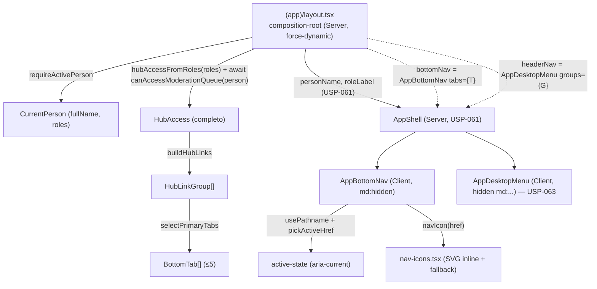

# USP-062 — Navegação mobile/tablet (bottom tab bar) Design

**Spec**: `.specs/features/app-shell-logado/usp-062-bottom-tab-bar/spec.md`
**Sibling (mesma unidade de execução)**: `.specs/features/app-shell-logado/usp-063-menu-desktop/design.md`
**Status**: Draft

> **Unidade combinada 062+063.** As duas USPs são a mesma superfície (navegação role-aware
> derivada de `buildHubLinks`, injetada nos seams da casca da USP-061) — só a apresentação
> muda por breakpoint. Compartilham: o helper puro `pickActiveHref`, a computação de
> `HubAccess` no composition-root (layout) e a única edição do layout que injeta os dois
> seams. Este design descreve o todo com foco na bottom bar; o design da USP-063 descreve o
> menu desktop e referencia as partes compartilhadas. A implementação roda como **1 unit**
> (ver `tasks.md`, idêntico nos dois `dir:`).

---

## Architecture Overview

A casca da USP-061 já expõe os seams. O composition-root `(app)/layout.tsx` (Server,
`force-dynamic`) — o **único** lugar que pode tocar sessão/guards — computa o `HubAccess`
completo (papéis inerentes + guard ao vivo de moderação), monta os grupos com
`buildHubLinks` e injeta:

- `bottomNav={<AppBottomNav tabs={selectPrimaryTabs(groups)} />}` (USP-062)
- `headerNav={<AppDesktopMenu groups={groups} />}` (USP-063)

`AppBottomNav`/`AppDesktopMenu` são **Client Components** apresentacionais: recebem dados
já resolvidos (arrays de objetos serializáveis) e usam só `usePathname()`/`useState` — nunca
importam sessão/Prisma (preserva APP-SHELL-MN-03 / BNAV-MN-03). Espelha exatamente a relação
`SiteHeader` (Server) → `PublicNav` (Client) da Fase 7.



Fluxo por request: middleware Edge (cookie) → `(app)/layout.tsx` (`requireActivePerson()`
revalida status/1º acesso) → computa `HubAccess`/`groups` → passa `tabs`/`groups` prontos aos
componentes de nav → cada componente resolve active-state no client via `usePathname()`.

---

## Code Reuse Analysis

### Existing Components to Leverage

| Component | Location | How to Use |
| --------- | -------- | ---------- |
| `AppShell` (seam `bottomNav`) | `src/app/(app)/_components/app-shell.tsx` | **Consumir** o seam — passar `bottomNav`; **não** reescrever a casca |
| `(app)/layout.tsx` (composition-root, USP-061) | `src/app/(app)/layout.tsx` | **Modificar**: computar `HubAccess`/`groups`, injetar `bottomNav`/`headerNav`. Mantém `requireActivePerson()` + `dynamic='force-dynamic'` |
| `buildHubLinks` / `hubAccessFromRoles` / `EXISTING_HUB_ROUTES` / `HubLinkGroup` | `@/modules/identity` (`domain/hub-links.ts`) | **Fonte única** de dados/allowlist. `selectPrimaryTabs` consome os grupos; o invariante allowlist é reaplicado |
| `canAccessModerationQueue(person)` | `@/modules/moderation` (barrel) | Guard ao vivo do flag `moderation` no layout — **exatamente** como o hub `/inicio/page.tsx` faz hoje |
| `PublicNav` (padrão active-state + SVG inline) | `src/app/(public)/_components/public-nav.tsx` | **Referência** do `usePathname()`, `aria-current`, e do `<svg viewBox="0 0 24 24" stroke="currentColor" strokeWidth={2}>` inline |
| `public-nav.test.tsx` (mock `usePathname`) | `src/app/(public)/_components/__tests__/` | **Molde** do teste RTL: `vi.hoisted` + `vi.mock('next/navigation')` + `await import` |
| `hub-links.test.ts` (invariante 2^9 combos) | `src/modules/identity/__tests__/` | **Molde** do teste de allowlist exaustivo (BNAV-MN-01) |
| `cn` | `@/shared/ui` | Composição de classes tokens-only |
| `Link` | `next/link` | Cada aba é um `<Link>` (navegação declarativa) |
| `app-shell-no-auth-pii.test.ts` / `app-shell-uses-tokens.test.ts` | `src/shared/__tests__/` | **Guards MN-03/MN-04 reusados** (varrem `(app)/_components/**`; cobrem os arquivos novos automaticamente — A9) |
| `inicio/page.tsx` (composition-root de referência) | `src/app/(app)/inicio/page.tsx` | **Molde** de como o layout deve computar `access`/`groups` (mesmo trecho `...hubAccessFromRoles(roles), moderation: await canAccessModerationQueue(person)`) |

### Integration Points

| System | Integration Method |
| ------ | ------------------ |
| `(app)/layout.tsx` | Passa a injetar `bottomNav`/`headerNav` (edição única compartilhada com USP-063 — task T6) |
| `@/modules/identity` (barrel) | +exports: `pickActiveHref`, `selectPrimaryTabs`, `BOTTOM_TAB_SHORT_LABELS`, tipo `BottomTab` |
| `@/modules/moderation` (barrel) | `canAccessModerationQueue` — importado **no layout** (composition-root), nunca nos componentes de nav |
| ~30 páginas `(app)/*` | **Nenhuma alteração** (spacer da barra reserva o espaço — A7) |

---

## Components

### `pickActiveHref` (helper puro — COMPARTILHADO com USP-063)

- **Purpose**: Resolver qual href de um conjunto está "ativo" para o `pathname` atual, por
  **match exato-ou-descendente mais longo** — corrigindo o problema de prefixo simples do
  `isActive` do `PublicNav` com links aninhados (`/perfil` vs `/perfil/papeis`).
- **Location**: `src/modules/identity/domain/app-nav.ts` (novo); export no barrel.
- **Signature**: `pickActiveHref(hrefs: readonly string[], pathname: string): string | null`
- **Rules**:
  - Candidato = href tal que `pathname === href` **ou** `pathname.startsWith(href + '/')`.
  - Retorna o candidato de **maior comprimento** (`href.length`); empate não ocorre (hrefs
    distintos). Sem candidato → `null`.
  - Raiz de grupo não engole descendente: em `/perfil/papeis`, tanto `/perfil` quanto
    `/perfil/papeis` casam, mas o mais longo (`/perfil/papeis`) vence.
- **Dependencies**: nenhuma (sem IO, sem JSX).
- **Requirements**: BNAV-03; DNAV-03.
- **Nota**: puro e sem JSX → testável 1:1 e **coverage-safe** (não puxa barrels pesados ao
  grafo v8 — lição do repo sobre queda de branch por barrels em testes).

### `selectPrimaryTabs` + `BOTTOM_TAB_SHORT_LABELS` (helper puro — USP-062)

- **Purpose**: Reduzir os grupos completos de `buildHubLinks` ao subconjunto **primário**
  (≤5 abas) da bottom bar, com rótulos curtos.
- **Location**: `src/modules/identity/domain/app-nav.ts` (mesmo arquivo); exports no barrel.
- **Types**: `interface BottomTab { href: string; label: string }`
- **Signature**: `selectPrimaryTabs(groups: readonly HubLinkGroup[]): BottomTab[]`
- **Algorithm** (determinístico):
  1. Aba fixa **Início** → `{ href: '/inicio', label: 'Início' }`.
  2. Aba fixa **Perfil** → `{ href: '/perfil', label: 'Perfil' }`.
  3. Para cada grupo em `groups` **cujo título ≠ "Minha conta"**, na ordem em que vêm, pega
     o **primeiro** link e cria `{ href: link.href, label: shortLabelFor(link.href) }`.
  4. Retorna a lista (Início, Perfil, …primárias). Máx. 4 (A2), nunca >5.
- **`shortLabelFor(href)`**: `BOTTOM_TAB_SHORT_LABELS[href] ?? <label do link>` (fallback
  defensivo; o mapa é exaustivo, então o fallback nunca dispara em produção).
- **`BOTTOM_TAB_SHORT_LABELS: Record<string, string>`** — cobre `/inicio` + todos os
  `EXISTING_HUB_ROUTES`:

  | href | rótulo curto | | href | rótulo curto |
  | ---- | ------------ |-| ---- | ------------ |
  | `/inicio` | Início | | `/prestador/manifestacoes` | Interesses |
  | `/perfil` | Perfil | | `/empresa/cadastrar` | Empresa |
  | `/perfil/papeis` | Papéis | | `/moderacao` | Moderação |
  | `/consentimentos` | Consentimentos | | `/relatorios` | Relatórios |
  | `/candidato` | Candidato | | `/encaminhamentos/novo` | Encaminhar |
  | `/prestador` | Prestador | | `/cadastro-assistido` | Cadastro |
  | `/prestador/servicos` | Serviços | | `/credenciais/reivindicacoes` | Credenciais |
  |  |  | | `/permissoes` | Permissões |

- **Dependencies**: `HubLinkGroup` (mesmo módulo). Sem IO/JSX.
- **Requirements**: BNAV-01, BNAV-02, BNAV-06, BNAV-07; BNAV-MN-01, BNAV-MN-02.
- **Nota**: como `groups` já é role-filtrado por `buildHubLinks`, o role-awareness e a
  allowlist (HUB-MN-01) são **herdados**; o teste exaustivo (2^9 combos) prova que todo
  `tab.href ∈ EXISTING_HUB_ROUTES ∪ {'/inicio'}`.

### `nav-icons.tsx` (registry de ícones SVG inline — USP-062)

- **Purpose**: Mapear `href → <svg>` para as abas, sem biblioteca de ícones.
- **Location**: `src/app/(app)/_components/nav-icons.tsx`.
- **Interface**: `function NavIcon({ href, className }: { href: string; className?: string }): React.ReactElement`
  - Lookup `href` num `Record<string, ReactElement>` interno; href sem entrada → **ícone
    fallback** (círculo simples). Nunca lança.
  - Cada ícone: `<svg viewBox="0 0 24 24" fill="none" stroke="currentColor" strokeWidth={2}
    aria-hidden="true" className={cn('h-5 w-5', className)}>` + `path` simples (mesmo estilo
    do hambúrguer do `PublicNav`).
- **Ícones necessários (conceito → href)** — o Implementer desenha `path`s simples:

  | href | conceito | | href | conceito |
  | ---- | -------- |-| ---- | -------- |
  | `/inicio` | casa (home) | | `/moderacao` | escudo com check |
  | `/perfil` | pessoa (cabeça+ombros) | | `/relatorios` | barras (bar-chart) |
  | `/candidato` | maleta (briefcase) | | `/encaminhamentos/novo` | avião/seta (enviar) |
  | `/prestador` | ferramenta (wrench) | | `/cadastro-assistido` | pessoa + | (user-plus) |
  | `/empresa/cadastrar` | prédio (building) | | `/credenciais/reivindicacoes` | crachá/chave |
  |  |  | | `/permissoes` | cadeado (lock) |

  (São os hrefs **elegíveis a aba**: `/inicio`, `/perfil` fixos + 1º link de "Meus papéis" ∈
  {`/candidato`,`/prestador`,`/empresa/cadastrar`} + 1º link de "Institucional" ∈
  {`/moderacao`,`/relatorios`,`/encaminhamentos/novo`,`/cadastro-assistido`,
  `/credenciais/reivindicacoes`,`/permissoes`}.) Demais hrefs → fallback.
- **Dependencies**: `cn` (`@/shared/ui`). Sem sessão/Prisma; tokens-only.
- **Requirements**: BNAV-04; BNAV-MN-04.

### `AppBottomNav` (Client Component — USP-062)

- **Purpose**: A bottom tab bar fixa (mobile/tablet).
- **Location**: `src/app/(app)/_components/app-bottom-nav.tsx` (`'use client'`).
- **Interface (props)**: `interface AppBottomNavProps { tabs: BottomTab[]; className?: string }`
- **Structure**:
  ```tsx
  'use client';
  // usePathname (next/navigation), Link (next), cn (@/shared/ui),
  // pickActiveHref (@/modules/identity), NavIcon (./nav-icons)
  const pathname = usePathname();
  const activeHref = pickActiveHref(tabs.map(t => t.href), pathname);
  return (
    <>
      <div aria-hidden className="h-16 md:hidden" />           {/* A7: spacer */}
      <nav aria-label="Navegação principal"
           className="fixed inset-x-0 bottom-0 z-40 flex border-t border-border bg-surface/95 backdrop-blur md:hidden">
        {tabs.map(t => {
          const active = t.href === activeHref;
          return (
            <Link key={t.href} href={t.href} aria-current={active ? 'page' : undefined}
              className={cn('flex flex-1 flex-col items-center gap-1 py-2 text-[0.65rem] font-medium',
                active ? 'text-primary' : 'text-fg-muted')}>
              <NavIcon href={t.href} />
              <span>{t.label}</span>
            </Link>
          );
        })}
      </nav>
    </>
  );
  ```
- **Rules**: `md:hidden` (some em ≥ md — BNAV-05); landmark `nav` com `aria-label`
  (distinto do menu desktop, que usará "Navegação da conta"); ícone `aria-hidden`; rótulo
  visível → sem `aria-label` por aba; `aria-current="page"` na ativa; foco visível herdado
  dos tokens (`focus-visible:` do reset/`globals.css`).
- **Dependencies**: `usePathname`, `Link`, `cn`, `pickActiveHref`, `NavIcon`.
- **Requirements**: BNAV-01, -03, -04, -05; BNAV-MN-01, -02, -03, -04.
- **Nota**: recebe `tabs` já computadas; **não** chama `selectPrimaryTabs` nem toca sessão
  (isso é do layout) → mantém MN-03. `pickActiveHref` é lógica pura de UI (client-safe).

### `(app)/layout.tsx` (composition-root — modificado, COMPARTILHADO com USP-063)

- **Purpose**: Computar `HubAccess`/`groups` e injetar os dois seams.
- **Location**: `src/app/(app)/layout.tsx`.
- **Shape**:
  ```tsx
  import { requireActivePerson, describeActiveRoles, hubAccessFromRoles,
           buildHubLinks, selectPrimaryTabs, type HubAccess } from '@/modules/identity';
  import { canAccessModerationQueue } from '@/modules/moderation';
  import { AppShell } from './_components/app-shell';
  import { AppBottomNav } from './_components/app-bottom-nav';
  import { AppDesktopMenu } from './_components/app-desktop-menu';       // USP-063
  export const dynamic = 'force-dynamic';
  export default async function AppLayout({ children }: { children: React.ReactNode }) {
    const person = await requireActivePerson();
    const access: HubAccess = {
      ...hubAccessFromRoles(person.roles),
      moderation: await canAccessModerationQueue(person),
    };
    const groups = buildHubLinks(access);
    return (
      <AppShell
        personName={person.fullName}
        roleLabel={describeActiveRoles(person.roles)}
        headerNav={<AppDesktopMenu groups={groups} />}
        bottomNav={<AppBottomNav tabs={selectPrimaryTabs(groups)} />}
      >
        {children}
      </AppShell>
    );
  }
  ```
- **Dependencies**: identity (session + hub-links + app-nav), moderation (guard), os 3
  componentes de casca.
- **Requirements**: BNAV-01, BNAV-MN-02 (ângulo composition-root); DNAV-01, DNAV-MN-02.
- **Nota**: espelha o hub `/inicio/page.tsx` na computação de `access`. Importar
  `canAccessModerationQueue` **aqui** (composition-root) é permitido — os guards MN-03
  varrem `_components/**`, não o layout.

---

## Data Models

Nenhum. Zero migração. Reusa `CurrentPerson` (`fullName`, `roles`), `HubLinkGroup`,
`EXISTING_HUB_ROUTES`. Novo tipo puro `BottomTab` (`{ href, label }`).

---

## Error Handling Strategy

| Error Scenario | Handling | User Impact |
| -------------- | -------- | ----------- |
| Sem sessão / Pessoa inativa | `requireActivePerson()` (layout, herdado USP-061) → redirect `/login` | Vai a login; casca/barra não renderizam |
| 1º acesso | `requireActivePerson()` → redirect `/trocar-senha` (herdado) | Barra não renderiza |
| Pessoa com zero papéis | `selectPrimaryTabs` → `[Início, Perfil]` | Barra com 2 abas (nunca vazia) |
| `pathname` sem aba correspondente | `pickActiveHref` → `null` → nenhuma aba ativa | Barra visível, nada destacado |
| href de aba sem ícone mapeado | `NavIcon` → fallback | Aba com ícone genérico (sem crash) |
| Conteúdo `min-h-screen` | spacer `h-16 md:hidden` reserva espaço | Último conteúdo rolável acima da barra |

---

## Risks & Concerns

| Concern | Location | Impact | Mitigation |
| ------- | -------- | ------ | ---------- |
| Barra `fixed bottom-0` cobre o fim de mains `min-h-screen` (concern encaminhado pela USP-061) | páginas `(app)/**` | Conteúdo final oculto em mobile | Spacer in-flow `h-16 md:hidden` no próprio `AppBottomNav` (A7) — auto-contido, sem editar páginas nem `AppShell` |
| Testes novos que importam barrels podem puxar módulos não-medidos ao grafo v8 e derrubar o branch global < 65% | `identity/__tests__`, `_components/__tests__` | Gate de cobertura cai sem tocar fonte | Lógica de decisão vive em helpers **puros** (`pickActiveHref`, `selectPrimaryTabs`) testados isoladamente; testes de componente ficam enxutos (mock `next/navigation`) |
| Layout agora faz `await canAccessModerationQueue` a cada request (já era `force-dynamic`) | `(app)/layout.tsx` | +1 checagem por request em toda rota `(app)` | Mesma chamada que o hub já faz; `force-dynamic` já impede cache. Custo aceito (a casca precisa do flag p/ decidir a aba de moderação) |
| Dois landmarks `nav` na árvore (bottom + desktop) | casca | Ambiguidade de a11y | Só um está no fluxo por viewport (`md:hidden` / `hidden md:…` = `display:none` remove da árvore); ainda assim, `aria-label` distinto ("Navegação principal" × "Navegação da conta") |
| `AppBottomNav`/`AppDesktopMenu` são Client; o layout Server passa props | boundary RSC | Props não-serializáveis quebram | `tabs`/`groups` são objetos planos de strings (serializáveis). Ícones são resolvidos **no client** por href (`NavIcon`), não passados como ReactNode pelo boundary |

> Test gaps: E2E autenticado deferido (A8/L-007/AD-025). Cobertura por helpers puros + RTL
> de componente/layout + guards estáticos + build de produção.

---

## Tech Decisions (only non-obvious ones)

| Decision | Choice | Rationale |
| -------- | ------ | --------- |
| Subconjunto da bottom bar | Início + Perfil fixos + 1º link de cada grupo (≤4) | Bottom bar convencional 3–5 itens; 1º link do grupo já é o mais representativo; Início → hub cobre o resto. Sem "Mais"/drawer (nunca excede 5 — A2) |
| Active-state | Novo `pickActiveHref` (longest-match), **não** `isActive` do PublicNav | Prefixo simples erraria pares aninhados do hub (`/perfil` vs `/perfil/papeis`). Mesmo aria, semântica correta. Compartilhado com USP-063 |
| Onde vive a lógica | Helpers **puros** no `identity/domain` (`app-nav.ts`); componentes ficam apresentacionais | Testabilidade 1:1 + coverage-safe; centraliza a política de navegação em identity (dono do hub) |
| Ícones | SVG inline em `nav-icons.tsx` com fallback | Sem lib de ícones (CLAUDE.md "Forbidden"); mesmo padrão do hambúrguer do PublicNav; fallback evita crash por href novo |
| Reserva de espaço | Spacer in-flow no próprio componente | Auto-contido; não edita as ~30 páginas nem a `AppShell` (A2 da USP-061 intacta) |
| Guards MN-03/MN-04 | **Reusar** os da USP-061 (varrem o diretório) | Já garantem tokens-only e ausência de PII em `_components/**`; novos arquivos entram na varredura (A9) |
| Injeção dos seams | **Uma** edição do layout injeta os dois (bottom + header) | Evita editar `layout.tsx` duas vezes; unidade 062+063 = 1 PR |

> **Project-level decisions:** nenhuma nova convenção project-wide; nenhum `AD-NNN` novo. A
> casca `(app)` da USP-061 permanece a referência. Se o dono quiser padronizar o registry de
> ícones ou a política de "atalho primário" para telas futuras, seria um AD futuro — fora do
> escopo desta USP.
