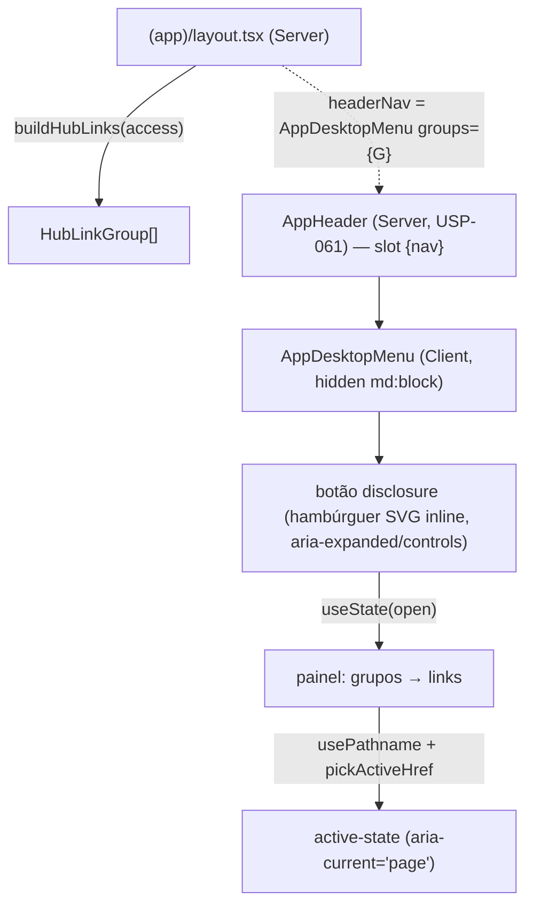

# USP-063 — Navegação desktop (menu no header) Design

**Spec**: `.specs/features/app-shell-logado/usp-063-menu-desktop/spec.md`
**Sibling (mesma unidade de execução)**: `.specs/features/app-shell-logado/usp-062-bottom-tab-bar/design.md`
**Status**: Draft

> **Unidade combinada 062+063.** Ver a nota no design da USP-062 (a arquitetura, o
> composition-root e o helper puro `pickActiveHref` são compartilhados). Este documento
> detalha **o menu desktop** e referencia — sem re-derivar — as partes comuns. A
> implementação roda como **1 unit** (`tasks.md` idêntico nos dois `dir:`).

---

## Architecture Overview

O composition-root `(app)/layout.tsx` computa `HubAccess` completo + `groups =
buildHubLinks(access)` (uma única vez — ver design da USP-062) e injeta o menu no seam
`headerNav` da casca da USP-061:

`headerNav={<AppDesktopMenu groups={groups} />}`.

`AppDesktopMenu` é um **Client Component** (precisa de `usePathname()` para active-state e
`useState` para o toggle do disclosure) — recebe `groups` já resolvidos e nunca importa
sessão/Prisma (preserva APP-SHELL-MN-03 / DNAV-MN-03). É o análogo autenticado do
`PublicNav`: mesmo padrão de hambúrguer inline + painel, aplicado à navegação completa por
papel em vez dos 3 itens públicos.



Renderização: o `AppHeader` (USP-061) já renderiza `{nav}` no lado direito, antes da
identidade/Sair. O menu ocupa esse slot em `≥ md`; em `< md` ele é `hidden`, e a navegação é
a bottom bar da USP-062.

---

## Code Reuse Analysis

### Existing Components to Leverage

| Component | Location | How to Use |
| --------- | -------- | ---------- |
| `AppHeader` (slot `nav` / seam `headerNav`) | `src/app/(app)/_components/app-header.tsx` | **Consumir** o slot — o menu é passado como `headerNav` pelo layout; **não** reescrever o header |
| `AppShell` (repassa `headerNav`→`AppHeader.nav`) | `src/app/(app)/_components/app-shell.tsx` | Já repassa o seam (USP-061); nada a mudar |
| `(app)/layout.tsx` (composition-root) | `src/app/(app)/layout.tsx` | **Modificar** (edição única compartilhada com USP-062 — task T6): injeta `headerNav` |
| `PublicNav` (disclosure hambúrguer) | `src/app/(public)/_components/public-nav.tsx` | **Molde direto**: `useState(open)`, botão `aria-expanded`/`aria-controls`/`aria-label`, SVG hambúrguer inline, painel `absolute`, fecha ao clicar |
| `buildHubLinks` / `EXISTING_HUB_ROUTES` / `HubLinkGroup` | `@/modules/identity` (`domain/hub-links.ts`) | Fonte única de grupos/links/allowlist (role-aware herdado) |
| `pickActiveHref` (COMPARTILHADO — USP-062) | `@/modules/identity` (`domain/app-nav.ts`) | Active-state longest-match (`aria-current`) — **mesmo** helper da bottom bar |
| `public-nav.test.tsx` | `src/app/(public)/_components/__tests__/` | **Molde** RTL: mock `usePathname` (`vi.hoisted` + `vi.mock` + `await import`), `fireEvent` no botão |
| `cn` | `@/shared/ui` | Classes tokens-only |
| `Link` | `next/link` | Cada link do menu |
| `app-shell-no-auth-pii.test.ts` / `app-shell-uses-tokens.test.ts` | `src/shared/__tests__/` | **Guards MN-03/MN-04 reusados** (varrem `(app)/_components/**`) |

### Integration Points

| System | Integration Method |
| ------ | ------------------ |
| `(app)/layout.tsx` | Injeta `headerNav={<AppDesktopMenu groups={groups} />}` (edição única com USP-062) |
| `@/modules/identity` (barrel) | Consome `pickActiveHref` (criado na foundation da unidade); `buildHubLinks`/`HubLinkGroup` já exportados |
| `AppHeader` (USP-061) | Renderiza o menu no slot `{nav}` — contrato de seam já existente, sem mudança |

---

## Components

### `pickActiveHref` (helper puro — COMPARTILHADO, definido no design da USP-062)

- Ver `usp-062-bottom-tab-bar/design.md` → seção `pickActiveHref`. `src/modules/identity/
  domain/app-nav.ts`. `pickActiveHref(hrefs, pathname): string | null` (longest-match).
- **Uso aqui**: `const activeHref = pickActiveHref(allHrefs, pathname)`, onde `allHrefs` é o
  flatten de todos os `group.links[].href`. Um link é ativo sse `link.href === activeHref`.
- **Requirements**: DNAV-03.
- **Nota**: criado uma vez na unidade (task T1). USP-063 **consome**, não recria.

### `AppDesktopMenu` (Client Component — USP-063)

- **Purpose**: Menu disclosure do header com a navegação completa role-aware.
- **Location**: `src/app/(app)/_components/app-desktop-menu.tsx` (`'use client'`).
- **Interface (props)**: `interface AppDesktopMenuProps { groups: HubLinkGroup[]; className?: string }`
- **Structure** (espelha `PublicNav`, adaptado a grupos):
  ```tsx
  'use client';
  // useState (react), usePathname (next/navigation), Link (next), cn (@/shared/ui),
  // pickActiveHref (@/modules/identity)
  const pathname = usePathname();
  const [open, setOpen] = useState(false);
  const activeHref = pickActiveHref(groups.flatMap(g => g.links.map(l => l.href)), pathname);
  return (
    <div className={cn('relative hidden md:block', className)}>
      <button type="button" onClick={() => setOpen(o => !o)}
        aria-expanded={open} aria-controls="app-menu-panel"
        aria-label={open ? 'Fechar menu de navegação' : 'Abrir menu de navegação'}
        className="flex items-center justify-center rounded-sm p-2 text-fg">
        <svg aria-hidden viewBox="0 0 24 24" fill="none" stroke="currentColor" strokeWidth={2}
             className="h-6 w-6">
          <path strokeLinecap="round" strokeLinejoin="round"
                d="M3.75 6.75h16.5M3.75 12h16.5m-16.5 5.25h16.5" />
        </svg>
      </button>
      {open && (
        <nav id="app-menu-panel" aria-label="Navegação da conta"
             className="absolute right-0 top-full mt-2 w-72 rounded-md border border-border bg-surface p-3 shadow-lg">
          {groups.map(group => (
            <div key={group.title} className="mb-2 last:mb-0">
              <p className="px-2 pb-1 pt-2 text-xs font-semibold uppercase tracking-wide text-fg-muted">
                {group.title}
              </p>
              {group.links.map(link => {
                const active = link.href === activeHref;
                return (
                  <Link key={link.href} href={link.href}
                    aria-current={active ? 'page' : undefined}
                    onClick={() => setOpen(false)}
                    className={cn('block rounded-sm px-2 py-2 text-sm',
                      active ? 'font-semibold text-primary' : 'text-fg hover:text-primary')}>
                    {link.label}
                  </Link>
                );
              })}
            </div>
          ))}
        </nav>
      )}
    </div>
  );
  ```
- **Rules**:
  - `hidden md:block` no wrapper (oculto `< md` — DNAV-05).
  - Botão: `aria-expanded`, `aria-controls="app-menu-panel"`, `aria-label` dinâmico (mesmo
    padrão do `PublicNav`) — DNAV-04.
  - Painel: landmark `nav` com `aria-label="Navegação da conta"` (distinto da bottom bar).
  - Grupos e ordem = os de `buildHubLinks` (título como cabeçalho) — DNAV-02; role-aware
    herdado (só vêm os grupos concedidos).
  - `aria-current="page"` no link ativo (longest-match via `pickActiveHref`) — DNAV-03.
  - Fecha ao clicar num link (`setOpen(false)`) — DNAV-04.
  - Tokens-only (`text-fg`, `text-fg-muted`, `text-primary`, `border-border`, `bg-surface`,
    `shadow-lg`, `rounded-*`) — DNAV-MN-04.
- **Dependencies**: `useState`, `usePathname`, `Link`, `cn`, `pickActiveHref`,
  `HubLinkGroup` (tipo).
- **Requirements**: DNAV-01, -02, -03, -04, -05; DNAV-MN-01, -02, -03, -04.
- **Nota**: recebe `groups` já role-filtrados; **não** toca sessão/Prisma (isso é do
  layout) → MN-03. `HubLinkGroup` é só um `import type` (não puxa runtime do módulo).

### `(app)/layout.tsx` (composition-root — modificado, COMPARTILHADO com USP-062)

- Ver `usp-062-bottom-tab-bar/design.md` → seção do layout. A **mesma** edição injeta os
  dois seams: `headerNav={<AppDesktopMenu groups={groups} />}` (USP-063) e
  `bottomNav={<AppBottomNav tabs={selectPrimaryTabs(groups)} />}` (USP-062).
- **Requirements aqui**: DNAV-01, DNAV-02, DNAV-MN-02 (ângulo composition-root).

---

## Data Models

Nenhum. Zero migração. Reusa `HubLinkGroup`/`HubLink`/`EXISTING_HUB_ROUTES`. Sem tipo novo
próprio (USP-062 introduz `BottomTab`; USP-063 usa os tipos existentes do hub).

---

## Error Handling Strategy

| Error Scenario | Handling | User Impact |
| -------------- | -------- | ----------- |
| Sem sessão / 1º acesso | `requireActivePerson()` (layout, herdado) → redirect | Menu não renderiza |
| Pessoa com zero papéis | `buildHubLinks` → só "Minha conta" | Menu com 1 grupo (nunca vazio) |
| `pathname` sem link correspondente | `pickActiveHref` → `null` | Menu abre, nada destacado |
| `/perfil/papeis` (par aninhado) | longest-match → `/perfil/papeis` ativo, `/perfil` não | Destaque correto |
| Painel fechado | `open === false` → links não renderizados | Só o botão focável (espelha PublicNav) |

---

## Risks & Concerns

| Concern | Location | Impact | Mitigation |
| ------- | -------- | ------ | ---------- |
| `pickActiveHref` com prefixo simples marcaria pais aninhados | `app-desktop-menu.tsx` | `/perfil` e `/perfil/papeis` ativos juntos | `pickActiveHref` usa longest-match (não o `isActive` do PublicNav); teste cobre o caso aninhado (DNAV-03) |
| Testes de componente puxando barrels derrubam branch coverage | `_components/__tests__` | Gate < 65% | Lógica de active-state é o helper puro `pickActiveHref` (testado à parte); o teste do menu é enxuto (mock `next/navigation`) |
| Dois landmarks `nav` (bottom + desktop) na árvore | casca | Ambiguidade a11y | `display:none` por breakpoint remove um da árvore; `aria-label` distinto ("Navegação da conta") |
| Painel `absolute` pode sair da viewport à direita | `app-desktop-menu.tsx` | Corte visual | `right-0` ancora à direita do botão (que fica no fim do header); `w-72` cabe no container `max-w-6xl`. Sem overlay/portal (YAGNI) |

> Test gaps: E2E autenticado deferido (A8/L-007/AD-025). Cobertura por RTL de componente +
> layout + guards + build.

---

## Tech Decisions (only non-obvious ones)

| Decision | Choice | Rationale |
| -------- | ------ | --------- |
| Hambúrguer vs dropdown | **Disclosure hambúrguer** (botão `aria-expanded` + painel), espelhando `PublicNav` | 13+ links em até 3 grupos não cabem inline; painel agrupado é o container; reusa o único padrão de disclosure do repo, sem lib nova (A1) |
| Active-state | `pickActiveHref` (longest-match) compartilhado com USP-062 | Corrige pares aninhados do hub; mesmo aria, semântica correta (A3) |
| Ícones no menu | **Sem** ícones (lista textual agrupada) | Ícones são affordance da bottom bar (USP-062); menu textual espelha os cards do hub; menos superfície (A6) |
| Grupos/ordem | Exatamente os de `buildHubLinks` (título = cabeçalho) | Fonte única; role-aware e allowlist (HUB-MN-01) herdados; menu não inventa nem reordena (A4) |
| Guards MN-03/MN-04 | **Reusar** os da USP-061 | Já cobrem `_components/**`; o menu novo entra na varredura (A8) |

> **Project-level decisions:** nenhuma nova convenção; nenhum `AD-NNN`. A divisão
> Server/Client da casca (USP-061) e o padrão de disclosure (PublicNav) são as referências
> aplicadas; não há supersessão de ADR.
