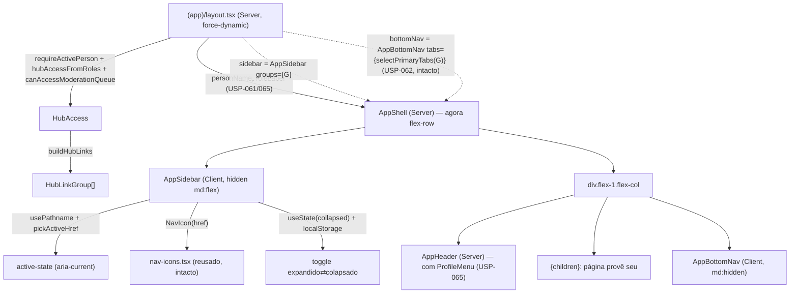

# USP-064 — Navegação desktop round 2: sidebar colapsável Design

**Spec**: `.specs/features/app-shell-logado/usp-064-sidebar-desktop/spec.md`
**Sibling (mesma unidade de execução)**: `.specs/features/app-shell-logado/usp-065-menu-perfil/design.md`
**Status**: Draft

> **Unidade combinada 064+065.** As duas USPs são a mesma superfície (a chrome da casca
> `(app)`), editam os mesmos arquivos (`AppShell`, `AppHeader`, `(app)/layout.tsx`, guards) e
> rodam como **1 unit** (`tasks.md` idêntico nos dois `dir:`). Este design detalha a
> **sidebar**; o da USP-065 detalha o **Menu de Perfil**. Partes compartilhadas (a mudança do
> `AppShell` para flex-row, a edição do layout, os guards) são descritas aqui e referenciadas
> — sem re-derivar — pelo design da USP-065.

## Decisões de projeto ativas conformadas (`.specs/STATE.md` §Decisions)

- **AD-027 (Fase 10, App Shell)** — **ativa**. Esta USP **conforma** à sua arquitetura de
  casca: `AppShell`/`AppHeader` apresentacionais em `(app)/_components/`, composition-root no
  layout, seams `React.ReactNode`, guards source-scan MN-03/MN-04, sem lib de ícones, sem token
  novo. **Substitui** o `AppDesktopMenu` (USP-063) — que a própria nota "Round 2" do ROADMAP já
  declara superseposta por 064/065 —, **sem** reabrir USP-061/062. Não é uma supersessão de
  AD-027 (a convenção de casca segue igual); é uma troca de componente **dentro** dela. Uma
  entrada **AD-028** (round 2) pode ser registrada pelo fluxo de memória **após o PASS** do
  Verifier (como AD-027 foi) — o Planner não edita `STATE.md`.
- **AD-025 (casca pública)** — ativa; referência de localização de componente de rota
  (`_components/`, não `shared/ui`). Conformada.
- **ADR-0030 / AD-022 (composition-root de sessão)** — o layout é o único a tocar sessão;
  componentes recebem dados prontos. Conformada.

Nenhuma decisão ativa é violada; nenhuma nova convenção project-wide é criada por esta USP.

**Lessons aplicadas:** L-021 (Client Component não importa o barrel `@/modules/identity`
server-only — usar `domain/*` direto com `eslint-disable no-restricted-imports`); a lição de
cobertura (testes que puxam barrels pesados derrubam branch v8 → lógica de decisão em helpers
puros já testados; componente enxuto com mock de `next/navigation`).

---

## Architecture Overview

A casca da USP-061 expõe seams. Hoje o composition-root injeta
`headerNav={<AppDesktopMenu groups={groups} />}` + `bottomNav={<AppBottomNav .../>}`. Round 2:
**remove-se o `headerNav`/`AppDesktopMenu`** e adiciona-se um **seam `sidebar`** preenchido com
`<AppSidebar groups={groups} />`. O `AppShell` passa de coluna (`flex-col`) para **linha**
(`flex`): sidebar à esquerda + uma coluna `flex-1` contendo header + `{children}` + bottomNav.

`AppSidebar` é um **Client Component** apresentacional (precisa de `usePathname()` para
active-state e `useState` para o collapse) — recebe `groups` já resolvidos e nunca importa
sessão/Prisma (preserva APP-SHELL-MN-03 / SIDE-MN-03). Reaproveita `pickActiveHref` (USP-062/063)
e `NavIcon` (USP-062) sem alterá-los.



Fluxo por request: middleware Edge (cookie) → `(app)/layout.tsx` (`requireActivePerson()` +
`HubAccess`/`groups`, **inalterado**) → `AppShell` (flex-row) recebe `sidebar`/`bottomNav` →
`AppSidebar` resolve active-state + collapse no client.

---

## Code Reuse Analysis

### Existing Components to Leverage

| Component | Location | How to Use |
| --------- | -------- | ---------- |
| `AppShell` (casca / seams) | `src/app/(app)/_components/app-shell.tsx` | **Modificar**: flex-row; troca o seam `headerNav` pelo seam `sidebar` (T3) |
| `AppHeader` (`nav?` seam) | `src/app/(app)/_components/app-header.tsx` | **Modificar**: remove o prop `nav?` (dead seam — a sidebar assume). A troca identidade→ProfileMenu é da USP-065 (mesmo arquivo, T4) |
| `(app)/layout.tsx` (composition-root) | `src/app/(app)/layout.tsx` | **Modificar** (T6): remove `AppDesktopMenu`/`headerNav`; injeta `sidebar={<AppSidebar groups={groups}/>}`. `HubAccess`/`groups` inalterados |
| `pickActiveHref` | `@/modules/identity/domain/app-nav.ts` | **Reusar** (import direto, L-021) — active-state longest-match. Sem mudança |
| `NavIcon` | `src/app/(app)/_components/nav-icons.tsx` | **Reusar** (import local) — registry href→SVG já cobre as 11 rotas + fallback. **Não** se altera (USP-062 aprovada) |
| `buildHubLinks` / `HubLinkGroup` / `EXISTING_HUB_ROUTES` | `@/modules/identity/domain/hub-links.ts` | Fonte única de grupos/links/allowlist (role-aware herdado) |
| `cn` | `@/shared/ui` | Classes tokens-only |
| `Link` | `next/link` | Cada link da sidebar |
| `ThemeToggle` (padrão de persistência) | `src/shared/ui/theme-toggle.tsx` | **Referência** do padrão `useState`+`useEffect`+`localStorage` (degrada sem lançar) para o collapse |
| `app-desktop-menu.tsx` (+ `.test.tsx`) | `src/app/(app)/_components/` | **Remover** (A8) — dead code após o layout parar de injetá-lo |
| `public-nav.test.tsx` / `app-bottom-nav.test.tsx` | `(public)`/`(app)` `__tests__/` | **Molde** RTL (mock `usePathname` via `vi.hoisted`+`vi.mock`+`await import`, `fireEvent`) |
| `app-shell-no-auth-pii.test.ts` / `app-shell-uses-tokens.test.ts` | `src/shared/__tests__/` | **Guards MN-03/MN-04 reusados**; migrar a asserção de membership `app-desktop-menu.tsx`→`app-sidebar.tsx` |

### Integration Points

| System | Integration Method |
| ------ | ------------------ |
| `(app)/layout.tsx` | Passa a injetar `sidebar` (em vez de `headerNav`); `bottomNav` intacto (edição única com a USP-065 no mesmo PR) |
| `@/modules/identity` (barrel) | **Nenhum export novo** — a sidebar consome `pickActiveHref`/`buildHubLinks`/`HubLinkGroup` já exportados/importados direto |
| `AppShell` (USP-061) | Contrato de seam evolui: `headerNav?` → `sidebar?` (o `bottomNav?` fica) |
| ~30 páginas `(app)/*` | **Nenhuma alteração** — mantêm seu `<main>`; o wrapper flex-row reserva a coluna da sidebar (A2) |

---

## Components

### `AppSidebar` (Client Component — USP-064)

- **Purpose**: A sidebar colapsável à esquerda com a navegação completa role-aware.
- **Location**: `src/app/(app)/_components/app-sidebar.tsx` (`'use client'`).
- **Interface (props)**: `interface AppSidebarProps { groups: HubLinkGroup[]; className?: string }`
- **Imports** (padrão L-021 — direto de `domain/*`, não do barrel):
  ```tsx
  'use client';
  import { useEffect, useState } from 'react';
  import Link from 'next/link';
  import { usePathname } from 'next/navigation';
  import { cn } from '@/shared/ui';
  // eslint-disable-next-line no-restricted-imports
  import { pickActiveHref } from '@/modules/identity/domain/app-nav';
  // eslint-disable-next-line no-restricted-imports
  import type { HubLinkGroup } from '@/modules/identity/domain/hub-links';
  import { NavIcon } from './nav-icons';
  ```
- **Estado & persistência (A-COLLAPSE, padrão `ThemeToggle`)**:
  - `const [collapsed, setCollapsed] = useState(false);` (SSR/1º render = **expandido** →
    sem hydration mismatch, igual ao `ThemeToggle` que inicia `'light'`).
  - `useEffect(() => { try { setCollapsed(localStorage.getItem('asonseg:sidebar-collapsed') === 'true'); } catch {} }, []);`
    (aplica a preferência salva; degrada sem lançar).
  - `toggle()`: `const next = !collapsed; setCollapsed(next); try { localStorage.setItem('asonseg:sidebar-collapsed', String(next)); } catch {}`.
  - **Nota de trade-off:** quem prefere colapsado vê 1 frame de settle (expandido→colapsado)
    no 1º paint — mesma classe do settle do ícone do `ThemeToggle`, aceito (spec A-COLLAPSE).
    Zero-flash via `SidebarInitScript` (espelhando `ThemeScript`) fica deferido.
- **Estrutura**:
  ```tsx
  const pathname = usePathname();
  const activeHref = pickActiveHref(groups.flatMap((g) => g.links.map((l) => l.href)), pathname);
  return (
    <aside
      className={cn(
        'hidden md:flex md:flex-col shrink-0 self-start sticky top-0 h-screen',
        'border-r border-border bg-surface transition-[width]',
        collapsed ? 'w-16' : 'w-60',
        className,
      )}
    >
      <div className="flex items-center justify-end p-2">
        <button
          type="button"
          onClick={toggle}
          aria-pressed={collapsed}
          aria-label={collapsed ? 'Expandir menu lateral' : 'Recolher menu lateral'}
          className="flex items-center justify-center rounded-sm p-2 text-fg-muted hover:text-primary"
        >
          <svg aria-hidden viewBox="0 0 24 24" fill="none" stroke="currentColor" strokeWidth={2} className="h-5 w-5">
            {/* chevron-left quando expandido, chevron-right quando colapsado (path inline, local) */}
            <path strokeLinecap="round" strokeLinejoin="round"
                  d={collapsed ? 'M9 6l6 6-6 6' : 'M15 6l-6 6 6 6'} />
          </svg>
        </button>
      </div>
      <nav aria-label="Navegação lateral" className="flex-1 overflow-y-auto px-2 pb-4">
        {groups.map((group) => (
          <div key={group.title} className="mb-2 last:mb-0">
            {!collapsed && (
              <p className="px-2 pb-1 pt-2 text-xs font-semibold uppercase tracking-wide text-fg-muted">
                {group.title}
              </p>
            )}
            {group.links.map((link) => {
              const active = link.href === activeHref;
              return (
                <Link
                  key={link.href}
                  href={link.href}
                  aria-current={active ? 'page' : undefined}
                  aria-label={collapsed ? link.label : undefined}   {/* SIDE-MN-05 */}
                  title={collapsed ? link.label : undefined}
                  className={cn(
                    'flex items-center gap-3 rounded-sm px-2 py-2 text-sm',
                    collapsed && 'justify-center',
                    active ? 'font-semibold text-primary' : 'text-fg hover:text-primary',
                  )}
                >
                  <NavIcon href={link.href} />
                  {!collapsed && <span>{link.label}</span>}
                </Link>
              );
            })}
          </div>
        ))}
      </nav>
    </aside>
  );
  ```
- **Rules**:
  - `hidden md:flex` (oculta `< md` — SIDE-05); `self-start sticky top-0 h-screen` pina o rail
    (o `self-start` impede o stretch do flex-item — sem isso o `sticky` não teria efeito).
  - Largura: `w-60` expandido / `w-16` colapsado (SIDE-02); `transition-[width]` suave.
  - Landmark `nav` com `aria-label="Navegação lateral"` (distinto de "Navegação principal"
    da bottom bar e da antiga "Navegação da conta").
  - Grupos/ordem/rótulos = os de `buildHubLinks`; título de grupo só no modo expandido (SIDE-02);
    role-aware/allowlist herdados (só vêm os grupos concedidos) — SIDE-MN-01/02.
  - `aria-current="page"` no link ativo (longest-match) — SIDE-04.
  - **Colapsada**: rótulo vira `aria-label`+`title` no `<Link>` → item mantém nome acessível
    (SIDE-06, SIDE-MN-05).
  - Toggle: `aria-pressed` + `aria-label` dinâmico; chevron SVG inline **local** (não toca
    `nav-icons.tsx`) — A5.
  - Tokens-only (`text-fg`/`text-fg-muted`/`text-primary`/`border-border`/`bg-surface`/`rounded-*`).
- **Dependencies**: `useState`/`useEffect`, `usePathname`, `Link`, `cn`, `pickActiveHref`,
  `NavIcon`, `HubLinkGroup` (tipo).
- **Requirements**: SIDE-01..06; SIDE-MN-01..05.

### `AppShell` (Server Component — modificado, COMPARTILHADO)

- **Purpose**: A casca — agora **flex-row**: sidebar + coluna de conteúdo.
- **Location**: `src/app/(app)/_components/app-shell.tsx`.
- **Interface (props)**: `personName`, `roleLabel`, `children`, `sidebar?`, `bottomNav?`
  (**remove** `headerNav?`).
- **Structure**:
  ```tsx
  export function AppShell({ personName, roleLabel, children, sidebar, bottomNav }: AppShellProps) {
    return (
      <div className="flex min-h-screen">
        {sidebar}
        <div className="flex min-h-screen flex-1 flex-col">
          <AppHeader personName={personName} roleLabel={roleLabel} />
          {children}
          {bottomNav}
        </div>
      </div>
    );
  }
  ```
- **Nota**: `AppShell` **não importa** `AppSidebar` — recebe-o como `ReactNode` do layout
  (apresentacional; preserva MN-03). Continua **sem** declarar `<main>` (A2/USP-061). O
  `AppHeader` deixa de receber `nav` (a sidebar assume o desktop; o Menu de Perfil da USP-065
  ocupa o canto direito).
- **Requirements**: SIDE-01 (estrutura), APP-SHELL-06/07 (regressão dos seams).

### `AppHeader` (Server Component — modificado, COMPARTILHADO)

- **Change (USP-064)**: remove o prop `nav?` e o slot `{nav}` (dead seam). A troca do bloco de
  identidade pelo `ProfileMenu` é da **USP-065** (mesmo arquivo, task T4) — ver o design da 065.
- **Requirements**: SIDE-01 (o header não hospeda mais nav desktop).

### `(app)/layout.tsx` (composition-root — modificado, COMPARTILHADO)

- **Change (T6)**: remove `import { AppDesktopMenu }` e `headerNav={...}`; adiciona
  `import { AppSidebar }` e `sidebar={<AppSidebar groups={groups} />}`. `requireActivePerson()`,
  `HubAccess`/`groups`, `describeActiveRoles`, `bottomNav` — **inalterados**.
- **Shape**:
  ```tsx
  return (
    <AppShell
      personName={person.fullName}
      roleLabel={describeActiveRoles(person.roles)}
      sidebar={<AppSidebar groups={groups} />}
      bottomNav={<AppBottomNav tabs={selectPrimaryTabs(groups)} />}
    >
      {children}
    </AppShell>
  );
  ```
- **Requirements**: SIDE-01, SIDE-MN-02 (ângulo composition-root).

### Guards estáticos (must-not sensors — reusados)

- `app-shell-no-auth-pii.test.ts` (MN-03) e `app-shell-uses-tokens.test.ts` (MN-04) já varrem
  `(app)/_components/**` recursivamente → cobrem `app-sidebar.tsx` automaticamente. **Migrar** a
  asserção de membership: trocar `expect(scannedBasenames).toContain('app-desktop-menu.tsx')`
  por `toContain('app-sidebar.tsx')` (e `'profile-menu.tsx'` — USP-065) em ambos.

---

## Data Models

Nenhum. Zero migração. Reusa `HubLinkGroup`/`HubLink`/`EXISTING_HUB_ROUTES`. Persistência do
collapse = chave `localStorage['asonseg:sidebar-collapsed']` (string `'true'`/`'false'`).

---

## Error Handling Strategy

| Error Scenario | Handling | User Impact |
| -------------- | -------- | ----------- |
| Sem sessão / 1º acesso | `requireActivePerson()` (layout, herdado) → redirect | Sidebar não renderiza |
| Pessoa com zero papéis | `buildHubLinks` → só "Minha conta" | Sidebar com 1 grupo (nunca vazia) |
| `pathname` sem link | `pickActiveHref` → `null` | Nada destacado |
| `/perfil/papeis` (aninhado) | longest-match → `/perfil/papeis` ativo, `/perfil` não | Destaque correto |
| `localStorage` indisponível | `try/catch` no read/write → default expandido | Sidebar expandida, sem crash |
| href sem ícone no registry | `NavIcon` → fallback (círculo) | Item com ícone genérico |

---

## Risks & Concerns

| Concern | Location | Impact | Mitigation |
| ------- | -------- | ------ | ---------- |
| `sticky` sem efeito por stretch do flex-item | `app-sidebar.tsx` | Sidebar rolaria com o conteúdo | `self-start` (align-self: flex-start) impede o stretch; `sticky top-0 h-screen` pina. Documentado como regra |
| Settle de 1 frame (expandido→colapsado) p/ quem prefere colapsado | `app-sidebar.tsx` | Micro-shift de largura no 1º paint | Aceito (A-COLLAPSE); mesma classe do `ThemeToggle`. Zero-flash (inline `SidebarInitScript`) deferido |
| Remover `AppDesktopMenu` quebra as asserções de membership dos guards | `app-shell-*.test.ts` | Guard vermelho por asserção obsoleta | T6 migra a asserção p/ `app-sidebar.tsx`; T1 já a adiciona ao criar o arquivo. Não é enfraquecimento — é atualização |
| `layout.test.tsx` abre o painel do `AppDesktopMenu` (linha ~124) | `src/app/(app)/layout.test.tsx` | Teste vermelho após a remoção | T6 atualiza: em vez de abrir o painel do menu, asserta o link role-aware **na sidebar** |
| Testes de componente puxando barrels derrubam branch coverage | `_components/__tests__` | Gate < 65% | Lógica de decisão é o helper puro `pickActiveHref` (já testado à parte); o teste da sidebar é enxuto (mock `next/navigation`, sem barrels pesados) |
| Sidebar `w-60` + `max-w-6xl` do header numa viewport `md` estreita | casca | Conteúdo apertado em ~768px | `md` (768px) − `w-60` (240px) ainda dá ~528px úteis; `max-w-6xl` só centraliza. Aceitável; colapsar libera espaço |

> Test gaps: E2E autenticado deferido (L-007/AD-025/AD-027). Cobertura por RTL de componente +
> layout + guards + build. Nenhum gap novo nas ~30 páginas (a casca só embrulha `{children}`).

---

## Tech Decisions (only non-obvious ones)

| Decision | Choice | Rationale |
| -------- | ------ | --------- |
| Padrão de nav desktop | **Sidebar colapsável** (substitui o hambúrguer da USP-063) | Pedido explícito do dono (round 2); referência Supabase (rail à esquerda + toggle rótulo⇄ícone) |
| Forma do `AppShell` | **flex-row** (sidebar + coluna `flex-1`) | Acomoda um elemento de layout horizontal sem editar as ~30 páginas (A2 da USP-061 preservada) |
| Persistência do collapse | `localStorage` + `useEffect` (padrão `ThemeToggle`) | Precedente do repo; evita cookie/Server Action. Trade-off de 1-frame aceito (A-COLLAPSE) |
| Toggle | Botão na própria sidebar, chevron SVG inline **local** | Supabase põe o recolher na sidebar; header fica p/ a USP-065. `nav-icons.tsx` (USP-062) não é tocado |
| Ícones | `NavIcon` reusado (registry USP-062) | Já cobre as 11 rotas + fallback; sem lib nova, sem duplicar |
| Active-state | `pickActiveHref` reusado (longest-match) | Já existe/testado; corrige pares aninhados |
| `AppDesktopMenu` | **Removido** (arquivo + teste) | Dead code (A8); preferência do dono/briefing. Guards migram a asserção de membership |
| Acessibilidade colapsada | Rótulo → `aria-label`+`title` no `<Link>` | Ícone-só sem nome acessível seria regressão de a11y (SIDE-MN-05) |
| Guards MN-03/MN-04 | **Reusar** os da USP-061 | Já varrem `_components/**`; só migra a asserção de membership (A9) |

> **Project-level decisions:** nenhuma nova convenção project-wide é criada. A troca
> hambúrguer→sidebar é feature-local dentro da convenção de casca (AD-027). Um `AD-028`
> (round 2) pode ser registrado **após o PASS** pelo fluxo de memória — não pelo Planner.
