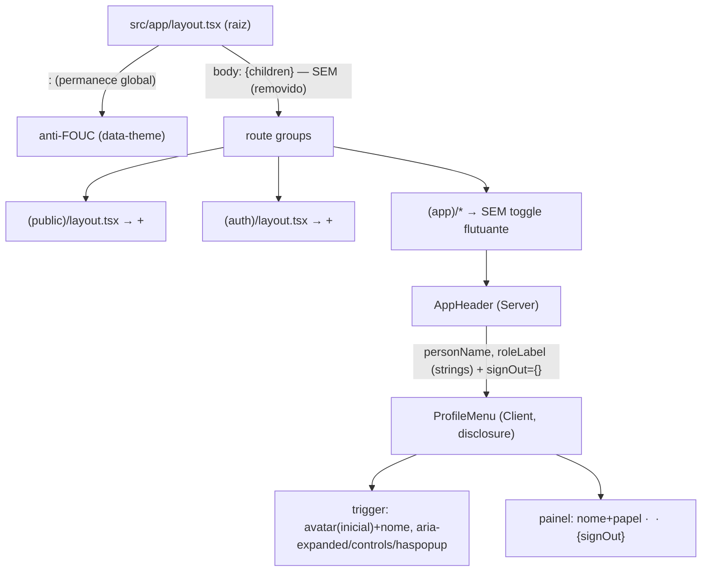

# USP-065 — Menu de Perfil (nome/papel, tema, Sair) Design

**Spec**: `.specs/features/app-shell-logado/usp-065-menu-perfil/spec.md`
**Sibling (mesma unidade de execução)**: `.specs/features/app-shell-logado/usp-064-sidebar-desktop/design.md`
**Status**: Draft

> **Unidade combinada 064+065.** Ver a nota no design da USP-064 (a mudança do `AppShell` para
> flex-row, a edição do `(app)/layout.tsx` e os guards são compartilhados). Este documento
> detalha o **Menu de Perfil** e a **migração do `ThemeToggle`**, referenciando — sem
> re-derivar — as partes comuns. A implementação roda como **1 unit** (`tasks.md` idêntico nos
> dois `dir:`).

## Decisões de projeto ativas conformadas (`.specs/STATE.md` §Decisions)

- **AD-027 (Fase 10, App Shell)** — **ativa**. Conformada: `AppHeader` apresentacional em
  `(app)/_components/`, composition-root no layout, guards source-scan, sem lib/token novo.
  O `ProfileMenu` (Client) recebe dados por props do layout (via `AppHeader`), como
  `AppBottomNav`/`AppDesktopMenu`. **APP-SHELL-MN-01** é **reenquadrada** (PROF-MN-05 / A7):
  não é supersessão de AD-027 (a garantia "sem beco sem saída" segue), é evolução da sua
  materialização (Sair migra p/ dentro do menu). Registrável como **AD-028** após o PASS.
- **AD-014 (Design System, `shared/ui`)** — ativa; `ThemeToggle`/`ThemeScript` são primitivas
  de `shared/ui`. A migração de **montagem** (onde o `ThemeToggle` é renderizado) **não** altera
  o componente nem o DS. Conformada.
- **AD-025 (casca pública)** — ativa; `(public)/layout.tsx` monta a casca do grupo. Adicionar
  o `ThemeToggle` flutuante ali é montagem de primitiva, não toca `CASCA-MN-01` (o `ThemeToggle`
  não importa sessão/PII).
- **ADR-0013 (ISR do grupo `(public)`)** — o `(public)/layout.tsx` **não** declara `revalidate`
  (por-página). Adicionar `<ThemeToggle/>` (Client) não muda isso. Conformada.

**Lessons aplicadas:** **L-021** — `ProfileMenu` (Client) **não** importa `@/modules/identity`
(barrel server-only): o `SignOutForm` chega **por prop** do `AppHeader` (Server). É a lição
materializada como must-not PROF-MN-03.

---

## Architecture Overview

Hoje o `AppHeader` (Server) renderiza, no canto direito, `{nav}` + um bloco estático
`(nome + roleLabel)` + `<SignOutForm/>`. Round 2:

- **USP-064** remove o `{nav}` (a sidebar assume o desktop) — ver design 064.
- **USP-065** substitui o bloco `(identidade + SignOutForm)` por um `<ProfileMenu personName
  roleLabel signOut={<SignOutForm/>} />`.

`ProfileMenu` é um **Client Component** (disclosure com `useState`) que recebe **strings**
(`personName`, `roleLabel`) e o `SignOutForm` **como `ReactNode` prop** (`signOut`). O
`AppHeader` continua Server e é quem importa `SignOutForm` do barrel (permitido no servidor) —
o `ProfileMenu` **nunca** importa o barrel (L-021 / PROF-MN-03). O controle de tema dentro do
painel é o **`ThemeToggle` reusado** (`@/shared/ui`, client-safe).

Em paralelo, a **migração do `ThemeToggle`** (ponto 4, opção A5):



---

## Code Reuse Analysis

### Existing Components to Leverage

| Component | Location | How to Use |
| --------- | -------- | ---------- |
| `AppHeader` | `src/app/(app)/_components/app-header.tsx` | **Modificar** (T4): troca o bloco `(identidade + SignOutForm)` por `<ProfileMenu personName roleLabel signOut={<SignOutForm/>} />`; remove `nav?` (USP-064) |
| `SignOutForm` | `@/modules/identity` (barrel) | **Reusar** — importado pelo `AppHeader` (Server, permitido) e **passado como prop** ao `ProfileMenu`. Não muda a ação |
| `ThemeToggle` | `src/shared/ui/theme-toggle.tsx` (via `@/shared/ui`) | **Reusar** dentro do painel (client-safe); `className` p/ caber na linha. Lógica **não** reescrita |
| `ThemeScript` / `THEME_INIT_SCRIPT` | `@/shared/ui` | **Permanece** no `<head>` do layout raiz (anti-FOUC global). Não muda |
| `PublicNav` (disclosure) | `src/app/(public)/_components/public-nav.tsx` | **Molde**: `useState(open)`, `aria-expanded`/`aria-controls`/`aria-label`, fecha ao clicar |
| `describeActiveRoles` / `roleLabel` | `@/modules/identity` (`domain/roles.ts`) | **Reusar** — o layout já passa `roleLabel` ao `AppHeader`; o `ProfileMenu` o exibe (mantém `data-testid="app-header-role-label"`) |
| marca-badge (`bg-gradient-to-br from-primary to-secondary … text-white`) | `AppHeader`/`SiteHeader` | **Molde** do avatar-badge (inicial do nome) do trigger |
| `cn`, `Button` | `@/shared/ui` | Classes tokens-only; `Button` já usado pelo `SignOutForm` |
| `src/app/layout.tsx` (raiz) | — | **Modificar** (T5): remove `<ThemeToggle>` do body; mantém `<ThemeScript>` no head e o import ajustado |
| `src/app/(public)/layout.tsx` · `src/app/(auth)/layout.tsx` | — | **Modificar** (T5): montam `<ThemeToggle className="fixed bottom-4 right-4 z-50 shadow-md" />` |
| `theme-toggle.test.tsx` / `public-nav.test.tsx` | `__tests__/` | **Molde** RTL (toggle de tema; disclosure) |
| `app-shell-no-auth-pii.test.ts` / `app-shell-uses-tokens.test.ts` | `src/shared/__tests__/` | **Guards MN reusados**; adicionar `profile-menu.tsx` à asserção de membership |
| `app-header.test.tsx` / `app-shell.test.tsx` | `(app)/_components/__tests__/` | **Atualizar** (T4): Sair agora dentro do menu (abrir → presente); papel dentro do painel |

### Integration Points

| System | Integration Method |
| ------ | ------------------ |
| `AppHeader` (Server) | Importa `SignOutForm` (barrel, ok) + `ProfileMenu` (local, Client); passa strings + `signOut` node |
| `src/app/layout.tsx` (raiz) | `<ThemeToggle>` sai do body; `<ThemeScript>` fica no head |
| `(public)`/`(auth)` layouts | Ganham o `<ThemeToggle>` flutuante |
| `@/shared/ui` (barrel) | `ProfileMenu` importa `ThemeToggle`/`cn` (client-safe); **não** importa `@/modules/identity` |

---

## Components

### `ProfileMenu` (Client Component — USP-065)

- **Purpose**: Dropdown de perfil no header — trigger (avatar+nome) + painel (nome/papel,
  tema, Sair).
- **Location**: `src/app/(app)/_components/profile-menu.tsx` (`'use client'`).
- **Interface (props)**:
  ```ts
  interface ProfileMenuProps {
    personName: string;
    roleLabel: string;               // '' quando sem papel → linha omitida (PROF-06)
    signOut: React.ReactNode;        // <SignOutForm/> injetado pelo AppHeader (PROF-MN-03/A4)
    className?: string;
  }
  ```
- **Imports** (client-safe apenas):
  ```tsx
  'use client';
  import { useState } from 'react';
  import { cn, ThemeToggle } from '@/shared/ui';   // NÃO importa @/modules/identity (PROF-MN-03)
  ```
- **Estrutura** (espelha `PublicNav`/`AppDesktopMenu`):
  ```tsx
  const [open, setOpen] = useState(false);
  const initial = personName.trim().charAt(0).toUpperCase() || '?';
  return (
    <div className={cn('relative', className)}>
      <button
        type="button"
        onClick={() => setOpen((p) => !p)}
        aria-expanded={open}
        aria-controls="profile-menu-panel"
        aria-haspopup="menu"
        aria-label={open ? 'Fechar menu de perfil' : 'Abrir menu de perfil'}
        className="flex items-center gap-2 rounded-sm p-1 text-fg"
      >
        <span aria-hidden className="flex h-9 w-9 items-center justify-center rounded-full
              bg-gradient-to-br from-primary to-secondary font-heading font-black text-white">
          {initial}
        </span>
        <span className="hidden text-sm font-semibold text-fg sm:block">{personName}</span>
      </button>
      {open && (
        <div id="profile-menu-panel" role="menu"
             className="absolute right-0 top-full mt-2 w-64 rounded-md border border-border bg-surface p-2 shadow-lg">
          <div className="px-2 py-2">
            <p className="text-sm font-semibold text-fg">{personName}</p>
            {roleLabel && (
              <p data-testid="app-header-role-label" className="text-xs text-fg-muted">{roleLabel}</p>
            )}
          </div>
          <hr className="my-1 border-border" />
          <div className="flex items-center justify-between px-2 py-2">
            <span className="text-sm text-fg">Tema</span>
            <ThemeToggle className="h-8 w-8" />
          </div>
          <hr className="my-1 border-border" />
          <div className="px-2 py-1" onClick={() => setOpen(false)}>
            {signOut}
          </div>
        </div>
      )}
    </div>
  );
  ```
- **Rules**:
  - Disclosure: `aria-expanded`/`aria-controls="profile-menu-panel"`/`aria-haspopup="menu"`/
    `aria-label` dinâmico (PROF-04); fecha ao acionar Sair (`setOpen(false)`).
  - Painel `role="menu"`; nome + papel (papel só se `roleLabel` não-vazio — PROF-06, mantém
    `data-testid="app-header-role-label"`).
  - Tema = `<ThemeToggle/>` reusado (PROF-02); Sair = `{signOut}` injetado (PROF-03).
  - Tokens-only; avatar-badge reusa o gradiente da marca (PROF-MN-02).
  - **Não** importa `@/modules/identity` (PROF-MN-03).
- **Dependencies**: `useState`, `cn`, `ThemeToggle` (`@/shared/ui`); `signOut` node (prop).
- **Requirements**: PROF-01, -02, -03, -04, -06; PROF-MN-01, -02, -03, -05.
- **Nota (PROF-04, fechar-fora):** MVP fecha por acionar uma ação (padrão `PublicNav`/
  `AppDesktopMenu`, que também não têm click-outside). Um handler de click-outside/Escape é
  **melhoria opcional** — não requisito; se adicionado, tokens-only e sem lib.

### `AppHeader` (Server Component — modificado, COMPARTILHADO)

- **Change (USP-065)**: troca o bloco `<div>(nome+roleLabel)</div><SignOutForm/>` por
  `<ProfileMenu personName={personName} roleLabel={roleLabel} signOut={<SignOutForm />} />`.
  Mantém a marca→`/inicio`. Remove o prop `nav?` (USP-064).
- **Imports**: `SignOutForm` (barrel — permitido, `AppHeader` é Server), `ProfileMenu` (local),
  `cn`, `Link`.
- **Requirements**: PROF-01, PROF-03, PROF-MN-05 (trigger sempre visível).

### `src/app/layout.tsx` (raiz — modificado, USP-065/T5)

- **Change**: remove `<ThemeToggle className="fixed bottom-4 right-4 z-50 shadow-md" />` do
  `<body>`; ajusta o import (`ThemeScript` continua; `ThemeToggle` deixa de ser usado aqui).
  `<ThemeScript />` **permanece** no `<head>`.
- **Requirements**: PROF-05, PROF-MN-04.

### `(public)/layout.tsx` · `(auth)/layout.tsx` (modificados, USP-065/T5)

- **Change**: cada um monta `<ThemeToggle className="fixed bottom-4 right-4 z-50 shadow-md" />`
  (import de `@/shared/ui`). `(public)` após `<SiteFooter/>`; `(auth)` junto a `{children}`.
- **Requirements**: PROF-05, PROF-MN-04.

### Guards & placement sensors

- `app-shell-no-auth-pii.test.ts` / `app-shell-uses-tokens.test.ts` — reusados; adicionar
  `profile-menu.tsx` à asserção de membership (compartilhado com USP-064/T1 que troca
  `app-desktop-menu.tsx`→`app-sidebar.tsx`).
- `theme-toggle-placement.test.ts` (**novo**, source-scan — PROF-MN-04): lê os arquivos de
  layout e afirma: `src/app/layout.tsx` **não** monta `<ThemeToggle` (mas mantém `ThemeScript`);
  `(public)/layout.tsx` **e** `(auth)/layout.tsx` montam `<ThemeToggle`. Molde: os guards
  source-scan existentes (`readFileSync` + regex).

---

## Data Models

Nenhum. Zero migração. Reusa `roleLabel` (string) + `ThemeToggle` (persistência própria em
`localStorage['theme']` + `data-theme`, inalterada).

---

## Error Handling Strategy

| Error Scenario | Handling | User Impact |
| -------------- | -------- | ----------- |
| Sem sessão / 1º acesso | `requireActivePerson()` (layout, herdado) → redirect | Menu não renderiza |
| `roleLabel === ''` (sem papel) | painel omite o nó de papel | Vê só o nome |
| `personName` vazio/whitespace | `initial` cai em `'?'` | Avatar com `?` (sem crash) |
| `localStorage` indisponível | `ThemeToggle` degrada sem lançar (herdado) | Tema não persiste, sem crash |
| Painel fechado | `open === false` → conteúdo não renderizado | Só o trigger focável |

---

## Risks & Concerns

| Concern | Location | Impact | Mitigation |
| ------- | -------- | ------ | ---------- |
| `ProfileMenu` (Client) importar `@/modules/identity` quebraria o build (L-021) | `profile-menu.tsx` | `next build` falha (server-only no bundle client) | `SignOutForm` chega **por prop**; `ProfileMenu` só importa `@/shared/ui`. Guard static-scan (PROF-MN-03) + build gate |
| `SignOutForm` passado a um Client Component | `AppHeader`→`ProfileMenu` | RSC boundary | Padrão RSC válido: Server Component como `ReactNode` prop de Client Component. `AppHeader` (Server) o cria; `ProfileMenu` só o renderiza |
| Tirar o `ThemeToggle` do raiz sem reinstalar deixaria `(public)`/`(auth)` sem tema | root/public/auth layouts | Regressão: público perde troca de tema | T5 reinstala em ambos; `theme-toggle-placement.test.ts` (PROF-MN-04) prova presença nos 2 + ausência no raiz |
| Testes da USP-061 afirmam "Sair" sempre no DOM | `app-shell.test.tsx`/`app-header.test.tsx` | Vermelho após Sair entrar no dropdown | T4 atualiza **com justificativa** (A7/PROF-MN-05): trigger sempre presente; abrir o menu → Sair presente. Não é enfraquecimento (a garantia sem-beco-sem-saída é mantida, reenquadrada) |
| `ThemeToggle` dentro do menu herda o mesmo `data-theme`/`localStorage['theme']` global | `profile-menu.tsx` | Consistência entre grupos | É desejável: um único estado de tema global; o `ThemeScript` no raiz aplica em todos os grupos. Sem divergência |
| Click-outside ausente (fecha só por ação) | `profile-menu.tsx` | Painel fica aberto até nova ação | Aceito no MVP (padrão `PublicNav`/`AppDesktopMenu`); melhoria opcional documentada, sem lib |

> Test gaps: E2E autenticado deferido (L-007/AD-025/AD-027). Cobertura por RTL de componente +
> source-scan de placement + guards + build.

---

## Tech Decisions (only non-obvious ones)

| Decision | Choice | Rationale |
| -------- | ------ | --------- |
| Identidade no header | **Dropdown `ProfileMenu`** (substitui o bloco estático) | Pedido do dono (round 2); consolida nome/papel/tema/Sair num controle limpo (padrão Supabase) |
| Trigger | Avatar (inicial) + nome (`hidden sm:block`) | Sem imagem de avatar no MVP; reusa o gradiente da marca. Nome some em telas estreitas |
| Sair no menu | `SignOutForm` **por prop** (`signOut`) | `ProfileMenu` é Client; importar do barrel `@/modules/identity` quebraria o build (L-021). Prop = padrão RSC |
| Controle de tema | **Reusar `<ThemeToggle/>`** no painel (só `className`) | Briefing: reaproveitar a lógica, não reescrever. Já persiste + seta `data-theme`; client-safe |
| Migração do `ThemeToggle` (ponto 4) | **Opção (a)**: fora do raiz; flutuante em `(public)`/`(auth)`; em `(app)` só no menu | App Router: só o raiz tem `<head>`. Mover o toggle (body) aos grupos sem menu de perfil é o split idiomático; **corolário**: some o overlap toggle×bottom-bar em mobile de `(app)`. `ThemeScript` fica global (anti-FOUC) |
| APP-SHELL-MN-01 | **Reenquadrada** em PROF-MN-05 (trigger sempre visível + Sair alcançável) | Sair migra p/ o dropdown; a garantia sem-beco-sem-saída é mantida, não drop (A7). Testes da USP-061 atualizados |

> **Project-level decisions:** nenhuma nova convenção project-wide. A migração do `ThemeToggle`
> e o `ProfileMenu` são feature-local dentro das convenções de casca (AD-027) e DS (AD-014). Um
> `AD-028` (round 2) pode ser registrado **após o PASS** pelo fluxo de memória — não pelo Planner.
