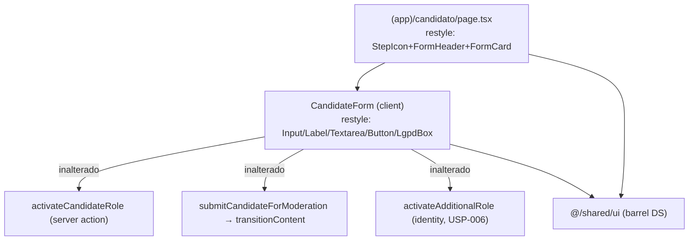

# USP-009 — Cadastro de candidato — Design (REFACTOR ao Design System)

> Deriva de [`spec.md`](./spec.md). **Alvo: refactor style-only** das duas telas de candidato às primitivas de `@/shared/ui` (AD-014), preservando comportamento — mesmo molde das unidades de refactor das Fases 1/2 (AD-015/AD-016).
> **Status:** Draft.

## 0. Restrições ativas do projeto (STATE.md `## Decisions`) — CONFORMAR

Este design **conforma** (não supera) às decisões ativas:

- **AD-014** — Fundação do DS: tokens em `globals.css`/`tailwind.config.ts`; primitivas em `src/shared/ui/` (barrel). Dark via `[data-theme]` (sem `dark:`). **DS-MN-02:** nada de hex cru / paleta fixa em `shared/ui` — aqui estendemos o mesmo princípio aos **consumidores** de candidato (CAD-MN-03).
- **AD-015 / AD-016** — Padrão de refactor: restyle é **style-only** (markup/classes); comportamento preservado ancorado nos **testes verdes existentes como testes negativos**; mudanças não-estilo só se forem **consistência pura** e documentadas. Import de action `'use server'` direto no Client Component é o escape-hatch RSC canônico (AD-013/T-A1).

Nenhuma decisão exige superação. Nenhum ADR de `docs/arch/` é contrariado (o restyle não altera contratos).

## 1. Estado atual (implementação a refatorar)

USP-009 está implementada e verde. Mapa dos arquivos e do que muda:

| Arquivo | Papel | Muda? |
|---|---|---|
| `src/app/(app)/candidato/page.tsx` | Server Component: `requireActivePerson`, carrega `jobAreas`/`profile`/`term`, renderiza `<CandidateForm>` | ✅ **Restyle** (header→`StepIcon`/`FormHeader`/`FormCard`; caixa de erro→token) |
| `src/modules/persons/components/candidate-form.tsx` | Client Component RHF+Zod: campos, gate de consentimento, submit, fluxo rascunho→moderação | ✅ **Restyle** (primitivas + `selectClass` + caixas por token) |
| `src/modules/persons/schemas/candidate.ts` | Zod (obrigatórios + mensagens PT-BR) | ❌ inalterado |
| `src/modules/persons/domain/candidate.ts` | `EDUCATION_LEVELS`, labels, `normalizePhone` | ❌ inalterado |
| `src/modules/persons/actions/activate-candidate-role.ts` | Server Action (Zod→`getCurrentPerson`→`requireActiveConsent`→`withAudit` upsert DRAFT) | ❌ inalterado (já canônico) |
| `src/modules/persons/actions/submit-candidate-for-moderation.ts` | Server Action (→`transitionContent` IN_MODERATION) | ❌ inalterado (já canônico) |
| `src/modules/persons/adapters/prisma-candidate-profile-status.ts` | `ContentStatusRepository` do CandidateProfile | ❌ inalterado |

**Suítes verdes (âncora de preservação — testes negativos):**
- `persons/__tests__/candidate-schema.test.ts` (unit, Zod/domain)
- `persons/__tests__/candidate-actions.test.ts` (unit, actions mockadas — 13 casos)
- `persons/__tests__/candidate-actions.int.test.ts` (integração, Postgres real — 9 casos, CAD-01/03/05)
- `persons/__tests__/CandidateForm.test.tsx` (component — 5 casos: gate de consentimento, erros de validação, happy path, status)
- `e2e/candidato.spec.ts` (E2E — confinamento de rota autenticada)

## 2. Arquitetura do refactor

Princípio: **só a camada de apresentação muda**. Nenhuma aresta de dados/ação é criada, removida ou reconfigurada. A UI continua chamando exatamente as mesmas actions com os mesmos argumentos.

## 3. Code Reuse Analysis

### Primitivas e padrões a reusar (referências verbatim de código já mergeado)

| Componente/padrão | Location | Como usar |
|---|---|---|
| `Button`, `Input`, `Label`, `Textarea`, `LgpdBox` | `@/shared/ui` (barrel) | Substituem `<button>`/`<input>`/`<label>`/`<textarea>` + caixa de consentimento |
| `StepIcon`, `FormHeader`, `FormCard` | `@/shared/ui` | Cabeçalho + moldura da página (padrão de tela de cadastro) |
| **Padrão de form RHF+Zod restilizado** | `src/modules/companies/components/create-company-form.tsx` | **Template exato**: `LgpdBox` com termo + checkbox `accent-primary` gateando o submit; caixa de erro `role="alert"` tintada em `danger`; `Button variant="primary" disabled={isPending \|\| !consentChecked}` |
| **Padrão de `<select>` no DS** | `src/modules/jobs/components/job-form.tsx` (L26-31) | `selectClass` por token (não há primitiva `Select`); `errorClass='mt-1 text-xs text-danger'`; caixas tintadas por `color-mix` sobre tokens |
| Página de cadastro no DS | `src/app/(app)/empresa/cadastrar/page.tsx` | `StepIcon variant="orange"` + `FormHeader` + `FormCard` envolvendo o form |

### Integration Points

| Sistema | Método de integração | Muda? |
|---|---|---|
| Server Actions (`persons`, `identity`) | Import direto do arquivo `'use server'` no client (escape-hatch RSC, comentário já presente no arquivo) | ❌ inalterado |
| Taxonomia `JobArea` (props `jobAreas`) | Carregada no Server Component, passada por prop | ❌ inalterado |
| Termo `JOB_APPLICATION` (prop `term`) | `loadTerm`+`stripTermFrontMatter` no Server Component | ❌ inalterado |

## 4. Componentes e mapeamento de restyle

### 4.1 `candidate-form.tsx` (CAD-R1, owner de CAD-MN-01/02)

- **Imports:** adicionar `import { Button, Input, Label, LgpdBox, Textarea } from '@/shared/ui';`. Remover as constantes locais `inputClass`/`labelClass`/`errorClass` de paleta fixa (`text-red-600`, `border-gray-300`, `focus:ring-blue-200`, `text-gray-700`). Manter `errorClass = 'mt-1 text-xs text-danger'` (token) e `selectClass` (token) copiados de `job-form.tsx`.
- **Campos:**
  - `Escolaridade`, `Área de interesse principal`: `<Label htmlFor>` + `<select className={selectClass} {...register}>` (mantém `<option>`s, `EDUCATION_LEVELS`/`jobAreas`).
  - `Telefone`: `<Label>` + `<Input type="tel">`.
  - `Resumo profissional` (opcional): `<Label>` + `<Input>`; o sufixo "(opcional)" vira `` (era `text-gray-400`).
  - `Experiência` (opcional): `<Label>` + `<Textarea rows={3}>`.
  - Erros: `{errors.x && 
...}` (token `text-danger`).
- **Placeholder de CV (USP-040):** comentário mantido no mesmo ponto.
- **Termo de consentimento (CAD-05 / CAD-MN-01):** trocar a `
` cinza por `<LgpdBox title="Termo de uso para candidatura a vagas">` envolvendo: caixa interna do corpo do termo (`max-h-40 overflow-y-auto whitespace-pre-wrap rounded-sm border border-border bg-surface p-2 text-xs text-fg-muted`, `aria-label` preservado) + `<label className="flex cursor-pointer items-start gap-2 text-sm text-fg">` com `<input type="checkbox" className="mt-0.5 accent-primary" checked={consentChecked} onChange=...>`. **Condicional `!alreadyCandidate` preservada.** Um único checkbox (mantém `getByRole('checkbox')`).
- **Erro do servidor (`role="alert"`):** `rounded-sm bg-[color-mix(in_srgb,var(--color-danger)_10%,transparent)] p-3 text-sm text-danger` (era `bg-red-50 border-red-200 text-red-700`).
- **Botão submit:** `<Button type="submit" variant="primary" disabled={isPending || !consentChecked}>` — texto `{isPending ? 'Salvando…' : 'Salvar cadastro'}` preservado (mantém `getByRole('button', {name:/salvar cadastro/i})`).
- **Caixa "rascunho" (CAD-03):** superfície neutra (sem token amber): `rounded-md border border-border bg-background p-4 text-sm` com texto `text-fg`/`text-fg-muted`; botão interno `<Button type="button" variant="primary" size="sm" onClick={onSubmitForModeration} disabled={isPending}>` texto `{isPending ? 'Enviando…' : 'Enviar para moderação'}` (mantém `getByRole('button', {name:/enviar para moderação/i})`).
- **Caixa "em moderação" (`role="status"`):** `rounded-md border border-primary bg-[color-mix(in_srgb,var(--color-primary)_10%,transparent)] px-4 py-3 text-sm text-primary` (era `bg-blue-50 border-blue-200 text-blue-800`). `role="status"` e texto "em moderação" preservados (mantém `getByRole('status')`).
- **Invariantes de DOM a preservar (contrato dos testes):** associações `htmlFor↔id` de escolaridade/área/telefone (`getByLabelText`); rótulos dos botões; um único `checkbox`; `role="alert"`/`role="status"`; render do corpo do termo. Toda a lógica (`useForm`, `onSubmit`, `onSubmitForModeration`, `startTransition`, `router.refresh`, estados `consentChecked`/`status`/`serverError`) **intacta**.

### 4.2 `(app)/candidato/page.tsx` (CAD-R2)

- Manter `export const dynamic = 'force-dynamic'`, `requireActivePerson()`, os `Promise.all` de `jobAreas`/`profile`, o `loadTerm('JOB_APPLICATION')` com `try/catch TermLoaderError`, e a passagem de props ao `<CandidateForm>` — **inalterados**.
- **Layout:** trocar `<main class="... max-w-3xl ...">` + `<header><h1 text-gray-900>
` por: `<main class="mx-auto flex min-h-screen max-w-lg flex-col justify-center px-6 py-12">` + `<StepIcon variant="orange">{userIcon}</StepIcon>` + `<FormHeader title="Cadastro de candidato" description="…"/>` + `<FormCard><CandidateForm .../></FormCard>` (padrão `empresa/cadastrar`).
- **Caixa de termo indisponível (`role="alert"`):** tintada em `danger` por token (era `bg-red-50 border-red-200 text-red-700`).
- `userIcon`: SVG inline (silhueta de usuário/candidato) com `stroke="currentColor"`, sem dependência externa.

### 4.3 Sem mudança de backend (decisão de consistência)

As Server Actions/schemas/domain/adapter **já** seguem os padrões canônicos (`getCurrentPerson()`/ADR-0030, `transitionContent`, `withAudit`, `ActionResult`, export por barrel). O import direto das actions `'use server'` no Client Component é o escape-hatch RSC já documentado no próprio arquivo (idêntico a `job-form.tsx`; AD-013/T-A1). **Portanto, nenhuma mudança de código não-estilo é necessária ou justificada** — mantém o refactor 100% style-only e minimiza risco de regressão.

## 5. Data Models

Nenhum. Sem migração, sem mudança de schema.

## 6. Error Handling Strategy

Inalterada (é a mesma lógica). Apenas a **apresentação** dos estados de erro/sucesso/status passa a usar tokens:

| Estado | Antes | Depois | Impacto ao usuário |
|---|---|---|---|
| Erro do servidor (form) | `role="alert"` vermelho fixo | `role="alert"` tintado em `danger` | Mesma mensagem PT-BR, cor por tema |
| Perfil em rascunho | caixa âmbar | caixa neutra de superfície + CTA `primary` | Mesma afordância "enviar para moderação" |
| Em moderação | `role="status"` azul fixo | `role="status"` tintado em `primary` | Mesmo texto |
| Termo indisponível (página) | `role="alert"` vermelho fixo | `role="alert"` tintado em `danger` | Mesma mensagem |

## 7. Risks & Concerns

| Concern | Location | Impact | Mitigation |
|---|---|---|---|
| Restyle pode quebrar queries de teste (`getByLabelText`/`getByRole`/`getByText`) | `CandidateForm.test.tsx` | Falha de suíte = regressão de contrato-DOM | Preservar `htmlFor↔id`, rótulos de botão, único checkbox, `role="alert"/"status"`, corpo do termo. O teste **não** é editado; se ficar vermelho, corrige-se o componente. |
| DS não tem token `warning`/`info` para as caixas âmbar/azul | `candidate-form.tsx` | Escolha arbitrária de cor → deriva | Mapeamento fixado nas assumptions (neutra p/ rascunho; `primary` tintado p/ moderação) — determinístico, espelha `job-form.tsx`. |
| Deriva de paleta fixa reintroduzida por descuido | ambos os arquivos | Perda de consistência DS (light/dark) | Guard estático CAD-MN-03 (T3) falha o gate se qualquer utilidade de paleta fixa permanecer. |
| Página adota novo layout (`max-w-lg` centralizado vs `max-w-3xl`) | `candidato/page.tsx` | Mudança visual de layout | É a intenção (paridade com telas de cadastro); E2E só checa redirect (não o conteúdo), sem `page.test.tsx` — sem quebra de teste. |

## 8. Tech Decisions (não óbvias)

| Decisão | Escolha | Rationale |
|---|---|---|
| `<select>` no DS | `selectClass` por token (nativo) | DS não tem `Select`; padrão do projeto (`job-form.tsx`, `job-search-filters.tsx`) |
| Caixa "rascunho" sem token amber | superfície neutra + CTA `primary` | Sem token `warning`; preserva afordância sem inventar cor |
| Caixa "em moderação" | `color-mix` sobre `--color-primary` | Espelha padrão de caixa tintada de `job-form.tsx`; preserva azul/informativo |
| Negativa de deriva de DS | guard estático (readFileSync + regex), não lint rule | Mesmo padrão de guarda do projeto (`no-external-verify.test.ts`, AD-013/016); dá ao Verifier um sensor discriminante |
| Backend | **sem mudança** | Já canônico; style-only minimiza risco (AD-015/016) |

> **Project-level decisions:** nenhuma nova convenção de projeto — este design **consome** AD-014 e **aplica** o padrão de refactor AD-015/016. Não há novo `AD-NNN` a registrar por esta unidade (a decisão de fase é do orquestrador).
