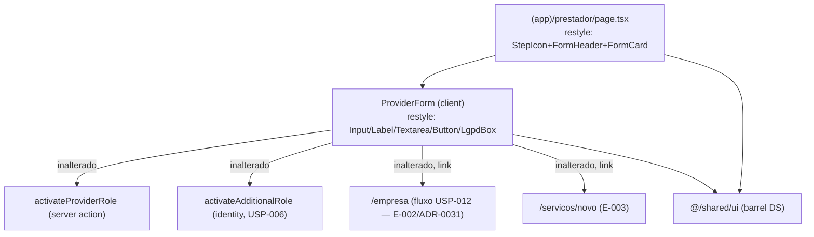

# USP-010 — Cadastro de prestador de serviço — Design (REFACTOR ao Design System)

> Deriva de [`spec.md`](./spec.md). **Alvo: refactor style-only** das duas telas de prestador às primitivas de `@/shared/ui` (AD-014), preservando comportamento — mesmo molde da U1 da Fase 3 (refactor da USP-009, AD-019).
> **Status:** Draft.

## 0. Restrições ativas do projeto (STATE.md `## Decisions`) — CONFORMAR

Este design **conforma** (não supera) às decisões ativas:

- **AD-014** — Fundação do DS: tokens em `globals.css`/`tailwind.config.ts`; primitivas em `src/shared/ui/` (barrel). Dark via `[data-theme]` (sem `dark:`). **DS-MN-02:** nada de hex cru / paleta fixa em `shared/ui` — aqui estendemos o mesmo princípio aos **consumidores** de prestador (PRV-MN-01).
- **AD-015 / AD-016 / AD-019** — Padrão de refactor: restyle é **style-only** (markup/classes); comportamento preservado ancorado nos **testes verdes existentes como testes negativos**; mudanças não-estilo só se forem **consistência pura** e documentadas. Import de action `'use server'` direto no Client Component é o escape-hatch RSC canônico (AD-013/T-A1).
- **ADR-0031** — CNPJ MEI reside em `companies` via USP-012; `ProviderProfile` **sem** CNPJ. O restyle **preserva** o redirect e a ausência de campo (E-002).
- **ADR-0015** — o **papel** é ativo imediatamente, **sem** moderação (não há `transitionContent` no fluxo do prestador). O restyle não introduz via de status.

Nenhuma decisão exige superação. Nenhum ADR de `docs/arch/` é contrariado (o restyle não altera contratos).

## 1. Estado atual (implementação a refatorar)

USP-010 está implementada e verde. Mapa dos arquivos e do que muda:

| Arquivo | Papel | Muda? |
|---|---|---|
| `src/app/(app)/prestador/page.tsx` | Server Component: `requireActivePerson`, carrega `regions`/`profile`/`term`(SERVICE_OFFERING), renderiza `<ProviderForm>` | ✅ **Restyle** (header→`StepIcon`/`FormHeader`/`FormCard`; caixa de erro→token) |
| `src/modules/persons/components/provider-form.tsx` | Client Component RHF+Zod: perfil (título/descrição/região), campos de perfil faltantes, gate de consentimento, orquestra `activateAdditionalRole`(USP-006)+`activateProviderRole`, caixas P-004/E-002/E-003 | ✅ **Restyle** (primitivas + `selectClass` + caixas por token) |
| `src/modules/persons/schemas/provider.ts` | Zod (todos opcionais; **sem CNPJ**, ADR-0031) | ❌ inalterado |
| `src/modules/persons/actions/activate-provider-role.ts` | Server Action (Zod→`getCurrentPerson`→`requireActiveConsent`[PORTAL_ACCESS+SERVICE_OFFERING]→`withAudit` upsert DRAFT) | ❌ inalterado (já canônico) |

**Suítes verdes (âncora de preservação — testes negativos):**
- `persons/__tests__/provider-schema.test.ts` (unit, Zod — 5 casos, inclui "não conhece `cnpjMei`")
- `persons/__tests__/provider-actions.test.ts` (unit, action mockada — 11 casos: E-001/E-002/Zod/P-005/P-003/idempotência)
- `persons/__tests__/provider-actions.int.test.ts` (integração, Postgres real — 4 casos: DRAFT, UNAUTHENTICATED, CONSENT_REQUIRED, idempotência)
- `persons/__tests__/ProviderForm.test.tsx` (component — 7 casos: P-004 copy, P-003 gate, E-002 sem-CNPJ+CTA MEI, GAP-B foto, happy path E-003, campos faltantes, alreadyProvider)
- `e2e/prestador.spec.ts` (E2E — confinamento de rota autenticada)

## 2. Arquitetura do refactor

Princípio: **só a camada de apresentação muda**. Nenhuma aresta de dados/ação/navegação é criada, removida ou reconfigurada. A UI continua chamando exatamente as mesmas actions com os mesmos argumentos e os mesmos `href`.

## 3. Code Reuse Analysis

### Primitivas e padrões a reusar (referências verbatim de código já mergeado)

| Componente/padrão | Location | Como usar |
|---|---|---|
| `Button`, `Input`, `Label`, `Textarea`, `LgpdBox` | `@/shared/ui` (barrel) | Substituem `<button>`/`<input>`/`<label>`/`<textarea>` + caixa de consentimento |
| `Button asChild` (Radix Slot) | `@/shared/ui` (`button.tsx`) | Estiliza os `<Link>` de MEI (`/empresa`) e "publicar primeiro serviço" (`/servicos/novo`) **preservando** `role="link"`+`href`+nome |
| `StepIcon`, `FormHeader`, `FormCard` | `@/shared/ui` | Cabeçalho + moldura da página (padrão de tela de cadastro) |
| **Padrão de form RHF+Zod restilizado (gêmeo exato)** | `src/modules/persons/components/candidate-form.tsx` | **Template**: `selectClass`/`errorClass` por token; `LgpdBox` com termo + checkbox `accent-primary` gateando o submit; caixa de erro `role="alert"` tintada em `danger`; `Button variant="primary" disabled={isPending \|\| !consentChecked}` |
| Página de cadastro no DS (gêmeo exato) | `src/app/(app)/candidato/page.tsx` | `StepIcon variant="orange"` + `FormHeader` + `FormCard` envolvendo o form; caixa "termo indisponível" tintada em `danger` |
| Caixas tintadas por `color-mix` sobre token | `src/modules/jobs/components/job-form.tsx` | `bg-[color-mix(in_srgb,var(--color-<token>)_10%,transparent)]` para erro/afirmação/status |

### Integration Points

| Sistema | Método de integração | Muda? |
|---|---|---|
| Server Actions (`persons.activateProviderRole`, `identity.activateAdditionalRole`) | Import direto do arquivo `'use server'` no client (escape-hatch RSC, comentário já presente no arquivo) | ❌ inalterado |
| Taxonomia `Region` (prop `regions`) | Carregada no Server Component, passada por prop | ❌ inalterado |
| Termo `SERVICE_OFFERING` (prop `term`) | `loadTerm`+`stripTermFrontMatter` no Server Component | ❌ inalterado |
| Fluxo de Empresa (USP-012) | `<Link href="/empresa">` (redirect E-002) | ❌ inalterado (só restyle do link) |

## 4. Componentes e mapeamento de restyle

### 4.1 `provider-form.tsx` (PRV-R1, owner de PRV-MN-P003/P004/E002)

- **Imports:** adicionar `import { Button, Input, Label, LgpdBox, Textarea } from '@/shared/ui';`. Remover as constantes locais `inputClass`/`labelClass`/`errorClass` de paleta fixa (`border-gray-300`, `focus:border-blue-500`, `focus:ring-blue-200`, `text-red-600`, `text-gray-700`). Adotar `errorClass = 'mt-1 text-xs text-danger'` (token) e `selectClass` (token) copiados de `candidate-form.tsx`.
- **Caixa P-004 (afirmação OFERECE — `PRV-MN-P004`):** trocar `border-emerald-200 bg-emerald-50 text-emerald-800` por caixa **success** por token: `rounded-md border border-success bg-[color-mix(in_srgb,var(--color-success)_10%,transparent)] px-4 py-3 text-sm text-success`. **Copy `"agora você OFERECE serviços"` + `"contrata"` preservada verbatim** (âncora `ProviderForm.test`).
- **Campos de perfil faltantes (telefone/endereço, só na 1ª ativação):** `<Label htmlFor={field}>` + `<Input>` (mantém `PROFILE_FIELD_META`, `value`/`onChange`/`aria-describedby`/`aria-invalid`); erro em `
` — associações e `role="alert"` preservados (`getByText(/campo obrigatório/i)`).
- **Título profissional (opcional):** `<Label>` + `<Input {...register('headline')}>`; sufixo "(opcional)" vira `` (era `text-gray-400`).
- **Descrição (opcional):** `<Label>` + `<Textarea rows={4} {...register('description')}>`.
- **Região (opcional):** `<Label>` + `<select className={selectClass} defaultValue="" {...register('regionId')}>` (mantém as `<option>`s de `regions`).
- **Foto (GAP-B, placeholder desabilitado):** `<Label htmlFor="photo">Foto do perfil (em breve)</Label>` + `<input id="photo" type="file" accept="image/*" disabled aria-disabled className="{selectClass} cursor-not-allowed opacity-60">` (era `bg-gray-100 text-gray-400`); help text `text-fg-muted`. **`getByLabelText(/foto do perfil/i)` disabled preservado.**
- **Termo de consentimento (`SERVICE_OFFERING` / `PRV-MN-P003`):** trocar a `
` cinza por `<LgpdBox title="Termo de oferta de serviços">` envolvendo: caixa interna do corpo do termo (`max-h-40 overflow-y-auto whitespace-pre-wrap rounded-sm border border-border bg-surface p-2 text-xs text-fg-muted`, `aria-label` preservado, `{term.body}` renderizado → `getByText(/TERMO: oferta de serviços/)`) + `<label className="flex cursor-pointer items-start gap-2 text-sm text-fg">` com `<input type="checkbox" className="mt-0.5 accent-primary" checked={consentChecked} onChange=...>`. **Condicional `!alreadyProvider` preservada.** Um **único** checkbox (mantém `getByRole('checkbox')`).
- **Erro do servidor (`role="alert"`):** `rounded-sm bg-[color-mix(in_srgb,var(--color-danger)_10%,transparent)] p-3 text-sm text-danger` (era `bg-red-50 border-red-200 text-red-700`).
- **Botão submit:** `<Button type="submit" variant="primary" disabled={isPending || !consentChecked}>` — texto `{isPending ? 'Salvando…' : 'Ativar papel de prestador'}` preservado (mantém `getByRole('button', {name:/ativar papel de prestador/i})` + `disabled`).
- **Caixa E-003 "papel ativado" (`role="status"`):** caixa **success** tintada (idem P-004); CTA `<Button asChild variant="primary"><Link href="/servicos/novo">Publicar primeiro serviço</Link></Button>` (era `bg-emerald-600`). **`role="status"` + link name/href preservados** (`getByRole('link', {name:/publicar primeiro serviço/i})` href `/servicos/novo`).
- **Caixa E-002 do MEI (`PRV-MN-E002`):** caixa **neutra** `rounded-md border border-border bg-surface p-4 text-sm text-fg-muted` (era `border-gray-200 bg-white text-gray-600`); CTA `<Button asChild variant="secondary"><Link href="/empresa">Registrar meu MEI / atuar como empresa</Link></Button>` (era link bordado cinza). **Nenhum campo de CNPJ; link name/href `/empresa` preservados** (`getByRole('link', {name:/registrar meu MEI/i})` href `/empresa`).
- **Invariantes de DOM a preservar (contrato dos testes):** `htmlFor↔id` dos campos (`getByLabelText`); rótulo do botão submit; **um único** `checkbox`; `role="alert"`/`role="status"`; render do corpo do termo; links "publicar primeiro serviço"→`/servicos/novo` e "Registrar meu MEI"→`/empresa`; **ausência** de qualquer campo com label /cnpj/i. Toda a lógica (`useForm`, `onSubmit`, orquestração `activateAdditionalRole`+`activateProviderRole`, `startTransition`, `router.refresh`, estados `consentChecked`/`profileValues`/`profileErrors`/`status`/`serverError`) **intacta**.

### 4.2 `(app)/prestador/page.tsx` (PRV-R2)

- Manter `export const dynamic = 'force-dynamic'`, `requireActivePerson()`, o `Promise.all` de `regions`/`profile`, o `loadTerm('SERVICE_OFFERING')` com `try/catch TermLoaderError`, e a passagem de props ao `<ProviderForm>` (`regions`/`term`/`alreadyProvider`/`missingFields`/`initialStatus`) — **inalterados**. Import de `ProviderForm` via barrel `@/modules/persons` mantido (Server Component — barrel OK).
- **Layout:** trocar `<main class="... max-w-3xl ...">` + `<header><h1 text-gray-900>
` por: `<main class="mx-auto flex min-h-screen max-w-lg flex-col justify-center px-6 py-12">` + `<StepIcon variant="orange">{providerIcon}</StepIcon>` + `<FormHeader title="Cadastro de prestador de serviço" description="Ative o papel de prestador para oferecer seus serviços no portal.">` + `<FormCard><ProviderForm .../></FormCard>` (padrão `candidato/page.tsx`).
- **Caixa "termo indisponível" (`role="alert"`):** tintada em `danger` por token (era `bg-red-50 border-red-200 text-red-700`).
- `providerIcon`: SVG inline (silhueta/ferramenta de prestador) com `stroke="currentColor"`, sem dependência externa.

### 4.3 Sem mudança de backend (decisão de consistência)

A Server Action/schema/domain **já** seguem os padrões canônicos (`getCurrentPerson()`/ADR-0030, `requireActiveConsent`, `withAudit`, `ActionResult`, export por barrel; sem `transitionContent` porque o papel não é moderado — ADR-0015). O import direto das actions `'use server'` no Client Component é o escape-hatch RSC já documentado no próprio arquivo (idêntico a `candidate-form.tsx`; AD-013/T-A1). **Portanto, nenhuma mudança de código não-estilo é necessária ou justificada** — mantém o refactor 100% style-only e minimiza risco de regressão.

## 5. Data Models

Nenhum. Sem migração, sem mudança de schema. (`ProviderProfile`/`ClientProfile`/`CompanyType` já existem e permanecem intactos.)

## 6. Error Handling Strategy

Inalterada (é a mesma lógica). Apenas a **apresentação** dos estados de erro/afirmação/status passa a usar tokens:

| Estado | Antes | Depois | Impacto ao usuário |
|---|---|---|---|
| Erro do servidor (form) | `role="alert"` vermelho fixo | `role="alert"` tintado em `danger` | Mesma mensagem PT-BR, cor por tema |
| Afirmação "OFERECE serviços" (P-004) | caixa emerald fixa | caixa tintada em `success` | Mesma copy; cor por token/tema |
| Papel ativado (E-003) | `role="status"` emerald fixo | `role="status"` tintado em `success` + CTA `Button asChild` | Mesmo texto/link |
| Nota do MEI (E-002) | caixa cinza fixa | caixa neutra de superfície + CTA `Button asChild variant="secondary"` | Mesmo link `/empresa` |
| Termo indisponível (página) | `role="alert"` vermelho fixo | `role="alert"` tintado em `danger` | Mesma mensagem |

## 7. Risks & Concerns

| Concern | Location | Impact | Mitigation |
|---|---|---|---|
| Restyle pode quebrar queries de teste (`getByLabelText`/`getByRole`/`getByText`/`toHaveAttribute('href', …)`) | `ProviderForm.test.tsx` (7 casos) | Falha de suíte = regressão de contrato-DOM | Preservar `htmlFor↔id`, rótulo do botão, **único** checkbox, `role="alert"/"status"`, corpo do termo, nomes/hrefs dos links, ausência de label /cnpj/i. O teste **não** é editado; se ficar vermelho, corrige-se o componente. |
| `Button asChild` sobre `<Link>` pode mudar o elemento renderizado | caixas E-002/E-003 | Se virar `<button>`, quebra `getByRole('link')` | Radix Slot funde props no filho `<a>` — o elemento continua `<a>`; validar nos testes de link (verdes). |
| DS não tem token `warning`/`info` para as caixas emerald/cinza | `provider-form.tsx` | Escolha arbitrária de cor → deriva | Mapeamento fixado nas assumptions (`success` p/ afirmação/ativado; neutra p/ nota do MEI) — determinístico, espelha `job-form.tsx`. |
| Deriva de paleta fixa reintroduzida por descuido | ambos os arquivos | Perda de consistência DS (light/dark) | Guard estático PRV-MN-01 (T3) falha o gate se qualquer utilidade de paleta fixa permanecer. |
| Página adota novo layout (`max-w-lg` centralizado vs `max-w-3xl`) | `prestador/page.tsx` | Mudança visual de layout | É a intenção (paridade com telas de cadastro); E2E só checa redirect (não o conteúdo), sem `page.test.tsx` — sem quebra de teste. |

## 8. Tech Decisions (não óbvias)

| Decisão | Escolha | Rationale |
|---|---|---|
| `<select>` no DS (região) | `selectClass` por token (nativo) | DS não tem `Select`; padrão do projeto (`candidate-form.tsx`, `job-form.tsx`) |
| Links MEI / "publicar serviço" | `Button asChild` (Radix Slot) sobre `<Link>` | Estilo de botão do DS **sem** perder `role="link"`/`href`/nome (âncoras de teste) |
| Caixas emerald (P-004 / E-003) | token `success` tintado por `color-mix` | Emerald≈verde≈`success`; preserva semântica positiva sem hex cru |
| Caixa do MEI | superfície neutra + CTA `secondary` | Nota informativa; sem inventar token; preserva o redirect E-002 |
| Negativa de deriva de DS | guard estático (readFileSync + regex), não lint rule | Mesmo padrão de guarda do projeto (`no-external-verify.test.ts`, AD-013/016/019); dá ao Verifier um sensor discriminante |
| Backend | **sem mudança** | Já canônico; style-only minimiza risco (AD-015/016/019) |

> **Project-level decisions:** nenhuma nova convenção de projeto — este design **consome** AD-014 e **aplica** o padrão de refactor AD-015/016/019. Não há novo `AD-NNN` a registrar por esta unidade (a decisão de fase é do orquestrador).
