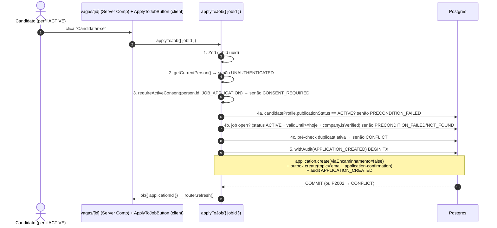

# USP-025 — Candidatar-se a uma vaga (Design)

**Spec**: `.specs/features/candidaturas-busca-candidatos/usp-025-candidatar-se/spec.md`
**Status**: Draft
**Escopo do agregado**: esta design carrega a **migração única** e o **módulo único** de
Server Actions do agregado `Application`, compartilhados com a **USP-026** (cancelar). A
USP-026 referencia esta migração e adiciona apenas o `cancelApplication` (não migra schema).

## Conformidade com decisões ativas (STATE.md `## Decisions`)

Lidas antes de projetar. Constrangimentos ativos aplicáveis:

- **AD-012** — `Application` nasceu mínima (só contagem); a escrita + unicidade + encaminhamento são **desta USP**. ✅ conformado (estendemos, não recriamos).
- **AD-007** — e-mail transacional via `Outbox` (enfileirar na tx; dispatcher = USP-044). ✅ conformado.
- **AD-009** — status de conteúdo mora na entidade (padrão `CandidateProfile`), FSM centralizada em `moderation`. `Application` **não** é conteúdo moderável (não entra na FSM); segue o shape raw-`withAudit` do `editJob`. ✅ conformado.
- **AD-011** — `search-jobs.ts` é a fonte única do `where` on-read (`ACTIVE AND validUntil>=hoje(SP) AND company.isVerified`). ✅ reusado como pré-condição da vaga.

### Divergência declarada de `technical-design.md` §4.5 → nova decisão AD-017

O TD §4.5 modela `Application` com `viaReferralId String? @unique` (FK `Referral`) e
`@@unique([jobId, candidatePersonId, appliedAt])`. Ambos **divergem** do que esta USP
entrega, por razões grounded:

1. `Referral` é Fase 5 (USP-037) e **não existe** → materializamos `viaEncaminhamento Boolean @default(false)` agora (A-2). A USP-037 adiciona depois a FK e seta o boolean.
2. O `@@unique([jobId, candidatePersonId, appliedAt])` **não** garante unicidade da candidatura *ativa* (dois inserts concorrentes com `appliedAt` distinto passam). Adotamos o **índice único parcial** `WHERE cancelled_at IS NULL` (A-3), que garante a invariante e habilita recandidatura. O compound-unique do TD **não** é adotado.

Registrar como **AD-017** em `.specs/project/STATE.md` (o TD é doc interno; conform-or-supersede → superseder o §4.5 nesses dois pontos, mantendo o resto do contrato).

**Lição aplicada (L-007):** specs E2E devem ser promovidas ao diretório real `e2e/` com
asserções vivas — um `.fixme` sob `.specs/` é invisível ao `npm run test:e2e` no CI.

---

## Architecture Overview

Server Action self-service (não-RBAC) no módulo `jobs`, espelhando `activate-candidate-role.ts`
(sessão + consent) e o shape transacional de `editJob` (raw `withAudit` + optimistic write).



A garantia real de unicidade é o **índice único parcial** (passo 5, no COMMIT), não o
pré-check (passo 4c, apenas UX amigável). Sob corrida, ambas passam o pré-check e o banco
deixa só uma inserir; a outra cai no `catch P2002 → CONFLICT`.

---

## Code Reuse Analysis

### Existing Components to Leverage

| Component | Location | How to Use |
| --- | --- | --- |
| `getCurrentPerson()` | `@/modules/identity` (`server/session.ts`) | Resolver a Pessoa da sessão; `null`→`UNAUTHENTICATED`. Nunca redireciona (é action). |
| `requireActiveConsent(personId, purpose, client?)` | `@/modules/consents` | Gate LGPD; `!active`→`CONSENT_REQUIRED`. Passar `tx` se checar dentro da tx. |
| `withAudit(event, fn, ctx)` + `AuditEvent.APPLICATION_CREATED` | `@/modules/audit` | Transação + evento. `fn(tx, audit)`; setar `audit.entityType='APPLICATION'`, `audit.entityId`, `audit.after`. |
| `ok` / `fail` / `ActionResult<T>` / `ActionErrorCode` | `@/shared/errors` | Retorno; **nunca throw**. Códigos: `VALIDATION`, `UNAUTHENTICATED`, `CONSENT_REQUIRED`, `NOT_FOUND`, `CONFLICT`, `PRECONDITION_FAILED`, `INTERNAL`. |
| `editJob` (shape de referência) | `src/modules/jobs/actions/edit-job.ts` | Copiar o padrão: `safeParse`→`getCurrentPerson`→`findUnique` pré-condição→`withAudit(updateMany/create)`→`try/catch` com classe de erro custom→`ok`. |
| on-read `where` da vaga | `src/modules/jobs/queries/search-jobs.ts:70` (`buildWhere`) | Fonte da regra "vaga aberta": `ACTIVE AND validUntil>=hoje(SP) AND company.isVerified`. Extrair a parte pura para `domain/application-rules.ts`. |
| `hojeSaoPaulo()` / `APP_TIME_ZONE` | `@/shared/lib/time` | Comparação de expiração TZ `America/Sao_Paulo`. |
| `prisma` singleton | `@/shared/lib/prisma` | Leituras de pré-condição (fora da tx) e escrita (via `tx`). |
| `Outbox` + padrão `tx.outbox.create` | `prisma/schema.prisma:685` + `src/modules/companies/actions/add-responsible.ts:122` | Enfileirar e-mail na mesma tx (AD-007). |
| `EmailMessage` port | `src/shared/lib/email/email-sender.port.ts` | Estender a união com `application-confirmation` (build-checked via `satisfies EmailMessage`). |
| `childLogger` | `@/shared/lib/logger` | Log estruturado (`{ module:'jobs', action:'applyToJob' }`). |
| `company-job-actions.tsx` (padrão client→action→refresh) | `src/modules/jobs/components/company-job-actions.tsx` | Molde do `ApplyToJobButton`: `'use client'` + `useTransition` + `router.refresh()`. |
| `applications.int.test.ts` (fixture/cleanup) | `src/modules/jobs/__tests__/applications.int.test.ts` | Reusar `cleanup()`/`beforeAll`/`afterAll` (author+company+job+candidates por CNPJ). |
| `add-responsible.int.test.ts` (matriz + corrida P2002 + assert outbox) | `src/modules/companies/__tests__/add-responsible.int.test.ts:161,179` | Molde da matriz de teste da action e do teste de concorrência. |

### Integration Points

| System | Integration Method |
| --- | --- |
| `Job` / `Company` | `Application.jobId → Job.id`; regra de vaga aberta via `Company.isVerified` + `Job.status`/`validUntil`. |
| `CandidateProfile` | Pré-condição `publicationStatus == ACTIVE` (leitura direta do **próprio** perfil do candidato — permitido pela regra de privacidade). |
| `audit_log` | `APPLICATION_CREATED` (já no catálogo; **não** exige justification). |
| `outbox` | Linha `topic='email'` enfileirada na tx; consumida pela USP-044. |
| Barrel `@/modules/jobs` | Novos exports: `applyToJob`, `applyToJobSchema`, `getMyActiveApplication`, `ApplyToJobButton`, tipos. |

---

## Components

### 1. Migração `..._usp025_applications_write` (schema + índice único parcial)

- **Purpose**: adicionar a coluna `viaEncaminhamento` e a constraint de unicidade da candidatura ativa.
- **Location**: `prisma/schema.prisma` (model `Application`) + `prisma/migrations/<ts>_usp025_applications_write/migration.sql`.
- **Schema (Prisma)** — adicionar ao model `Application`:
  - `viaEncaminhamento Boolean @default(false) @map("via_encaminhamento")`
  - comentário explicando que o índice único parcial é criado por SQL bruto (Prisma não expressa `@@unique ... WHERE`).
- **SQL hand-append** (após os blocos gerados; comentário de convenção obrigatório citando ADR-0021 / P-004 e o precedente `uq_person_company_active`):
  ```sql
  -- Unicidade da candidatura ATIVA por (candidato, vaga) — ADR-0021 / P-004.
  -- Prisma não expressa índice parcial no schema → SQL bruto. cancelled_at IS NULL = ativa.
  -- Permite recandidatura após cancelar (linha cancelada sai do índice). 2º insert concorrente → P2002 → CONFLICT.
  CREATE UNIQUE INDEX "uq_application_active"
    ON "applications" ("candidate_person_id", "job_id")
    WHERE "cancelled_at" IS NULL;
  ```
- **Dependencies**: tabela `applications` (já existe — migração `20260620140000_usp022_applications`).
- **Reuses**: padrão de índice parcial de `20260615114411_usp013_grant_status` e `20260602190000_consents_active_unique`.

### 2. `domain/application-rules.ts` (regras puras — sem IO)

- **Purpose**: isolar as regras testáveis por unidade.
- **Location**: `src/modules/jobs/domain/application-rules.ts` (não é dono do módulo, mas `jobs` já tem `domain/`).
- **Interfaces**:
  - `isJobOpenForApplication(job: { status: ContentStatus; validUntil: Date; companyIsVerified: boolean }, today: Date): boolean` — espelha o `where` on-read: `status === 'ACTIVE' && validUntil >= today && companyIsVerified`.
  - `isProfileApplicable(profile: { publicationStatus: ContentStatus } | null): boolean` — `profile != null && publicationStatus === 'ACTIVE'`.
  - (a regra de cancelamento `canCancelApplication` é adicionada pela **USP-026** neste mesmo arquivo.)
- **Dependencies**: tipo `ContentStatus` (de `@/modules/moderation` ou `@prisma/client`).
- **Reuses**: a semântica de `buildWhere` (search-jobs) — sem duplicar SQL.

### 3. `schemas/application.schema.ts` (Zod)

- **Purpose**: validar entrada; **sem `personId`** no input (P-002 — opera sobre a sessão).
- **Location**: `src/modules/jobs/schemas/application.schema.ts`.
- **Interfaces**:
  - `applyToJobSchema = z.object({ jobId: z.string().uuid('Vaga inválida.') })` + `type ApplyToJobInput`.
  - (`cancelApplicationSchema` com `applicationId` é adicionado pela **USP-026** neste arquivo.)
- **Reuses**: convenção de `lifecycle.schema.ts` (`jobIdSchema`).

### 4. Server Action `applyToJob` — `actions/apply-to-job.ts`

- **Purpose**: criar a candidatura (o caminho de escrita).
- **Location**: `src/modules/jobs/actions/apply-to-job.ts` (`'use server'`).
- **Interface**: `applyToJob(input: ApplyToJobInput): Promise<ActionResult<ApplyToJobResult>>` onde `ApplyToJobResult = { applicationId: string }`.
- **Sequência** (grounded em A-4; espelha `activate-candidate-role.ts` + `editJob`):
  1. `applyToJobSchema.safeParse` → `VALIDATION`.
  2. `getCurrentPerson()` → `null`→`UNAUTHENTICATED`.
  3. `requireActiveConsent(person.id, 'JOB_APPLICATION')` → `!active`→`CONSENT_REQUIRED`.
  4. Pré-condições (leituras fora da tx):
     - `prisma.candidateProfile.findUnique({ where:{ personId: person.id }, select:{ publicationStatus:true } })`; `isProfileApplicable` falso → `PRECONDITION_FAILED` ("Seu perfil de candidato não está ativo.").
     - `prisma.job.findUnique({ where:{ id: jobId }, select:{ status:true, validUntil:true, title:true, company:{ select:{ isVerified:true, nomeFantasia:true } } } })`; `null`→`NOT_FOUND`; `isJobOpenForApplication(..., hojeSaoPaulo())` falso → `PRECONDITION_FAILED` ("Esta vaga não está mais disponível.").
     - pré-check duplicata: `prisma.application.findFirst({ where:{ jobId, candidatePersonId: person.id, cancelledAt: null }, select:{ id:true } })` → existe → `CONFLICT` ("Você já se candidatou a esta vaga.").
  5. `withAudit(AuditEvent.APPLICATION_CREATED, async (tx, audit) => { ... }, { actorUserId: person.supabaseUserId, actorPersonId: person.id, context: { jobId } })`:
     - `const created = await tx.application.create({ data:{ jobId, candidatePersonId: person.id, viaEncaminhamento: false }, select:{ id:true } });`
     - `const me = await tx.person.findUnique({ where:{ id: person.id }, select:{ emailLogin:true, fullName:true } });`
     - `if (me?.emailLogin) { const message = { to: me.emailLogin, template: 'application-confirmation', data: { candidatoNome: me.fullName, vagaTitulo: job.title, empresaNome: job.company.nomeFantasia ?? 'Empresa' } } satisfies EmailMessage; await tx.outbox.create({ data:{ topic:'email', payload: message } }); }`
     - `audit.entityType='APPLICATION'; audit.entityId=created.id; audit.after={ jobId, candidatePersonId: person.id, viaEncaminhamento:false };`
     - `return created.id;`
  6. `try/catch`: `Prisma.PrismaClientKnownRequestError` `code==='P2002'` → `CONFLICT`; outro → log + `INTERNAL`.
  7. `return ok({ applicationId })`.
- **Dependencies**: componentes 1–3 + primitivas reusadas.
- **Reuses**: `editJob` (classe de erro + try/catch), `add-responsible` (outbox + P2002).

### 5. Query `getMyActiveApplication` — `queries/get-my-application.ts`

- **Purpose**: informar o estado do CTA (candidatar vs já candidatado) na página de detalhe.
- **Location**: `src/modules/jobs/queries/get-my-application.ts`.
- **Interface**: `getMyActiveApplication(jobId: string, candidatePersonId: string): Promise<{ id: string } | null>` — `findFirst({ where:{ jobId, candidatePersonId, cancelledAt: null }, select:{ id:true } })`. Leitura do **próprio** dado do candidato (privacidade OK).

### 6. `ApplyToJobButton` (client) + wiring na página de detalhe

- **Purpose**: CTA "Candidatar-se" (CAN-025-06).
- **Location**: `src/modules/jobs/components/apply-to-job-button.tsx` (`'use client'`) + edição de `src/app/(public)/vagas/[id]/page.tsx`.
- **Interface**: `ApplyToJobButton({ jobId }: { jobId: string })` — `useTransition` + chama `applyToJob({ jobId })` (import relativo, não cruza barrel) → `!ok`: mostra `error.message`; `ok`: `router.refresh()`.
- **Wiring na página**: Server Component já resolve `viewer = getCurrentPerson()`. Adicionar: se `viewer` é candidato ativo (via `viewer.roles.includes(CANDIDATE_ROLE)`) **e** a vaga está aberta → resolver `getMyActiveApplication(id, viewer.id)`; `null` → `<ApplyToJobButton jobId={id} />`; senão → estado "Você já se candidatou" (o botão de cancelar é da **USP-026**). Anônimo/não-candidato: sem CTA (preserva P-003/P-005).
- **Reuses**: `company-job-actions.tsx` (padrão), `CANDIDATE_ROLE` (export de `views/job-detail.view`).

### 7. E-mail: template `application-confirmation`

- **Purpose**: confirmação ao candidato (enfileirada; envio real = USP-044).
- **Locations**:
  - `src/shared/lib/email/email-sender.port.ts` — nova interface `ApplicationConfirmationEmailData { candidatoNome: string; vagaTitulo: string; empresaNome: string }` + variante na união `EmailMessage`: `| { to: string; template: 'application-confirmation'; data: ApplicationConfirmationEmailData }`.
  - `src/shared/lib/email/templates/application-confirmation.ts` — renderer `(data) => RenderedEmail` (espelha `responsible-link-pending.ts` + `layout.ts`).
  - `src/shared/lib/email/resend-email-sender.ts` — adicionar o `case 'application-confirmation'` no switch de templates.
- **Reuses**: `layout.ts`, padrão dos renderers existentes.

---

## Data Models

```prisma
// prisma/schema.prisma — model Application (delta desta USP)
model Application {
  id                String    @id @default(uuid()) @db.Uuid
  candidatePersonId String    @map("candidate_person_id") @db.Uuid
  jobId             String    @map("job_id") @db.Uuid
  cancelledAt       DateTime? @map("cancelled_at") @db.Timestamptz(6) // null = ativa (soft-cancel)
  appliedAt         DateTime  @default(now()) @map("applied_at") @db.Timestamptz(6)
  viaEncaminhamento Boolean   @default(false) @map("via_encaminhamento") // A-2: sempre false na Fase 3; USP-037 seta true

  candidate Person @relation(fields: [candidatePersonId], references: [id])
  job       Job    @relation(fields: [jobId], references: [id])

  // uq_application_active (SQL bruto): UNIQUE (candidate_person_id, job_id) WHERE cancelled_at IS NULL
  @@index([jobId, cancelledAt]) // contagem on-read (E-003, USP-022) — mantido
  @@map("applications")
}
```

**Relationships**: `viaEncaminhamento` fica isolado; a FK `viaReferralId` será adicionada pela USP-037 sem re-migrar esta coluna.

---

## Error Handling Strategy

| Error Scenario | Handling | User Impact |
| --- | --- | --- |
| `jobId` inválido | Zod `safeParse` → `fail('VALIDATION', …, fieldErrors)` | Mensagem de campo; nada no banco |
| Sem sessão | `fail('UNAUTHENTICATED', 'Sessão expirada. Faça login novamente.')` | Redirecionado ao login pela UI |
| Sem consent `JOB_APPLICATION` | `fail('CONSENT_REQUIRED', …)` | CTA orienta a conceder consentimento; 0 efeito |
| Perfil não `ACTIVE` | `fail('PRECONDITION_FAILED', 'Seu perfil de candidato não está ativo.')` | Orientação a completar/aguardar moderação |
| Vaga inexistente | `fail('NOT_FOUND', 'Vaga não encontrada.')` | Estado "vaga indisponível" |
| Vaga não-aberta/expirada | `fail('PRECONDITION_FAILED', 'Esta vaga não está mais disponível.')` | Estado "vaga encerrada" |
| Duplicata ativa (pré-check ou P2002) | `fail('CONFLICT', 'Você já se candidatou a esta vaga.')` | Botão já reflete "candidatado" |
| Erro inesperado | log + `fail('INTERNAL', …)`; tx rollback | Mensagem genérica; nada persistido |

---

## Risks & Concerns

| Concern | Location | Impact | Mitigation |
| --- | --- | --- | --- |
| Página de detalhe é ISR pública (`revalidate=1800`) — estado do botão é por-usuário | `src/app/(public)/vagas/[id]/page.tsx` | Botão poderia cachear estado errado | A página já chama `getCurrentPerson()` (cookies) → Next a trata como dinâmica por request; `getMyActiveApplication` roda por request; escrita usa `router.refresh()`. Documentado. |
| Pré-check de duplicata (passo 4c) é apenas UX, não garantia | `apply-to-job.ts` | Sob corrida dois pré-checks passam | A **garantia** é o índice único parcial + catch P2002 (MN-01). Teste de concorrência obrigatório. |
| `emailLogin` pode ser nulo (candidato assistido) | `apply-to-job.ts` (tx) | E-mail sem destinatário | Guard `if (me?.emailLogin)` — cria a candidatura sem enfileirar (como `add-responsible`). |
| `application-confirmation` sem renderer no adapter | `resend-email-sender.ts` | `satisfies EmailMessage` compila, mas dispatch (USP-044) quebra sem o `case` | Adicionar o `case` no switch nesta USP (T3), mesmo sem dispatcher ativo. |
| Ações são excluídas da cobertura **unit** (`vitest.config.ts`) | infra de teste | Cobertura unit não vê a action | Cobertas pela suíte de **integração** (`*.int.test.ts`) — matriz reflete isso. |

> Nenhuma outra fragilidade encontrada nos arquivos tocados.

---

## Tech Decisions (não óbvias)

| Decisão | Escolha | Rationale |
| --- | --- | --- |
| Módulo dono | `jobs` | A-1 (lista canônica fechada; relação em `Job`; TD §2.5). |
| Unicidade | índice único parcial `WHERE cancelled_at IS NULL` | A-3 (à prova de concorrência + habilita recandidatura; supersede compound-unique do TD). |
| Autorização | sessão + perfil ACTIVE + consent (sem RBAC) | A-4 (não há `PermissionId` de candidatura; padrão `activate-candidate-role`). |
| `viaEncaminhamento` boolean agora | materializar `@default(false)` | A-2 (`Referral` é Fase 5; evita re-migração). |
| Regras puras extraídas | `domain/application-rules.ts` | Testabilidade unit + must-nots verificáveis fora do IO. |

> **Projeto-level:** registrar **AD-017** em `.specs/project/STATE.md` documentando (a) módulo dono = `jobs`, (b) unicidade por índice parcial (supersede TD §4.5), (c) `viaEncaminhamento` boolean now (deferindo a FK `Referral` à USP-037), (d) autorização self-service sem RBAC. USP-026/027/028/037/044 conformam a estas decisões.
