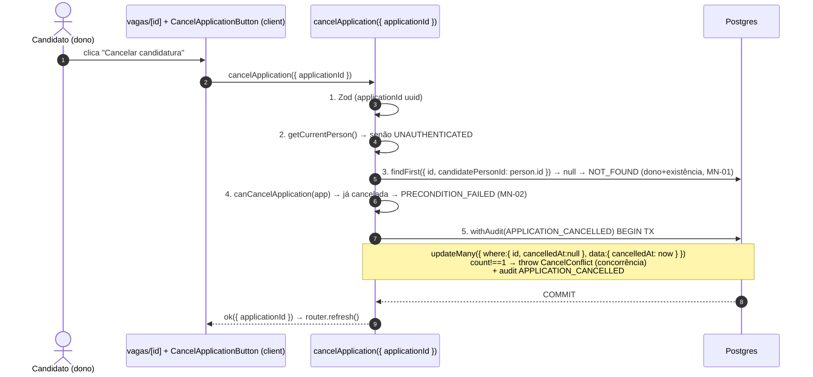

# USP-026 — Cancelar candidatura (Design)

**Spec**: `.specs/features/candidaturas-busca-candidatos/usp-026-cancelar-candidatura/spec.md`
**Status**: Draft
**Relação com o agregado**: a **migração é única e pertence à USP-025** (adiciona
`viaEncaminhamento` + `uq_application_active`). Esta USP **não migra schema**; adiciona o
`cancelApplication`, a regra pura `canCancelApplication` (no mesmo `application-rules.ts`),
o schema `cancelApplicationSchema` (no mesmo `application.schema.ts`) e a UI de cancelar.
Auto-suficiente: o estado de schema relevante está restated abaixo.

## Conformidade com decisões ativas (STATE.md `## Decisions`)

- **AD-012** — `cancelledAt` (soft-cancel; null=ativa) já existe. ✅ apenas preenchido aqui.
- **AD-007** — sem e-mail no cancelamento (silencioso; nada a enfileirar).
- **AD-017** (nova, registrada pela USP-025) — módulo dono `jobs`; unicidade por índice único parcial (habilita a recandidatura); autorização self-service sem RBAC. ✅ conformado.

**Lição aplicada (L-007):** E2E promovido ao diretório real `e2e/` com asserções vivas.

## Estado de schema relevante (restated — não migra aqui)

```prisma
model Application {
  id                String    @id @default(uuid()) @db.Uuid
  candidatePersonId String    @map("candidate_person_id") @db.Uuid
  jobId             String    @map("job_id") @db.Uuid
  cancelledAt       DateTime? @map("cancelled_at") @db.Timestamptz(6) // null = ativa; preenchido = cancelada
  appliedAt         DateTime  @default(now()) @map("applied_at") @db.Timestamptz(6)
  viaEncaminhamento Boolean   @default(false) @map("via_encaminhamento") // criado pela USP-025
  // uq_application_active: UNIQUE (candidate_person_id, job_id) WHERE cancelled_at IS NULL (USP-025)
  //   → ao cancelar, a linha sai do índice, liberando a recandidatura (CAN-026-02).
  @@index([jobId, cancelledAt])
  @@map("applications")
}
```

---

## Architecture Overview

Server Action self-service no módulo `jobs`, espelhando o shape de `editJob` (pré-condição
via `findFirst` escopada à sessão + `withAudit` com optimistic `updateMany`).



A **restrição ao dono** (MN-01) é resolvida pela query escopada a `candidatePersonId =
person.id` (passo 3): candidatura de terceiro simplesmente "não existe" para esta sessão
→ `NOT_FOUND`, sem vazar existência e sem efeito. A **idempotência** (MN-02) tem defesa em
profundidade: pré-check (passo 4) **e** optimistic `updateMany where cancelledAt:null`
(passo 5) — duplo-cancelamento concorrente deixa só um `count===1`.

---

## Code Reuse Analysis

### Existing Components to Leverage

| Component | Location | How to Use |
| --- | --- | --- |
| `getCurrentPerson()` | `@/modules/identity` | Pessoa da sessão; `null`→`UNAUTHENTICATED`. |
| `withAudit(event, fn, ctx)` + `AuditEvent.APPLICATION_CANCELLED` | `@/modules/audit` | Transação + evento (não exige justification). `audit.before={cancelledAt:null}`, `audit.after={cancelledAt}`. |
| `ok`/`fail`/`ActionResult<T>` | `@/shared/errors` | Retorno; nunca throw. Códigos: `VALIDATION`, `UNAUTHENTICATED`, `NOT_FOUND`, `PRECONDITION_FAILED`, `INTERNAL`. |
| `editJob` (shape optimistic updateMany + classe de erro) | `src/modules/jobs/actions/edit-job.ts` | Molde: `updateMany where cancelledAt:null` + `count!==1 → throw CancelConflictError` + try/catch. |
| `applyToJob` (USP-025) | `src/modules/jobs/actions/apply-to-job.ts` | Usado no teste de recandidatura (CAN-026-02). |
| `application-rules.ts` (USP-025) | `src/modules/jobs/domain/application-rules.ts` | **Estender** com `canCancelApplication(...)`. |
| `application.schema.ts` (USP-025) | `src/modules/jobs/schemas/application.schema.ts` | **Estender** com `cancelApplicationSchema`. |
| `getMyActiveApplication` (USP-025) | `src/modules/jobs/queries/get-my-application.ts` | Fornece o `applicationId` para o botão de cancelar. |
| `apply-to-job-button.tsx` / `company-job-actions.tsx` | `src/modules/jobs/components/` | Molde do `CancelApplicationButton` (client→action→`router.refresh`). |
| `applications.int.test.ts` + `add-responsible.int.test.ts` | `src/modules/jobs/__tests__/` + `src/modules/companies/__tests__/` | Fixture/cleanup + padrão de matriz e concorrência. |

### Integration Points

| System | Integration Method |
| --- | --- |
| `Application` | `updateMany` idempotente sobre `cancelledAt`; escopo por `candidatePersonId` da sessão. |
| `audit_log` | `APPLICATION_CANCELLED` (uma linha por cancelamento efetivo). |
| Barrel `@/modules/jobs` | Novos exports: `cancelApplication`, `cancelApplicationSchema`, `CancelApplicationButton`, `canCancelApplication`. |

---

## Components

### 1. `domain/application-rules.ts` — extensão `canCancelApplication` (pura)

- **Purpose**: regra pura de elegibilidade do cancelamento.
- **Location**: `src/modules/jobs/domain/application-rules.ts` (arquivo criado pela USP-025; aqui **estendido**).
- **Interface**:
  - `canCancelApplication(app: { cancelledAt: Date | null }): { ok: true } | { ok: false; reason: 'ALREADY_CANCELLED' }` — `app.cancelledAt == null ? { ok:true } : { ok:false, reason:'ALREADY_CANCELLED' }`.
  - (a checagem de dono/existência é feita na query escopada, não aqui — a regra pura só decide sobre o estado da linha já pertencente ao candidato.)
- **Reuses**: convenção de resultado discriminado.

### 2. `schemas/application.schema.ts` — extensão `cancelApplicationSchema` (Zod)

- **Location**: mesmo arquivo da USP-025 (estendido).
- **Interface**: `cancelApplicationSchema = z.object({ applicationId: z.string().uuid('Candidatura inválida.') })` + `type CancelApplicationInput`. Sem `personId` (P-002).

### 3. Server Action `cancelApplication` — `actions/cancel-application.ts`

- **Purpose**: o caminho de escrita do cancelamento.
- **Location**: `src/modules/jobs/actions/cancel-application.ts` (`'use server'`).
- **Interface**: `cancelApplication(input: CancelApplicationInput): Promise<ActionResult<CancelApplicationResult>>` onde `CancelApplicationResult = { applicationId: string }`.
- **Sequência**:
  1. `cancelApplicationSchema.safeParse` → `VALIDATION`.
  2. `getCurrentPerson()` → `null`→`UNAUTHENTICATED`.
  3. `const app = await prisma.application.findFirst({ where:{ id: applicationId, candidatePersonId: person.id }, select:{ id:true, cancelledAt:true } });` `null`→`NOT_FOUND` (dono+existência foldados — MN-01/E2).
  4. `const gate = canCancelApplication(app);` `!gate.ok`→`PRECONDITION_FAILED` ("Candidatura já cancelada." — MN-02/E1).
  5. `withAudit(AuditEvent.APPLICATION_CANCELLED, async (tx, audit) => { const r = await tx.application.updateMany({ where:{ id: applicationId, cancelledAt: null }, data:{ cancelledAt: new Date() } }); if (r.count !== 1) throw new CancelConflictError(); audit.entityType='APPLICATION'; audit.entityId=applicationId; audit.before={cancelledAt:null}; audit.after={cancelledAt:new Date().toISOString()}; }, { actorUserId: person.supabaseUserId, actorPersonId: person.id });`
  6. `try/catch`: `CancelConflictError` → `PRECONDITION_FAILED` ("Candidatura já cancelada."); outro → log + `INTERNAL`.
  7. `return ok({ applicationId })`.
- **Reuses**: `editJob` (optimistic updateMany + classe de erro + try/catch).

### 4. `CancelApplicationButton` (client) + wiring na página de detalhe

- **Purpose**: CTA "Cancelar candidatura" (CAN-026-03).
- **Location**: `src/modules/jobs/components/cancel-application-button.tsx` (`'use client'`) + edição de `src/app/(public)/vagas/[id]/page.tsx`.
- **Interface**: `CancelApplicationButton({ applicationId }: { applicationId: string })` — `useTransition` + `cancelApplication({ applicationId })` → erro mostra `error.message`; sucesso `router.refresh()`.
- **Wiring**: a página já resolve `getMyActiveApplication(id, viewer.id)` (USP-025). O ramo "candidatura ativa" — que a USP-025 renderizava como texto "Você já se candidatou" — passa a renderizar `<CancelApplicationButton applicationId={activeApp.id} />`. Ao cancelar, `router.refresh()` → `getMyActiveApplication` volta a `null` → CTA "Candidatar-se" (USP-025) reaparece.
- **Reuses**: `apply-to-job-button.tsx` (padrão).

---

## Error Handling Strategy

| Error Scenario | Handling | User Impact |
| --- | --- | --- |
| `applicationId` inválido | `fail('VALIDATION', …)` | Nada no banco |
| Sem sessão | `fail('UNAUTHENTICATED', …)` | Redirecionado ao login |
| Candidatura inexistente / de terceiro | `fail('NOT_FOUND', 'Candidatura não encontrada.')` | Sem vazar existência; sem efeito |
| Já cancelada (pré-check ou conflito de concorrência) | `fail('PRECONDITION_FAILED', 'Candidatura já cancelada.')` | Botão já reflete estado cancelado |
| Erro inesperado | log + `fail('INTERNAL', …)`; rollback | Mensagem genérica; nada alterado |

---

## Risks & Concerns

| Concern | Location | Impact | Mitigation |
| --- | --- | --- | --- |
| Duplo-cancelamento concorrente | `cancel-application.ts` | Reescrita de `cancelledAt` / auditoria dupla | Optimistic `updateMany where cancelledAt:null` + `count!==1 → throw` (MN-02); teste de concorrência (E5). |
| Vazamento de existência de candidatura alheia | `cancel-application.ts` (passo 3) | Enumeração | Query escopada a `candidatePersonId=person.id`; terceiro → `NOT_FOUND` idêntico a inexistente (MN-01). |
| Dependência da migração da USP-025 | agregado | Sem `uq_application_active`, recandidatura poderia duplicar ativa | USP-026 depende de USP-025 (ROADMAP dep). O teste de recandidatura (CAN-026-02) roda contra o índice já criado. |
| Ações excluídas da cobertura unit | `vitest.config.ts` | Cobertura unit não vê a action | Coberta por integração (`*.int.test.ts`). |

> Nenhuma outra fragilidade encontrada.

---

## Tech Decisions (não óbvias)

| Decisão | Escolha | Rationale |
| --- | --- | --- |
| Owner+existência foldados | query escopada → `NOT_FOUND` | A-2 (sem canal de enumeração; resolve MN-01 sem `FORBIDDEN` vazante). |
| Sem consent no cancelamento | `requireActiveConsent` ausente | A-3 (retirar tratamento é direito do titular). |
| Idempotência defense-in-depth | pré-check + optimistic updateMany | A-4 (MN-02 sob concorrência). |
| Recandidatura via nova linha | não "descancelar" | A-6 (histórico preservado; índice parcial aceita nova ativa). |

> **Projeto-level:** esta USP **conforma** à AD-017 (registrada pela USP-025) — não introduz nova decisão de projeto.
