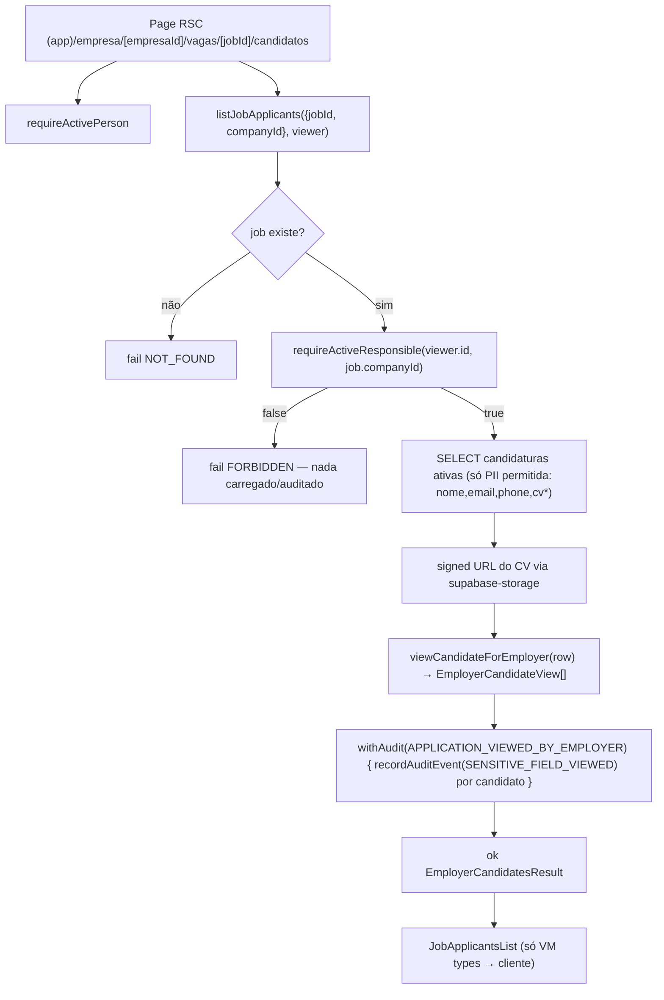

# USP-027 — Empresa ver lista de candidatos da vaga — Design

**Spec**: `.specs/features/candidaturas-busca-candidatos/usp-027-empresa-ver-candidatos/spec.md`
**Sibling (View Model compartilhado)**: `../usp-028-empresa-buscar-candidatos/design.md`
**Status**: Draft

> **Decisões de projeto ativas honradas** (STATE.md `## Decisions`): AD-012
> (forma da tabela `applications`: `candidatePersonId`, `jobId`, `cancelledAt` null=ativa,
> `appliedAt`; USP-025 estende com `viaEncaminhamento`), AD-009 (status na entidade),
> ADR-0010/ADR-0017 (View Model como fonte única de anonimização; SELECT condicional
> ao papel), ADR-0023/ADR-0004 (`audit_log` append-only). Nenhuma decisão é
> superseded por esta feature.

---

## Architecture Overview

Leitura **auditada** de dados sensíveis de uma Pessoa (candidato) para outra
(Empresa), com autorização por vínculo de domínio (não RBAC). O padrão espelha
`reporting/actions/access-report.ts` (revelação auditada via `withAudit` sobre uma
leitura pura) + `jobs/queries/get-job-detail.ts` (SELECT condicional que **não
carrega** o campo restrito para o papel errado).



**Camadas e responsabilidades (least privilege em duas barreiras):**
1. **Query** (`jobs/queries`): autoriza (ownership), faz o SELECT que **só carrega**
   a PII permitida (nunca `cpf`/`birthDate`/`fullAddress`), resolve a URL do CV, mapeia
   por View Model e **audita**. Retorna `ActionResult<EmployerCandidatesResult>`.
2. **View Model** (`persons/views`): serializer **puro** sobre um `Row` tipado que
   **estruturalmente não contém** os campos proibidos — impossível vazá-los mesmo por
   engano de template.
3. **Page/Componente**: só recebe o tipo do View Model.

---

## Code Reuse Analysis

### Existing Components to Leverage

| Component | Location | How to Use |
| --- | --- | --- |
| `requireActiveResponsible(personId, companyId)` | `src/modules/jobs/server/require-active-responsible.ts` (barrel `@/modules/jobs`) | Gate de ownership — **antes** de qualquer carga de candidato (USP027-MN-02) |
| `withAudit` / `recordAuditEvent` / `AuditContext` | `src/modules/audit` (`withAudit.ts`) | Auditar a leitura (evento primário + secundário no mesmo tx — padrão USP-017) |
| `AuditEvent.APPLICATION_VIEWED_BY_EMPLOYER`, `SENSITIVE_FIELD_VIEWED` | `src/modules/audit/events.ts` | Eventos já catalogados (nunca usados ainda — seremos os primeiros) |
| Padrão SELECT-condicional | `src/modules/jobs/queries/get-job-detail.ts:17-38` | Precedente do "não carregar o campo restrito" (defesa contra Flight leak) |
| `viewJobForVisitor` (serializer puro sobre `Row`) | `src/modules/jobs/views/job-list-item.view.ts` | Molde do View Model puro + `Row` tipado |
| `getCurrentPerson` / `requireActivePerson` / `CurrentPerson` | `src/modules/identity` (`server/session.ts`) | Sessão (ADR-0030). `CurrentPerson` **não** traz contexto de Empresa — resolver via `requireActiveResponsible` |
| `ok` / `fail` / `ActionResult` / `ActionError` | `src/shared/errors.ts` | Retorno padronizado (nunca `throw`) |
| `formatInTimezone` (`America/Sao_Paulo`) | `src/shared/lib/time` (usado por `search-jobs`/views) | Data/hora da candidatura (USP027-03) |
| `supabase-storage` client | `src/shared/lib/supabase-storage.ts` (Fase 0 / AD-013) | Signed URL do CV; degrada se bucket ausente |
| `clientIp(headers)` + `headers()` | usado em `reporting/actions/access-report.ts:76-85` | Montar `AuditContext.ip`/`userAgent` inline |
| Estrutura de teste de int + assert de audit | `persons/__tests__/inactivate-person.int.test.ts`, `jobs/__tests__/applications.int.test.ts` | Molde do int test (skipIf DB, mocks, seed, teardown, `auditLog.findFirst`) |
| Sensor de discriminação sobre payload | `jobs/__tests__/vagas-detalhe-metadata.int.test.ts:139-159` | Molde do "campo sensível ausente de `JSON.stringify(...)`" |

### Integration Points

| System | Integration Method |
| --- | --- |
| `Application` (Prisma) | `findMany({ where: { jobId, cancelledAt: null }, ... })` — **lê** `viaEncaminhamento` (coluna entregue por U2/USP-025) |
| `Person` + `CandidateProfile` | `select` aninhado carregando **só** `fullName, emailLogin, phone` (Person) e `cvStoragePath, cvUploadedAt` (CandidateProfile) |
| `audit_log` | append-only via `withAudit`/`recordAuditEvent` |
| Supabase Storage (bucket de CV) | signed URL de curta duração para `cvStoragePath` |

---

## Components

### 1. `viewCandidateForEmployer` (View Model — serializer puro)

- **Purpose**: Projetar uma candidatura+candidato para a Empresa dona da vaga,
  expondo **só** contato+CV+nome+meta da candidatura. Sem IO, sem Prisma.
- **Location**: `src/modules/persons/views/view-candidate-for-employer.ts`
- **Interfaces**:
  ```typescript
  /** Shape mínimo que o serializer consome — a query faz SELECT explícito disto.
   *  Estruturalmente SEM cpf/birthDate/fullAddress (impossível vazá-los). */
  export interface EmployerCandidateRow {
    candidatePersonId: string;
    fullName: string;
    emailLogin: string | null;
    phone: string | null;
    appliedAt: Date;
    viaEncaminhamento: boolean;
    cvStoragePath: string | null;
    cvUploadedAt: Date | null;
    /** URL assinada resolvida na query (IO fica fora do VM puro). */
    cvSignedUrl: string | null;
  }

  export interface EmployerCandidateView {
    candidatePersonId: string;
    fullName: string;
    contact: { email: string | null; phone: string | null };
    cv: { available: boolean; url: string | null; uploadedAt: Date | null };
    appliedAt: Date;
    viaEncaminhamento: boolean;
  }

  export function viewCandidateForEmployer(row: EmployerCandidateRow): EmployerCandidateView;
  ```
- **Dependencies**: nenhuma (função pura).
- **Reuses**: molde de `viewJobForVisitor` (serializer puro + `Row`).

### 2. `listJobApplicants` (query auditada + ownership)

- **Purpose**: Autorizar, carregar candidaturas ativas da vaga (só PII permitida),
  resolver CV, mapear por View Model e auditar. Fonte única do acesso.
- **Location**: `src/modules/jobs/queries/list-job-applicants.ts` (barrel `@/modules/jobs`)
  — fica em `jobs` porque é **job-centric**: chaveada por `jobId`, autoriza por
  `job.companyId` e reusa `requireActiveResponsible` (que vive em `jobs/server`); é
  onde a tabela `applications` já é lida hoje (`get-job-detail`, `applications.int.test`).
- **Interfaces**:
  ```typescript
  export const APPLICANTS_PAGE_SIZE = 20;

  export interface EmployerCandidatesResult {
    applicants: EmployerCandidateView[];
    total: number;   // total de candidaturas ATIVAS
    page: number;
    pageSize: number;
  }

  export async function listJobApplicants(
    input: { jobId: string; page?: number },
    viewer: CurrentPerson,
  ): Promise<ActionResult<EmployerCandidatesResult>>;
  ```
- **Fluxo** (sequência canônica adaptada à leitura sensível):
  1. Resolver a vaga: `prisma.job.findUnique({ where: { id: jobId }, select: { id: true, companyId: true } })`.
     `null` → `fail('NOT_FOUND', 'Vaga não encontrada.')` *(USP027-07)*.
  2. **Ownership**: `await requireActiveResponsible(viewer.id, job.companyId)`.
     `false` → `fail('FORBIDDEN', 'Você não é responsável por esta Empresa.')`
     — **sem carregar nem auditar** candidato *(USP027-MN-02/USP027-06)*.
  3. Contagem + página das candidaturas **ativas** com o **mesmo** filtro
     (`{ jobId, cancelledAt: null }`, `orderBy: { appliedAt: 'asc' }`, `take: APPLICANTS_PAGE_SIZE`,
     `skip`). SELECT aninhado carregando **só**:
     `appliedAt, viaEncaminhamento, candidate: { id, fullName, emailLogin, phone,
     candidateProfile: { cvStoragePath, cvUploadedAt } }`. **Nunca** `cpf/birthDate/fullAddress`
     *(USP027-MN-01/MN-03/MN-05)*.
  4. Para cada candidatura com `cvStoragePath`, resolver signed URL via
     `supabase-storage` (try/catch → `null` se indisponível).
  5. Mapear via `viewCandidateForEmployer`.
  6. **Auditar** (evento primário + secundários no mesmo tx):
     ```typescript
     await withAudit(AuditEvent.APPLICATION_VIEWED_BY_EMPLOYER, async (tx, audit) => {
       audit.entityType = 'job';
       audit.entityId = job.id;
       audit.context = { companyId: job.companyId, applicantCount: applicants.length };
       for (const a of applicants) {
         await recordAuditEvent(tx, AuditEvent.SENSITIVE_FIELD_VIEWED, {
           entityType: 'person',
           entityId: a.candidatePersonId,
           context: { jobId: job.id, viewedFields: ['email', 'phone', 'cv'] },
         }, ctx);
       }
     }, ctx);
     ```
     `ctx: AuditContext` montado inline via `headers()` (`actorPersonId: viewer.id`,
     `ip: clientIp(hdrs)`, `userAgent`) *(USP027-MN-04)*.
     > Nota perf: chamadas sequenciais dentro do `tx` (guideline §13 — nada de
     > `Promise.all` no mesmo `tx`). As leituras (passos 3–4) ocorrem **fora** do
     > `tx`; dentro do `tx` só há escritas de auditoria.
  7. `ok({ applicants, total, page, pageSize })`.
- **Dependencies**: `requireActiveResponsible`, `withAudit`/`recordAuditEvent`,
  `viewCandidateForEmployer`, `supabase-storage`, `headers()`.
- **Reuses**: padrão `access-report.ts` (leitura auditada) + `get-job-detail.ts` (SELECT restrito).

### 3. Página + componente de apresentação

- **Purpose**: Renderizar a lista para o responsável; estado vazio; badge; data/hora SP.
- **Location**:
  - Página RSC: `src/app/(app)/empresa/[empresaId]/vagas/[jobId]/candidatos/page.tsx`
    (route group `(app)` → `force-dynamic`; consistente com a árvore existente
    `empresa/[empresaId]/vagas/[jobId]/...`).
  - Componente: `src/modules/jobs/components/job-applicants-list.tsx` (consome
    `EmployerCandidateView[]` — **nunca** a linha crua).
- **Comportamento da página**:
  1. `const viewer = await requireActivePerson()`.
  2. `const res = await listJobApplicants({ jobId, page }, viewer)`.
  3. `!res.ok && res.error.code === 'NOT_FOUND'` → `notFound()`;
     `'FORBIDDEN'` → `notFound()` (não revelar existência) ou UI de acesso negado.
  4. Renderizar `JobApplicantsList` com data/hora (`formatInTimezone`), badge
     ("Candidato encaminhado pela ASONSEG") quando `viaEncaminhamento`, link do CV
     quando `cv.available`, contato ("não informado" quando `phone` null), e **estado
     vazio** "Nenhuma candidatura ativa" *(USP027-08)*.
- **Reuses**: primitivas `@/shared/ui` (Card/Badge), `formatInTimezone`.

---

## Data Models

Sem migração nova. **Depende** de `Application.viaEncaminhamento Boolean @default(false)`
entregue por **U2 (USP-025)** — U3 apenas **lê**. Schema atual de `Application`
(`prisma/schema.prisma:495`): `id, candidatePersonId, jobId, cancelledAt, appliedAt`
+ (U2) `viaEncaminhamento`.

Campos lidos e sua classificação de privacidade:

| Fonte | Campo | Exposto ao empregador? |
| --- | --- | --- |
| `Person` | `fullName` | **Sim** (nome para contato) |
| `Person` | `emailLogin` | **Sim** (contato) — sensível, auditado |
| `Person` | `phone` | **Sim** (contato) — sensível, auditado |
| `Person` | `cpf`, `birthDate`, `fullAddress` | **NÃO** — nunca SELECTado *(MN-01)* |
| `CandidateProfile` | `cvStoragePath`, `cvUploadedAt` | **Sim** (CV) — sensível, auditado |
| `Application` | `appliedAt`, `viaEncaminhamento` | **Sim** (meta) |

---

## Error Handling Strategy

| Error Scenario | Handling | User Impact |
| --- | --- | --- |
| Vaga inexistente | `fail('NOT_FOUND')` → `notFound()` | Página 404 |
| Não é responsável / outra Empresa | `fail('FORBIDDEN')` — nada carregado/auditado | 404/acesso negado |
| Sessão inválida/inativa | `requireActivePerson` → `redirect('/login')` | Volta ao login |
| Sem candidaturas ativas | `ok` com `applicants: []` | Estado vazio amigável |
| CV storage indisponível | `cv.available=false`, `url=null` (try/catch) | Item sem link de CV |
| `phone` null | contato "não informado" | Exibição graciosa |

---

## Risks & Concerns

| Concern | Location | Impact | Mitigation |
| --- | --- | --- | --- |
| `Person.phone` não é persistido pelo cadastro de candidato | `persons/actions/activate-candidate-role.ts:74-98` (não grava `phone`) | Contato telefônico pode vir vazio para candidatos reais | USP-027 exibe "não informado"; abrir **follow-up** para persistir `phone` na USP-009 (fora do escopo desta unidade) — registrado em Assumptions |
| Dependência de coluna `viaEncaminhamento` entregue por U2 | `prisma/schema.prisma:495-508` (comentário defere a U2) | Se U2 não rodou, o SELECT/leitura quebra | Orquestrador sequencia U2 antes de U3; Verifier falha se ausente (não é U3 quem cria a coluna) |
| Auditoria por render pode gerar volume | `list-job-applicants.ts` (novo) | Muitas linhas em `audit_log` sob refresh | Aceito (append-only, trilho LGPD por candidato); dedup/throttle é Deferred Idea |
| Signed URL do CV expõe o arquivo por janela curta | `supabase-storage` | Link compartilhável durante a validade | URL de **curta duração**; acesso já é auditado (`SENSITIVE_FIELD_VIEWED`) |
| Nenhum lint que bloqueie Prisma-model em componente ainda | guideline §5 (planejado) | Risco de passar linha crua ao cliente | View Model + `Row` tipado sem campos proibidos; teste de payload (sensor) |

---

## Tech Decisions (only non-obvious ones)

| Decision | Choice | Rationale |
| --- | --- | --- |
| Autorização do empregador | Gate de domínio `requireActiveResponsible` (não RBAC) | Não há `PermissionId` de empregador; mesmo gate dos ciclos de vida de vaga |
| Onde vive a query | `jobs/queries/list-job-applicants.ts` | Job-centric; reusa `requireActiveResponsible`; `applications` já é lida em `jobs` |
| Onde vive o View Model | `persons/views/view-candidate-for-employer.ts` | O titular do dado é a Pessoa (guideline §5: `<source>/views`) |
| Leitura auditada | `withAudit` sobre leitura pura (padrão `access-report`) + `recordAuditEvent` por candidato | Único jeito de trilho atômico; catálogo já tem os eventos |
| CV | signed URL resolvida na query (VM puro) | Mantém o VM sem IO; reusa storage client da Fase 0 |
| PII servida ao empregador | só nome+email+phone+cv (least privilege) | CPF/endereço/nascimento não são necessários para contato |

> **Nenhuma decisão nova de projeto (AD-NNN)** — a feature conforma às decisões
> ativas. Se o Implementer descobrir que `viaEncaminhamento` ainda não existe no
> working tree, é falha de sequência da pipeline (STOP), não decisão de design.
