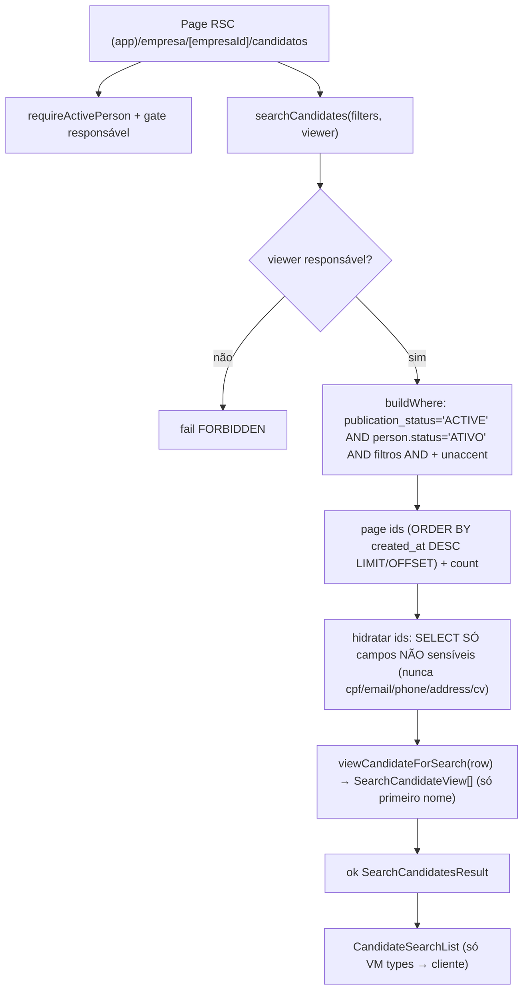

# USP-028 — Empresa buscar candidatos (busca ativa) — Design

**Spec**: `.specs/features/candidaturas-busca-candidatos/usp-028-empresa-buscar-candidatos/spec.md`
**Sibling (revelação de contato/CV)**: `../usp-027-empresa-ver-candidatos/design.md`
**Status**: Draft

> **Decisões ativas honradas** (STATE.md): AD-011 (busca `unaccent` no DB + índice
> funcional; paginação no banco), AD-009 (status na entidade — `publicationStatus`),
> ADR-0010/ADR-0017 (View Model = fonte de anonimização; SELECT condicional ao papel).
> **Nova decisão de projeto** proposta: `CandidateProfile.regionId` (localização
> estruturada do candidato) — registrar como **AD-018** no STATE ao aprovar o design
> (AD-017 já é reivindicada por U2/USP-025 — módulo dono de `applications`; usar o
> próximo número). Ver Tech Decisions.

---

## Architecture Overview

Busca paginada, **não sensível**, espelhando `jobs/queries/search-jobs.ts`: o `WHERE`
(gate on-read + filtros AND + texto `unaccent`) é resolvido **uma vez** em SQL
parametrizado, usado pela contagem e pela página; só os ids da página sobem; hidratados
por um SELECT que **carrega apenas campos não sensíveis**; mapeados por um View Model
puro que emite **só primeiro nome + região + área + escolaridade + resumo**.



**Duas barreiras de privacidade:** (1) o **SELECT nunca carrega** campos sensíveis
(defesa contra Flight leak — memória `view-model-anonimizacao-nao-basta`); (2) o View
Model reduz `fullName → primeiro nome` e nunca recebe os campos proibidos no seu `Row`.

---

## Code Reuse Analysis

### Existing Components to Leverage

| Component | Location | How to Use |
| --- | --- | --- |
| Padrão de busca `unaccent` + paginação no DB | `src/modules/jobs/queries/search-jobs.ts` | Molde de `buildWhere`, `$queryRaw` ids+count, hidratação por `select`, map por View Model |
| `immutable_unaccent` (função SQL) + índice trgm | migração de `search-jobs` (USP-021) | Reusar a função; criar índice trgm análogo p/ candidatos (ver Data Models) |
| `viewJobForVisitor` (serializer puro sobre `Row`) | `src/modules/jobs/views/job-list-item.view.ts` | Molde do View Model puro |
| `EDUCATION_LEVELS` / `EDUCATION_LEVEL_LABELS` | `src/modules/persons/domain/candidate.ts` | Filtro + label de escolaridade |
| `listApprovedJobAreas()` | `src/modules/jobs/queries/list-approved-job-areas.ts` (barrel `@/modules/jobs`) | Opções do filtro "área de interesse" |
| `listActiveRegions()` | `src/modules/jobs/queries/list-active-regions.ts` (barrel `@/modules/jobs`) | Opções do filtro "localização" + label cidade/região |
| `getCurrentPerson`/`requireActivePerson`/`CurrentPerson` | `src/modules/identity` | Sessão + `roles` p/ gate de responsável |
| `requireActiveResponsible` | `@/modules/jobs` | Gate da página `[empresaId]` |
| `ok`/`fail`/`ActionResult` | `src/shared/errors.ts` | Retorno padronizado |
| `Prisma.sql`/`Prisma.join` | `@prisma/client` | SQL parametrizado (anti-injeção) |
| Teste de "campo ausente do SELECT e do output" | `persons/__tests__/view-person-for-staff.test.ts` | Molde do unit de privacidade do VM |
| Sensor de discriminação sobre payload | `jobs/__tests__/vagas-detalhe-metadata.int.test.ts:139-159` | Molde do "campo sensível ausente de `JSON.stringify`" |
| Int test de busca (seed + filtros + paginação) | `jobs/__tests__/search-jobs.int.test.ts` | Molde do int test da query |

### Integration Points

| System | Integration Method |
| --- | --- |
| `CandidateProfile` + `Person` + `JobArea` + `Region` (Prisma) | `$queryRaw` para ids/count (join persons + candidate_profiles), depois `findMany` por ids com `select` não sensível |
| `Region` | join p/ cidade/região + FK nova `candidate_profiles.region_id` |
| Migração | adicionar `region_id` a `candidate_profiles` + índice trgm de busca |

---

## Components

### 1. Migração — `CandidateProfile.regionId` + índice de busca

- **Purpose**: Dar localização estruturada ao candidato (exigida por filtro/exibição)
  e um índice para a busca textual.
- **Location**: `prisma/schema.prisma` (model `CandidateProfile` + back-relation em `Region`)
  + `prisma/migrations/<timestamp>_usp028_candidate_search/migration.sql`
- **Mudanças de schema**:
  ```prisma
  model CandidateProfile {
    // ...campos existentes...
    regionId String? @map("region_id") @db.Uuid
    region   Region? @relation(fields: [regionId], references: [id])
    // ...
    @@index([publicationStatus])
    @@index([regionId])            // filtro por localização
    @@map("candidate_profiles")
  }

  model Region {
    // ...
    candidateProfiles CandidateProfile[]   // back-relation
  }
  ```
- **SQL adicional** (migração à mão, cf. AD-011): índice trgm funcional para a busca
  textual não sensível, ex.:
  `CREATE INDEX candidate_search_trgm ON candidate_profiles USING gin (immutable_unaccent(lower(coalesce(headline,'')||' '||coalesce(skills_text,'')||' '||coalesce(courses_text,'')||' '||coalesce(experience_text,''))) gin_trgm_ops);`
  (reusa a função `immutable_unaccent` já criada pela USP-021; verificar existência).
- **Dependencies**: extensão `unaccent`/`pg_trgm` já habilitadas (USP-021).
- **Reuses**: padrão da migração de busca de `search-jobs`.

### 2. `viewCandidateForSearch` (View Model — serializer puro)

- **Purpose**: Projetar um candidato para a busca ativa, expondo **só** dados não
  sensíveis; reduz `fullName → primeiro nome`. Sem IO.
- **Location**: `src/modules/persons/views/view-candidate-for-search.ts` (+ barrel)
- **Interfaces**:
  ```typescript
  /** Row do SELECT não sensível — SEM cpf/emailLogin/phone/fullAddress/cv*. */
  export interface SearchCandidateRow {
    personId: string;
    fullName: string;                       // usado só p/ derivar o 1º nome, nunca emitido
    headline: string | null;
    skillsText: string | null;
    educationLevel: string | null;
    availability: string | null;
    primaryAreaOfInterest: { name: string } | null;
    region: { name: string; cityName: string } | null;
  }

  export interface SearchCandidateView {
    candidatePersonId: string;
    firstName: string;                      // 1º token de fullName
    primaryArea: string | null;
    educationLevel: string | null;
    educationLevelLabel: string | null;     // via EDUCATION_LEVEL_LABELS
    location: string | null;                // `${cityName} — ${name}` ou null
    availability: string | null;
    qualificationsSummary: string | null;   // headline ?? skillsText (truncado)
  }

  export function viewCandidateForSearch(row: SearchCandidateRow): SearchCandidateView;
  ```
- **Dependencies**: `firstNameOf` (T-domain), `EDUCATION_LEVEL_LABELS`.
- **Reuses**: molde de `viewJobForVisitor`.

### 3. `firstNameOf` (helper puro de domínio)

- **Purpose**: Derivar o primeiro nome de um nome completo (1º token; trata vazio/único).
- **Location**: `src/modules/persons/domain/candidate-display.ts` (+ barrel)
- **Interface**: `export function firstNameOf(fullName: string): string;`
- **Reuses**: nenhum (regra pura).

### 4. `searchCandidates` (query de busca)

- **Purpose**: Autorizar (responsável), montar `WHERE` (gate on-read + filtros +
  texto), paginar no DB, hidratar por SELECT não sensível, mapear por View Model.
- **Location**: `src/modules/persons/queries/search-candidates.ts` (**cria** o diretório
  `persons/queries/`; + barrel `@/modules/persons`). Fica em `persons` porque é
  **candidate-centric** (busca sobre `CandidateProfile`/`Person`, não sobre uma vaga).
- **Interfaces**:
  ```typescript
  export const SEARCH_PAGE_SIZE = 20;
  export const SEARCH_TERM_MAX = 100;

  export interface SearchCandidatesFilters {
    q?: string;              // texto sem acento (headline/skills/courses/experience)
    areaId?: string;         // área de interesse principal
    educationLevel?: string; // igualdade
    availability?: string;   // unaccent contains
    regionId?: string;       // localização (igualdade)
    page?: number;
  }
  export interface SearchCandidatesResult {
    items: SearchCandidateView[];
    page: number;
    pageSize: number;
    total: number;
  }
  export async function searchCandidates(
    filters: SearchCandidatesFilters,
    viewer: CurrentPerson,
  ): Promise<ActionResult<SearchCandidatesResult>>;
  ```
- **Fluxo**:
  1. **Authz**: `viewer.roles.includes('COMPANY_RESPONSIBLE')` senão `fail('FORBIDDEN')` *(USP028-08)*.
  2. `buildWhere(filters)` — base **on-read** (join `persons p` ⨝ `candidate_profiles cp`):
     `cp.publication_status = 'ACTIVE'` **AND** `p.status = 'ATIVO'` *(USP028-MN-03)*.
     Filtros AND: `cp.primary_area_of_interest_id = $areaId::uuid`,
     `cp.education_level = $educationLevel`, `cp.region_id = $regionId::uuid`,
     `immutable_unaccent(lower(cp.availability)) LIKE immutable_unaccent(lower('%'||$avail||'%'))`,
     e texto `q` via `immutable_unaccent(lower(headline||' '||skills_text||' '||courses_text||' '||experience_text)) LIKE ...`.
  3. Página + contagem com o **mesmo** `WHERE`: `SELECT cp.person_id FROM candidate_profiles cp JOIN persons p ON p.id = cp.person_id WHERE ... ORDER BY cp.created_at DESC LIMIT ${SEARCH_PAGE_SIZE} OFFSET ${offset}` + `count(*)`. Paginação no DB *(USP028-MN-04)*.
  4. Hidratar ids com `prisma.candidateProfile.findMany({ where: { personId: { in: ids } }, select: candidateSearchSelect })`, onde `candidateSearchSelect` carrega **só**:
     `personId, headline, skillsText, educationLevel, availability,
     primaryAreaOfInterest: { select: { name } }, region: { select: { name, cityName } },
     person: { select: { fullName } }`. **Nunca** `person.cpf/emailLogin/phone/fullAddress`
     nem `cvStoragePath` *(USP028-MN-01/MN-05)*.
  5. Reordenar conforme os ids do banco; mapear por `viewCandidateForSearch`.
  6. `ok({ items, page, pageSize, total })`.
- **Reuses**: `search-jobs.ts` (estrutura idêntica).
- **Auditoria**: **nenhuma** — dado não sensível *(ver USP028 Out of Scope)*.

### 5. Página + componentes de busca

- **Purpose**: Formulário de filtros + lista paginada de cards não sensíveis + estado vazio.
- **Location**:
  - Página RSC: `src/app/(app)/empresa/[empresaId]/candidatos/page.tsx` (`(app)` → `force-dynamic`; filtros via `searchParams`)
  - Componentes: `src/modules/persons/components/candidate-search-form.tsx` (filtros) e
    `src/modules/persons/components/candidate-search-list.tsx` (+ card) — consomem só `SearchCandidateView[]`.
- **Comportamento**:
  1. `const viewer = await requireActivePerson()`; página sob `[empresaId]` valida
     `requireActiveResponsible(viewer.id, empresaId)` → `notFound()` se falso.
  2. Opções de filtro via `listApprovedJobAreas()` + `listActiveRegions()` + `EDUCATION_LEVELS`.
  3. `const res = await searchCandidates(filtersFromSearchParams, viewer)`.
  4. Renderizar form + lista (primeiro nome, cidade/região "Região não informada"
     quando null, área, escolaridade (label), resumo) + paginação + estado vazio
     "Nenhum candidato encontrado" *(USP028-07)*.
- **Reuses**: primitivas `@/shared/ui`, padrão de página de busca de vagas.

---

## Data Models

Ver Component 1. `CandidateProfile` ganha `regionId String?` + `region Region?`;
`Region` ganha back-relation `candidateProfiles`. Todos os demais campos lidos são os
**não sensíveis** já existentes (`headline, skillsText, educationLevel, availability,
primaryAreaOfInterestId, createdAt`) + `person.fullName` (reduzido a 1º nome no VM).

**Classificação (o que a busca ativa PODE tocar):**

| Campo | Fonte | Na busca ativa? |
| --- | --- | --- |
| `fullName` | Person | carregado p/ derivar 1º nome; **fullName nunca emitido** *(MN-02)* |
| `cpf`, `emailLogin`, `phone`, `fullAddress`, `birthDate` | Person | **NÃO** — nunca SELECTado *(MN-01)* |
| `cvStoragePath` e demais `cv*` | CandidateProfile | **NÃO** — nunca SELECTado *(MN-01)* |
| `headline`, `skillsText`, `educationLevel`, `availability`, `primaryAreaOfInterestId`, `regionId`, `createdAt`, `publicationStatus` | CandidateProfile | Sim (não sensível / gate) |

---

## Error Handling Strategy

| Error Scenario | Handling | User Impact |
| --- | --- | --- |
| Não é responsável / anônimo | `fail('FORBIDDEN')` / redirect | Sem resultados |
| Nenhum candidato p/ os filtros | `ok` com `items: []` | Estado vazio amigável |
| `regionId` null no candidato | filtro não casa; exibe "Região não informada" | Exibição graciosa |
| Termo gigante | truncado em `SEARCH_TERM_MAX` | Busca segura |
| Extensão `unaccent`/índice ausente | migração habilita/usa a função de USP-021 | Falha no gate de migração (detectável) |

---

## Risks & Concerns

| Concern | Location | Impact | Mitigation |
| --- | --- | --- | --- |
| Candidatos reais sem `regionId` (form não coleta) | `persons/schemas/candidate.ts` (sem região) | Filtro por localização e exibição inertes p/ dados reais | Seed demo popula região; exibição "Região não informada"; **follow-up** coletar no form (fora de U3) — em Assumptions |
| `experienceText`/`skillsText` são texto livre do candidato — pode conter PII digitada | `candidate_profiles` | Candidato pode digitar telefone no resumo | Fora do escopo controlar conteúdo digitado; expõe-se só `headline`+`skillsText` truncado (mesma política de descrição de vaga); moderação (perfil ACTIVE) é o filtro de conteúdo |
| Reutilização da função `immutable_unaccent` | migração USP-021 | Se a função/extensão não existir no ambiente, o índice/quebra | Verificar existência na migração; criar se ausente (idempotente) |
| Sem lint bloqueando Prisma-model em componente | guideline §5 (planejado) | Risco de passar linha crua | View Model + `Row` sem campos proibidos + teste de payload |

---

## Tech Decisions (only non-obvious ones)

| Decision | Choice | Rationale |
| --- | --- | --- |
| Localização do candidato | Nova coluna `CandidateProfile.regionId` (espelha `ProviderProfile.regionId`) | Precedente AD-011/012: 1ª USP que precisa cria a migração mínima; `Region` já existe |
| Onde vive a query | `persons/queries/search-candidates.ts` (cria o dir) | Candidate-centric; sem dependência de `jobs` |
| Onde vive o View Model | `persons/views/view-candidate-for-search.ts` | Titular do dado é a Pessoa (guideline §5) |
| Anonimização | SELECT não sensível **fixo** (o papel "empregador em busca ativa" nunca vê PII) + redução `fullName→1º nome` no VM | Barreira dupla; "condicional ao papel" aqui = papel busca-ativa ⇒ zero PII |
| Sem auditoria | Dado não sensível ⇒ sem `SENSITIVE_FIELD_VIEWED` | Auditar acesso não sensível seria ruído; revelação é a USP-027 |
| Filtro disponibilidade | `unaccent` contains sobre `availability` (texto livre) | Determinístico e testável; sem enum |

> **Project-level decision:** ao aprovar este design, **anexar `AD-018` ao STATE.md**
> (`## Decisions`) — AD-017 é de U2/USP-025 (dono de `applications`): "USP-028 introduz
> `CandidateProfile.regionId` (localização estruturada do candidato) via migração
> mínima; coleta no form de cadastro é follow-up; busca/exibição de localização
> operam sobre ele." Feature-local o resto.
