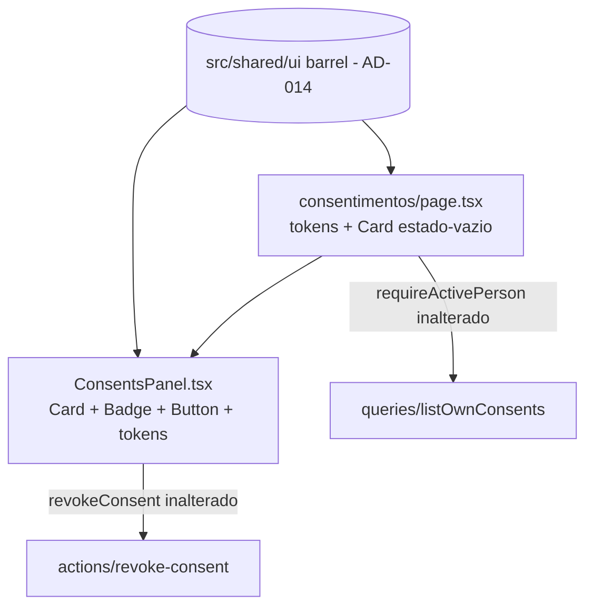

# USP-043 Consentimentos - Refactor (Fase 1) Design

**Spec**: `.specs/features/consentimentos-lgpd/usp-043-consentimentos/spec.md`
**Status**: Draft

> **Fontes da verdade upstream (adaptar, não re-derivar):**
> - Design System: `.specs/features/fundacao-ui-design-system/design.md` + barrel `src/shared/ui/index.ts` (**AD-014**).
> - Linguagem visual: protótipo `docs/prototipo/index.html` (`.card`, `.badge` L186-193, tokens) - já portados nos primitivos `Card`/`Badge` do DS.
> - Fluxo e invariantes: épico `.specs/features/consentimentos-lgpd/spec.md` (LGP-04/LGP-05); ADR-0008 (retenção); privacidade por `personId`.
> - Padrão de restyle já mergeado: `src/modules/identity/components/LoginForm.tsx` (danger-token, links).
>
> **Decisões ativas de STATE.md `## Decisions`:** AD-014 (DS) é o constraint; este design **conforma** a ele e não supersede nada.

---

## Architecture Overview

Uma frente única de apresentação (só estilo) sobre dois arquivos já entregues. Nenhuma action, query,
view ou modelo muda. O escopo por titular (`requireActivePerson`) e a cascata de revogação (LGP-04)
permanecem intactos.

**Princípio:** troca **apenas marcação/classe**. Handlers (`onConfirmRevoke`, `setShowTerm`,
`setConfirming`), `revokeConsent`, `router.refresh`, landmarks e nomes acessíveis - todos preservados.

---

## Code Reuse Analysis

### Existing Components to Leverage

| Component | Location | How to Use |
| --- | --- | --- |
| `Card` | `src/shared/ui/card.tsx` | Substitui `article`/`div` com `rounded-xl border-gray-200 bg-white p-5 shadow-sm` nos cards de consentimento e no estado-vazio. |
| `Badge` | `src/shared/ui/badge.tsx` | Substitui os `` de status; `variant` por status (green/orange/gray). |
| `Button` | `src/shared/ui/button.tsx` | Substitui os `<button>` crus; `outline` para "Ver termo"/"Cancelar", `outline`+token danger para "Revogar"/"Sim, revogar". |
| Tokens | `tailwind.config.ts` / `globals.css` | `text-fg`, `text-fg-muted`, `bg-background` (área do termo), `bg-surface`. |
| Padrão danger-token | `src/modules/identity/components/LoginForm.tsx:92` | `bg-[color-mix(in_srgb,var(--color-danger)_10%,transparent)] text-danger` para a caixa de confirmação. |

### Integration Points

| System | Integration Method |
| --- | --- |
| `revokeConsent` (Server Action) | Chamada inalterada; só o botão que a dispara é restilizado. |
| `listOwnConsents` / `own-consents.view` | Não tocados; a página continua passando `person.id`. |
| Vitest (jsdom) | `consents-panel.test.tsx` roda em `npm run test`; asserts de role/nome preservados. |

---

## Components

### `ConsentsPanel` (restyle - Client Component)
- **Purpose**: painel do titular restilizado com primitivos do DS; comportamento intacto.
- **Location**: `src/modules/consents/components/consents-panel.tsx`
- **Interfaces**: props inalteradas (`{ items }`). Internamente:
  - `STATUS_BADGE`: trocar o `{ label, className }` cru por `{ label, variant }` (`green`/`orange`/`gray`) e renderizar `<Badge variant={...}>`.
  - `ConsentCard`: `article` -> `<Card as article>`? `Card` é `div`; manter o elemento `article` semântico exige envolver o conteúdo em `Card` OU aplicar as classes do `Card` a um `article`. **Decisão:** manter `<article>` e aplicar os tokens de superfície diretamente (`rounded-md border border-border bg-surface p-6 shadow-sm`), preservando o landmark `article`. (Ver Tech Decisions.)
  - Botões: `Button variant="outline"` (Ver termo / Cancelar); Revogar / Sim, revogar em `outline` + `className` de token danger.
  - Área do termo: `bg-background` em vez de `bg-gray-50`; textos em `text-fg`/`text-fg-muted`.
- **Preserva (U43-MN-01):** `role="dialog"` `aria-modal`, nomes acessíveis, "Revogar" só nos vigentes, confirmação antes de `revokeConsent`.
- **Reuses**: `Badge`, `Button`, tokens.

### `consentimentos/page.tsx` (restyle - Server Component)
- **Purpose**: casca do painel com tokens e `Card` no estado-vazio.
- **Location**: `src/app/(app)/consentimentos/page.tsx`
- **Interfaces**: `<header>` com `text-fg`/`text-fg-muted` (em vez de `text-gray-*`); estado-vazio em
  `<Card>` (em vez de `rounded-xl border-gray-200 bg-white ...`).
- **Preserva (U43-MN-02):** `requireActivePerson()`, `listOwnConsents(person.id)`, dedup de termos,
  `dynamic='force-dynamic'`. **Nenhuma** mudança nesses.
- **Reuses**: `Card`, tokens.

---

## Data Models

N/A - nenhum modelo, migração, query, view ou action muda. Restyle puramente de apresentação.

---

## Error Handling Strategy

| Error Scenario | Handling | User Impact |
| --- | --- | --- |
| `revokeConsent` retorna erro | Mensagem exibida na caixa de confirmação com token danger (comportamento atual, só cor via token) | Usuário vê o erro e pode tentar de novo. |
| Termo indisponível | `TERM_BODY_UNAVAILABLE` já tratado na página (inalterado) | Corpo do termo mostra o sentinela. |
| Classe conflita no `cn`/tailwind-merge | Merge resolve (última vence) | Estilo previsível. |

---

## Risks & Concerns

| Concern | Location (file:line) | Impact | Mitigation |
| --- | --- | --- | --- |
| `Card` é `div`; o painel usa `article` semântico | `src/modules/consents/components/consents-panel.tsx:74`; `src/shared/ui/card.tsx:8` | Trocar `article`->`Card(div)` perderia o landmark | Manter `<article>` e aplicar os tokens de superfície do `Card` diretamente (mesmas classes), preservando semântica. |
| Testes RTL asseguram nomes/roles exatos | `consents-panel.test.tsx:51-76` | Restyle que renomeie botões/regiões quebra a suíte | Preservar textos e `aria-labelledby`; `Button` renderiza `<button>` com o mesmo texto -> nome acessível idêntico. |
| `Badge` não tem variante "âmbar" | `src/shared/ui/badge.tsx:13-25` | Cor do status `desatualizado` muda de âmbar para laranja | Aceito (AD-014 deriva tints por token; `orange` é o mais próximo). Registrado em Assumptions do spec. |
| Ação destrutiva sem variante `danger` no `Button` | `src/shared/ui/button.tsx:20-42` | Botão de revogar perderia o tom vermelho | `outline` + override de token (`border-danger text-danger`); sem hex cru, respeita a convenção. |

> Nenhum outro concern relevante encontrado nos arquivos tocados.

---

## Tech Decisions (only non-obvious ones)

| Decision | Choice | Rationale |
| --- | --- | --- |
| `article` vs. `Card` | Manter `<article>` e aplicar as classes de superfície do `Card` inline | Preserva o landmark `article` que a semântica do painel usa; `Card` é `div`. Mesma aparência, sem perda de acessibilidade. |
| Botão destrutivo | `Button variant="outline"` + `className="border-danger text-danger hover:bg-[color-mix(...danger...)]"` | Não há variante `danger`; tokens preservam a convenção AD-014 e o padrão danger do `LoginForm`. |
| Status `desatualizado` | `Badge variant="orange"` | Variante DS mais próxima do âmbar atual, sem hex cru. |
| Página: header à esquerda | Não usar `FormHeader` | Painel é lista de gestão, não formulário centralizado. |

> **Nenhuma decisão nova de projeto (AD-NNN).** Conforma a AD-014.

---

## Tips aplicadas
- Reuse é rei: `Card`/`Badge`/`Button` do DS + padrão danger do `LoginForm`.
- Interfaces first: props do `ConsentsPanel` inalteradas; só o interior muda.
- Escopo travado: só estilo; privacidade e revogação preservadas.
</content>
