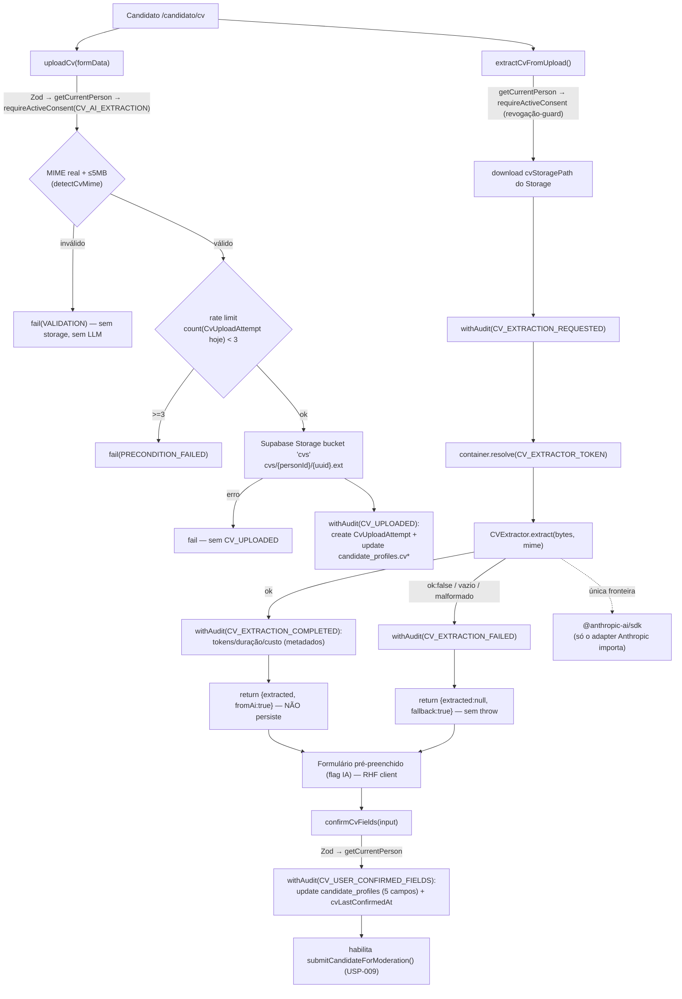

# Extração de CV via IA Generativa (USP-040) Design

**Spec**: `.specs/features/extracao-cv-ia/usp-040-extracao-cv/spec.md`
**Status**: Implemented (pending independent Verifier review)

> **Classificação de risco (bravi-spec-driven, Risk sizing floor): Large** — carrega must-nots (CVE-MN-01..06), toca efeitos externos irreversíveis (LLM externo + Storage) e é **fundacional** (cria o módulo `cv-extraction` e a porta `CVExtractor` que ADR-0012 antecipa). Spec completa + Design + Tasks formal obrigatórios.

## Decisões de projeto ativas conformadas (`.specs/project/STATE.md` `## Decisions`)

Nenhuma decisão ativa é violada. Conformidades:
- **AD-009 / AD-005** — status na entidade (`CandidateProfile.publicationStatus`), `content_items` abandonado; cada conteúdo registra seu adapter por `ContentKind`. Esta USP **não** cria conteúdo moderável novo (o CV não é um `ContentKind`; a moderação incide sobre o perfil do candidato via USP-009 `submitCandidateForModeration`). Sem novo `ContentKind`.
- **Padrão `no-external-verify.test.ts`** (Fase 0, USP-017) — reusado como template da guarda estática de import do SDK (CVE-MN-05).
- **ADR-0030** — guardas de sessão `getCurrentPerson()` de `@/modules/identity`.

**Decisão que vira convição de projeto (candidata a AD-017, a registrar pelo orquestrador):** o módulo `cv-extraction` detém as 3 Server Actions do fluxo e **escreve as colunas de CV de `candidate_profiles`** (`cvStoragePath`, `cvSha256`, `cvUploadedAt`, `cvLastConfirmedAt` + os 5 campos estruturados, apenas na confirmação). Justificativa: jornada única e coesa; as colunas `cv*` existem para esta feature; candidato edita o próprio dado (regra de privacidade do CLAUDE.md permite Prisma direto sobre o próprio perfil). Campos-base do perfil seguem donos em `persons` (USP-009). Análogo ao princípio AD-009 ("a US que precisa primeiro cria/possui a infra").

---

## Architecture Overview

Três Server Actions em `src/modules/cv-extraction/actions/`, cada uma seguindo a sequência sensível `Zod → ownership → consent → precondições → withAudit`. A extração é a única que resolve a porta `CVExtractor` do container. Nenhum dado extraído é persistido: a extração devolve um *draft* no `data`; o cliente pré-preenche o formulário (RHF); só a confirmação grava.



---

## Code Reuse Analysis

### Existing Components to Leverage

| Component | Location | How to Use |
|---|---|---|
| `ActionResult<T>` + `ok()`/`fail()` | `src/shared/errors.ts` | Retorno das 3 actions; códigos `VALIDATION`/`UNAUTHENTICATED`/`CONSENT_REQUIRED`/`PRECONDITION_FAILED`/`INTERNAL`. Nunca `throw`. |
| `withAudit` + `recordAuditEvent` | `@/modules/audit` | Envolver escritas sensíveis; metadados de custo em `audit.after` de `CV_EXTRACTION_COMPLETED`. |
| `AuditEvent` catálogo | `src/modules/audit/events.ts` | `CV_EXTRACTION_*` + `CV_USER_CONFIRMED_FIELDS` **já existem**; **adicionar `CV_UPLOADED`** (não é justification-required). |
| `requireActiveConsent(personId, purpose, client?)` | `@/modules/consents` | Verificar `CV_AI_EXTRACTION` no upload e na extração (guarda de revogação). |
| `getCurrentPerson()` (ADR-0030) | `@/modules/identity` | Ownership do candidato (auto-serviço; sem `PermissionId`). |
| Container DI + `createToken` | `src/shared/container.ts` | Registrar `CV_EXTRACTOR_TOKEN`→adapter Anthropic (prod) / fake (teste/E2E via flag guardada). |
| Supabase Storage (ADR-0005) | `src/shared/lib/supabase/supabase-storage.ts` | `createSupabaseStorageClient().from(STORAGE_BUCKETS.CVS).upload/.download`. Bucket `cvs` já declarado em `supabase/config.toml` (privado, PDF/DOC/DOCX, 5MiB). |
| `CandidateProfile` | `prisma/schema.prisma:537` | Colunas `cvStoragePath/cvSha256/cvUploadedAt/cvLastConfirmedAt` + `educationLevel/educationArea/experienceText/skillsText/coursesText` **já existem** — só escrever. |
| `EDUCATION_LEVELS` + candidate schema | `src/modules/persons/domain/candidate.ts`, `.../schemas/candidate.ts` | Reusar enum/limites para o schema Zod de `confirmCvFields`. |
| Padrão `AuthAttempt` (rate limit durável) | `prisma/schema.prisma` (`auth_attempts`) + `identity/domain/lockout.ts` | Template para `CvUploadAttempt` + regra pura de janela diária. |
| Guarda estática `no-external-verify.test.ts` | `src/modules/companies/__tests__/` | Template exato da guarda de import do SDK (CVE-MN-05) — varredura recursiva + allowlist. |
| Consumo lazy de porta em action | `identity/actions/request-credential-claim.ts:70` | `container.resolve(CV_EXTRACTOR_TOKEN)` dentro da action. |

### Integration Points

| System | Integration Method |
|---|---|
| Supabase Storage `cvs` | `.upload(path, bytes, {contentType})` no upload; `.download(path)` na extração. Autorização feita **na action** antes de tocar o Storage (service-role sem RLS). |
| Anthropic Messages API | Só via `AnthropicCVExtractor`. PDF → bloco `document` base64 nativo; DOCX→texto (`mammoth`); DOC best-effort; JSON por instrução no prompt (Sonnet 4.6 não tem structured outputs); `usage.input_tokens/output_tokens` para custo. |
| Moderação (USP-009) | Sem acoplamento novo: `confirmCvFields` habilita `submitCandidateForModeration()` existente; não cria `ContentKind`. |

---

## Components

### `CVExtractor` port + tipos
- **Purpose**: contrato único que o código consumidor conhece; nunca lança.
- **Location**: `src/modules/cv-extraction/ports/cv-extractor.port.ts`
- **Interfaces**:
  - `extract(input: CvExtractionInput): Promise<CvExtractionResult>`
  - `CvExtractionInput = { content: Uint8Array; mimeType: CvMimeType; fileName?: string }`
  - `CvExtractedFields = { educationLevel?, educationArea?, experienceText?, skillsText?, coursesText? }` (todos `string | null`)
  - `CvExtractionUsage = { inputTokens, outputTokens, durationMs, estimatedCostUsd, model }`
  - `CvExtractionResult = { ok: true; fields: CvExtractedFields; usage: CvExtractionUsage } | { ok: false; reason: 'EMPTY'|'MALFORMED'|'PROVIDER_ERROR'|'TIMEOUT'; usage?: Partial<CvExtractionUsage> }`
  - `CV_EXTRACTOR_TOKEN = createToken<CVExtractor>('CVExtractor')`
- **Dependencies**: `@/shared/container` (só `createToken`).
- **Reuses**: shape do `CaptchaVerifier` (result `readonly`, token via `createToken`).

### `AnthropicCVExtractor` (adapter)
- **Purpose**: única fronteira com o SDK do provedor.
- **Location**: `src/modules/cv-extraction/adapters/anthropic-cv-extractor.ts` — **ÚNICO arquivo autorizado a importar `@anthropic-ai/sdk`** (allowlist da guarda CVE-MN-05).
- **Interfaces**: `class AnthropicCVExtractor implements CVExtractor`.
- **Dependencies**: `@anthropic-ai/sdk`, `env.ANTHROPIC_API_KEY`/`ANTHROPIC_MODEL`, `mammoth` (DOCX→texto), `domain/extracted-fields`, `domain/cost`.
- **Comportamento**: PDF→bloco `document`; DOCX→texto via `mammoth`; DOC→best-effort (falha→`ok:false`); prompt instrui JSON só com os 5 campos; parse defensivo + Zod (via `domain/extracted-fields`) — malformado/vazio→`ok:false`; captura qualquer erro do SDK→`ok:false PROVIDER_ERROR` (nunca lança). Mede `durationMs`; calcula custo por `domain/cost`.

### `FakeCVExtractor` (adapter de teste)
- **Purpose**: determinístico para unit/integração/E2E; sem chamada real.
- **Location**: `src/modules/cv-extraction/adapters/fake-cv-extractor.ts`
- **Interfaces**: `class FakeCVExtractor implements CVExtractor` (resultado configurável). Tests também podem registrar fake inline via `container.register(CV_EXTRACTOR_TOKEN, ...)`.

### Domínio puro (sem IO)
- `domain/mime.ts`: `detectCvMime(bytes): CvMimeType | null` (magic bytes — PDF `%PDF-`; DOC OLE2 `D0CF11E0A1B11AE1`; DOCX `PK\x03\x04` + marcador OOXML `word/`), `MAX_CV_BYTES = 5*1024*1024`, `CvMimeType`.
- `domain/extracted-fields.ts`: `parseExtractedFields(raw: unknown): CvExtractedFields | null` — parse/validação Zod, **ignora chaves desconhecidas**, mapeia só os 5 campos; JSON malformado/vazio → `null`.
- `domain/cost.ts`: `estimateExtractionCostUsd(usage, model): number` (tabela de tarifa por modelo).
- `domain/rate-limit.ts`: `DAILY_CV_UPLOAD_LIMIT = 3`, `startOfDaySaoPaulo(now): Date` (date-fns-tz), `isOverDailyLimit(count): boolean`.

### Server Actions
- `actions/upload-cv.ts` — `uploadCv(formData: FormData): Promise<ActionResult<{ uploaded: true }>>`
  Sequência: Zod(file) → `getCurrentPerson()` → carregar `candidate_profiles` (senão `PRECONDITION_FAILED`) → `requireActiveConsent(CV_AI_EXTRACTION)` → `detectCvMime`+tamanho (senão `VALIDATION`; **sem storage/LLM** — CVE-MN-02) → rate limit `count(CvUploadAttempt ≥ startOfDaySP)` (senão `PRECONDITION_FAILED` — CVE-MN-04) → sha256 + path `cvs/{personId}/{uuid}.ext` → `storage.upload` (erro→`fail`, sem `CV_UPLOADED`) → `withAudit('CV_UPLOADED', tx ⇒ create CvUploadAttempt + update candidate_profiles.cv*)`.
- `actions/extract-cv.ts` — `extractCvFromUpload(): Promise<ActionResult<{ extracted: CvExtractedFields | null; fromAi: boolean; fallback: boolean }>>`
  Sequência: `getCurrentPerson()` → ler `cvStoragePath` (senão `PRECONDITION_FAILED`) → **`requireActiveConsent(CV_AI_EXTRACTION)` (guarda de revogação — antes de resolver/chamar o extractor; CVE-MN-03)** → download bytes (falha→`CV_EXTRACTION_FAILED`+fallback) → `withAudit('CV_EXTRACTION_REQUESTED')` → `container.resolve(CV_EXTRACTOR_TOKEN).extract(...)` → ok: `withAudit('CV_EXTRACTION_COMPLETED', after=metadados)` + `return {extracted, fromAi:true}` (**NÃO persiste** — CVE-MN-01); ok:false: `withAudit('CV_EXTRACTION_FAILED')` + `return {extracted:null, fallback:true}` (**sem throw** — CVE-MN-06).
- `actions/confirm-cv-fields.ts` — `confirmCvFields(input: ConfirmCvFieldsInput): Promise<ActionResult<{ confirmed: true }>>`
  Sequência: Zod → `getCurrentPerson()` → carregar `candidate_profiles` (senão `PRECONDITION_FAILED`) → `withAudit('CV_USER_CONFIRMED_FIELDS', tx ⇒ update os 5 campos + cvLastConfirmedAt)`. **Único caminho que grava os campos estruturados** (CVE-MN-01). Não auto-submete (A-07).

### UI — `CvUploadForm` (client)
- **Location**: `src/modules/cv-extraction/components/CvUploadForm.tsx` + página no fluxo do candidato (`app/(app)/candidato/...`).
- **Comportamento**: upload (dropzone/input) → estado "extraindo…" (feedback p95) → chama `uploadCv` depois `extractCvFromUpload` → pré-preenche RHF com `extracted`, marcando visualmente "sugerido pela IA" → candidato edita → `confirmCvFields`. Em `fallback:true`: mensagem amigável + campos vazios editáveis (sem erro disruptivo — CVE-MN-06). Reusa primitivas `@/shared/ui`.

---

## Data Models

### `CvUploadAttempt` (nova tabela — migração)
```prisma
/// Tentativas de upload de CV por candidato — cota diária (USP-040 / CVE-07).
/// Espelha o padrão durável de `auth_attempts`. Uma linha por upload VÁLIDO
/// (criada no tx de CV_UPLOADED); a contagem diária (America/Sao_Paulo) barra o 4º.
model CvUploadAttempt {
  id        String   @id @default(uuid()) @db.Uuid
  personId  String   @map("person_id") @db.Uuid
  createdAt DateTime @default(now()) @map("created_at") @db.Timestamptz(6)

  person Person @relation(fields: [personId], references: [id], onDelete: Cascade)

  @@index([personId, createdAt])
  @@map("cv_upload_attempts")
}
```
- Relação inversa `cvUploadAttempts CvUploadAttempt[]` em `Person`.
- **Sem** alteração em `CandidateProfile` (colunas já existem).

### Novo evento de auditoria
- `CV_UPLOADED: 'CV_UPLOADED'` em `AuditEvent` (`src/modules/audit/events.ts`, seção "Extração de CV (ADR-0012)"), **não** em `JUSTIFICATION_REQUIRED_EVENTS`. Comentário citando ADR-0012 (convenção do catálogo: evento novo exige ADR/nota de runbook).

---

## Error Handling Strategy

| Error Scenario | Handling | User Impact |
|---|---|---|
| MIME real inválido / >5MB | `fail('VALIDATION', msg PT-BR)` antes de storage/LLM | Mensagem clara; nada é enviado |
| Consentimento ausente/revogado | `fail('CONSENT_REQUIRED')`; LLM nunca chamado | Pede aceite do termo `CV_AI_EXTRACTION` |
| 4º upload no dia | `fail('PRECONDITION_FAILED', 'limite de 3 uploads/dia')` | Orienta tentar amanhã |
| Storage.upload falha | `fail('INTERNAL')`, sem `CV_UPLOADED` | "Não foi possível enviar; tente novamente" |
| Extração falha/vazia/JSON malformado | `withAudit('CV_EXTRACTION_FAILED')` + `ok({extracted:null, fallback:true})` | Formulário manual, mensagem amigável; cadastro segue |
| Consentimento revogado entre upload e extração | `fail('CONSENT_REQUIRED')`; fake/adapter NÃO chamado | Extração interrompida sem processar |
| SDK do provedor lança | Adapter captura → `ok:false PROVIDER_ERROR` | Cai no fallback gracioso |

---

## Risks & Concerns

| Concern | Location | Impact | Mitigation |
|---|---|---|---|
| Extração síncrona pode encostar no timeout de função (Vercel) se o LLM demorar | `actions/extract-cv.ts` | Extração longa → função expira | `max_tokens` modesto (saída = JSON pequeno); p95≤30s cabe no limite; feedback visual; assíncrono por fila fica fora de escopo (A-05) |
| DOC legado sem lib pura confiável | `adapters/anthropic-cv-extractor.ts` | `.doc` pode não extrair | Best-effort → `ok:false` → fallback manual (CVE-05/MN-06), coberto por teste |
| Heurística DOCX (zip + marcador `word/`) pode aceitar zip OOXML não-Word | `domain/mime.ts` | Falso positivo raro | Downstream é best-effort + confirmação humana; teste negativo cobre `.pdf` falso e bytes aleatórios |
| Race entre `count` e insert de `CvUploadAttempt` em uploads concorrentes | `actions/upload-cv.ts` | 4 uploads quase simultâneos poderiam passar | Aceito para MVP (mesmo trade-off do `AuthAttempt`); candidato individual, volume baixo |
| Flag `CV_EXTRACTOR_FAKE` vazar para produção | `src/shared/container.ts` / `env.ts` | Fake ativo em prod | Guarda por `VERCEL_ENV` (padrão do `RATE_LIMIT_DISABLED`), testada |
| Vazamento de PII do CV na auditoria/logs | `actions/extract-cv.ts` | Conteúdo do CV no `audit_log` | Auditar **apenas metadados** (tokens/duração/custo/modelo), nunca os valores extraídos (A-11); `withAudit` já minimiza PII |
| `@anthropic-ai/sdk` importado fora do adapter | qualquer `src/**` | Quebra a abstração LLM | Guarda estática CVE-MN-05 (allowlist = só o adapter) |

---

## Tech Decisions (only non-obvious ones)

| Decision | Choice | Rationale |
|---|---|---|
| Autorização do candidato | Ownership por sessão (`getCurrentPerson`), não `requirePermission` | Sem `PermissionId` de auto-serviço; precedente USP-009 (A-03) |
| Rate limit | Tabela durável `CvUploadAttempt` + janela dia-calendário SP | `SlidingWindowRateLimiter` em memória não é durável nem compartilhado; padrão `AuthAttempt` é o precedente correto (A-04) |
| 3 actions separadas (upload/extract/confirm) | Torna a guarda de revogação (MN-03) e o "não-persiste-sem-confirmar" (MN-01) testáveis em fronteiras nítidas | Uma action monolítica esconderia esses gates |
| Extração síncrona | Retorna draft no `data`; sem fila | Sem coluna para estacionar rascunho; persistir violaria MN-01 (A-05) |
| JSON por prompt (não structured outputs) | Sonnet 4.6 não suporta `output_config.format` | Parse defensivo já exigido por CVE-05 (A-09) |
| Modelo default | `env.ANTHROPIC_MODEL` = `claude-sonnet-4-6` (válido/atual) | Custo-adequado a extração; troca por env var, sem hardcode stale (A-02) |
| Novo dep | `@anthropic-ai/sdk` (adapter) + `mammoth` (DOCX→texto) | Necessários; nenhum na lista proibida do CLAUDE.md; `mammoth` isolado no adapter |

> **Project-level:** a decisão de fronteira do módulo `cv-extraction` (detém o fluxo + escreve colunas `cv*` de `candidate_profiles`) deve ser registrada como o próximo `AD-NNN` em `.specs/project/STATE.md` `## Decisions` pelo orquestrador (não editado aqui para evitar colisão com unidades paralelas da Fase 3).
