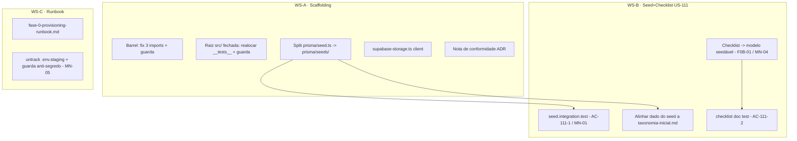

# Fase 0 — Fundação (Design)

**Spec**: `.specs/features/fase-0-fundacao/spec.md`
**Status**: Draft

> **Conformidade com decisões ativas (STATE.md `## Decisions`).** Este design conforma-se a:
> **AD-005/AD-009** (a US que precisa cria sua infra; adapter por `ContentKind`) → justifica não
> scaffoldar `services`/`referrals`/`cv-extraction` agora (A-01). **AD-010** (checklist como fonte
> única configurável, com a troca pelo conteúdo seedado prevista para a Fase 0) → F0B-01 **completa**
> AD-010, não o contradiz. Docs canônicos (`CLAUDE.md`, `project-guideline.md`) são a fonte de verdade
> de conformidade — referenciados, não re-decididos.

---

## Architecture Overview

Três workstreams independentes que compartilham só o pipeline de gates. Sem novo domínio; WS-A e WS-C
são majoritariamente conformidade/documentação, WS-B é o único que toca schema/moderação.



---

## Code Reuse Analysis

### Componentes existentes a alavancar

| Componente | Localização | Como usar |
| ---------- | ----------- | --------- |
| Guarda estática (padrão) | `src/modules/companies/__tests__/no-external-verify.test.ts` | **Modelo** para as 3 guardas novas (`readdirSync`/`readFileSync` recursivo, `expect(offenders).toEqual([])`) |
| Seed atual | `prisma/seed.ts` (`seedRegions`/`seedJobAreas`/`seedServiceCategories` + `seedDemo*`) | Split: referência → `prisma/seeds/reference.ts`; demo → `prisma/seeds/demo.ts`; `main()` orquestra |
| Doc taxonomia canônica | `docs/operacao/taxonomia-inicial.md` | Fonte de verdade do dado do seed (B2) e dos nomes pinados no teste |
| Doc checklist | `docs/operacao/checklist-empresa-fantasma.md` | Ancorado por `tests/docs/checklist-empresa-fantasma.test.ts` (B4); fonte dos itens seedados (B3) |
| Mecanismo checklist | `src/modules/moderation/domain/verification-checklist.ts` | Const `VERIFICATION_CHECKLIST_ITEMS` vira **dado de seed** + fallback; UI passa a ler da fonte seedável |
| Container DI | `src/shared/container.ts` | Registrar o novo port/query da checklist (padrão token→adapter já usado) |
| Clients Supabase | `src/shared/lib/supabase/{browser,server}.ts` | Adicionar `supabase-storage.ts` no mesmo diretório (A4) |
| Docs infra/spikes | `docs/infra/*`, `docs/spikes/*` | Cross-linkados pelo runbook (C1); estados: pooler ✅, turnstile ✅, claude-cv pendente, restore local |
| Config de teste | `vitest.config.ts` (unit), `vitest.integration.config.ts` (integração), `package.json` scripts | Comandos reais de gate (não inventar) |

### Integration Points

| Sistema | Método de integração |
| ------- | -------------------- |
| Prisma `db:seed` | Após split (A3), `package.json`→`prisma.seed` aponta para o novo entrypoint; `npm run db:seed` inalterado no uso |
| Moderação (VerificationPanel) | Passa a consumir a query/port da checklist em vez do literal TS (F0B-01) |
| CI | Guardas rodam em `npm run test`; seed integration em `npm run test:integration` (job e2e, Node 22 — ver MEMORY) |

---

## Approach Exploration (Large — F0B-01 é a única decisão arquitetural real)

Os demais itens de WS-A/WS-C são conformidade mecânica (uma abordagem óbvia cada). A decisão que
merece exploração é **como tornar os itens da checklist "configuráveis sem redeploy" (B-004)**.

**Abordagem 1 (RECOMENDADA) — Modelo Prisma seedável + port de leitura.**
Novo modelo `VerificationChecklistItem` semeado em `prisma/seeds/`, lido pela moderação via query/port
resolvido no container. A const TS atual vira o **dado do seed** e fallback.
*Prós:* satisfaz literalmente B-004 ("conteúdo seedado depois sem redeploy" — troca via seed/DB, sem
build); completa AD-010; guarda F0-MN-04 fica trivial (JSX não contém literais). *Contras:* +1
migração + port/adapter/query + rewire da UI (~escopo médio).

**Abordagem 2 (fallback pragmático) — manter fonte TS única, só desacoplar da UI + guarda.**
Não migra para DB; garante que a UI lê da const única (já o caso) e adiciona a guarda F0-MN-04.
*Prós:* zero migração, menor custo. *Contras:* trocar itens ainda exige **redeploy** → **não**
satisfaz B-004 estritamente; deixa o gate de go-live dependente de deploy.

**Escolha (modo autônomo):** Abordagem 1. É a leitura fiel de B-004/AD-010 e o custo cabe no orçamento
de Fase 0. Registrado como AD-013 proposto (abaixo). Se o Dev Sênior priorizar custo, a Abordagem 2 é
o downgrade explícito — mas então B-004 permanece parcialmente aberto (troca de itens = redeploy).

---

## Components

### Guarda: no-deep-module-imports (F0-MN-02 / F0A-01)
- **Purpose**: Falhar se algum `.ts(x)` sob `src/modules/**` importar `@/modules/<x>/<subpath>`.
- **Location**: `src/__tests__/no-deep-module-imports.test.ts` (co-localizada com a realocação A2)
- **Interfaces**: varre `src/modules`, ignora `__tests__`, regex `from '@/modules/[^']+/[^']+'`, permite
  `@/modules/<x>` puro; **exclui `src/shared/container.ts`** (exceção documentada A-07).
- **Reuses**: padrão de `no-external-verify.test.ts`.

### Guarda: closed-src-root (F0-MN-03 / F0A-02)
- **Purpose**: Falhar se `readdirSync('src')` (dirs) contiver algo além de `app`/`modules`/`shared`.
- **Location**: `src/shared/__tests__/closed-src-root.test.ts`
- **Interfaces**: allowlist `['app','modules','shared']`; ignora arquivos (ex.: `middleware.ts`).
- **Dependency**: a realocação de `src/__tests__/middleware.test.ts` precisa acontecer no mesmo task.

### Guarda: no-committed-secrets (F0-MN-05 / F0C-02)
- **Purpose**: Falhar se algum arquivo **tracked** casar padrão de segredo (senha em URL de pooler,
  `service_role` JWT, `sk-ant-`, chave `re_` real, etc.) — excluindo `.env.example` (dummies).
- **Location**: `src/shared/__tests__/no-committed-secrets.test.ts`
- **Interfaces**: usa `git ls-files` para listar tracked; regexes de segredo; `.env.staging` deve ter
  sido `git rm --cached` no mesmo task para a guarda passar. **RED até untrack + rotação.**

### Seed split (F0A-03)
- **Purpose**: Separar referência (taxonomia — idempotente, prod-safe) de demo (dev-only).
- **Location**: `prisma/seeds/reference.ts`, `prisma/seeds/demo.ts`, `prisma/seed.ts` (entrypoint fino).
- **Reuses**: funções atuais de `seed.ts` movidas 1:1; `main()` chama reference sempre, demo só fora de prod.

### Query/port da checklist (F0B-01)
- **Purpose**: Fornecer os itens da checklist à moderação a partir da fonte seedável.
- **Location**: `src/modules/moderation/queries/list-verification-checklist.ts` (+ port se o padrão do
  módulo exigir); barrel `@/modules/moderation`.
- **Interfaces**: `listVerificationChecklistItems(): Promise<VerificationChecklistItem[]>` (ativos, ordenados).
- **Reuses**: const atual como seed + fallback; container para binding.

### Runbook (F0C-01)
- **Purpose**: Índice único de provisionamento reconciliado.
- **Location**: `docs/infra/fase-0-provisioning-runbook.md`
- **Interfaces**: tabela por serviço (Vercel/Supabase/Resend/Sentry/Turnstile/Anthropic) + restore drill
  + 3 spikes, colunas **estado atual / provisionar manualmente / verificar**, cross-link aos docs existentes.

---

## Data Models

### VerificationChecklistItem (novo — Abordagem 1, F0B-01)

```prisma
model VerificationChecklistItem {
  id         String   @id @default(uuid()) @db.Uuid
  code       String   @unique                 // 'A1','B2','cnpj-ativo'...
  section    String                           // 'A' eliminatório | 'B' presença | 'C' red-flag
  label      String
  guidance   String?                          // "Como verificar"
  isBlocking Boolean  @default(false)          // eliminatório (qualquer reprovado -> rejeitar)
  order      Int
  isActive   Boolean  @default(true)
  createdAt  DateTime @default(now()) @map("created_at") @db.Timestamptz(6)

  @@map("verification_checklist_items")
}
```

**Relationships**: nenhuma FK (dado de referência, como `JobArea`/`ServiceCategory`). Semeado idempotente
por `code` (`@unique`), espelhando o padrão da taxonomia. Conteúdo **definitivo** dos rows = gate go-live
(B-004); o seed inicial usa os itens de `docs/operacao/checklist-empresa-fantasma.md` (A/B/C) + a const atual.

> Não há novo modelo para WS-A/WS-C. Os modelos de taxonomia (`Region`/`JobArea`/`ServiceCategory`) já
> existem com a forma correta (`name @unique`, `is_suggestion default false`, região `is_active`).

---

## Error Handling Strategy

| Cenário | Tratamento | Impacto no usuário |
| ------- | ---------- | ------------------ |
| Seed re-executado | `upsert` por chave `@unique` (idempotente) | Nenhum — contagem estável |
| Query da checklist retorna vazio (tabela não seedada) | Fallback para a const default `VERIFICATION_CHECKLIST_ITEMS` | Moderador vê os itens default; nunca lista vazia |
| Guarda anti-segredo acha match | Teste falha (RED) listando os arquivos ofensores | Dev remove/gira o segredo antes do merge |
| Split do seed quebra `db:seed` | Gate `npm run db:seed` no task A3 confirma entrypoint | — |

---

## Risks & Concerns

| Concern | Localização | Impacto | Mitigação |
| ------- | ----------- | ------- | --------- |
| **Segredo commitado** | `.env.staging` (senha de pooler viva, ref `postgres.fscdicnqotjzsvlzjykk`) | Vazamento de credencial staging | F0C-02: `git rm --cached` + guarda F0-MN-05 + **rotação manual** documentada no runbook (owner external, A-05) |
| Deep-import deliberado do DI | `src/shared/container.ts:~62-129` (20 deep imports) | Guarda de barrel daria falso-positivo | Guarda F0-MN-02 exclui `container.ts`; carve-out documentado na nota de conformidade (A-07/F0A-05) |
| Split do seed acopla WS-A↔WS-B | `prisma/seed.ts` | Dupla-titularidade / ordem de merge | A3 (split) precede B1/B2 (dependência declarada em tasks); demo vs referência separados |
| Mismatch nome de segredo B2 | `env.ts`/`.env.example` usam `B2_APPLICATION_KEY`; workflows usam `B2_APP_KEY` | Backup pode falhar por env ausente | Documentar no runbook (C1) como item de verificação; não é code-fix desta unidade (não bloqueia dev) |
| `env.ts` exige `B2_*` no boot mas `.env.local/.staging` omitem | `src/shared/env.ts:53-55` | Boot local pode falhar sem dummies | Documentar no runbook (C1); fora do escopo de código de Fase-0-fundação |
| Módulos ausentes vs guideline (11 canônicos) | `services`/`referrals`/`cv-extraction` inexistentes; `reporting`/`persons` skeletais | Aparente não-conformidade | Deferimento **documentado** (A-01, AD-005/AD-009) na nota de conformidade — não é gap a fechar agora |
| Mismatch localização de ADR | guideline cita `docs/adr/`; ADRs reais em `docs/arch/0001-0016.md` | Confusão de fonte | Nota de conformidade (F0A-05) fixa a localização real + registra dívida `runbooks/` ausente |

---

## Tech Decisions

| Decisão | Escolha | Racional |
| ------- | ------- | -------- |
| Realização de "configurável" do checklist | Modelo Prisma seedável + port (Abordagem 1) | Satisfaz B-004 literalmente ("sem redeploy"); completa AD-010; guarda F0-MN-04 trivial |
| Scaffolding de módulos ausentes | **Não** fazer; deferir às USPs donas | AD-005/AD-009 (a US cria sua infra); evita colisão de migrations |
| Local do runbook | `docs/infra/fase-0-provisioning-runbook.md` (índice) | Consolida sobre `docs/infra/*` existente; `runbooks/` do guideline = dívida separada |
| Escopo de WS-C | Só documentação + guarda de segredo | Provisionamento real exige credencial/ação manual fora da esteira |
| Padrão das guardas | Estáticas fs-based (modelo `no-external-verify`) | Já é o padrão do projeto; parallel-safe; sem dependência de runtime |

> **AD-013 (proposto — não aplicar agora).** Este design propõe registrar em `.specs/project/STATE.md`
> `## Decisions`, **no kickoff/aprovação** (não pelo Planner): "Fase 0 — Fundação reconcilia a fundação
> aos docs canônicos via guardas estáticas (barrel, raiz fechada, anti-segredo), split do seed
> referência/demo, e migra os itens da checklist de verificação para modelo seedável (completa AD-010);
> módulos canônicos ausentes permanecem deferidos às USPs donas (AD-005/AD-009)." O Planner **não** edita
> STATE.md — a proposta fica aqui para aprovação do Dev Sênior antes do Execute.
