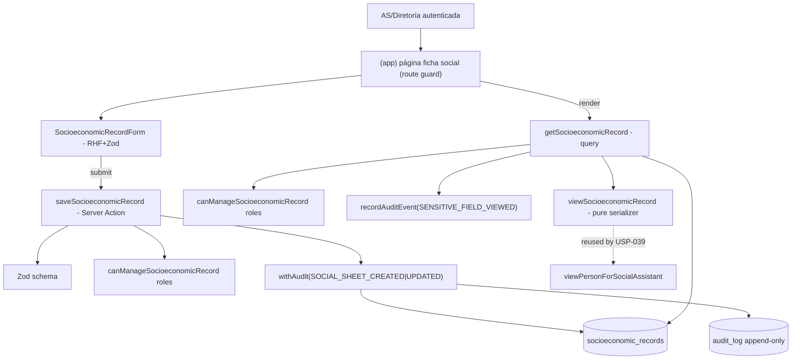

# USP-036 — Ficha socioeconômica (Design)

**Spec**: `.specs/features/ficha-social-encaminhamento/usp-036-ficha-socioeconomica/spec.md`
**Status**: Draft
**Módulo dono**: `persons`

> **Adapt, don't re-derive.** Este design conforma aos artefatos upstream e às decisões
> ativas de projeto:
> - `docs/arch/technical-design.md` §Fase 5 → tabela **`socioeconomic_records`**, View Model **`viewPersonForSocialAssistant`** (nomes pré-comprometidos; adotados).
> - `docs/arch/architecture-document.md` §4.3 + `docs/arch/0012-*` (ADR-0012) → **cripto em repouso = plataforma Supabase** (precedente `candidate_profiles`).
> - `docs/arch/project-guideline.md` §3/§4/§5/§12 → template de módulo, sequência de Server Action sensível, View Models, matriz de teste.
> - **STATE.md `## Decisions` (lido):** conformo a **AD-009** (status/estado na entidade, não `content_items`), **AD-008** (atributo de negócio na linha + evento no `audit_log`), padrão de **guarda de papel inline** para atores AS/diretoria (`register-person-by-assistant.ts`, AD-002/Fase 1). Nenhuma decisão ativa é contrariada → nenhuma AD nova/superseded necessária.

---

## Architecture Overview

Fatia vertical fina no módulo `persons`: um model 1:1 `SocioeconomicRecord` (PK = `personId`),
uma Server Action de escrita (upsert, auditada), uma query de leitura (guarda de papel +
audit-on-read + serializer), e a UI (form + página guardada na área `(app)`). Autorização é
**guarda de papel inline** (`SOCIAL_ASSISTANT`/`BOARD`) — não `PermissionId` delegável. A
criptografia em repouso é fornecida pela plataforma (Supabase), não por código.



**Sequência da Server Action sensível (guideline §4)** — `saveSocioeconomicRecord`:
1. **Zod** `socioeconomicRecordSchema.safeParse` → `VALIDATION`.
2. **Autorização** = `getCurrentPerson()` + `canManageSocioeconomicRecord(operator.roles)` → `UNAUTHENTICATED`/`FORBIDDEN` (guarda de papel inline; substitui `requirePermission`, Assumption #3).
3. **Consentimento** = **N/A** (Assumption #2 — legítimo interesse; Pessoa pode não ter credencial). Documentado, não é passo omitido silenciosamente.
4. **Pré-condições** = Pessoa-alvo existe (`NOT_FOUND` se não). **Não** exige Pessoa ativa (edge case: edita ficha de Pessoa inativa).
5. **`withAudit`** `SOCIAL_SHEET_CREATED` (1ª vez) ou `SOCIAL_SHEET_UPDATED` (edição), com `upsert` na mesma tx; `actorPersonId`/`actorUserId`/`ip`/`userAgent` no `AuditContext`.

Retorno sempre `ActionResult<T>` (`shared/errors.ts`), nunca `throw`.

---

## Code Reuse Analysis

### Existing Components to Leverage

| Component | Location | How to Use |
|---|---|---|
| Padrão de ator AS/diretoria + guarda de papel inline | `src/modules/identity/actions/register-person-by-assistant.ts` (`canRegisterAssisted`) | Espelhar em `canManageSocioeconomicRecord(roles)` p/ `SOCIAL_ASSISTANT`/`BOARD`. |
| `withAudit` / `recordAuditEvent` | `src/modules/audit/withAudit.ts` (barrel `@/modules/audit`) | Envolver o upsert; registrar `SENSITIVE_FIELD_VIEWED` na leitura. |
| Catálogo de eventos | `src/modules/audit/events.ts` (`AuditEvent`, SCREAMING_SNAKE) | Adicionar `SOCIAL_SHEET_CREATED`/`SOCIAL_SHEET_UPDATED`; reusar `SENSITIVE_FIELD_VIEWED`. |
| `getCurrentPerson()` | `src/modules/identity` (barrel) | Obter operador + roles (ADR-0030, revalidação por requisição). |
| `ActionResult<T>` / `ok` / `fail` | `src/shared/errors.ts` | Retorno de action/query. |
| Padrão profile 1:1 com Person | `CandidateProfile`/`ProviderProfile`/`ClientProfile` (`prisma/schema.prisma`) | `SocioeconomicRecord` com `personId String @id`, relação `onDelete: Cascade`, `@@map`. |
| View Model serializer puro (sem IO) | `src/modules/persons/views/view-candidate-for-employer.ts` | Espelhar em `viewSocioeconomicRecord` (Row estruturalmente só com campos da ficha). |
| Stub de omissão p/ coordenador | `src/modules/persons/views/view-person-for-staff.ts` (já cita "sem ficha social, USP-036/P-006") | Referência do inverso que a USP-039 fará; nada a mudar aqui. |
| Prisma singleton | `src/shared/lib/prisma` | Query de leitura. |
| Primitivas de UI | `@/shared/ui` (Input/Label/Textarea/Select/Button/FormCard…, AD-014) | Montar o form. |
| Guarda de rota autenticada | páginas `(app)` existentes (ex. moderação/perfil) + `getCurrentPerson()` | Guardar a página da ficha. |

### Integration Points

| System | Integration Method |
|---|---|
| `Person` (persons) | Relação 1:1 `Person.socioeconomicRecord`; FK `person_id` `onDelete: Cascade`. |
| `audit_log` (audit) | Escrita via `withAudit` (alteração) + `SENSITIVE_FIELD_VIEWED` (acesso). Append-only (REVOKE UPDATE/DELETE no DB). |
| Supabase Postgres | Criptografia em repouso gerenciada (plataforma) — satisfaz AC-036-4 (config, não código). |
| USP-039 (downstream) | `viewSocioeconomicRecord` + `getSocioeconomicRecord` compõem `viewPersonForSocialAssistant`, que omitirá os campos p/ `COORDINATOR`. |

---

## Components

### `canManageSocioeconomicRecord` (domain guard)
- **Purpose**: Regra pura de autorização de papel para a ficha (ver+editar).
- **Location**: `src/modules/persons/domain/socioeconomic-record.ts`
- **Interfaces**:
  - `canManageSocioeconomicRecord(roles: Role[]): boolean` — `true` sse contém `SOCIAL_ASSISTANT` ou `BOARD`.
  - Tipos/labels de domínio `IncomeBracket`, `HousingSituation` (derivados dos enums Prisma) + helper `isEmptyRecord(view)`.
- **Dependencies**: `Role` (enum Prisma).
- **Reuses**: forma de `canRegisterAssisted` (identity).

### `socioeconomicRecordSchema` (Zod)
- **Purpose**: Validar o input dos 4 campos (todos opcionais; formato/limites quando presentes).
- **Location**: `src/modules/persons/schemas/socioeconomic-record.schema.ts`
- **Interfaces**: `socioeconomicRecordSchema` → `{ personId: uuid, incomeBracket?: IncomeBracket, socialBenefit?: string(≤200), housingSituation?: HousingSituation, familyComposition?: string(≤500) }`. Strings sofrem `trim`; vazio → `undefined`/`null`.
- **Reuses**: convenção dos schemas de `persons/schemas/*`.

### `saveSocioeconomicRecord` (Server Action)
- **Purpose**: Upsert (criar/editar) a ficha de uma Pessoa, auditado.
- **Location**: `src/modules/persons/actions/save-socioeconomic-record.ts` (`'use server'`)
- **Interfaces**: `saveSocioeconomicRecord(input): Promise<ActionResult<{ personId: string }>>`.
- **Dependencies**: Zod schema, `canManageSocioeconomicRecord`, `getCurrentPerson`, `withAudit`, Prisma.
- **Reuses**: sequência canônica de `register-person-by-assistant.ts`; eventos do catálogo.
- **Notas**: `upsert` por `personId` (1:1) → `SOCIAL_SHEET_CREATED` no create, `SOCIAL_SHEET_UPDATED` no update (detectar existência dentro da tx). `audit.after` com PII **minimizada** (`normalizeJson` já redige; não gravar valores sensíveis em claro no `after` — registrar apenas os nomes de campos alterados / flags de presença, não os valores).

### `getSocioeconomicRecord` (query)
- **Purpose**: Ler a ficha para exibição, restrita a AS/BOARD, com audit-on-read.
- **Location**: `src/modules/persons/queries/get-socioeconomic-record.ts`
- **Interfaces**: `getSocioeconomicRecord(personId: string): Promise<ActionResult<SocioeconomicRecordView | null>>` (`null` = Pessoa sem ficha ainda).
- **Dependencies**: `getCurrentPerson`, `canManageSocioeconomicRecord`, Prisma (`select` explícito), `recordAuditEvent(SENSITIVE_FIELD_VIEWED)`, `viewSocioeconomicRecord`.
- **Reuses**: padrão de query com `select` + `take` (guideline). Guarda de papel **antes** do `SELECT` (MN-01: não carregar os campos p/ não-autorizado).

### `viewSocioeconomicRecord` (View Model / serializer puro)
- **Purpose**: Moldar a Row da ficha em `SocioeconomicRecordView` (sem IO, sem Prisma).
- **Location**: `src/modules/persons/views/view-socioeconomic-record.ts`
- **Interfaces**: `viewSocioeconomicRecord(row: SocioeconomicRow): SocioeconomicRecordView`.
- **Reuses**: `view-candidate-for-employer.ts` (Row estruturalmente só com campos da ficha → impossível vazar cross-Person).

### `SocioeconomicRecordForm` (Client Component)
- **Purpose**: Formulário dos 4 campos (AC-036-1) com RHF + Zod.
- **Location**: `src/modules/persons/components/socioeconomic-record-form.tsx`
- **Interfaces**: props `{ personId, initial?: SocioeconomicRecordView }`; on submit → `saveSocioeconomicRecord`.
- **Reuses**: `@/shared/ui` (AD-014). Select p/ `IncomeBracket`/`HousingSituation`, Input/Textarea p/ benefício/composição.
- **Nota carve-out client/server (ADR-0017):** o Client Component **não** importa o barrel `@/modules/persons` inteiro (arrasta Prisma/`next/headers`). Importa a action por caminho consciente + tipos/labels de enum duplicados localmente se necessário (precedente `EDUCATION_LEVELS`, AD-019). A guarda `no-deep-module-imports` pode exigir escape-hatch pinado — seguir o precedente dos forms de candidato/prestador.

### Ficha social — página `(app)`
- **Purpose**: Rota autenticada AS/diretoria que renderiza a ficha de uma Pessoa.
- **Location**: `src/app/(app)/social/pessoas/[personId]/ficha/page.tsx` *(caminho proposto; ajustar à convenção de rotas de gestão de Pessoa da USP-002 se já existir uma área AS)*.
- **Interfaces**: Server Component `force-dynamic`; guarda `getCurrentPerson()` + `canManageSocioeconomicRecord` → `notFound()`/redirect se não-autorizado (MN-01 na rota); carrega `getSocioeconomicRecord`; renderiza `SocioeconomicRecordForm`.
- **Reuses**: layout `(app)`, primitivas UI.

---

## Data Models

### `SocioeconomicRecord` (Prisma — tabela `socioeconomic_records`)

```prisma
enum IncomeBracket {
  NO_INCOME
  UP_TO_1_MW
  FROM_1_TO_2_MW
  FROM_2_TO_3_MW
  ABOVE_3_MW
  UNDECLARED
  @@map("income_bracket")
}

enum HousingSituation {
  OWNED
  RENTED
  GRANTED
  FAMILY
  HOMELESS
  OTHER
  @@map("housing_situation")
}

model SocioeconomicRecord {
  personId          String            @id @map("person_id") @db.Uuid
  person            Person            @relation(fields: [personId], references: [id], onDelete: Cascade)

  // Campos declarados sensíveis (LGPD). Cripto em repouso = plataforma Supabase (ADR-0012);
  // em claro no nível SQL — acesso restrito por papel (MN-01) + auditoria (MN-02) são os controles.
  incomeBracket     IncomeBracket?    @map("income_bracket")
  socialBenefit     String?           @map("social_benefit")        // texto declarado; null = não recebe/não declarado
  housingSituation  HousingSituation? @map("housing_situation")
  familyComposition String?           @map("family_composition")     // texto/número declarado (sem entidade Família)

  // Conveniência de "última alteração" (histórico autoritativo = audit_log, AD-008).
  updatedByPersonId String?           @map("updated_by_person_id") @db.Uuid
  createdAt         DateTime          @default(now()) @map("created_at") @db.Timestamptz(6)
  updatedAt         DateTime          @updatedAt @map("updated_at") @db.Timestamptz(6)

  @@map("socioeconomic_records")
}
```

E em `model Person`: `socioeconomicRecord SocioeconomicRecord?`.

**Migration:** `usp036_socioeconomic_record` (cria os 2 enums + tabela + FK). Sem SQL bruto
(sem índice parcial/extensão). `personId` é PK e FK → garante 1 ficha por Pessoa (AC-036-2)
sem índice adicional.

**Relationships**: 1:1 com `Person` (PK = FK). `onDelete: Cascade` (some com a Pessoa se ela
for hard-deleted; no MVP Pessoas são inativadas, não deletadas — histórico via audit_log).

### `SocioeconomicRecordView` (tipo de saída — sem campos cross-Person)

```typescript
type SocioeconomicRecordView = {
  personId: string
  incomeBracket: IncomeBracket | null
  socialBenefit: string | null
  housingSituation: HousingSituation | null
  familyComposition: string | null
  updatedAt: Date | null
  updatedByPersonId: string | null
}
```

---

## Error Handling Strategy

| Error Scenario | Handling | User Impact |
|---|---|---|
| Input inválido (enum/limite) | Zod → `fail('VALIDATION', …, fieldErrors)` | Mensagem PT-BR por campo no form. |
| Sessão ausente/expirada | `fail('UNAUTHENTICATED', …)` | Redireciona ao login. |
| Papel não AS/BOARD (MN-01) | `fail('FORBIDDEN', …)` **sem** carregar/retornar campos sensíveis; opcional audit de negação | Acesso negado; nada da ficha exibido. |
| Pessoa inexistente | `fail('NOT_FOUND', …)` | "Pessoa não encontrada". |
| Falha ao gravar/auditar | `withAudit` roda em tx → rollback conjunto (MN-02) | Erro genérico; nada persistido. |
| Pessoa inativa | Permitido (edge case) — sem bloqueio | Edição normal; histórico preservado. |

---

## Risks & Concerns

| Concern | Location | Impact | Mitigation |
|---|---|---|---|
| **Gap residual de cripto** — dados em claro no nível SQL; leitor autorizado do DB (service_role) / dump pré-cifra de backup vê renda/benefício/moradia. | `socioeconomic_records` (todas colunas sensíveis) | Exposição LGPD se credencial de DB vazar. | (1) Acesso restrito por papel na app (MN-01, defesa em profundidade); (2) auditoria de acesso/alteração (MN-02 + `SENSITIVE_FIELD_VIEWED`); (3) backup já é AES-256-CBC (ADR-0006); (4) **flag ao dono**: upgrade p/ cripto de coluna (pgcrypto/AES app-side + chave em `shared/env.ts`) é decisão de **arquitetura/diretoria** (arch-doc §4.3 "se decidido") — follow-up documentado, fora do escopo desta USP. |
| **Vazamento RSC/Flight** — carregar a Row sensível num Server Component cujo payload chega a cliente não-autorizado (lição de projeto "anonimizar no View Model não basta"). | query + página | Campo sensível serializado no payload Flight. | Guarda de papel **antes** do `SELECT`; página só renderiza p/ AS/BOARD (route guard); `select` explícito; serializer estruturalmente sem cross-Person. Testes negativos MN-01 em action, query e rota. |
| **`audit.after` com valor sensível em claro** | `saveSocioeconomicRecord` | Renda/benefício em claro no `audit_log` (alto volume, retenção longa). | Não gravar valores sensíveis no `before/after`; registrar só nomes de campos alterados/flags de presença. `normalizeJson` redige, mas não confiar nele p/ estes campos. |
| **Carve-out client/server (ADR-0017)** — form (Client) importar barrel `@/modules/persons` quebra o build. | `socioeconomic-record-form.tsx` | Build falha (Prisma no bundle client). | Seguir precedente dos forms de candidato/prestador (import consciente + guard `no-deep-module-imports` com escape-hatch pinado, se necessário). |

> Nenhum outro concern relevante encontrado nos caminhos que a feature toca.

---

## Tech Decisions (only non-obvious ones)

| Decision | Choice | Rationale |
|---|---|---|
| Cripto em repouso (AC-036-4) | Plataforma Supabase (gerenciada), não coluna/app-side | Precedente `candidate_profiles`/ADR-0012; arch-doc §4.3 deixa coluna "se decidido". Não introduzir mecanismo net-new. Gap residual flagado (Assumption #1). |
| Autorização | Guarda de papel inline `SOCIAL_ASSISTANT`/`BOARD` | Ficha é capacidade intrínseca de papel, não delegável — não entra no catálogo `PermissionId` (Assumption #3; precedente `register-person-by-assistant`). |
| Consentimento | N/A (legítimo interesse) | Pessoa sem credencial não consente; edge case permite ficha p/ sem-credencial (Assumption #2). |
| Model 1:1 | PK = `personId` (FK), sem índice extra | Garante unicidade da ficha; espelha `CandidateProfile`/`ProviderProfile`. |
| Estado na entidade | Colunas na própria tabela (não `content_items`) | AD-009. |
| Última alteração | `updatedByPersonId`/`updatedAt` na linha + histórico completo no `audit_log` | AD-008 (atributo consultável na linha; evento na auditoria). |
| Renda/moradia | Enums (`IncomeBracket`/`HousingSituation`) | Estruturado, consultável p/ relatórios; "aproximada" ⇒ faixa (Assumptions #5/#6). |

> **Project-level:** nenhuma decisão desta USP fixa convenção nova de projeto que exija AD-NNN
> em STATE.md — todas conformam a decisões ativas (AD-009/AD-008) ou a precedentes de Fase 1.
> Se a diretoria decidir cripto de coluna (Assumption #1), isso **será** um AD/ADR novo (fora desta USP).
