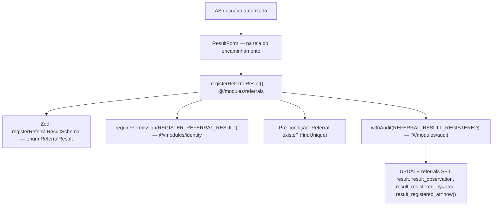

# USP-038 — Registrar resultado do encaminhamento — Design

**Spec**: `./spec.md`
**Status**: Draft
**Design do agregado (fonte)**: `../usp-037-encaminhar-vaga/design.md` — o model `Referral`,
o enum `ReferralResult` e as colunas de resultado (`result`, `resultObservation`,
`resultRegisteredBy`, `resultRegisteredAt`, todas **nullable**) já foram definidos e
**migrados pela USP-037**. Esta USP **não adiciona migração** — só escreve nessas colunas.

---

## Constraints do projeto (STATE.md `## Decisions` — conformidade)

- **CLAUDE.md** — sequência de Server Action sensível: Zod → `requirePermission` →
  (`requireActiveConsent` **N/A** aqui — ver spec) → pré-condições (referral existe) →
  `withAudit(REFERRAL_RESULT_REGISTERED)`. `ActionResult<T>`, nunca `throw`. → **Conformado.**
- **AD-009 / status-na-entidade**: o resultado é um atributo da própria entidade `Referral`
  (não `content_items`), coerente com o padrão do projeto. → **Conformado.**
- **technical-design §2.7**: `result ReferralResult?`, `resultObservation`, `resultRegisteredBy`,
  `resultRegisteredAt` — concretizados na USP-037; aqui apenas escritos. **Nada re-decidido.**

**Nenhum AD superseeded.**

---

## Architecture Overview

Sequência: `registerReferralResult({ referralId, result, observation? })` → Zod (enum) →
`requirePermission('REGISTER_REFERRAL_RESULT')` → `findUnique(referral)` (NOT_FOUND se ausente) →
`withAudit(REFERRAL_RESULT_REGISTERED)` tx: `UPDATE` set `result`, `resultObservation`,
`resultRegisteredBy = actor.id`, `resultRegisteredAt = now()` → `ActionResult.ok`.

---

## Code Reuse Analysis

### Existing Components to Leverage

| Component | Location | How to Use |
|---|---|---|
| `requirePermission(id)` | `identity/server/require-permission.ts` | Gate RBAC. `REGISTER_REFERRAL_RESULT` **já existe** (intrínseco COORDINATOR/SOCIAL_ASSISTANT + delegável) — **nenhum add**. |
| `withAudit(REFERRAL_RESULT_REGISTERED)` | `audit/withAudit.ts` (barrel) | Evento **já existe** no catálogo (`events.ts:108`). |
| `ReferralResult` enum | Prisma (migrado na USP-037) + `@prisma/client` | Fonte do `z.nativeEnum`/`z.enum` do Zod e da coluna. |
| `Referral` model + colunas de resultado | Prisma (migrado na USP-037) | Alvo do `UPDATE`. |
| `ActionResult` / `fail`/`ok` | `shared/errors.ts` | Retorno; nunca `throw`. |
| Padrão de action sensível | `moderation/actions/inactivate.ts`, `apply-to-job.ts` | Molde da sequência Zod→permissão→precondição→withAudit. |
| Módulo `referrals` + barrel | `src/modules/referrals` (criado na USP-037) | Nova action + schema entram aqui. |

### Integration Points

| System | Integration Method |
|---|---|
| `@/modules/identity` | `requirePermission('REGISTER_REFERRAL_RESULT')`. |
| `@/modules/audit` | `withAudit(REFERRAL_RESULT_REGISTERED)`. |
| Prisma (`referrals`) | `UPDATE` nas colunas de resultado (já existentes). **Sem migração.** |

---

## Components

### `registerReferralResult` (Server Action) — USP-038
- **Purpose**: registrar/atualizar o resultado de um `Referral` existente, com proveniência.
- **Location**: `src/modules/referrals/actions/register-referral-result.ts` (`'use server'`, export no barrel)
- **Interface**: `registerReferralResult(input: RegisterReferralResultInput): Promise<ActionResult<{ referralId: string }>>`
- **Sequência** (sensível — CLAUDE.md):
  1. **Zod** `registerReferralResultSchema.safeParse` → `VALIDATION` (enum restrito → REF38-MN-01).
  2. **RBAC** `requirePermission('REGISTER_REFERRAL_RESULT')` → `UNAUTHENTICATED`/`FORBIDDEN` (REF38-MN-02).
  3. **Pré-condição**: `prisma.referral.findUnique({ where:{ id: referralId }, select:{ id:true } })` → ausente → `NOT_FOUND` (EC-1).
  4. **`withAudit(REFERRAL_RESULT_REGISTERED)`** tx: `tx.referral.update({ where:{ id }, data:{ result, resultObservation: observation ?? null, resultRegisteredBy: actor.id, resultRegisteredAt: new Date() } })`; set `audit.entityType='REFERRAL'`, `audit.entityId=id`, `audit.before`/`audit.after` (result anterior→novo). Proveniência sempre setada (REF38-MN-03).
  5. **Map de erro**: nunca `throw`; falha inesperada → `INTERNAL`.
- **Reuses**: `requirePermission`, `withAudit`, padrão de action sensível.

### Zod schema — `registerReferralResultSchema`
- **Location**: `src/modules/referrals/schemas/referral.schema.ts` (co-existe com `createReferralSchema` da USP-037)
- **Shape**: `z.object({ referralId: z.string().uuid(), result: z.nativeEnum(ReferralResult), observation: z.string().trim().max(2000).optional() })`.
  - `z.nativeEnum(ReferralResult)` garante o enum restrito (REF38-MN-01) — valor fora do enum → falha Zod → `VALIDATION`.

### `ResultForm` — UI (fatia vertical fina)
- **Purpose**: seletor de resultado + observação, na tela do encaminhamento.
- **Location**: `src/modules/referrals/components/result-form.tsx` (embutido na página/detalhe do encaminhamento; a página base é a de encaminhamentos criada na USP-037 / ou consumida pela USP-039)
- **Comportamento**: `Select` com os 4 valores (rótulos PT-BR: "Contratado"/"Não selecionado"/"Em análise"/"Sem resposta") + `Textarea` de observação; submit → `registerReferralResult`; erros PT-BR. Guardado por `REGISTER_REFERRAL_RESULT` server-side.
- **Reuses**: `@/shared/ui` (Design System AD-014: `Select`/`Textarea`/`Button`).

---

## Error Handling Strategy

| Error Scenario | Handling | User Impact (PT-BR) |
|---|---|---|
| Enum inválido / input Zod inválido | `fail('VALIDATION', …)` | "Resultado inválido." |
| Sem permissão | `requirePermission` → `FORBIDDEN`/`UNAUTHENTICATED` | "Você não tem permissão para registrar o resultado." |
| `referralId` inexistente | `fail('NOT_FOUND', …)` | "Encaminhamento não encontrado." |
| Falha inesperada | `fail('INTERNAL', …)`; rollback; nunca `throw` | "Erro ao registrar o resultado." |

---

## Risks & Concerns

| Concern | Location | Impact | Mitigation |
|---|---|---|---|
| Re-registro sobrescreve resultado anterior sem histórico na tabela | `register-referral-result.ts` | Perda do resultado anterior na linha | Aceito (assumption). O **audit_log** (`before`/`after` do `REFERRAL_RESULT_REGISTERED`) preserva o histórico de cada registro (ADR-0023). |
| Enum garantido só no Zod poderia ser burlado por chamada direta | `registerReferralResultSchema` | Valor inválido persistido | Defesa dupla: `z.nativeEnum` + a **coluna enum `referral_result` no Postgres** (migrada na USP-037) rejeita valor fora do domínio. Negative test exercita ambos. |

> Nenhum concern de código pré-existente novo além dos acima.

---

## Tech Decisions (não-óbvias)

| Decision | Choice | Rationale |
|---|---|---|
| Sem migração nesta USP | Reusar colunas nullable da USP-037 | Agregado planejado coeso; USP-038 é puramente comportamental. |
| Resultado mutável | Permitir re-registro (overwrite + refresh de autor/data) | Acompanhamento evolui; MP9 lê o estado corrente; histórico no audit_log. |
| Sem `requireActiveConsent` | Passo N/A | Ação interna institucional; não age em nome da Pessoa sob finalidade. |
| Enum defense-in-depth | Zod `nativeEnum` + coluna enum PG | REF38-MN-01 provado nas duas camadas. |
