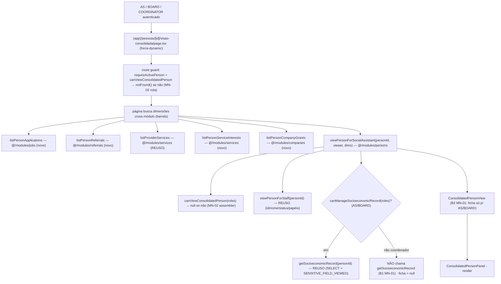

# USP-039 — Visão consolidada da Pessoa (Design)

**Spec**: `./spec.md`
**Status**: Draft
**Módulo dono do View Model**: `persons`

> **Adapt, don't re-derive.** Este design conforma aos artefatos upstream e às decisões ativas:
> - `docs/arch/technical-design.md` §Fase 5 → View Model **`viewPersonForSocialAssistant`** (nome pré-comprometido; adotado) e o enum `Role`.
> - `docs/arch/project-guideline.md` §5 (View Models de privacidade — nunca Prisma cru p/ retornar dados de uma Pessoa a outra) + §12 (matriz de teste).
> - **STATE.md `## Decisions` (lido):** **AD-017/018** (View Model de privacidade 2-barreiras — `select` restrito + strip), **AD-019** (lição de import circular: barrel `@/modules/persons` arrasta Prisma → **`persons` não importa outros barrels de domínio**), **AD-020** (privacidade de serviços; `listProviderServices(personId)` reusável). **STATE.md `## Lessons` / memória** — "Anonimizar no View Model não basta (RSC/Flight)": a *row crua* vaza no payload Flight; **SELECT condicional ao papel**, não carregar campo restrito p/ quem não pode ver. Esta é a barreira B1 do MN-01.
> - Nenhuma decisão ativa é contrariada → **nenhum AD novo/superseded**. As decisões de agregado do `Referral` (módulo `referrals`, colunas de resultado) já foram fixadas pela USP-037 (a consolidar como AD pelo orquestrador).

---

## Architecture Overview

USP-039 é **agregação somente-leitura, crítica de privacidade**. Não há migração (todos os models
existem). O núcleo é o assembler **`viewPersonForSocialAssistant`** em `persons`, **fonte única de
anonimização** (AC-039-4), que:

1. **Guarda** o viewer (`canViewConsolidatedPerson(roles)`) → `null` se não autorizado (defesa em
   profundidade; a rota já negou).
2. Compõe a **identidade** via `viewPersonForStaff` (persons, reuso).
3. **Gate da ficha (barreira B1 do MN-01):** só chama `getSocioeconomicRecord(personId)` (persons,
   reuso — já role-gated + audit-on-read) **quando** `canManageSocioeconomicRecord(roles)`
   (AS/BOARD). Para coordenador, **não chama** → os campos sensíveis **nunca são SELECIONADOS** →
   não entram no payload RSC/Flight.
4. Recebe as **dimensões cross-módulo** já buscadas (candidaturas, encaminhamentos, serviços,
   manifestações, vínculos) como **input tipado** — `persons` **não importa** os barrels
   `jobs`/`referrals`/`services`/`companies` (evita ciclo, lição AD-019). A **página `(app)`**
   (raiz de composição) faz os fetches e passa ao assembler.
5. Monta o `ConsolidatedPersonView`, onde `ficha` existe **apenas** para AS/BOARD (barreira B2 do
   MN-01: strip estrutural).



**Fronteira de módulo (crítica).** `persons` é *sink*: o assembler importa **apenas** o próprio read
da ficha + `viewPersonForStaff` + as guardas de domínio. As 5 dimensões cross-módulo entram como
input. Assim `persons` **não** ganha dependência de `jobs`/`referrals`/`services`/`companies` (que já
dependem de `persons`) → sem ciclo.

---

## Code Reuse Analysis

### Existing Components to Leverage

| Component | Location | How to Use |
|---|---|---|
| `getSocioeconomicRecord(personId)` (role-gated + audit-on-read) | `src/modules/persons/queries/get-socioeconomic-record.ts` | **Reuso direto** — a leitura da ficha (barreira B1: guarda ANTES do SELECT; grava `SENSITIVE_FIELD_VIEWED`). Chamado **só** para AS/BOARD. |
| `viewSocioeconomicRecord` / `SocioeconomicRecordView` | `src/modules/persons/views/view-socioeconomic-record.ts` | Tipo da dimensão ficha no `ConsolidatedPersonView`. |
| `canManageSocioeconomicRecord(roles)` / `SOCIOECONOMIC_RECORD_ROLES` | `src/modules/persons/domain/socioeconomic-record.ts` | Gate da ficha (AS/BOARD) dentro do assembler. **Não re-implementar.** |
| `viewPersonForStaff(personId)` / `StaffPersonView` | `src/modules/persons/views/view-person-for-staff.ts` | Dimensão "dados pessoais + papéis ativos" (id/nome/status/papéis/inativação). |
| `listProviderServices(personId)` / `ProviderServiceRow` | `src/modules/services/queries/list-provider-services.ts` | **Reuso direto** — dimensão "serviços oferecidos" (já escopado por `authorPersonId`, `take` 100). |
| Guarda de papel de painel consolidado (precedente) | `src/modules/reporting/actions/access-report.ts` (`ACCESS_REPORT_ROLES=['SOCIAL_ASSISTANT','BOARD','COORDINATOR']`) + `src/modules/reporting/views/access-report.view.ts` (`viewPersonForAccessReport`, ADR-0010) | **Padrão a espelhar** em `canViewConsolidatedPerson` e no assembler (consolidação de Pessoa via View Model tipado). |
| `getCurrentPerson` / `requireActivePerson` / `CurrentPerson.roles` | `src/modules/identity` (barrel) | Sessão + papéis na rota (ADR-0030). |
| Layout guard `(app)` | `src/app/(app)/layout.tsx` (`force-dynamic` + `requireActivePerson`) | Base da rota. |
| Padrão de rota role-gate → `notFound()` | `src/app/(app)/pessoas/[id]/ficha-social/page.tsx`, `src/app/(app)/pessoas/[id]/page.tsx` | Guarda da nova página (nega voluntário, não revela existência). |
| Padrão de read 2-barreiras (`select satisfies Prisma.*Select` + View strip) | `src/modules/jobs/queries/list-job-applicants.ts`, `src/modules/services/queries/list-provider-interests.ts` | Molde dos 4 reads novos (nunca SELECIONAR PII de terceiros). |
| `withAudit`/`recordAuditEvent` + `SENSITIVE_FIELD_VIEWED` | `src/modules/audit` (barrel) | Já disparado por `getSocioeconomicRecord`; nada novo. |
| `ActionResult<T>`/`ok`/`fail` | `src/shared/errors.ts` | Retorno dos reads (quando gated). Reads de dimensão não-sensível podem retornar arrays diretos (precedente `listProviderServices`). |
| Primitivas UI (AD-014) | `@/shared/ui` (`Card`/`Badge`/`FormCard`/…) | Painel de exibição. |

### Integration Points

| System | Integration Method |
|---|---|
| `@/modules/jobs` | A **página** importa `listPersonApplications` (novo) via barrel. |
| `@/modules/referrals` | A **página** importa `listPersonReferrals` (novo) via barrel (o módulo ganha um dir `queries/`, hoje inexistente). |
| `@/modules/services` | A **página** importa `listProviderServices` (reuso) + `listPersonServiceInterests` (novo) via barrel. |
| `@/modules/companies` | A **página** importa `listPersonCompanyGrants` (novo) via barrel. |
| `@/modules/persons` | A **página** importa `viewPersonForSocialAssistant` (novo) via barrel. `persons` **não** importa os demais. |
| `audit_log` | `SENSITIVE_FIELD_VIEWED` via a leitura reusada da ficha (AS/BOARD). |
| Prisma | Só leitura (`select`/`take`); **sem migração**. |

---

## Components

### `canViewConsolidatedPerson` (domain guard) — NOVO, em `persons`
- **Purpose**: regra pura de autorização de papel para abrir o painel consolidado.
- **Location**: `src/modules/persons/domain/consolidated-person.ts` (+ barrel)
- **Interfaces**:
  - `export const CONSOLIDATED_PERSON_ROLES = ['SOCIAL_ASSISTANT','BOARD','COORDINATOR'] as const`
  - `canViewConsolidatedPerson(roles: readonly string[]): boolean` — `true` sse contém algum de `CONSOLIDATED_PERSON_ROLES`.
- **Reuses**: forma de `SOCIOECONOMIC_RECORD_ROLES`/`canManageSocioeconomicRecord`; valor idêntico a `ACCESS_REPORT_ROLES` (reporting).
- **Nota**: a ficha permanece gated por `canManageSocioeconomicRecord` (AS/BOARD) — coordenador passa neste guard mas **não** no da ficha.

### `viewPersonForSocialAssistant` (assembler / View Model) — NOVO, em `persons`
- **Purpose**: montar o painel consolidado, **fonte única de anonimização** (AC-039-4), com o gate da ficha (B1+B2 do MN-01).
- **Location**: `src/modules/persons/views/view-person-for-social-assistant.ts` (+ barrel)
- **Interface**:
  ```typescript
  export interface ConsolidatedExternalDimensions {
    applications: PersonApplicationRow[];       // @/modules/jobs
    referrals: PersonReferralRow[];             // @/modules/referrals
    servicesOffered: ProviderServiceRow[];      // @/modules/services (reuso)
    serviceInterests: PersonServiceInterestRow[]; // @/modules/services (novo)
    companyGrants: PersonCompanyGrantRow[];     // @/modules/companies
  }
  export interface ConsolidatedPersonView {
    person: StaffPersonView;                    // dados pessoais + papéis ativos
    ficha: SocioeconomicRecordView | null;      // presente SÓ p/ AS/BOARD (B2); null p/ coordenador / sem-registro
    applications: PersonApplicationRow[];
    referrals: PersonReferralRow[];
    servicesOffered: ProviderServiceRow[];
    serviceInterests: PersonServiceInterestRow[];
    companyGrants: PersonCompanyGrantRow[];
  }
  export async function viewPersonForSocialAssistant(
    personId: string,
    viewer: { roles: readonly string[] },
    dimensions: ConsolidatedExternalDimensions,
  ): Promise<ConsolidatedPersonView | null>;
  ```
  *(As dimensões cross-módulo entram como `dimensions` — evita `persons`→outros barrels, Assumption #5. Os tipos `Person*Row` são reexportados pelos barrels dos módulos donos e importados aqui como **tipos** — import type-only não cria ciclo de runtime; se o lint reclamar, duplicar a forma do tipo localmente, precedente `EDUCATION_LEVELS`/AD-019.)*
- **Sequência**:
  1. `if (!canViewConsolidatedPerson(viewer.roles)) return null;` (MN-02, defesa em profundidade).
  2. `const person = await viewPersonForStaff(personId); if (!person) return null;` (Pessoa inexistente → `null`).
  3. **B1 (MN-01):** `const ficha = canManageSocioeconomicRecord(viewer.roles) ? ((await getSocioeconomicRecord(personId)).ok ? <unwrap>.data : null) : null;` — para coordenador o read **não é chamado**.
  4. Retorna `{ person, ficha, ...dimensions }` (B2: `ficha` só populada no ramo AS/BOARD).
- **Dependencies (persons-internas apenas)**: `canViewConsolidatedPerson`, `viewPersonForStaff`, `canManageSocioeconomicRecord`, `getSocioeconomicRecord`, `viewSocioeconomicRecord` (tipo).
- **Reuses**: precedente `viewPersonForAccessReport` (reporting) para a forma "consolidação tipada de Pessoa".

### `listPersonApplications` (read query) — NOVO, em `jobs`
- **Purpose**: candidaturas (ativas e históricas) de uma Pessoa, para o painel.
- **Location**: `src/modules/jobs/queries/list-person-applications.ts` (+ barrel)
- **Interface**: `listPersonApplications(personId: string): Promise<PersonApplicationRow[]>`
  - `PersonApplicationRow = { id; jobId; jobTitle: string; companyName: string; appliedAt: Date; cancelledAt: Date | null; active: boolean; viaEncaminhamento: boolean }` (`active = cancelledAt === null`; "histórica" = `cancelledAt != null`).
- **Detalhes**: `where: { candidatePersonId: personId }`; `select` restrito — `id, appliedAt, cancelledAt, viaEncaminhamento, job:{ title, company:{ nomeFantasia } }` (**nunca** PII); `orderBy: [{ cancelledAt: 'asc' }, { appliedAt: 'desc' }]`; `take: 50`.
- **Reuses**: molde de `list-job-applicants.ts` (`select satisfies Prisma.ApplicationSelect`), mas escopado por `candidatePersonId` (direção inversa).

### `listPersonReferrals` (read query) — NOVO, em `referrals` (cria `queries/`)
- **Purpose**: encaminhamentos recebidos por uma Pessoa + resultado.
- **Location**: `src/modules/referrals/queries/list-person-referrals.ts` (+ barrel)
- **Interface**: `listPersonReferrals(personId: string): Promise<PersonReferralRow[]>`
  - `PersonReferralRow = { id; jobId; jobTitle: string; companyName: string; referrerName: string; justification: string | null; result: ReferralResult | null; resultObservation: string | null; resultRegisteredAt: Date | null; createdAt: Date }`.
- **Detalhes**: `where: { personId }` (Pessoa encaminhada = `@relation("ReferredPerson")`); `select` — `id, justification, result, resultObservation, resultRegisteredAt, createdAt, job:{ title, company:{ nomeFantasia } }, referrer:{ fullName }` (nome do referrer é operacional/público, ADR-0010; **nunca** PII); `orderBy: { createdAt: 'desc' }`; `take: 50`.
- **Reuses**: convenção de query; o módulo `referrals` hoje não tem `queries/` → cria o dir + export no barrel.

### `listPersonServiceInterests` (read query) — NOVO, em `services`
- **Purpose**: manifestações de interesse que a Pessoa fez **como cliente**.
- **Location**: `src/modules/services/queries/list-person-service-interests.ts` (+ barrel)
- **Interface**: `listPersonServiceInterests(personId: string): Promise<PersonServiceInterestRow[]>`
  - `PersonServiceInterestRow = { id; serviceId; serviceTitle: string; providerName: string; interestedAt: Date; cancelledAt: Date | null; active: boolean }`.
- **Detalhes**: `where: { clientPersonId: personId }`; `select` — `id, interestedAt, cancelledAt, service:{ title, author:{ fullName } }`; `orderBy: [{ cancelledAt: 'asc' }, { interestedAt: 'desc' }]`; `take: 50`. (Escopo inverso ao `listProviderInterests`, que é `authorPersonId`.)
- **Reuses**: molde `list-provider-interests.ts` (`select satisfies Prisma.ServiceInterestSelect`, sem PII).

### `listPersonCompanyGrants` (read query) — NOVO, em `companies`
- **Purpose**: papéis organizacionais da Pessoa (vínculos Pessoa↔Empresa).
- **Location**: `src/modules/companies/queries/list-person-company-grants.ts` (+ barrel)
- **Interface**: `listPersonCompanyGrants(personId: string): Promise<PersonCompanyGrantRow[]>`
  - `PersonCompanyGrantRow = { grantId; companyId; companyName: string; grantType: 'RESPONSIBLE'; status: 'ACTIVE' | 'PENDING'; grantedAt: Date; acceptedAt: Date | null }`.
- **Detalhes**: `where: { personId, revokedAt: null }` (vínculos vivos — ACTIVE/PENDING); `select` — `id, grantType, status, grantedAt, acceptedAt, company:{ nomeFantasia }`; `orderBy: { grantedAt: 'desc' }`; `take: 50`. (Direção inversa a `listActiveResponsibles`, que é `companyId`.)
- **Reuses**: molde de `list-active-responsibles.ts`, escopado por `personId`.

### `ConsolidatedPersonPanel` (componente de exibição) — NOVO, em `persons`
- **Purpose**: renderizar o painel único a partir do `ConsolidatedPersonView`.
- **Location**: `src/modules/persons/components/consolidated-person-panel.tsx`
- **Interface**: props `{ view: ConsolidatedPersonView }`. Renderiza seções: identidade+papéis, **ficha** (só quando `view.ficha != null`), candidaturas (ativas/históricas), encaminhamentos (com resultado), serviços, manifestações, vínculos. Estados vazios por dimensão. Read-only; pode linkar para `ficha-social` (editar) e `encaminhamentos/novo`.
- **Reuses**: `@/shared/ui` (AD-014). Componente de apresentação (pode ser Server Component; sem estado). Se precisar ser Client, seguir o carve-out ADR-0017 (não importar barrel `@/modules/persons` inteiro).
- **Privacidade (B2 do MN-01):** a seção da ficha só é montada quando `view.ficha` existe; com `ficha=null` (coordenador) nenhum rótulo/valor sensível aparece.

### Página `(app)` do painel consolidado — NOVO
- **Purpose**: rota autenticada que orquestra os fetches e renderiza o painel.
- **Location**: `src/app/(app)/pessoas/[id]/visao-consolidada/page.tsx` (+ `page.test.tsx`) · E2E `e2e/persons/visao-consolidada.spec.ts`
- **Interface**: Server Component `force-dynamic`. Sequência:
  1. `const viewer = await requireActivePerson();` (layout já garante sessão).
  2. `if (!canViewConsolidatedPerson(viewer.roles)) notFound();` (**MN-02 na rota** — nega voluntário; não revela existência).
  3. Busca as dimensões cross-módulo (barrels `jobs`/`referrals`/`services`/`companies`) **em paralelo** (`Promise.all`).
  4. `const view = await viewPersonForSocialAssistant(id, viewer, dims); if (!view) notFound();`
  5. `<ConsolidatedPersonPanel view={view} />`.
- **Reuses**: layout `(app)`, `getCurrentPerson`/`requireActivePerson`, os 5 reads + o assembler.
- **Defesa em profundidade:** rota nega voluntário (MN-02) e coordenador não recebe a ficha (o assembler nem a busca — MN-01 B1).

---

## Data Models

**Nenhum model novo. Nenhuma migração.** Todos existem: `SocioeconomicRecord`, `Application`
(`cancelledAt` null=ativa; `viaEncaminhamento`), `Referral` (`result`/`resultObservation`/
`resultRegisteredAt`; relações `ReferredPerson`/`Referrer`), `Service`/`ServiceInterest`
(`clientPersonId`, `cancelledAt`), `PersonCompanyGrant` (`status` ACTIVE/PENDING, `revokedAt`).

Tipos de saída novos (só View Models, sem persistência) — ver assinaturas nos Components:
`ConsolidatedPersonView`, `ConsolidatedExternalDimensions`, `PersonApplicationRow`,
`PersonReferralRow`, `PersonServiceInterestRow`, `PersonCompanyGrantRow`. `ProviderServiceRow` e
`SocioeconomicRecordView`/`StaffPersonView` são **reusados** dos módulos donos.

### Role-visibility matrix (o coração desta USP)

| Dimensão | `SOCIAL_ASSISTANT` / `BOARD` (AS/diretoria) | `COORDINATOR` | `VOLUNTEER` comum / demais papéis |
|---|---|---|---|
| Acesso à rota / painel | ✅ | ✅ | ❌ `notFound()` (MN-02) |
| Dados pessoais + papéis ativos (`viewPersonForStaff`) | ✅ | ✅ | ❌ |
| **Ficha socioeconômica (SENSÍVEL)** | ✅ (SELECIONADA + `SENSITIVE_FIELD_VIEWED`) | ❌ **omitida — NÃO SELECIONADA** (MN-01: B1+B2) | ❌ |
| Candidaturas (ativas/históricas) | ✅ | ✅ | ❌ |
| Encaminhamentos + resultado | ✅ | ✅ | ❌ |
| Serviços oferecidos | ✅ | ✅ | ❌ |
| Manifestações de interesse | ✅ | ✅ | ❌ |
| Papéis organizacionais (vínculos) | ✅ | ✅ | ❌ |

A **única** dimensão sensível é a ficha; o coordenador difere de AS/BOARD **só** por ela. Voluntário
comum não passa da guarda de rota/assembler.

---

## Error Handling Strategy

| Error Scenario | Handling | User Impact |
|---|---|---|
| Sessão ausente/expirada | Layout `(app)` `requireActivePerson()` → redirect `/login` | Vai ao login. |
| Papel não autorizado (voluntário/others) — MN-02 | Rota `notFound()`; assembler `null` | 404 (não revela existência). |
| Coordenador (autorizado, ficha omitida) — MN-01 | `getSocioeconomicRecord` **não chamado**; `view.ficha = null`; painel sem seção de ficha | Vê o operacional, nunca o sensível. |
| Pessoa inexistente | `viewPersonForStaff → null` → assembler `null` → `notFound()` | 404. |
| Ficha ausente (AS/BOARD) | `getSocioeconomicRecord → ok(null)`; sem `SENSITIVE_FIELD_VIEWED` | Seção "sem registro". |
| Dimensão vazia | Read retorna `[]` | Estado vazio por seção. |
| Falha de leitura de uma dimensão | Erro propaga na página (Server Component) → boundary de erro do `(app)` | Erro genérico; nada sensível vaza. |

---

## Risks & Concerns

| Concern | Location | Impact | Mitigation |
|---|---|---|---|
| **Vazamento RSC/Flight da ficha** (lição de projeto — anonimizar no View Model não basta) | assembler + página | Renda/benefício/moradia/composição no payload Flight p/ coordenador | **B1:** assembler não chama `getSocioeconomicRecord` p/ não-AS/BOARD → nunca SELECIONA os campos. **B2:** `ConsolidatedPersonView` de coordenador não tem `ficha`. Testes negativos MN-01 em T6 (spy de não-chamada + `JSON.stringify` sem valor sensível + sem audit), T7 (componente sem seção), T8 (page test). |
| **Ciclo de módulo** (`persons`→`jobs`/`referrals`/`services`/`companies`) — lição AD-019 (barrel arrasta Prisma; import circular) | assembler | Build quebra / bundle client contaminado | `persons` **não** importa esses barrels; a página (raiz de composição) busca e passa as dimensões. Tipos `Person*Row` importados como **type-only** (ou duplicados localmente se o lint exigir). |
| **PII de terceiros nos reads de dimensão** (nome/contato de referrer, provider, candidato de vaga) | 4 reads novos | Vazar cpf/endereço/contato de terceiros no painel | `select satisfies Prisma.*Select` restrito — só título/nome-fantasia/`fullName`/status/datas; **nunca** cpf/nascimento/endereço/emailLogin/phone (padrão `list-job-applicants`/`list-provider-interests`). `fullName`/nome-fantasia são operacionais/públicos (ADR-0010). |
| **`where` de read só mockado** (lição AD-021 F5/F6/F7) | 4 reads novos | Filtro de escopo (`personId`) "passa" sem exercitar o `where` real | Cada read tem **teste de integração** exercitando o `where` contra Postgres real (não só page-mock). |
| **N+1 / lista ilimitada** | 4 reads + `listProviderServices` | Degradação | `take` obrigatório por dimensão; joins via `select` aninhado (1 query por dimensão), `Promise.all` na página. |
| **Coordenador scoping por área não modelado** (Assumption #3) | rota/assembler | Coordenador abre painel operacional de qualquer Pessoa | Aceito no MVP (mesma superfície da gestão USP-007). **Flag LGPD-adjacente ao dono.** Ficha continua protegida (MN-01). |

> Nenhum outro concern relevante nos caminhos tocados.

---

## Tech Decisions (only non-obvious ones)

| Decision | Choice | Rationale |
|---|---|---|
| Onde mora `viewPersonForSocialAssistant` | `persons/views/` (assembler async) | TD §Fase 5 nomeia; é View Model de Pessoa; AC-039-4 exige. |
| Como evitar ciclo de módulo | `persons` não importa outros barrels; a **página** busca as dimensões e as passa ao assembler | Lição AD-019 (import circular via barrel). `persons` é sink; páginas são a raiz de composição (precedente: página da ficha compõe `viewPersonForStaff` + `getSocioeconomicRecord`). |
| Barreira B1 do MN-01 | Assembler **não chama** `getSocioeconomicRecord` p/ não-AS/BOARD | "SELECT condicional ao papel" — não carregar o que o viewer não pode ver (lição RSC/Flight). Reusa a guarda-antes-do-SELECT da USP-036. |
| Barreira B2 do MN-01 | `ficha` só populada no ramo AS/BOARD; `null` caso contrário | Strip estrutural no serializer (redundância defensiva). |
| Guarda de acesso ao painel | `canViewConsolidatedPerson` = `{AS,BOARD,COORDINATOR}` (≡ `ACCESS_REPORT_ROLES`) | Precedente `access-report`; AC-039-1/2/3. Ficha continua gated à parte (AS/BOARD). |
| Auditoria de abertura | Reusar `SENSITIVE_FIELD_VIEWED` da leitura da ficha (AS/BOARD); sem evento novo | Assumption #4; catálogo `events.ts` é fechado (evento novo exigiria ADR/runbook); o acesso sensível real é a ficha, já auditada. |
| Serviços oferecidos | Reusar `listProviderServices(personId)` | Já escopado por `authorPersonId`, `take` 100 — nenhum read novo. |
| 4 reads novos vs. 1 mega-read | 1 read mínimo por módulo dono, exportado pelo barrel | Fronteira de módulo (cada módulo é dono da sua tabela); testável 1:1; `persons` fica desacoplado. |
| Sem migração | Nenhuma | USP-039 é só leitura; todos os models existem. |

> **Project-level:** nenhuma decisão desta USP fixa convenção nova que exija AD-NNN — todas conformam
> a AD-017/018/019/020 e ao precedente `access-report`. As decisões de agregado do `Referral`
> (módulo `referrals`, colunas de resultado) são da USP-037 (consolidadas como AD pelo orquestrador).
