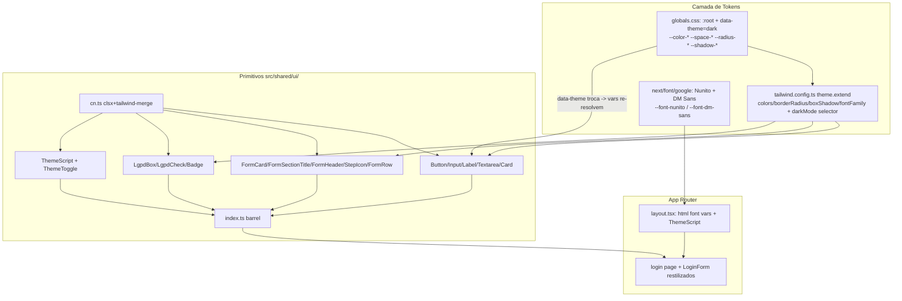
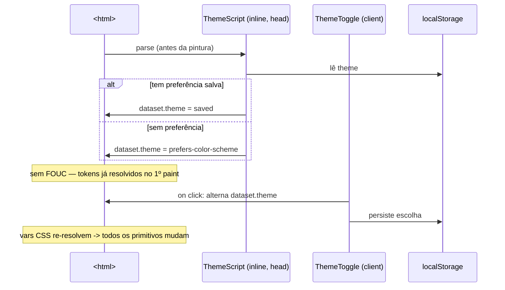

# Fundação de Design System da Fase 1 — Design

**Spec**: `.specs/features/fundacao-ui-design-system/spec.md`
**Status**: Draft

> **Fontes da verdade upstream (adaptar, não re-derivar):** protótipo `docs/prototipo/index.html`
> (linguagem visual — bloco `<style>` L11-58, L134-213, L521-559); `CLAUDE.md` §Tech Stack/§Shared
> Code/§Conventions (stack e raiz `src/` fechada); `docs/arch/project-guideline.md` (padrões/DoD).
> STATE.md `## Decisions`: AD-013 (precedente ad-hoc fundacional). Nenhuma decisão ativa **conflita**
> com este design — AD-010..AD-013 tratam de moderação/vagas/Fase 0, escopos distintos. Este design
> **adiciona** convenção nova (proposta **AD-014**, bloco ao fim) sem supersedir nenhuma.

---

## Architecture Overview

A fundação tem 3 camadas, do token ao pixel:



**Princípio central:** os primitivos usam **apenas** classes Tailwind mapeadas para variáveis CSS
(`bg-cta`, `text-fg`, `border-border`, `rounded-md`, `shadow-sm`, `font-heading`). Trocar
`data-theme` no `<html>` re-resolve as variáveis no cascade — **nenhum** primitivo precisa de utilitário
`dark:` para a maioria dos casos. Isso é o que torna DS-MN-02 (proibir hex/paleta crua) a garantia mais
importante da unidade: é o que mantém o dark-mode e a fonte única de verdade funcionando.

---

## Token System — mapeamento verbatim do protótipo → Tailwind

### 1. Variáveis CSS em `globals.css` (valores idênticos ao protótipo)

`:root` (light) e `[data-theme="dark"]` (override) copiados verbatim de `docs/prototipo/index.html`
L12-58. `globals.css` atual (só `--background`/`--foreground` + bloco `prefers-color-scheme`) é
**substituído** — o bloco `@media (prefers-color-scheme: dark)` legado é **removido** (DS-MN-04).

| Token (CSS var) | Light | Dark |
|---|---|---|
| `--color-primary` | `#2563EB` | `#3B82F6` |
| `--color-secondary` | `#3B82F6` | `#60A5FA` |
| `--color-cta` | `#F97316` | `#FB923C` |
| `--color-cta-hover` | `#EA580C` | `#F97316` |
| `--color-background` | `#F8FAFC` | `#0F172A` |
| `--color-text` | `#1E293B` | `#F1F5F9` |
| `--color-text-light` | `#64748B` | `#94A3B8` |
| `--color-border` | `#E2E8F0` | `#334155` |
| `--color-white` (surface) | `#FFFFFF` | `#1E293B` |
| `--color-success` | `#10B981` | `#34D399` |
| `--color-danger` | `#EF4444` | `#F87171` |
| `--space-xs..3xl` | 4/8/16/24/32/48/64px | (iguais) |
| `--radius-sm..xl` | 8/12/16/24px | (iguais) |
| `--shadow-sm..xl` | ver protótipo L31-34 | ver protótipo L54-57 |

### 2. Mapeamento em `tailwind.config.ts theme.extend` (chaves semânticas)

```ts
// darkMode: usa o MESMO seletor dos tokens (Tailwind v3.4.19 suporta a estratégia 'selector').
darkMode: ['selector', '[data-theme="dark"]'],
theme: {
  extend: {
    colors: {
      primary:   'var(--color-primary)',
      secondary: 'var(--color-secondary)',
      cta:       { DEFAULT: 'var(--color-cta)', hover: 'var(--color-cta-hover)' },
      background:'var(--color-background)',
      surface:   'var(--color-white)',   // "white" do protótipo = superfície de card (navy no dark)
      fg:        { DEFAULT: 'var(--color-text)', muted: 'var(--color-text-light)' },
      border:    'var(--color-border)',  // habilita border-border / border-*
      success:   'var(--color-success)',
      danger:    'var(--color-danger)',
    },
    borderRadius: { sm:'var(--radius-sm)', md:'var(--radius-md)', lg:'var(--radius-lg)', xl:'var(--radius-xl)' },
    boxShadow:    { sm:'var(--shadow-sm)', md:'var(--shadow-md)', lg:'var(--shadow-lg)', xl:'var(--shadow-xl)' },
    fontFamily: {
      sans:    ['var(--font-dm-sans)', 'ui-sans-serif', 'system-ui', 'sans-serif'],
      heading: ['var(--font-nunito)', 'ui-sans-serif', 'system-ui', 'sans-serif'],
    },
  },
},
```

> **Espaçamento:** a escala do protótipo (4/8/16/24/32/48/64px) **já coincide** com o default do Tailwind
> (`1/2/4/6/8/12/16` no base 0.25rem). Não estendemos `spacing` — os primitivos usam os utilitários
> default (`p-3` = 12px = padding do `.btn`; `p-6` = 24px = `--space-lg`), e as `--space-*` ficam em
> `globals.css` para eventual CSS cru. Decisão de simplicidade documentada em Tech Decisions.
>
> **`darkMode: ['selector', ...]`** — confirmado via Context7 (docs Tailwind: dark por data-attribute).
> Como o dark-mode real é dirigido pelas **variáveis CSS** (não por `dark:`), esta config é seguro-extra
> para os poucos casos que precisem de `dark:` explícito. Fonte: Tailwind CSS dark-mode (data attribute).

### 3. Fontes — `next/font/google`

`src/app/layout.tsx` importa `Nunito` e `DM_Sans` de `next/font/google`, cada uma com
`variable: '--font-nunito'` / `'--font-dm-sans'`, `subsets: ['latin']`, `display: 'swap'`, pesos do
protótipo (Nunito 700/800/900; DM Sans 400/500/700). As classes `.variable` vão no `<html className>` e
`font-sans` é aplicada no `<body>`. `next/font` **auto-hospeda** os arquivos no build (DS-MN-01: zero
CDN). O `<link>`/`preconnect` do protótipo (L7-9) **não** é portado.

---

## Dark Mode — mecanismo no App Router (sem lib de estado)



- **`ThemeScript`** (`theme.tsx`): componente que emite um `<script dangerouslySetInnerHTML>` mínimo
  (try/catch em torno de `localStorage`) para setar `document.documentElement.dataset.theme` antes da
  hidratação. Renderizado **no `<head>` do root layout** (Server Component OK — é markup estático).
- **`ThemeToggle`** (`'use client'`): botão redondo (porta `.theme-toggle` do protótipo, L118-132) que lê
  o tema atual do DOM, alterna `data-theme` no `<html>`, persiste em `localStorage` e troca o ícone
  (lua/sol via SVG inline — sem `lucide-react`). Usa só `useState`/`useEffect`. Degrada sem
  `localStorage` (edge case).
- **Sem `next-themes`** e sem provider global obrigatório: como o toggle escreve direto no DOM e os
  tokens são variáveis CSS, não há estado React a compartilhar. React Context **nativo** é permitido
  (não é lib proibida) mas dispensável aqui — mantemos mínimo.

---

## Code Reuse Analysis

### Existing Components to Leverage

| Component | Location | How to Use |
|---|---|---|
| Guarda estática `closed-src-root` | `src/shared/__tests__/closed-src-root.test.ts` | Reusar padrão `node:fs` para os testes negativos DS-MN-*; já cobre a proibição de 4ª pasta de topo (parte de DS-MN-05). |
| Guarda `no-external-verify` / `no-committed-secrets` | `src/modules/companies/__tests__/`, `src/shared/__tests__/` | Padrão de guarda de fonte (scan de arquivos) para DS-MN-01/02/03/04. |
| `LoginForm` | `src/modules/identity/components/LoginForm.tsx` | Restilizar (T13): trocar `<input>`/`<button>`/`<label>` crus por `Input`/`Button`/`Label`; **preservar** RHF+Zod+`loginAction`+mensagem única+navegação (DS-19). |
| Login page | `src/app/(auth)/login/page.tsx` | Envolver com `FormCard`+`FormHeader`; remover `text-gray-*`/`bg-blue-600` (DS-18/DS-MN-03). |
| Root layout | `src/app/layout.tsx` | Injetar font vars + `ThemeScript`; hoje `<html lang="pt-BR"><body>` sem fonte/tema. |
| Testes RTL existentes | `redefinir-senha/page.test.tsx`, `CandidateForm.test.tsx`, etc. | Modelo de estilo/estrutura para os `.test.tsx` dos primitivos e do login. |

### Integration Points

| System | Integration Method |
|---|---|
| Tailwind (v3.4.19) | `theme.extend` mapeia vars; `content` globs já incluem `src/shared/**` (purge preserva classes dos primitivos). |
| `react-hook-form` | `Input`/`Textarea` encaminham `ref` + props → compatíveis com `register()` sem mudança nos forms. |
| App Router / `next/font` | Fontes no root layout; rotas `(auth)` já `force-dynamic` (sem impacto de cache). |
| Vitest (jsdom) | Testes de primitivo e guardas rodam em `npm run test` (glob já cobre `src/**/*.{test,spec}.{ts,tsx}`). |

---

## Components (inventário de primitivos)

Todos em `src/shared/ui/` (raiz canônica shadcn — CLAUDE.md §Shared Code). Cada arquivo `.tsx` com teste
`.test.tsx` co-localizado em `src/shared/ui/__tests__/`.

### cn (util)
- **Purpose**: mesclar classes com `tailwind-merge` (dedup de conflitos de token).
- **Location**: `src/shared/ui/cn.ts`
- **Interfaces**: `cn(...inputs: ClassValue[]): string`
- **Reuses**: `clsx` + `tailwind-merge`.

### Button — mapeia `.btn`/`.btn-primary`/`.btn-secondary`/`.btn-outline`/`.btn-sm`/`.btn-lg`
- **Location**: `src/shared/ui/button.tsx`
- **Interfaces**: `<Button variant='primary'|'secondary'|'outline' size='sm'|'default'|'lg' asChild? ...ButtonHTMLAttributes>` (cva + Radix `Slot`). `primary`=CTA laranja; `secondary`=outline primário→fill; `outline`=borda neutra.
- **Reuses**: `class-variance-authority`, `@radix-ui/react-slot`, `cn`.

### Input / Label / Textarea — mapeia `.input-group input|label|textarea`
- **Location**: `src/shared/ui/input.tsx`, `label.tsx`, `textarea.tsx`
- **Interfaces**: `<Input>` e `<Textarea>` são `forwardRef` sobre os elementos nativos (borda 1.5px `border-border`, `rounded-sm`, foco `ring` primário); `<Label>` sobre `@radix-ui/react-label` (a11y `htmlFor`).
- **Reuses**: `@radix-ui/react-label`, `cn`.
- **Nota**: encaminham `ref`/props → compatíveis com `react-hook-form register` (DS-07/DS-19).

### Card / FormCard / FormSectionTitle — mapeia `.card`, `.form-card`, `.form-section-title`
- **Location**: `src/shared/ui/card.tsx`, `form-card.tsx`
- **Interfaces**: `<Card>` (surface+border+shadow-sm+hover shadow-md); `<FormCard>` (surface, `rounded-lg`, `p-8`, shadow-sm — L527-534); `<FormSectionTitle>` (`font-heading`, borda inferior — L535-540).
- **Reuses**: `cn`.

### FormHeader / StepIcon — mapeia `.form-header`(+h1/p), `.step-icon`(+`-blue/-orange/-green`)
- **Location**: `src/shared/ui/form-header.tsx`, `step-icon.tsx`
- **Interfaces**: `<FormHeader title description? />` (centralizado, h1 `font-heading`); `<StepIcon variant='blue'|'orange'|'green'>{icon}</StepIcon>` (cva; combinações light L358-360 + dark L102-104).
- **Reuses**: `class-variance-authority`, `cn`.

### FormRow — mapeia `.form-row`(+`-3`) e a media query de colapso
- **Location**: `src/shared/ui/form-row.tsx`
- **Interfaces**: `<FormRow cols?=2|3>` → grid responsivo (`grid-cols-1 md:grid-cols-2|3`, gap = `--space-md`).
- **Reuses**: `cn`.

### LgpdBox / LgpdCheck — mapeia `.lgpd-box`(+h4/p), `.lgpd-check`(+input/span/a)
- **Location**: `src/shared/ui/lgpd-box.tsx`
- **Interfaces**: `<LgpdBox title>{children}</LgpdBox>` (fundo `#F8FAFC`/dark `#1A2332`, borda, radius-md); `<LgpdCheck>` (checkbox `accent-color: primary` + label; forward de props para o input).
- **Reuses**: `cn`. **Preserva** semântica de consentimento (só estilo — decisão de produto (b)).

### Badge — mapeia `.badge`(+`-blue/-orange/-green/-gray`)
- **Location**: `src/shared/ui/badge.tsx`
- **Interfaces**: `<Badge variant='blue'|'orange'|'green'|'gray'>` (cva; light L190-193 + dark L93-96).
- **Reuses**: `class-variance-authority`, `cn`.

### ThemeScript / ThemeToggle — mapeia `.theme-toggle`
- **Location**: `src/shared/ui/theme.tsx`
- **Interfaces**: `<ThemeScript />` (inline no head, anti-FOUC); `<ThemeToggle />` (`'use client'`, alterna `data-theme` + `localStorage`).
- **Reuses**: `cn`; React nativo.

### Barrel
- **Location**: `src/shared/ui/index.ts` — reexporta todos + `cn`. Import sempre via `@/shared/ui` (regra de barrel do CLAUDE.md).

---

## Data Models (if applicable)

N/A — unidade puramente de apresentação; nenhum modelo de dados, Prisma, Server Action ou consulta é
criado ou alterado. (Os fluxos do login permanecem intactos — DS-19.)

---

## Error Handling Strategy

| Error Scenario | Handling | User Impact |
|---|---|---|
| `localStorage` indisponível (SSR/privado) | `ThemeScript`/`ThemeToggle` em try/catch → cai em `prefers-color-scheme` | Tema segue a preferência do SO; sem crash. |
| `<Button asChild>` com múltiplos filhos | Contrato Radix `Slot` (um filho) documentado no JSDoc | Erro de dev em build/dev, não em runtime do usuário. |
| Classe extra conflita com token | `cn`/tailwind-merge resolve o conflito (última vence) | Estilo previsível; sem classe duplicada. |
| Fonte falha ao baixar no build | `next/font` falha o build (não o runtime) | Detecção no gate `npm run build`. |

---

## Risks & Concerns

| Concern | Location (file:line) | Impact | Mitigation |
|---|---|---|---|
| `globals.css` atual tem `@media (prefers-color-scheme: dark)` que conflita com `[data-theme]` | `src/app/globals.css:10-15` | Dois mecanismos de dark → tema inconsistente | T2 remove o bloco legado; DS-MN-04 guarda contra reintrodução. |
| `LoginForm`/login usam `bg-blue-600`/`text-gray-*`/`ring-blue-*`/`system-ui` (herança) | `LoginForm.tsx:44-111`, `login/page.tsx:13-21` | Estilo ad-hoc fora do DS; sem paridade | T13 migra e DS-MN-03 guarda; fluxos preservados (DS-19). |
| shadcn/ui não existe no repo (sem `cva`/`clsx`/`tailwind-merge`/Radix/`cn`/`next/font`/`components.json`) | `package.json` | Base ausente para portar primitivos | T1 adiciona o allowlist mínimo + `cn`; DS-MN-05 guarda contra libs proibidas. |
| Tailwind purge poderia remover classes-token usadas só nos primitivos | `tailwind.config.ts:4-8` | Estilo sumindo no build | `content` já cobre `src/shared/**`; build gate detecta. |
| `.tsx` de UI ficam **fora** do gate de cobertura (coverage.include = `.ts`) | `vitest.config.ts` | Cobertura não conta os primitivos | Intencional (filosofia do repo); mesmo assim cada primitivo tem `.test.tsx` que roda em `npm run test`. |
| Editar `LoginForm` (módulo `identity`) para o smoke toca um módulo entregue | `src/modules/identity/components/LoginForm.tsx` | Regressão de fluxo de login | Só troca de marcação/estilo; teste RTL do login assevera preservação de labels/erros/ação (DS-19). |

> Nenhum outro concern relevante encontrado nos arquivos tocados.

---

## Tech Decisions (only non-obvious ones)

| Decision | Choice | Rationale |
|---|---|---|
| Valores de token vs. nomes | Copiar **valores** verbatim do protótipo em `globals.css`; expor **nomes semânticos** no Tailwind | Cópia literal = paridade auditável 1:1; camada semântica = ergonomia. Mapa na seção Token System. |
| Escala de espaçamento | Não estender `spacing`; usar default Tailwind (já == px do protótipo) | Menos config, mesmo pixel; `--space-*` ficam em CSS para uso cru. |
| Local do `cn` | `src/shared/ui/cn.ts` (não `shared/lib/`) | DS coeso/auto-contido; `cn` só serve UI. Alternativa `shared/lib/` é válida — registrada como assumption. |
| Dark mode | `data-theme` + `ThemeScript` inline + `ThemeToggle` React nativo; sem `next-themes` | Tokens são variáveis CSS → basta trocar o atributo; evita ampliar deps além do allowlist. |
| Fontes | `next/font/google` (Nunito + DM Sans) | Auto-hospeda no build (DS-MN-01); canônico no Next 15; sem FOUC de fonte. |
| Não usar registry shadcn | Portar primitivos à mão | Evita `components.json`/config gerada e drift; usamos só as convenções (cva/Slot/forwardRef). |
| Tela de paridade | login (page + LoginForm) | Menor superfície ponta-a-ponta; menor blast radius que cadastro. |

> **Decisão de projeto (candidata a AD-014 em STATE.md `## Decisions`):** ver bloco abaixo. Como Planner
> no pipeline autônomo, **não** edito `STATE.md` diretamente (evita colisão com o orquestrador); deixo o
> bloco pronto e sinalizo no relatório para o gate humano/orquestrador anexá-lo.

```markdown
### AD-014: Fundação de Design System da Fase 1 — tokens do protótipo + primitivos em src/shared/ui (ad-hoc, fora do ROADMAP)

**Decision:** Unidade transversal/fundacional (não é USP; ROADMAP não tocado — precedente AD-013)
extrai a linguagem visual de `docs/prototipo/index.html` para uma fundação reutilizável: (1) tokens
como variáveis CSS em `globals.css` (`:root` + `[data-theme="dark"]`, valores verbatim do protótipo)
mapeados em `tailwind.config.ts theme.extend` (colors/borderRadius/boxShadow/fontFamily) com
`darkMode: ['selector','[data-theme="dark"]']`; (2) fontes Nunito+DM Sans via `next/font/google`
(auto-hospedadas); (3) 15 primitivos React em `src/shared/ui/` (Button/Input/Label/Textarea/Card/
FormCard/FormSectionTitle/FormHeader/StepIcon/FormRow/LgpdBox/LgpdCheck/Badge/ThemeToggle/ThemeScript)
+ `cn`, exportados por barrel; (4) modo escuro por `[data-theme]` sem lib de estado (React nativo +
script inline anti-FOUC). Allowlist de deps novas: cva, clsx, tailwind-merge, @radix-ui/react-slot,
@radix-ui/react-label. Convenção para TODAS as telas Fase 1+: estilizar via primitivos/tokens; proibido
hex cru/paleta fixa (`bg-blue-600` etc.) em `src/shared/ui/**`.
**Reason:** `src/shared/ui/` vazio e telas com Tailwind solto impediam restilização consistente. 5
must-nots (DS-MN-01..05) com teste negativo discriminante cada.
**Trade-off:** Edita `LoginForm` (módulo identity) só para o smoke de paridade — estilo apenas, fluxos
RHF/Zod/action preservados. `.tsx` de UI ficam fora do gate de cobertura (filosofia do repo).
**Impact:** Habilita as unidades de restilização das demais telas. Artefatos em
`.specs/features/fundacao-ui-design-system/`.
```

---

## Tips aplicadas
- Context first: reusa guardas estáticas e testes RTL existentes.
- Interfaces first: APIs dos primitivos fixadas antes da implementação.
- Reuse é rei: `cn`/cva/Slot padronizam; nada reinventado.
</content>
