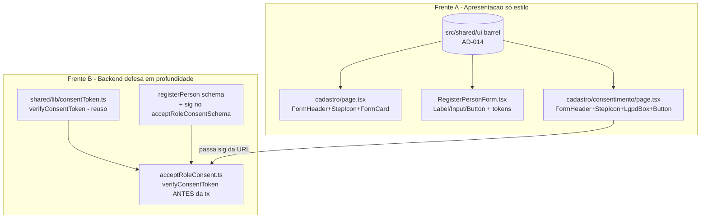

# USP-001 Auto-cadastro - Refactor (Fase 1) Design

**Spec**: `.specs/features/identity-acesso-papeis/usp-001-auto-cadastro/spec.md`
**Status**: Draft

> **Fontes da verdade upstream (adaptar, não re-derivar):**
> - Design System: `.specs/features/fundacao-ui-design-system/design.md` + barrel `src/shared/ui/index.ts` (**AD-014**, STATE.md).
> - Linguagem visual: protótipo `docs/prototipo/index.html` - `page-candidato-cadastro` (L1222-1360) e estilos `.form-card`/`.form-header`/`.step-icon`/`.lgpd-box` (L521-577); ícones SVG do protótipo (usuário L1228; escudo-check L1340).
> - Fluxo e invariantes: épico `.specs/features/identity-acesso-papeis/spec.md` (IDN-01..03); ADR-0020 (grant nunca ACTIVE sem consent na mesma tx); ADR-0014 (CAPTCHA fail-closed); ADR-0021 (unicidade).
> - Padrão de restyle já mergeado: `src/modules/identity/components/LoginForm.tsx` (prova de paridade do login, AD-014) - **modelo a seguir**.
>
> **Decisões ativas de STATE.md `## Decisions`:** AD-014 (DS) e AD-013 (precedente ad-hoc) são os constraints. Nenhuma decisão ativa conflita com este design; ele **conforma** ao AD-014 e não supersede nada.

---

## Architecture Overview

Duas frentes independentes sobre código já entregue - uma de apresentação (só estilo), uma de backend
(defesa em profundidade). Nenhum modelo de dados, schema Prisma ou contrato de fluxo muda.



**Princípio:** a Frente A troca **apenas marcação/classe** (nenhum handler, schema, action ou navegação
muda). A Frente B adiciona uma checagem no topo da action, reusando o utilitário HMAC que já existe -
sem novo mecanismo criptográfico.

---

## Code Reuse Analysis

### Existing Components to Leverage

| Component | Location | How to Use |
| --- | --- | --- |
| Primitivos DS | `src/shared/ui/index.ts` | `FormHeader`, `StepIcon`, `FormCard`, `Label`, `Input`, `Button`, `LgpdBox` - importar via barrel `@/shared/ui`. |
| Padrão de restyle do login | `src/modules/identity/components/LoginForm.tsx` | Modelo verbatim: `Label`+`Input`, `Button variant="primary"`, caixa de erro `bg-[color-mix(in_srgb,var(--color-danger)_10%,transparent)] text-danger`, links `text-primary hover:underline`. |
| `verifyConsentToken` / `signConsentToken` | `src/shared/lib/consentToken.ts` | Re-validar o HMAC dentro da action; `timingSafeEqual` já implementado. **Sem** alteração. |
| `acceptRoleConsentSchema` | `src/modules/identity/schemas/registerPerson.ts` | Adicionar campo `sig`. |
| Teste de integração TX2 | `src/modules/identity/__tests__/acceptRoleConsent.int.test.ts` | Atualizar os 5 caminhos-feliz para passar `sig` válido; adicionar o caso negativo (U1-MN-01). |
| SVGs do protótipo | `docs/prototipo/index.html` L1228 (usuário), L1340 (escudo-check) | Copiar o `path` para o `StepIcon` do cadastro (blue) e do aceite (green). |

### Integration Points

| System | Integration Method |
| --- | --- |
| App Router `(auth)` | Rotas já `force-dynamic`; restyle não altera cache/metadata. |
| `react-hook-form` | `Input` encaminha `ref`/props -> `register()` continua funcionando sem mudança. |
| Server Action `acceptConsent` (closure na página) | Passa a repassar `sig` (já em escopo) para `acceptRoleConsent`. |
| Vitest (jsdom / integração) | RTL do form em `npm run test`; caso negativo da guarda em `npm run test:integration` (Postgres local). |

---

## Components

### `RegisterPersonForm` (restyle - Client Component)
- **Purpose**: formulário de auto-cadastro restilizado com primitivos do DS; comportamento intacto.
- **Location**: `src/modules/identity/components/RegisterPersonForm.tsx`
- **Interfaces**: props inalteradas (`siteKey`, `onSuccess`). Internamente: trocar `<label>`->`Label`,
  `<input>`->`Input`, `<button>`->`Button variant="primary" size="lg"` (full-width via
  `className="w-full"`); caixa de erro do servidor no padrão danger-token do `LoginForm`; rótulo do
  papel em cards com tokens (`border-border`, `has-[:checked]:border-primary`,
  `has-[:checked]:bg-[color-mix(in_srgb,var(--color-primary)_8%,transparent)]`, `accent-primary`).
- **Dependencies**: `@/shared/ui`, RHF, Zod, `@marsidev/react-turnstile`, `registerPerson`.
- **Reuses**: `LoginForm` como referência de estilo.
- **Preserva (must-not U1-MN-02/03):** gate client de CAPTCHA (`if (!captchaToken) { setServerError(...); return; }`); nenhum checkbox; nenhum campo de perfil.

### `cadastro/page.tsx` (restyle - Server Component)
- **Purpose**: casca da página de cadastro com header/ícone/card do DS.
- **Location**: `src/app/(auth)/cadastro/page.tsx`
- **Interfaces**: envolver o conteúdo em `<StepIcon variant="blue">{userSvg}</StepIcon>` +
  `<FormHeader title="Criar conta no ASONSEG" description="Preencha os dados abaixo para começar." />`
  + `<FormCard>` ao redor do `RegisterPersonForm`; link "Já tem conta? Entrar" com `text-primary`.
- **Preserva**: `handleRegistrationSuccess` (assina `sig` e redireciona à TX2), `NEXT_STEP_BY_ROLE`,
  `metadata`, `dynamic='force-dynamic'`. **Nenhuma** mudança nesses.

### `cadastro/consentimento/page.tsx` (restyle + repasse de `sig` - Server Component)
- **Purpose**: página de aceite (TX2) restilizada; passa `sig` à action.
- **Location**: `src/app/(auth)/cadastro/consentimento/page.tsx`
- **Interfaces**: `FormHeader` ("Quase pronto!") + `StepIcon variant="green"` (escudo-check) + `LgpdBox`
  com o termo (`ROLE_PURPOSE_DESCRIPTION` + base legal) + `<form action={acceptConsent}>` com
  `<Button type="submit" variant="primary" size="lg" className="w-full">` e "Aceitar depois" via
  `<Button asChild variant="outline"><a href="/app/perfil">...</a></Button>`.
- **Mudança de backend (Frente B):** dentro de `acceptConsent`, adicionar `sig` ao objeto passado a
  `acceptRoleConsent({ personId, role, termVersion, termContentHash, sig })`.
- **Preserva (must-not U1-MN-03):** `verifyConsentToken` no topo da página, `safeRedirect`, o aceite
  como **clique afirmativo** (sem checkbox pré-marcado), a rota separada (split).

### `acceptRoleConsent` (guarda - Server Action)
- **Purpose**: TX2 com defesa em profundidade.
- **Location**: `src/modules/identity/actions/acceptRoleConsent.ts`
- **Interface (guarda):** após `acceptRoleConsentSchema.safeParse`, antes de `withAudit`:
  ```ts
  if (!verifyConsentToken(input.personId, input.role, input.sig)) {
    return fail('FORBIDDEN', 'Autorização inválida para este aceite.');
  }
  ```
- **Reuses**: `verifyConsentToken` (`@/shared/lib/consentToken`).
- **Preserva**: toda a transação atual (consent + grant ACTIVE + auditoria) - inalterada.

### `acceptRoleConsentSchema` (schema)
- **Location**: `src/modules/identity/schemas/registerPerson.ts`
- **Mudança**: adicionar `sig: z.string().min(1, 'Assinatura ausente')` ao objeto. A validade
  criptográfica é checada na action (Zod cobre só presença/forma).

---

## Data Models

N/A - nenhum modelo de dados, migração Prisma ou tabela é criado ou alterado. A guarda usa dados já
persistidos e o token HMAC já existente. O restyle é puramente de apresentação.

---

## Error Handling Strategy

| Error Scenario | Handling | User Impact |
| --- | --- | --- |
| `sig` ausente/inválido em `acceptRoleConsent` | `return fail('FORBIDDEN', ...)` antes de qualquer escrita | Nada é ativado; na prática só ocorre em chamada fora do fluxo. A página legítima sempre traz `sig` válido. |
| CAPTCHA não resolvido no form | gate client (`setServerError`) + fail-closed server (já existe) | Mensagem "Complete o desafio CAPTCHA..."; sem submit. |
| Classe de token conflita no `cn`/tailwind-merge | resolvido pelo merge (última vence) | Estilo previsível. |
| `localStorage`/tema indisponível | coberto pela fundação (ThemeScript try/catch) | Sem FOUC; segue `prefers-color-scheme`. |

---

## Risks & Concerns

| Concern | Location (file:line) | Impact | Mitigation |
| --- | --- | --- | --- |
| Adicionar `sig` obrigatório ao schema quebra os 5 caminhos-feliz do teste de integração existente | `acceptRoleConsent.int.test.ts:73-169` | Suíte de integração vermelha se não atualizada | T1 atualiza cada chamada para computar `sig` via `signConsentToken(personId, role)` e adiciona o caso negativo - no mesmo commit. |
| Único caller de produção da action é a página de aceite | `src/app/(auth)/cadastro/consentimento/page.tsx:78` | Se a página não passar `sig`, a TX2 legítima falha | T1 altera a closure `acceptConsent` para repassar `sig` (já em escopo pós-`verifyConsentToken`). |
| `RegisterPersonForm` não tem teste RTL hoje (lacuna de cobertura) | `src/modules/identity/__tests__/` (ausente) | Restyle sem rede de segurança de comportamento | T2 cria `RegisterPersonForm.test.tsx` cobrindo CAPTCHA fail-closed + ausência de checkbox/campos de perfil (U1-MN-02/03). |
| Restyle toca módulo `identity` já entregue | `RegisterPersonForm.tsx`, `cadastro/*` | Regressão de fluxo de cadastro | Só marcação/estilo; testes preservados verdes + novo RTL assevera preservação. |
| `StepIcon.title` é string; o protótipo põe SVG no `<h4>` do LgpdBox | `src/shared/ui/lgpd-box.tsx:18-25` | Paridade de ícone do LgpdBox não é 1:1 | O escudo-check vai no `StepIcon` do header (não no LgpdBox), preservando a API do primitivo. Diferença desprezível. |

> Nenhum outro concern relevante encontrado nos arquivos tocados.

---

## Tech Decisions (only non-obvious ones)

| Decision | Choice | Rationale |
| --- | --- | --- |
| Guard: sessão vs. token | Re-validar o **token HMAC** dentro da action | Na TX2 não há sessão (a TX1 não autentica); o `sig` é o único portador de autorização. Reusa `verifyConsentToken`. |
| Local do campo do token | `sig` no `acceptRoleConsentSchema` (input tipado) | Um único input; Zod cobre presença; a action cobre a validade criptográfica. |
| Botão de submit full-width | `Button ... className="w-full"` | O protótipo usa `.btn-lg` full-width (L1354); `cn` mescla `w-full` sem violar tokens. |
| Cards de papel (radio) sem primitivo dedicado | Restyle inline com tokens (`border-border`, `has-[:checked]:*`, `accent-primary`) | Não existe primitivo de "radio card" no DS; usar tokens mantém a convenção AD-014 sem inventar componente. |
| Ícone do aceite | `StepIcon variant="green"` no header (não no LgpdBox) | Preserva a API `LgpdBox(title: string)`; o escudo-check fica no header, ecoando o protótipo. |

> **Nenhuma decisão nova de projeto (AD-NNN).** Este design conforma a AD-014; não cria convenção nova.

---

## Tips aplicadas
- Reuse é rei: `LoginForm` é o gabarito de restyle; `verifyConsentToken` é reusado sem tocar.
- Interfaces first: a guarda é uma única checagem no topo da action; o restyle não muda assinaturas.
- Escopo travado: só estilo na Frente A; a Frente B não altera a transação existente.
</content>
