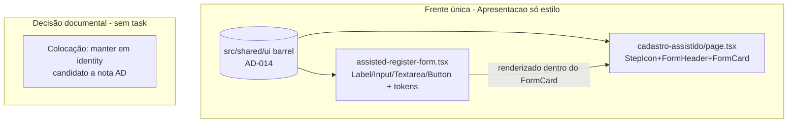

# USP-002 Cadastro de Pessoa pela assistente social - Refactor (Fase 1) Design

**Spec**: `.specs/features/identity-acesso-papeis/usp-002-cadastro-as/spec.md`
**Status**: Draft

> **Fontes da verdade upstream (adaptar, não re-derivar):**
> - Design System: `.specs/features/fundacao-ui-design-system/design.md` + barrel `src/shared/ui/index.ts` (**AD-014**, STATE.md).
> - Linguagem visual: protótipo `docs/prototipo/index.html` - estilos `.form-card`/`.form-header`/`.step-icon` (L521-559). Esta tela **não existe** no protótipo: aplica-se a **linguagem** (mesmos primitivos/tokens do cadastro/login já restilizados), não uma cópia 1:1.
> - Fluxo e invariantes: épico `.specs/features/identity-acesso-papeis/spec.md` (IDN-04..06); ADR-0013 (evidência de consentimento em papel no audit `after`).
> - Padrão de restyle já mergeado: `src/modules/identity/components/RegisterPersonForm.tsx` + `src/app/(auth)/cadastro/page.tsx` (AD-014) - **modelo a seguir**.
>
> **Decisões ativas de STATE.md `## Decisions`:** AD-014 (DS) e AD-013 (precedente ad-hoc / carve-out client-server) são os constraints. Nenhuma decisão ativa conflita com este design; ele **conforma** ao AD-014 e não supersede nada.

---

## Architecture Overview

Uma única frente sobre código já entregue: **apresentação (só estilo)**. Nenhum modelo de dados, schema
Prisma, Server Action, query, navegação, metadata ou cache muda. A decisão de colocação de módulo é
**documental** (não gera task).

**Princípio:** troca-se **apenas marcação/classe**. Nenhum handler, schema, action, navegação, metadata
ou cache é tocado. O gate de papel da página (`requireActivePerson` + `canRegisterAssisted` → `notFound`)
permanece byte-a-byte igual.

---

## Decisão de consistência: colocação do módulo (candidato a nota AD)

**Decisão: manter a USP-002 em `src/modules/identity` (não mover para `persons`).**

Rationale:

- A USP-002 cria uma **Pessoa sem credencial** como parte da superfície de **identidade/onboarding** -
  o mesmo domínio do auto-cadastro (USP-001), da reivindicação de credencial (USP-003) e do login. A
  ficha social/encaminhamento consome a Pessoa criada, mas o **ato de criar identidade** é de `identity`.
- A política de autorização institucional já vive em `identity`:
  `ASSISTED_REGISTRATION_ROLES`/`canRegisterAssisted` em `src/modules/identity/domain/assisted-registration.ts`,
  exportada pelo barrel `@/modules/identity` e consumida pela rota `(app)/cadastro-assistido/page.tsx`
  (`requireActivePerson` + `canRegisterAssisted` + `AssistedRegisterForm`, todos do mesmo barrel).
- Mover para `persons` implicaria: recriar/estender o barrel `@/modules/persons`, reapontar imports da
  rota e dos testes, e arriscar o **carve-out client/server** já documentado (AD-013 / ADR-0017: o barrel
  `@/modules/identity` puxa `next/headers`/`next/cache` transitivamente, o que quebra Client Components).
  É **churn de alto risco sem ganho de correção**.
- Por isso NÃO se planeja task de mudança física. A decisão é registrada aqui e sinalizada no relatório
  do Planner para o gate humano/orquestrador anexá-la ao STATE.md se desejar (o Planner não edita STATE.md
  no pipeline autônomo).

---

## Code Reuse Analysis

### Existing Components to Leverage

| Component | Location | How to Use |
| --- | --- | --- |
| Primitivos DS | `src/shared/ui/index.ts` | `Label`, `Input`, `Textarea`, `Button`, `FormHeader`, `StepIcon`, `FormCard` - importar via barrel `@/shared/ui`. |
| Padrão de restyle do cadastro público | `src/modules/identity/components/RegisterPersonForm.tsx`, `src/app/(auth)/cadastro/page.tsx` | Modelo verbatim: `Label`+`Input`, `Button variant="primary" size="lg" className="w-full"`, caixa de erro `bg-[color-mix(in_srgb,var(--color-danger)_10%,transparent)] text-danger`, cards com `border-border`/`has-[:checked]:*`/`accent-primary`, página com `StepIcon`+`FormHeader`+`FormCard`. |
| Classe-token do `<select>` | `src/shared/ui/input.tsx:14-16` | Espelhar as classes do `Input` no `<select>` nativo (sem placeholder): `w-full rounded-sm border-[1.5px] border-border bg-surface px-4 py-3 text-[0.95rem] text-fg focus:border-primary focus:outline-none focus:ring-2 focus:ring-primary`. |
| Teste RTL existente | `src/modules/identity/__tests__/AssistedRegisterForm.test.tsx` | Manter os 6 casos verdes; adicionar a asserção U2-MN-02 (ausência de campo de credencial). |

### Integration Points

| System | Integration Method |
| --- | --- |
| App Router `(app)` | Rota já `force-dynamic`; restyle não altera cache/metadata/gate. |
| `react-hook-form` | `Input`/`Textarea` encaminham `ref`/props → `register()` continua funcionando sem mudança. |
| Vitest (jsdom) | RTL do form em `npm run test`; página validada por `npm run build`. |

---

## Components

### `AssistedRegisterForm` (restyle - Client Component)
- **Purpose**: formulário de cadastro assistido restilizado com primitivos do DS; comportamento intacto.
- **Location**: `src/modules/identity/components/assisted-register-form.tsx`
- **Interfaces**: props inalteradas (sem props). Internamente: remover `const inputClass` cru; trocar
  `<label>`→`Label`, `<input>`→`Input`, `<textarea>`→`Textarea`, `<button>`→`Button variant="primary"
  size="lg" className="w-full"` (submit) e `Button variant="outline"` (para "Cadastrar outra Pessoa");
  `<select>` de papel restilizado com a classe-token (ver Code Reuse); caixa de exceção com tokens `cta`
  (`border-cta`, `bg-[color-mix(in_srgb,var(--color-cta)_10%,transparent)]`, `accent-cta`); caixa de
  sucesso com tokens `success`; caixa de erro do servidor no padrão danger-token do `RegisterPersonForm`;
  textos auxiliares `text-fg-muted`.
- **Dependencies**: `@/shared/ui`, RHF, Zod, `registerPersonByAssistant`.
- **Reuses**: `RegisterPersonForm` como referência de estilo.
- **Preserva (must-not U2-MN-01/02):** a lógica condicional `cpfException` (esconde CPF, exige
  justificativa via `CPF_EXCEPTION_MIN_JUSTIFICATION`); `signedOnPaperAt`; nenhum campo de credencial;
  os textos de rótulo/botão/estado testados ("Cadastrar Pessoa", "Pessoa cadastrada com sucesso",
  "Cadastrar outra Pessoa", "Nome completo", "CPF", "Justificativa da exceção", checkbox de exceção).

### `cadastro-assistido/page.tsx` (restyle - Server Component)
- **Purpose**: casca da página com header/ícone/card do DS.
- **Location**: `src/app/(app)/cadastro-assistido/page.tsx`
- **Interfaces**: envolver o conteúdo em `<StepIcon variant="blue">{userIcon}</StepIcon>` +
  `<FormHeader title="Cadastro assistido de Pessoa" description="..." />` + `<FormCard>` ao redor do
  `AssistedRegisterForm`; nota de rodapé (consentimento em papel/auditoria) com `text-fg-muted`.
- **Preserva**: o gate de papel (`requireActivePerson` + `canRegisterAssisted` → `notFound`) e
  `dynamic='force-dynamic'`. **Nenhuma** mudança nesses.

---

## Data Models

N/A - nenhum modelo de dados, migração Prisma, Server Action ou query é criado ou alterado. O restyle é
puramente de apresentação.

---

## Error Handling Strategy

| Error Scenario | Handling | User Impact |
| --- | --- | --- |
| Exceção marcada sem justificativa | gate client via Zod (`register`) já existente; preservado | Erro `role="alert"`; sem submit. |
| Erro do servidor (CPF/e-mail em uso) | caixa `role="alert"` com token danger (padrão existente) | Mensagem do servidor; sucesso não exibido. |
| Classe de token conflita no `cn`/tailwind-merge | resolvido pelo merge (última vence) | Estilo previsível. |
| `localStorage`/tema indisponível | coberto pela fundação (ThemeScript try/catch) | Sem FOUC; segue `prefers-color-scheme`. |

---

## Risks & Concerns

| Concern | Location (file:line) | Impact | Mitigation |
| --- | --- | --- | --- |
| `AssistedRegisterForm` tem `<select>` e `<textarea>` que os testes localizam por `getByLabelText`/`getByRole` | `assisted-register-form.tsx:144,253` | Trocar por primitivo custom quebraria as queries dos testes | `<select>` fica nativo restilizado com tokens; `<textarea>`→`Textarea` (mesma semântica de label/ref). |
| A caixa de exceção usa `amber-*` cru (sem token de warning no DS) | `assisted-register-form.tsx:102-111` | Sem paridade de token | Mapear para família `cta` (laranja de atenção); documentado em Assumptions. |
| Restyle toca módulo `identity` já entregue | `assisted-register-form.tsx`, `cadastro-assistido/page.tsx` | Regressão de fluxo de cadastro assistido | Só marcação/estilo; 6 testes RTL existentes seguem verdes + asserção U2-MN-02 nova. |
| Textos de botão/estado são localizadores de teste | `AssistedRegisterForm.test.tsx:30,75` | Renomear texto quebra a suíte | Preservar verbatim "Cadastrar Pessoa"/"Pessoa cadastrada com sucesso"/"Cadastrar outra Pessoa". |

> Nenhum outro concern relevante encontrado nos arquivos tocados.

---

## Tech Decisions (only non-obvious ones)

| Decision | Choice | Rationale |
| --- | --- | --- |
| Colocação do módulo | Manter em `identity` (documentar, não mover) | Cria identidade sem credencial; autz e barrel já em `identity`; mover é churn de alto risco (carve-out AD-013). |
| `<select>` sem primitivo | Nativo restilizado com classe-token espelhando `Input` | DS não tem Select; preserva `getByLabelText`/`onChange`; usa tokens. |
| Caixa de exceção (amber) | Família de token `cta` (laranja de atenção) | Sem token de warning no DS; `cta` é a cor de atenção; sem hex cru. |
| Botão de submit full-width + "Cadastrar outra" | `Button variant="primary" size="lg" className="w-full"` + `Button variant="outline"` | Espelha o `RegisterPersonForm`; `cn` mescla `w-full` sem violar tokens. |
| Ícone da página | `StepIcon variant="blue"` + SVG de usuário inline | Coerência com a família de onboarding; sem `lucide-react` (convenção DS). |

> **Nenhuma decisão nova de projeto (AD-NNN) criada pelo Planner.** Este design conforma a AD-014. A
> decisão de colocação de módulo é registrada aqui como **candidata a nota AD** e sinalizada no relatório
> para o gate humano/orquestrador (o Planner não edita STATE.md no pipeline autônomo).

---

## Tips aplicadas
- Reuse é rei: `RegisterPersonForm`/`cadastro/page.tsx` são o gabarito de restyle; nada reinventado.
- Interfaces first: o restyle não muda assinaturas nem props; só marcação/classe.
- Escopo travado: uma frente só (estilo); a decisão de módulo é documental, não uma task.
