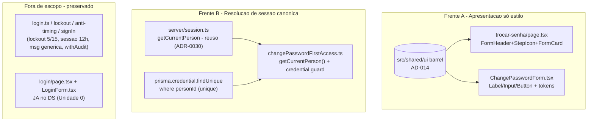

# USP-004 Autenticar no portal (login) - Refactor (Fase 1) Design

**Spec**: `.specs/features/identity-acesso-papeis/usp-004-login/spec.md`
**Status**: Draft

> **Fontes da verdade upstream (adaptar, não re-derivar):**
> - Design System: `.specs/features/fundacao-ui-design-system/design.md` + barrel `src/shared/ui/index.ts` (**AD-014**, STATE.md).
> - Linguagem visual: protótipo `docs/prototipo/index.html` - estilos `.form-card`/`.form-header`/`.step-icon`/`.btn*` (L521-577, L158-184). As telas de troca/recuperação de senha **não existem** no protótipo: aplica-se a **linguagem** (mesmo card/header/botão do cadastro), não cópia 1:1.
> - Padrão de restyle já mergeado (Unidade 0): `src/modules/identity/components/LoginForm.tsx` + `src/app/(auth)/login/page.tsx` - **modelo verbatim a seguir** (prova de paridade do login, DS-18/DS-19/DS-20).
> - Padrão canônico de resolução de ator: `src/modules/identity/actions/activate-additional-role.ts:67` (`getCurrentPerson()`); helper em `src/modules/identity/server/session.ts` (ADR-0030).
> - Fluxo/invariantes preservados: épico `.specs/features/identity-acesso-papeis/spec.md` (IDN-09..11); ADR-0030 (revalidação de sessão por request).
>
> **Decisões ativas de STATE.md `## Decisions`:** AD-014 (DS) e AD-013 (precedente ad-hoc) são os constraints. Este design **conforma** a AD-014 e ao padrão de sessão do módulo; não supersede nada.

---

## Architecture Overview

Duas frentes independentes sobre código já entregue - uma de apresentação (só estilo), uma de backend
(padronização da resolução de sessão). A tela de **login** já está no DS (Unidade 0) e **não** é
tocada. Nenhum modelo de dados, migração Prisma ou contrato de fluxo muda.



**Princípio:** a Frente A troca **apenas marcação/classe** (nenhum handler, schema, action ou navegação
muda). A Frente B substitui **apenas os passos de resolução do ator** (2) na action, reusando o helper
canônico; a transação de escrita (updateUser + credential.update + audit) é preservada verbatim.

---

## Code Reuse Analysis

### Existing Components to Leverage

| Component | Location | How to Use |
| --- | --- | --- |
| Primitivos DS | `src/shared/ui/index.ts` | `FormHeader`, `StepIcon`, `FormCard`, `Label`, `Input`, `Button` via barrel `@/shared/ui`. |
| Padrão de restyle (login) | `src/modules/identity/components/LoginForm.tsx` + `src/app/(auth)/login/page.tsx` | Modelo verbatim: `Label`+`Input`, `Button variant="primary"`, caixa de erro danger-token, `FormHeader`+`FormCard` na página. |
| Helper de sessão canônico | `src/modules/identity/server/session.ts` (`getCurrentPerson`) | Resolver a Pessoa + revalidar status (ADR-0030) dentro de `changePasswordFirstAccess`. Retorna `{ id, supabaseUserId, status, primeiroAcesso, ... }`. **Sem** alteração no helper. |
| Padrão de uso do helper | `src/modules/identity/actions/activate-additional-role.ts:67` | Gabarito: `const person = await getCurrentPerson(); if (!person) return fail('UNAUTHENTICATED', ...)`. |
| Schema `Credential` (personId unique) | `prisma/schema.prisma:215-224` | `prisma.credential.findUnique({ where: { personId }, select: { id: true } })` - `personId` é `@unique`. |
| Teste unit da action | `src/modules/identity/__tests__/changePassword.test.ts` | Atualizar o seam mockado (de `supabase.getUser`/`prisma.person.findUnique` para `getCurrentPerson`/`prisma.credential.findUnique`); adicionar o caso negativo (U4-MN-01). |
| Teste RTL do form | `src/modules/identity/__tests__/ChangePasswordForm.test.tsx` | 5 casos existentes; **manter verdes** após o restyle (asserem labels/botão/`role=alert`). |

### Integration Points

| System | Integration Method |
| --- | --- |
| App Router `(auth)` | Rota `trocar-senha` já `force-dynamic`; restyle não altera cache/metadata. |
| `react-hook-form` | `Input` encaminha `ref`/props → `register()` inalterado. |
| Supabase Auth | `updateUser({ password })` preservado (mutação de senha continua exigindo o cliente). |
| Vitest (jsdom) | RTL do form + teste unit da action rodam em `npm run test` (sem Postgres). |

---

## Components

### `changePasswordFirstAccess` (padronização - Server Action)
- **Purpose**: troca de senha no 1º acesso resolvendo o ator pelo helper canônico de sessão.
- **Location**: `src/modules/identity/actions/changePassword.ts`
- **Mudança (Frente B) - substituir os passos 2 (linhas ~32-46):**
  ```ts
  // ANTES: supabase.auth.getUser() + prisma.person.findUnique(...) + checagem de status/credential
  // DEPOIS:
  const person = await getCurrentPerson();               // ADR-0030: resolve + revalida status
  if (!person) return fail('UNAUTHENTICATED', 'Sessão expirada. Faça login novamente.');

  const credential = await prisma.credential.findUnique({
    where: { personId: person.id },
    select: { id: true },
  });
  if (!credential) return fail('FORBIDDEN', 'Operação não permitida.');

  const supabase = await createSupabaseServerClient();   // ainda necessário p/ updateUser
  const { error: updateError } = await supabase.auth.updateUser({ password: senhaNova });
  // ... resto inalterado; audit usa actorUserId: person.supabaseUserId, actorPersonId: person.id
  // ... tx.credential.update({ where: { id: credential.id }, data: { primeiroAcesso: false } })
  ```
- **Reuses**: `getCurrentPerson` (`../server/session`), `createSupabaseServerClient`, `withAudit`.
- **Preserva**: a transação `withAudit(AUTH_PASSWORD_CHANGED_FIRST_ACCESS)` (credential.update +
  audit), o `updateUser({ password })`, o redirect `/inicio`, o `context: { route: '/trocar-senha' }`.
- **Import a adicionar**: `import { getCurrentPerson } from '../server/session';`. **Import a remover
  se não mais usado**: nenhum obrigatório - `createSupabaseServerClient`, `prisma`, `headers`,
  `clientIp` permanecem em uso.

### `ChangePasswordForm` (restyle - Client Component)
- **Purpose**: formulário de troca de senha restilizado com primitivos do DS; comportamento intacto.
- **Location**: `src/modules/identity/components/ChangePasswordForm.tsx`
- **Interfaces**: props inalteradas (nenhuma). Internamente: `<label>`→`Label`, `<input>`→`Input`,
  `<button>`→`Button variant="primary"`; caixa de erro do servidor no padrão danger-token do
  `LoginForm`; erros de campo mantêm `<p role="alert" className="text-xs text-danger">`.
- **Preserva (must-not U4-MN-02):** RHF+Zod (`changePasswordFirstAccessSchema`), o gate client de
  força/confirmação (submit não chama a action quando inválido), labels "Nova senha"/"Confirmar nova
  senha", botão "Salvar nova senha", `router.replace(redirectTo)` + `refresh`.

### `trocar-senha/page.tsx` (restyle - Server Component)
- **Purpose**: casca da página de troca de senha com header/ícone/card do DS.
- **Location**: `src/app/(auth)/trocar-senha/page.tsx`
- **Interfaces**: envolver o conteúdo em `FormHeader title="Defina sua nova senha" description="Este é
  seu primeiro acesso. Por segurança, escolha uma nova senha para continuar."` + (opcional)
  `<StepIcon variant="blue">{lockSvg}</StepIcon>` + `<FormCard>` ao redor do `ChangePasswordForm`.
- **Preserva**: `metadata`, `dynamic='force-dynamic'`, o import de `ChangePasswordForm`. **Nenhuma**
  mudança de comportamento.

---

## Data Models

N/A - nenhum modelo de dados, migração Prisma ou tabela é criado ou alterado. A Frente B lê dados já
persistidos (Pessoa via helper + credencial por `personId`). O restyle é puramente de apresentação.

---

## Error Handling Strategy

| Error Scenario | Handling | User Impact |
| --- | --- | --- |
| `getCurrentPerson()` retorna `null` (sem sessão / inativa) | `return fail('UNAUTHENTICATED', ...)` antes de qualquer escrita | Redirecionado a novo login; nada é alterado. |
| Pessoa ativa sem credencial | `return fail('FORBIDDEN', ...)` (via `credential.findUnique`) | Operação bloqueada; sem escrita. |
| `updateUser` falha no provedor | `return fail('INTERNAL', ...)` (inalterado) | "Não foi possível alterar a senha. Tente novamente." |
| Senha fraca/confirmação divergente no form | gate client Zod (`setServerError`/erros de campo) | Erro exibido; sem submit à action. |
| Tema/`localStorage` indisponível | coberto pela fundação (ThemeScript try/catch) | Sem FOUC; segue `prefers-color-scheme`. |

---

## Risks & Concerns

| Concern | Location (file:line) | Impact | Mitigation |
| --- | --- | --- | --- |
| Trocar o seam de resolução muda o teste unit da action (mock de `getUser`/`person.findUnique` → `getCurrentPerson`/`credential.findUnique`) | `changePassword.test.ts:20-31,49-55,99-104` | Suíte unit vermelha se não atualizada | T1 reescreve o seam mockado no mesmo commit, preservando todos os cenários e adicionando o caso negativo (U4-MN-01). |
| Ramo "inativa" colapsa de `FORBIDDEN` para `UNAUTHENTICATED` | `changePassword.test.ts:99-104` | Um teste existente muda de assertiva | Documentado como consequência deliberada (ramo inalcançável; desfecho observável idêntico). O caso `FORBIDDEN` é **preservado** para "sem credencial". Spec Assumptions registra. |
| `getCurrentPerson()` faz uma leitura extra da Pessoa; a action ainda lê a credencial | `session.ts:48-63` + nova `credential.findUnique` | Uma query a mais que a versão atual (que lia person+credential juntos) | Custo desprezível (rota `force-dynamic`, 1 usuário/request, fora de hot loop); ganho de consistência (ADR-0030) compensa. |
| Restyle toca componentes/rotas do módulo `identity` já entregue | `ChangePasswordForm.tsx`, `trocar-senha/page.tsx` | Regressão de fluxo de troca de senha | Só marcação/estilo; `ChangePasswordForm.test.tsx` (5 casos) mantido verde assevera preservação. |
| `StepIcon` do protótipo não tem glifo canônico p/ senha | `src/shared/ui/step-icon.tsx` | Paridade de ícone não é 1:1 | `StepIcon` recebe SVG `children` com `currentColor`; glifo de cadeado é decorativo e discricionário (spec Assumptions). |

> Nenhum outro concern relevante encontrado nos arquivos tocados.

---

## Tech Decisions (only non-obvious ones)

| Decision | Choice | Rationale |
| --- | --- | --- |
| Como padronizar a resolução | `getCurrentPerson()` (helper canônico) + `credential.findUnique` para a chave da credencial | O helper resolve+revalida status (ADR-0030) como o resto do módulo; a credencial é lida à parte pois o helper não expõe `credential.id`. |
| Colapso "sem sessão"/"inativa" | Ambos → `UNAUTHENTICATED` | `getCurrentPerson()` não distingue o porquê do `null`; ramo "inativa" é inalcançável na prática; `FORBIDDEN` preservado para "sem credencial". |
| `actorUserId` da auditoria | `person.supabaseUserId` | Valor idêntico ao antigo `user.id`; auditoria preservada. |
| StepIcon nas telas de auth | Incluir `StepIcon variant="blue"` (glifo discricionário) | Ecoa o par form-header/step-icon do protótipo; `FormHeader`+`FormCard` (iguais ao login) garantem a paridade de token. |
| Gate da action | quick (unit) | A action tem cobertura unit (mocks); nenhum teste de integração/DB existe para ela. Build integral roda no restyle da página (T3) e no Verifier. |

> **Nenhuma decisão nova de projeto (AD-NNN).** Este design conforma a AD-014 e ao padrão de sessão do módulo; não cria convenção nova.

---

## Tips aplicadas
- Reuse é rei: `LoginForm`/`login/page.tsx` são o gabarito de restyle; `getCurrentPerson` é reusado sem tocar.
- Interfaces first: a padronização substitui só os passos 2 da action; assinatura e transação inalteradas.
- Escopo travado: só estilo na Frente A; a Frente B não altera a transação de escrita nem o login.
