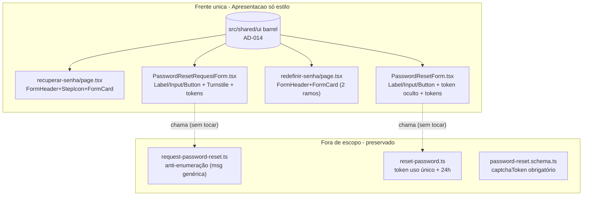

# USP-005 Recuperar senha esquecida - Refactor (Fase 1) Design

**Spec**: `.specs/features/identity-acesso-papeis/usp-005-recuperar-senha/spec.md`
**Status**: Draft

> **Fontes da verdade upstream (adaptar, não re-derivar):**
> - Design System: `.specs/features/fundacao-ui-design-system/design.md` + barrel `src/shared/ui/index.ts` (**AD-014**, STATE.md).
> - Linguagem visual: protótipo `docs/prototipo/index.html` - estilos `.form-card`/`.form-header`/`.step-icon`/`.btn*` (L521-577, L158-184). As telas de recuperação/redefinição **não existem** no protótipo: aplica-se a **linguagem** (mesmo card/header/botão do login/cadastro), não cópia 1:1.
> - Padrão de restyle já mergeado (Unidade 0): `src/modules/identity/components/LoginForm.tsx` + `src/app/(auth)/login/page.tsx` - **modelo verbatim a seguir**.
> - Fluxo/invariantes preservados: épico `.specs/features/identity-acesso-papeis/spec.md` (IDN-12..13); ADR-0014 (CAPTCHA); anti-enumeração e uso único do token nas actions (`request-password-reset.ts`, `reset-password.ts`).
>
> **Decisões ativas de STATE.md `## Decisions`:** AD-014 (DS) e AD-013 (precedente ad-hoc) são os constraints. Este design **conforma** a AD-014; não supersede nada.

---

## Architecture Overview

Uma única frente de apresentação (só estilo) sobre código já entregue: 2 páginas + 2 formulários. Todo
o comportamento de segurança vive nas Server Actions e schemas, que **não** são tocados. Nenhum modelo
de dados, migração Prisma ou contrato de fluxo muda.

**Princípio:** troca **apenas marcação/classe**. Nenhum handler, schema, action, navegação, metadata ou
config de cache muda. As guardas de segurança (CAPTCHA fail-closed, anti-enumeração, token) são
propriedades preservadas pela disciplina de "só estilo" e travadas pelos testes existentes.

---

## Code Reuse Analysis

### Existing Components to Leverage

| Component | Location | How to Use |
| --- | --- | --- |
| Primitivos DS | `src/shared/ui/index.ts` | `FormHeader`, `StepIcon`, `FormCard`, `Label`, `Input`, `Button` via barrel `@/shared/ui`. |
| Padrão de restyle (login) | `src/modules/identity/components/LoginForm.tsx` + `src/app/(auth)/login/page.tsx` | Modelo verbatim: `Label`+`Input`, `Button variant="primary"`, caixa de erro danger-token, `FormHeader`+`FormCard` na página, links `text-primary hover:underline`, texto auxiliar `text-fg-muted`. |
| Teste RTL dos forms | `src/modules/identity/__tests__/PasswordResetForms.test.tsx` | 6 casos existentes; **manter verdes** (labels, botões, mensagem genérica, "CAPTCHA obrigatório", `role=alert`, token). |
| Teste de página | `src/app/(auth)/redefinir-senha/page.test.tsx` | 2 casos existentes; **manter verdes** (ramo sem token → `role=alert` + link; ramo com token → form). |

### Integration Points

| System | Integration Method |
| --- | --- |
| App Router `(auth)` | Rotas já `force-dynamic`; restyle não altera cache/metadata; `searchParams.token_hash` preservado. |
| `react-hook-form` | `Input` encaminha `ref`/props → `register()` (incl. `token` oculto e `captchaToken` oculto) inalterado. |
| `@marsidev/react-turnstile` | `<Turnstile>` + `handleCaptchaSuccess` preservados; só o container é restilizado. |
| Vitest (jsdom) | RTL dos forms + page.test rodam em `npm run test` (sem Postgres). |

---

## Components

### `PasswordResetRequestForm` (restyle - Client Component)
- **Purpose**: solicitação de recuperação restilizada; comportamento (CAPTCHA, anti-enumeração) intacto.
- **Location**: `src/modules/identity/components/password-reset-request-form.tsx`
- **Interfaces**: props inalteradas (`siteKey`). Internamente: `<label>`→`Label`, `<input>`→`Input`,
  `<button>`→`Button variant="primary"`; caixa de erro do servidor danger-token; caixa de confirmação
  success-token (`bg-[color-mix(in_srgb,var(--color-success)_10%,transparent)] text-success`,
  `role="status"`); link "Voltar para o login" `text-primary`; texto auxiliar `text-fg-muted`.
- **Preserva (must-not U5-MN-01/02):** `<Turnstile>` + `<input type="hidden" {...register('captchaToken')} />`,
  o gate `if (!captchaToken) { setServerError(...); return; }`, a exibição de `result.data.message`
  (mensagem genérica) e o `if (confirmacao)` que oculta o formulário após envio; botão "Enviar link de
  recuperação"; label "E-mail".

### `PasswordResetForm` (restyle - Client Component)
- **Purpose**: definição de nova senha restilizada; token e comportamento intactos.
- **Location**: `src/modules/identity/components/password-reset-form.tsx`
- **Interfaces**: props inalteradas (`token`). Internamente: `<label>`→`Label`, `<input>`→`Input`,
  `<button>`→`Button variant="primary"`; caixa de erro danger-token; erros de campo `role="alert"`.
- **Preserva (must-not U5-MN-03):** `<input type="hidden" {...register('token')} />` +
  `defaultValues: { token }`, RHF+Zod (`resetPasswordSchema`), `resetPassword`, `router.replace` +
  `refresh`; labels "Nova senha"/"Confirmar nova senha"; botão "Redefinir senha".

### `recuperar-senha/page.tsx` (restyle - Server Component)
- **Purpose**: casca da página de solicitação com header/ícone/card do DS.
- **Location**: `src/app/(auth)/recuperar-senha/page.tsx`
- **Interfaces**: envolver em `FormHeader title="Recuperar senha" description="Informe o e-mail da sua
  conta..."` (+ opcional `StepIcon variant="blue"`) + `FormCard` ao redor do
  `PasswordResetRequestForm`.
- **Preserva**: `metadata`, `dynamic='force-dynamic'`, `siteKey={env.NEXT_PUBLIC_TURNSTILE_SITE_KEY}`.

### `redefinir-senha/page.tsx` (restyle - Server Component, 2 ramos)
- **Purpose**: casca da página de redefinição; ambos os ramos restilizados.
- **Location**: `src/app/(auth)/redefinir-senha/page.tsx`
- **Interfaces**: `FormHeader title="Definir nova senha" description="Escolha uma nova senha..."`
  (+ opcional `StepIcon variant="blue"`) + `FormCard`; ramo com token → `<PasswordResetForm token=... />`;
  ramo sem token → alerta danger-token "Link inválido ou incompleto" (`role="alert"`) + link "Solicitar
  novo link" (`text-primary`, href `/recuperar-senha`).
- **Preserva (must-not U5-MN-03):** leitura de `await searchParams`, a condição `token_hash ? ... : ...`,
  `metadata`, `dynamic='force-dynamic'`. **Deve manter verde** `redefinir-senha/page.test.tsx`.

---

## Data Models

N/A - nenhum modelo de dados, migração Prisma ou tabela é criado ou alterado. O restyle é puramente de
apresentação; toda a lógica de segurança permanece nas actions/schemas intocados.

---

## Error Handling Strategy

| Error Scenario | Handling | User Impact |
| --- | --- | --- |
| CAPTCHA não resolvido na solicitação | gate client (`setServerError`) + Zod "CAPTCHA obrigatório" (ambos preservados) | Mensagem exibida; sem submit à action. |
| E-mail inexistente na solicitação | action retorna a **mesma** mensagem genérica (não tocada) | Confirmação idêntica; sem revelar inexistência. |
| `redefinir-senha` sem `token_hash` | ramo condicional (preservado) exibe alerta + link "Solicitar novo link" | Orientação para novo link; sem formulário. |
| Token inválido/expirado no submit | action retorna erro (não tocada); form exibe em caixa danger-token | "Link inválido ou expirado..."; sem redirect. |
| Senha fraca/divergente no reset | gate client Zod (`role="alert"`) | Erro exibido; sem submit à action. |
| Tema/`localStorage` indisponível | coberto pela fundação (ThemeScript try/catch) | Sem FOUC; segue `prefers-color-scheme`. |

---

## Risks & Concerns

| Concern | Location (file:line) | Impact | Mitigation |
| --- | --- | --- | --- |
| Restyle da caixa de confirmação (verde) pode alterar o seletor do teste anti-enumeração | `password-reset-request-form.tsx:54-67` | Teste "confirmação genérica" vermelho se o texto/estrutura mudar | Preservar o texto de `result.data.message` e `role="status"`; só trocar as classes (verde → success-token). Teste assevera por `findByText(GENERIC)`, agnóstico à classe. |
| Restyle pode remover o campo `token`/`captchaToken` oculto por engano | `password-reset-form.tsx:45`, `password-reset-request-form.tsx:93` | Uso único / CAPTCHA quebrados; testes vermelhos | Manter os `<input type="hidden" {...register(...)} />`; a disciplina "só marcação de apresentação" não toca campos ocultos. Testes existentes travam. |
| `redefinir-senha/page.test.tsx` assevera `role="alert"` no ramo sem token e ausência no ramo com token | `redefinir-senha/page.test.tsx:22-39` | Restyle que mova/duplique `role="alert"` quebra o teste | Manter exatamente um `role="alert"` no ramo sem token (a caixa danger-token) e nenhum no ramo com token; link "Solicitar novo link"→`/recuperar-senha` preservado. |
| Restyle toca componentes/rotas do módulo `identity` já entregue | 4 arquivos | Regressão do fluxo de recuperação | Só marcação/estilo; 8 testes existentes (6 forms + 2 página) mantidos verdes asseveram preservação. |
| `StepIcon` do protótipo não tem glifo canônico p/ senha | `src/shared/ui/step-icon.tsx` | Paridade de ícone não é 1:1 | `StepIcon` recebe SVG `children` com `currentColor`; glifo de cadeado/chave é decorativo e discricionário. |

> Nenhum outro concern relevante encontrado nos arquivos tocados.

---

## Tech Decisions (only non-obvious ones)

| Decision | Choice | Rationale |
| --- | --- | --- |
| Caixa de sucesso (confirmação) | success-token (`color-mix` sobre `--color-success`) | Tokeniza sem hex cru (mesma técnica do `StepIcon`/`LoginForm`); preserva `role="status"` e o texto genérico. |
| StepIcon nas telas de auth | Incluir `StepIcon variant="blue"` (glifo discricionário) | Ecoa o par form-header/step-icon do protótipo; `FormHeader`+`FormCard` (iguais ao login) garantem a paridade de token. |
| Gate do restyle de `redefinir-senha` | build (roda também o page.test) | A página tem `redefinir-senha/page.test.tsx` (unit) que deve permanecer verde; o gate build inclui `npm run test`. |
| Anti-enumeração | preservar a action + a exibição da mensagem genérica; sem ramo de UI por existência | O form nunca conhece a existência do e-mail; a segurança recai na action (não tocada). |

> **Nenhuma decisão nova de projeto (AD-NNN).** Este design conforma a AD-014; não cria convenção nova.

---

## Tips aplicadas
- Reuse é rei: `LoginForm`/`login/page.tsx` são o gabarito de restyle das 4 telas.
- Escopo travado: só estilo; nenhuma action/schema/navegação tocada; guardas de segurança preservadas pelos testes existentes.
- Interfaces first: props dos forms inalteradas; campos ocultos (`token`/`captchaToken`) preservados.
