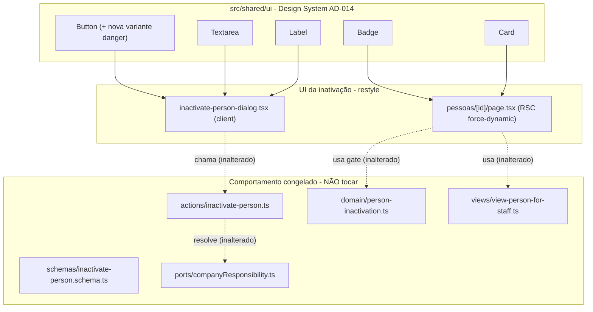

# USP-007 Inativar Pessoa - Restyle ao DS - Design

**Spec:** `.specs/features/identity-acesso-papeis/usp-007-inativar-pessoa/spec.md`
**Status:** Draft

> **Upstream (adaptar, não re-derivar):** comportamento canônico no épico
> `identity-acesso-papeis/spec.md` (IDN-15/16) + código já entregue; convenção de DS em
> STATE.md `AD-014` + `.specs/features/fundacao-ui-design-system/design.md`. Nenhuma decisão
> ativa do STATE conflita com este design - ele **conforma** ao AD-014 e o **estende** com uma
> variante `danger` do `Button` (adição token-based, não supersede AD-014).

---

## Architecture Overview

Refactor puramente de apresentação sobre 3 arquivos de UI + 1 primitivo do DS. Nenhum modelo de
dados, Server Action, query, view model ou navegação é criado ou alterado.

**Princípio central do restyle:** apenas markup/classes mudam. Handlers (`onSubmit`,
`closeDialog`, `useTransition`, `router.refresh`), RHF+Zod (`useForm`/`register`/`handleSubmit`),
a chamada `inactivatePerson(data)`, o overlay bespoke (backdrop + `role="dialog"` + Esc + `autoFocus`)
e todas as guardas/config da página permanecem byte-a-byte. Os tokens re-resolvem no `[data-theme]`
- sem `dark:` explícito.

---

## Mecanismo de diálogo existente (resposta ao ponto do brief)

O diálogo **NÃO** usa Radix Dialog nem shadcn Dialog. É um **modal bespoke**:

- backdrop `fixed inset-0 z-50 ... bg-black/40` com `onClick` para fechar;
- cartão interno `role="dialog" aria-modal aria-labelledby` com `stopPropagation`;
- fechar no `Esc` via `useEffect` + listener `keydown`;
- `autoFocus` no `<textarea>`.

O DS (barrel `src/shared/ui/index.ts`) **não exporta** Dialog/Modal, e o `package.json` só tem
`@radix-ui/react-label` e `@radix-ui/react-slot` (nenhum `@radix-ui/react-dialog`). **Decisão:** manter
o overlay bespoke e apenas trocar as classes por tokens + usar `Button`/`Textarea`/`Label`. **Não**
introduzir dependência de dialog (U7-MN-02 / allowlist do AD-014). Se um primitivo Dialog for
desejado, é trabalho de fundação (AD-014), fora desta unidade.

---

## Code Reuse Analysis

### Existing Components to Leverage

| Component | Location | How to Use |
|---|---|---|
| `Button` (cva + Radix Slot) | `src/shared/ui/button.tsx` | Estender com variante `danger`; consumir `danger`/`outline` no diálogo. |
| `Textarea` | `src/shared/ui/textarea.tsx` | Substitui o `<textarea className={inputClass}>` bruto; `forwardRef` compatível com `register()`. |
| `Label` | `src/shared/ui/label.tsx` | Substitui o `<label>` bruto (a11y `htmlFor` preservado). |
| `Badge` (variantes blue/orange/green/gray) | `src/shared/ui/badge.tsx` | Selo de status na página: `green` = Ativa. |
| `Card` | `src/shared/ui/card.tsx` | Envolver a seção "Inativar acesso" da página (surface+border+shadow). |
| Guarda `DS-MN-02` | `src/shared/ui/__tests__/` (padrão AD-014) | Já cobre hex/paleta em `src/shared/ui/**` - protege a nova variante `danger`. |
| Testes RTL do diálogo | `src/modules/persons/__tests__/InactivatePersonDialog.test.tsx` | Rede de regressão; devem seguir verdes e inalterados. |

### Integration Points

| System | Integration Method |
|---|---|
| `react-hook-form` | `Textarea` encaminha `ref`+props → `register('reason')` inalterado. |
| Server Action `inactivatePerson` | Chamada inalterada (`onSubmit` idêntico). |
| Tailwind tokens | `content` já cobre `src/modules/**` e `src/shared/**`; classes-token preservadas no purge. |
| Vitest (jsdom) | `InactivatePersonDialog.test.tsx` e `button.test.tsx` rodam em `npm run test`. |

---

## Components

### Button - adicionar variante `danger`

- **Purpose:** tratamento visual de ação destrutiva reutilizável no DS.
- **Location:** `src/shared/ui/button.tsx` (modificar cva) + `src/shared/ui/__tests__/button.test.tsx` (nova asserção).
- **Interfaces:** `<Button variant="danger">` - adiciona à união de variantes existente.
- **Classes propostas (guard-safe, token-based):** `danger: 'bg-danger text-white hover:shadow-md hover:brightness-95'`. Usa o token `bg-danger` (mapeado a `var(--color-danger)` no `tailwind.config.ts`), **sem** hex cru (respeita DS-MN-02). `hover:brightness-95` é utilitário de filtro (não paleta) e não dispara a guarda. A base cva (`transition-all`, `hover:-translate-y-px`, `disabled:opacity-60`) já cobre o resto.
- **Dependencies:** `class-variance-authority`, `cn` (já presentes).
- **Reuses:** o próprio `buttonVariants` cva; nada novo importado.
- **Não-regressão:** `primary`/`secondary`/`outline` ficam idênticas; a nova entrada é aditiva.

### inactivate-person-dialog.tsx - restyle

- **Purpose:** diálogo de confirmação da inativação, agora estilizado pelo DS.
- **Location:** `src/modules/persons/components/inactivate-person-dialog.tsx` (modificar markup/classes).
- **O que muda (apenas apresentação):**
  - remover a const local `inputClass`; o `<textarea>` vira `<Textarea>`;
  - `<label>` → `<Label htmlFor="reason">` (mantendo o texto "Motivo da inativação *");
  - gatilho "Inativar Pessoa" e "Confirmar inativação" → `<Button variant="danger">` (o de submit mantém `type="submit"` e o texto dinâmico "Inativando..."/"Confirmar inativação");
  - "Cancelar" → `<Button variant="outline" type="button">`;
  - casca: `bg-white` → `bg-surface`; `text-gray-900` → `text-fg`; `text-gray-600` → `text-fg-muted`; `rounded-xl`/`shadow-xl` mantidos como `rounded-lg`/`shadow-xl` (tokens de radius/shadow do DS); bloco de erro `bg-red-50 text-red-700` → tratamento token (`bg-danger/10 text-danger` ou equivalente com token, sem hex);
  - backdrop `bg-black/40` **preservado** (scrim neutro; arquivo fora do escopo da guarda DS-MN-02, que só cobre `src/shared/ui/**`).
- **O que NÃO muda:** todos os hooks/handlers, `useForm`/`register`/`handleSubmit`, `startTransition`, `router.refresh`, o `<input type="hidden" {...register('personId')}>`, a lógica de Esc/overlay, `aria-*`, os `id`/`role="alert"` e os **nomes acessíveis** dos botões (seletores dos testes).
- **Reuses:** `Button`, `Textarea`, `Label` do barrel `@/shared/ui`.

### pessoas/[id]/page.tsx - restyle (arquivo único, ambos os ramos)

- **Purpose:** tela de gestão da Pessoa (RSC `force-dynamic`), reestilizada ao DS.
- **Location:** `src/app/(app)/pessoas/[id]/page.tsx` (modificar markup/classes).
- **O que muda (apresentação, ambos os ramos ATIVO e INATIVO no mesmo passe):**
  - selo de status: `` → `<Badge variant="green">Ativa</Badge>` / `<Badge variant="gray">Inativa</Badge>`;
  - `<h1 className="text-2xl font-bold text-gray-900">` → `font-heading` + `text-fg`;
  - seções `<section className="... border border-gray-200 p-5">` → `<Card>` (ou tokens `border-border`/`bg-surface`);
  - textos `text-gray-600`/`text-gray-500`/`text-amber-700` → tokens (`text-fg-muted`; o aviso `isSelf` fica em token de destaque, ver Error Handling);
  - `bg-gray-50` (seção INATIVO) → `bg-background`/token.
- **O que NÃO muda (U7-MN-03):** `requireActivePerson()`, `hasInactivationPrivilege(...)→notFound()`, `viewPersonForStaff(id)`, `const isSelf`, `hasReactivationPrivilege(...)`, `export const dynamic='force-dynamic'`, o mapa `ROLE_LABELS`, e toda a estrutura condicional (`person.status === 'ATIVO' ? ... : ...`). Os componentes de diálogo continuam sendo renderizados com as mesmas props.
- **Nota de escopo:** o ramo INATIVO renderiza `<ReactivatePersonDialog>` (cujo **restyle interno** é da USP-045). Restilizar a **página** aqui (badge/cartão/tokens) não toca o componente de reativação - são arquivos distintos.
- **Reuses:** `Badge`, `Card` do barrel `@/shared/ui`; `formatSaoPaulo` inalterado.

---

## Data Models (if applicable)

N/A - unidade puramente de apresentação. Nenhum modelo Prisma, Server Action, schema Zod ou
query é criado/alterado. Os campos de `Person` (`status`, `inactivatedAt/By/Reason`) e
`PersonRoleGrant` são apenas **lidos** pelas funções já existentes (inalteradas).

---

## Error Handling Strategy

| Error Scenario | Handling | User Impact |
|---|---|---|
| `PRECONDITION_FAILED` (único responsável) | `serverError` renderizado no bloco de erro (agora token) - diálogo permanece aberto | Mensagem preservada; só o estilo do bloco muda. |
| Validação Zod (motivo curto) | `errors.reason` no `role="alert"` (token de texto danger) | Comportamento preservado; seletor `role="alert"` mantido. |
| `isSelf` na página | Aviso preservado, reestilizado com token de destaque (ex.: `text-cta` ou bloco `bg-danger/10`) em vez de `text-amber-700` | Mesma mensagem; cor passa a ser do sistema de tokens. |
| Dark mode | Tokens re-resolvem no `[data-theme="dark"]` | Sem FOUC/ilegibilidade; sem `dark:` extra. |

> **Aviso `isSelf` e cor "amber":** o DS não tem token de "warning/amber". Como o arquivo está
> fora do escopo da guarda DS-MN-02, seria tecnicamente permitido manter `text-amber-700`, mas isso
> quebraria a consistência da linguagem de tokens. **Decisão:** usar um token do sistema
> (recomendado `text-cta`/`text-fg-muted` ou um bloco `bg-danger/10 text-danger` para avisos fortes).
> Gap documentado: "o DS carece de token de warning" (ver Risks).

---

## Risks & Concerns

| Concern | Location (file:line) | Impact | Mitigation |
|---|---|---|---|
| Restyle pode inadvertidamente mudar o nome acessível de um botão e quebrar os testes RTL | `inactivate-person-dialog.tsx:79-85,146-152` | Testes RTL falham; ou pior, passam mas o seletor muda | Manter textos exatos dos botões; U7-05 e o gate `npm run test` protegem. |
| Adicionar variante ao `Button` toca uma fundação já validada (AD-014 PASS) | `src/shared/ui/button.tsx` | Regressão em consumidores do `Button` | Mudança **aditiva** (nova entrada cva); nenhum consumidor usa `danger` hoje; `button.test.tsx` cobre variantes existentes + nova. |
| DS não tem token de warning/amber | `reactivate`/`page.tsx` (aviso) | Inconsistência ao mapear "amber" | Usar token existente; registrar gap "DS carece de warning token" como candidato para a fundação (não implementar aqui). |
| Backdrop `bg-black/40` é utilitário de paleta fixa | `inactivate-person-dialog.tsx:89` | Poderia parecer violar a linguagem de tokens | Aceito: é um scrim neutro, o arquivo está fora da guarda DS-MN-02 (`src/shared/ui/**`); o protótipo usa scrim análogo. |
| Página sem teste de rota | `pessoas/[id]/page.tsx` | Preservação de comportamento não coberta por teste | Gate de build+typecheck+diff review; guardas/config byte-a-byte inalteradas (U7-MN-03). |

> Nenhum outro concern relevante nos arquivos tocados.

---

## Tech Decisions (only non-obvious ones)

| Decision | Choice | Rationale |
|---|---|---|
| Ação destrutiva no DS | Adicionar **variante `danger`** ao `Button` (token `bg-danger`) | DRY/reusável e alinhado ao protótipo; alternativa (override `bg-danger` por call-site) evita tocar a fundação mas espalha cor no consumidor - registrada como fallback. |
| Reativação usa `primary` (laranja), inativação usa `danger` (vermelho) | Não adicionar variante `success`; reativar é a CTA positiva da tela (laranja) | Minimiza a mudança na fundação (só 1 variante nova); o "positivo" já é sinalizado pelo contexto/Badge. |
| Manter overlay bespoke | Não introduzir `@radix-ui/react-dialog` | DS não tem Dialog; allowlist do AD-014 fecha deps novas; U7-MN-02. |
| Página como 1 tarefa (ambos os ramos) | USP-007 possui o restyle de `page.tsx` inteiro; USP-045 não toca a página | Ownership de arquivo limpo no pipeline por-unidade. |

> **Extensão do `Button` vs. AD-014:** adicionar a variante `danger` **estende** o contrato do
> primitivo `Button` fixado no AD-014, consumindo um token que o AD-014 já definiu
> (`--color-danger`). Não é uma nova decisão de projeto (não muda convenção nem supersede nada);
> fica como decisão feature-local. **Sinalizo no relatório** ao orquestrador para ciência, com o
> fallback (override por call-site) caso se prefira **zero** toque na fundação.
