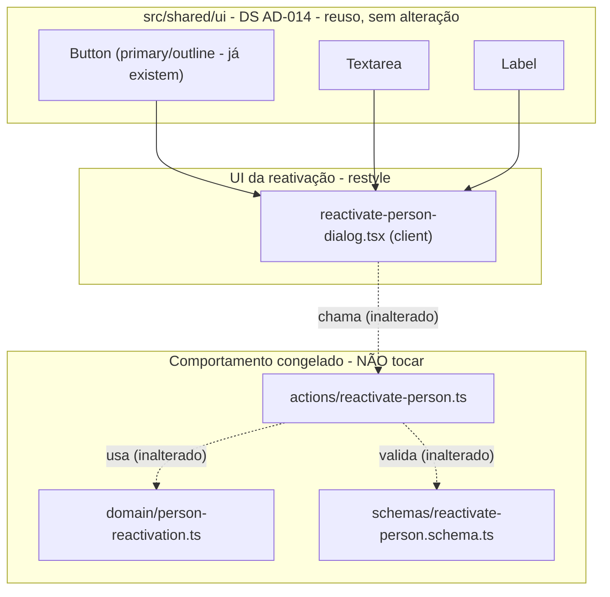

# USP-045 Reativar Pessoa - Restyle ao DS - Design

**Spec:** `.specs/features/identity-acesso-papeis/usp-045-reativar-pessoa/spec.md`
**Status:** Draft

> **Upstream (adaptar, não re-derivar):** comportamento canônico é o **código já entregue**
> (a spec desta USP é um backfill dele) - preservar, não re-decidir. Convenção de DS em STATE.md
> `AD-014` + `.specs/features/fundacao-ui-design-system/design.md`. Nenhuma decisão ativa do STATE
> conflita: este design **conforma** ao AD-014 e consome só variantes de `Button` já existentes
> (`primary`/`outline`) - **não** toca a fundação `src/shared/ui`.

---

## Architecture Overview

Refactor puramente de apresentação sobre 1 arquivo de UI (o diálogo). O `page.tsx` (ramo INATIVO)
é reestilizado pela **USP-007** (arquivo único). Nenhum comportamento, modelo, action, schema ou
query é alterado.

**Princípio central do restyle:** só markup/classes mudam. `useForm`/`register`/`handleSubmit`,
`onSubmit`→`reactivatePerson(data)`→`router.refresh()`, `useTransition`, overlay bespoke (backdrop
+ `role="dialog"` + Esc + `autoFocus`) e o **aviso de zeragem de grants** permanecem. Tokens
re-resolvem no `[data-theme]`.

---

## Mecanismo de diálogo existente

Idêntico ao da USP-007: **modal bespoke** (não Radix Dialog, não shadcn Dialog). Backdrop
`fixed inset-0 z-50 bg-black/40`, cartão `role="dialog" aria-modal aria-labelledby`, Esc via
`useEffect`+`keydown`, `autoFocus` no `<textarea>`. O DS não tem Dialog e o `package.json` não tem
`@radix-ui/react-dialog`. **Decisão:** manter o overlay bespoke; só trocar classes por tokens e usar
`Button`/`Textarea`/`Label`. **Não** introduzir dependência de dialog (U45-MN-R03).

---

## Code Reuse Analysis

### Existing Components to Leverage

| Component | Location | How to Use |
|---|---|---|
| `Button` (`primary`/`outline`) | `src/shared/ui/button.tsx` | `primary` = gatilho "Reativar Pessoa" + "Confirmar reativação"; `outline` = "Cancelar". **Sem** variante nova (não toca a fundação). |
| `Textarea` | `src/shared/ui/textarea.tsx` | Substitui o `<textarea className={inputClass}>`; `forwardRef` compatível com `register()`. |
| `Label` | `src/shared/ui/label.tsx` | Substitui o `<label>` bruto ("Motivo da reativação"). |
| Testes RTL do diálogo | `src/modules/persons/__tests__/ReactivatePersonDialog.test.tsx` | Rede de regressão (inclui a asserção do aviso de zeragem); devem seguir verdes e inalterados. |

### Integration Points

| System | Integration Method |
|---|---|
| `react-hook-form` | `Textarea` encaminha `ref`+props → `register('reason')` inalterado. |
| Server Action `reactivatePerson` | Chamada inalterada. |
| Tailwind tokens | `content` cobre `src/modules/**`; classes-token preservadas no purge. |
| Vitest (jsdom) | `ReactivatePersonDialog.test.tsx` roda em `npm run test`. |

---

## Components

### reactivate-person-dialog.tsx - restyle

- **Purpose:** diálogo de confirmação da reativação, estilizado pelo DS, com o aviso de zeragem de grants preservado.
- **Location:** `src/modules/persons/components/reactivate-person-dialog.tsx` (modificar markup/classes).
- **O que muda (apenas apresentação):**
  - remover a const local `inputClass`; `<textarea>` → `<Textarea>`;
  - `<label>` → `<Label htmlFor="reactivation-reason">` (mantendo o texto "Motivo da reativação *");
  - gatilho "Reativar Pessoa" e submit "Confirmar reativação" → `<Button variant="primary">` (submit mantém `type="submit"` e o texto dinâmico "Reativando..."/"Confirmar reativação");
  - "Cancelar" → `<Button variant="outline" type="button">`;
  - casca: `bg-white`→`bg-surface`; `text-gray-900`→`text-fg`; `text-gray-600`→`text-fg-muted`; `rounded-xl`→`rounded-lg`; `shadow-xl` mantido; bloco de erro `bg-red-50 text-red-700`→token;
  - **aviso de zeragem** `bg-amber-50 text-amber-800` → bloco de atenção com token (recomendado `bg-danger/10 text-danger border border-danger/30`, ou `bg-background`+`text-fg` com "Atenção:" em negrito) - **texto preservado**;
  - backdrop `bg-black/40` preservado (scrim neutro; fora da guarda DS-MN-02).
- **O que NÃO muda:** todos os hooks/handlers, `useForm`/`register`/`handleSubmit`, `startTransition`, `router.refresh`, o `<input type="hidden" {...register('personId')}>`, a lógica de Esc/overlay, `aria-*`, os `id`/`role="alert"` e os **nomes acessíveis** dos botões (seletores dos testes).
- **Reuses:** `Button`, `Textarea`, `Label` do barrel `@/shared/ui`.

> **Nota de escopo (página):** o ramo INATIVO de `pessoas/[id]/page.tsx` (Badge "Inativa", metadados,
> CTA de reativação, gate `hasReactivationPrivilege`) é reestilizado pela **USP-007** (tarefa de
> página, arquivo único). Esta unidade **não** edita `page.tsx`.

---

## Data Models (if applicable)

N/A - unidade puramente de apresentação. `Person.status`/`inactivated*` e `PersonRoleGrant`
(ACTIVE→REVOKED) são manipulados apenas pela action já existente (inalterada).

---

## Error Handling Strategy

| Error Scenario | Handling | User Impact |
|---|---|---|
| `FORBIDDEN` (rank insuficiente) | `serverError` no bloco de erro (agora token) - diálogo permanece aberto | Mensagem preservada; só o estilo muda. |
| Validação Zod (motivo curto) | `errors.reason` no `role="alert"` (token) | Comportamento e seletor preservados. |
| Aviso de zeragem de grants | Bloco de atenção reestilizado com token; texto intacto | Operador continua ciente de que os papéis serão removidos (U45-MN-R02). |
| Dark mode | Tokens re-resolvem no `[data-theme="dark"]` | Sem `dark:` extra. |

> **Cor "amber" do aviso:** o DS não tem token de warning. Como o arquivo está fora da guarda
> DS-MN-02, manter amber seria permitido, mas quebraria a linguagem de tokens. **Decisão:** usar
> token do sistema. Gap "DS carece de warning token" registrado em Risks (candidato de fundação,
> não implementado aqui).

---

## Risks & Concerns

| Concern | Location (file:line) | Impact | Mitigation |
|---|---|---|---|
| Restyle pode mudar nome acessível de botão e quebrar RTL | `reactivate-person-dialog.tsx:78-84,149-155` | Teste RTL falha | Manter textos exatos; U45-03 + `npm run test`. |
| Reestilizar o aviso pode alterar/remover o texto e furar a must-not | `reactivate-person-dialog.tsx:105-109` | U45-MN-R02 violada | Preservar o texto exato do aviso; asserção RTL existente cobre. |
| DS não tem token de warning/amber | `reactivate-person-dialog.tsx:105` | Inconsistência ao mapear "amber" | Usar token existente; registrar gap de fundação como candidato. |
| Backdrop `bg-black/40` (paleta fixa) | `reactivate-person-dialog.tsx:88` | Poderia parecer violar tokens | Aceito: scrim neutro, fora da guarda DS-MN-02 (`src/shared/ui/**`). |

> Nenhum outro concern relevante nos arquivos tocados.

---

## Tech Decisions (only non-obvious ones)

| Decision | Choice | Rationale |
|---|---|---|
| Botão de reativação | `Button variant="primary"` (laranja CTA) | Reativar é a CTA positiva da tela; evita adicionar variante `success` à fundação. |
| Cancelar | `Button variant="outline"` | Ação secundária neutra do DS. |
| Aviso de zeragem | Bloco de atenção com token, texto preservado | Consistência de tokens + must-not U45-MN-R02. |
| Página não é tocada aqui | Restyle de `page.tsx` pertence à USP-007 (arquivo único) | Ownership de arquivo limpo no pipeline por-unidade. |
| Manter overlay bespoke | Não introduzir `@radix-ui/react-dialog` | DS não tem Dialog; allowlist AD-014; U45-MN-R03. |

> **Sem toque na fundação:** esta unidade consome apenas variantes de `Button` já existentes; ao
> contrário da USP-007 (que adiciona `danger`), a USP-045 **não** modifica `src/shared/ui`. Se a
> USP-007 rodar antes (dep da 045 no ROADMAP), a variante `danger` já existirá - mas a 045 não
> depende dela.
