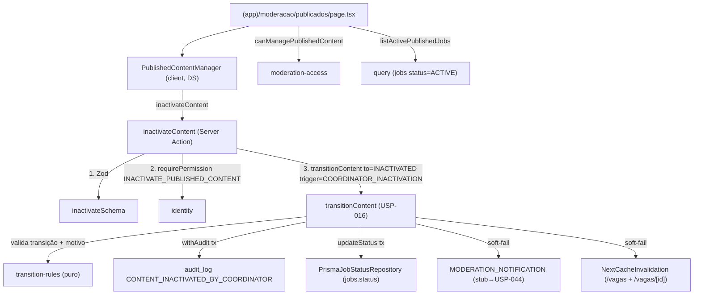

# USP-018 — Inativar conteúdo já publicado — Design

**Spec**: `.specs/features/moderacao-conteudo/usp-018-inativar-conteudo/spec.md`
**Status**: Draft

## 💠 Upstream design constraints (referenced, not re-decided)

- **ADR-0011** (`docs/arch/0011-maquina-estados-moderacao.md` L128, L187-193): `ACTIVE → INACTIVATED` / `COORDINATOR_INACTIVATION` / `requiresJustification`; histórico no `audit_log` (sem tabela de transições). **Design conforma.**
- **AD-009** (STATE): status vive na entidade (`Job.status`), adapter por `ContentKind` — já cabeado (`PrismaJobStatusRepository` no container). **Conforma.**
- **AD-005** (STATE): `transitionContent` acessa status via `ContentStatusRepository`; fila opera hoje sobre `_moderation_fixture`, mas JOB já tem adapter real. **Conforma.**
- **AD-014** (STATE): Design System — toda UI nova consome `@/shared/ui` + tokens; dark mode via `[data-theme]` (sem `dark:`); **sem nova dependência** (DS-MN-05); **sem hex cru em `shared/ui`** (DS-MN-02). **Conforma.**
- **Sequência canônica de Server Action** (CLAUDE.md): Zod → `requirePermission` → (consent N/A) → precondições → `withAudit` (embutido em `transitionContent`). **Conforma.**

Nenhuma decisão upstream é contrariada → nenhum novo `AD-NNN` de supersessão. As duas decisões locais (nome do estado, superfície JOB) já estão nas Assumptions da spec.

---

## Architecture Overview

A **maior parte da máquina já existe** (USP-016). Esta USP adiciona a **via de entrada** (action + schema + guard), a **superfície** (query + página + UI DS) e **estende a revalidação de cache** para cobrir a página de detalhe. Nada muda no núcleo puro da FSM (a regra `ACTIVE → INACTIVATED` já está lá).



---

## Code Reuse Analysis

### Existing Components to Leverage

| Component | Location | How to Use |
| --------- | -------- | ---------- |
| `transitionContent` | `src/modules/moderation/actions/transition-content.ts` | **A única via** de mudança de status. Chamar com `to=INACTIVATED`, `trigger='COORDINATOR_INACTIVATION'`, `justification`. Já valida transição, exige motivo, audita na tx, dispara notificação + cache. |
| Regra `ACTIVE → INACTIVATED` | `moderation/domain/content-status.ts` L73 (`SHARED_TRANSITIONS`) | Já existe para JOB/CV/SERVICE/CANDIDATE_PROFILE (`requiresJustification: true`). Nada a adicionar no domínio. |
| `eventTypeFor` | `transition-content.ts` L144-159 | Já mapeia `INACTIVATED → CONTENT_INACTIVATED_BY_COORDINATOR`. Nada a mudar. |
| `isMeaningfulJustification` / `MIN_JUSTIFICATION_LENGTH` | `moderation/domain/justification.ts` | Reusar no `inactivateSchema` (idêntico a `rejectSchema`). |
| `requirePermission('INACTIVATE_PUBLISHED_CONTENT')` | `identity/server/require-permission.ts` | Passo 2 da action. Coordenador inerente + delegado (fail-closed). |
| `canAccessModerationQueue` (padrão) | `moderation/server/moderation-access.ts` | **Espelhar** em `canManagePublishedContent` (coordenador OU delegação `INACTIVATE_PUBLISHED_CONTENT`). |
| `InactivatePersonDialog` (padrão de UI) | `src/modules/persons/components/inactivate-person-dialog.tsx` | **Clonar o padrão** (client, `role="dialog"`, Escape-to-close, RHF+Zod, `<Textarea>` motivo obrigatório, `<Button variant="danger">`, `useTransition`, tokens DS). NÃO importar dep de Dialog (DS-MN-05). |
| Filtro público on-read | `jobs/queries/search-jobs.ts` L72 (`status='ACTIVE'`), `jobs/queries/get-job-detail.ts` | Já excluem tudo que não é `ACTIVE` ⇒ INACT-MN-04 estruturalmente satisfeito; **assertar** com teste negativo. |
| DS primitives | `@/shared/ui` (`Button` var `danger`, `Textarea`, `Card`, `Badge`, `Label`, `cn`) | UI da página + diálogo. |
| `formatSaoPaulo` | `@/shared/lib/time` | Formatar datas na listagem (fuso SP). |

### Integration Points

| System | Integration Method |
| ------ | ------------------ |
| `@/modules/moderation` barrel | Exportar `inactivateContent`, `inactivateSchema`/`InactivateContentInput`, `canManagePublishedContent`, `listActivePublishedJobs`, `PublishedContentManager`. |
| `@/modules/jobs` | Query lê `jobs` (`status=ACTIVE`); reusa a view/`company` select. A query pode viver em `jobs/queries` (dono do model) e ser consumida pela página de moderação — decisão em Tech Decisions. |
| `NextCacheInvalidation` | **Estender** `publicPathsFor`/`revalidateForContent` para revalidar também `/vagas/${contentId}` (detalhe), não só `/vagas`. |
| `src/app/(app)/moderacao/` | Nova rota `publicados/page.tsx` (`force-dynamic`), guardada. |

---

## Components

### `inactivateSchema` (Zod)
- **Purpose**: Validar `{ contentKind, contentId, justification }` com motivo significativo obrigatório.
- **Location**: `src/modules/moderation/schemas/inactivate.ts` (ou estender `schemas/decision.ts`).
- **Interfaces**: `inactivateSchema: ZodType<InactivateContentInput>`; reusa `contentRef` + `justification` de `decision.ts`.
- **Reuses**: `justification` (min 20 + `isMeaningfulJustification`), `contentRef`.

### `inactivateContent` (Server Action)
- **Purpose**: Via de entrada da inativação administrativa (genérica por `ContentKind`).
- **Location**: `src/modules/moderation/actions/inactivate.ts` (`'use server'`).
- **Interfaces**: `inactivateContent(input: InactivateContentInput): Promise<ActionResult<TransitionContentData>>`.
- **Sequência**: `inactivateSchema.safeParse` → `requirePermission('INACTIVATE_PUBLISHED_CONTENT')` (retorna `authz` se `!ok`) → `transitionContent({ contentKind, contentId, to: INACTIVATED, trigger: 'COORDINATOR_INACTIVATION', justification, actorPersonId: authz.data.person.id })`.
- **Dependencies**: `identity`, `transitionContent`, `inactivateSchema`.
- **Reuses**: padrão idêntico a `rejectContent` (`actions/decide.ts`), trocando permissão/estado/trigger.

### `canManagePublishedContent` (server guard)
- **Purpose**: `true` se a Pessoa pode ver/gerir conteúdo publicado (coordenador ou delegação ativa `INACTIVATE_PUBLISHED_CONTENT`).
- **Location**: `src/modules/moderation/server/moderation-access.ts` (adicionar função).
- **Interfaces**: `canManagePublishedContent(person: CurrentPerson): Promise<boolean>`.
- **Reuses**: `isCoordinator` + `prisma.delegatedPermission.findFirst({ permission: 'INACTIVATE_PUBLISHED_CONTENT', revokedAt: null })` (espelha `canAccessModerationQueue`).

### `listActivePublishedJobs` (query)
- **Purpose**: Listar vagas `ACTIVE` para a superfície de gestão (paginada).
- **Location**: `src/modules/jobs/queries/list-active-published-jobs.ts` (dono do model) OU `moderation/queries/`. **Decisão:** em `jobs` (regra: quem é dono do model expõe a leitura; a página de moderação consome via barrel `@/modules/jobs`).
- **Interfaces**: `listActivePublishedJobs(opts?: { page?: number }): Promise<{ items: PublishedJobRow[]; total: number; page: number; pageSize: number }>` com `take` obrigatório; `select` explícito (`id, title, publishedAt, company.nomeFantasia, area.name`).
- **Reuses**: convenção de paginação `search-jobs.ts`.

### `PublishedContentManager` (client component, DS)
- **Purpose**: Renderiza as vagas `ACTIVE` e permite inativar cada uma com motivo obrigatório.
- **Location**: `src/modules/moderation/components/published-content-manager.tsx` (`'use client'`).
- **Interfaces**: `PublishedContentManager({ items }: { items: PublishedContentRow[] })`. Cada linha: título/empresa (`Card`, `Badge`), botão "Inativar" (`Button variant="danger"`) que abre um bloco/diálogo com `<Textarea>` motivo + Confirmar/Cancelar; chama `inactivateContent` em `useTransition`; on-ok remove a linha; erros inline (`role="alert"`).
- **Padrão de UI**: clonar `InactivatePersonDialog` (overlay `role="dialog" aria-modal`, Escape) **ou** o inline-textarea de `moderation-queue.tsx`. Recomendado: **inline expandível** (mais simples, sem overlay, mesma UX da fila) usando `@/shared/ui`.
- **Reuses**: `@/shared/ui` (`Button`, `Textarea`, `Card`, `Badge`, `Label`, `cn`); `MIN_JUSTIFICATION_LENGTH`.

### Página `(app)/moderacao/publicados/page.tsx`
- **Purpose**: Superfície autenticada de gestão de conteúdo publicado.
- **Interfaces**: Server Component `force-dynamic`. `requireActivePerson()` → `canManagePublishedContent(person)` (senão `notFound()`) → `listActivePublishedJobs()` → mapeia para rows (datas em SP) → `<PublishedContentManager items={rows} />`.
- **Reuses**: padrão exato de `(app)/moderacao/page.tsx`.

### Extensão de `NextCacheInvalidation`
- **Purpose**: Revalidar também o detalhe da vaga (`/vagas/[id]`) na inativação (INACT-05 / INACT-MN-04).
- **Location**: `src/modules/moderation/adapters/next-cache-invalidation.ts`.
- **Change**: em `revalidateForContent`, quando `to ∈ {ACTIVE, INACTIVATED}` e `kind === JOB`, além de `revalidatePath('/vagas')`, chamar `revalidatePath('/vagas/' + target.contentId)`. (Continua soft-fail.)

---

## Data Models

**Nenhuma mudança de schema.** Reuso integral:

```prisma
// jobs.status já é ContentStatus (inclui INACTIVATED). Sem migration.
model Job { status ContentStatus @default(DRAFT) /* ... */ }
enum ContentStatus { /* ... */ INACTIVATED }
```

```typescript
// Tipos novos (TS apenas)
interface InactivateContentInput { contentKind: ContentKind; contentId: string; justification: string }
interface PublishedJobRow { id: string; title: string; companyName: string; areaName: string | null; publishedAtLabel: string }
```

---

## Error Handling Strategy

| Error Scenario | Handling | User Impact |
| -------------- | -------- | ----------- |
| Motivo ausente/curto/genérico | `inactivateSchema` falha ⇒ `fail('VALIDATION')`; defesa em profundidade em `transitionContent` (`JUSTIFICATION_REQUIRED`) | Mensagem inline "informe um motivo descritivo (≥20)". |
| Sem permissão | `requirePermission` ⇒ `FORBIDDEN`; página ⇒ `notFound()` | 404 na rota; erro inline se chamada direta. |
| Conteúdo não-`ACTIVE` | `transitionContent` ⇒ `INVALID_TRANSITION` | "Este item já foi atualizado / não pode ser inativado". |
| Inativação concorrente | `updateStatus` casa 0 linhas ⇒ `TransitionConflictError` ⇒ `INVALID_TRANSITION` | "Item já atualizado por outra decisão". |
| `contentId` inexistente | `loadStatus` null ⇒ `NOT_FOUND` | "Conteúdo não encontrado". |
| Falha de notificação/cache | soft-fail (log) — transição permanece | Nenhum; ISR de fallback cobre. |
| Falha de auditoria | `withAudit` aborta a tx ⇒ status **não** muda | Erro genérico; conteúdo continua público (fail-safe). |

---

## Risks & Concerns

| Concern | Location | Impact | Mitigation |
| ------- | -------- | ------ | ---------- |
| `NextCacheInvalidation` só revalida `/vagas` (lista), não o detalhe `/vagas/[id]` | `moderation/adapters/next-cache-invalidation.ts` L23-41 | Detalhe ISR poderia servir cache stale de vaga inativada (fere INACT-MN-04) | Estender para revalidar `/vagas/${contentId}` (task T5). `getActiveJobDetail` já filtra `ACTIVE` ⇒ mesmo sem revalidar, a re-render devolve 404; a revalidação garante imediatismo. |
| `moderation-queue.tsx` usa Tailwind cru (pré-DS) | `moderation/components/moderation-queue.tsx` | Inconsistência visual; NÃO é escopo desta USP | UI **nova** desta USP usa `@/shared/ui`; refactor da fila é débito separado (não tocar). |
| Notificação real ao autor é stub (GAP-3) | `adapters/stub-moderation-notification.ts` | AC-018-1 "e-mail ao autor" não entrega de fato até USP-044 | Assertar o seam; dependência externa registrada na spec (owner USP-044). |
| Fila `_moderation_fixture` vs adapters reais (AD-005) | container | Confusão sobre qual store atende JOB | JOB tem adapter real (`PrismaJobStatusRepository`); a inativação de vaga escreve em `jobs`, não na fixture. Testes de integração usam `jobs` real. |

> Concerns de segurança/perf adicionais: none found além dos acima.

---

## Tech Decisions (only non-obvious ones)

| Decision | Choice | Rationale |
| -------- | ------ | --------- |
| Onde vive a query de vagas `ACTIVE` | `src/modules/jobs/queries/list-active-published-jobs.ts` | `jobs` é dono do model `Job` (AD-009); moderação consome via barrel. Evita acoplar moderação ao schema de vaga. |
| Padrão de coleta de motivo | Inline expandível (como `moderation-queue.tsx`), com primitivas DS | Sem dep de Dialog (DS-MN-05); consistente com a fila; menor superfície de a11y a validar. (Alternativa: clonar `InactivatePersonDialog` — aceitável.) |
| Estado terminal `INACTIVATED` | Não adicionar transição de saída | Re-publicação é decisão de governança (Out of Scope); mantém INACT-MN-06 verificável no domínio. |
| Migration | Nenhuma | Enum/regra/evento/permissão já existem. |

> **Projeto-nível:** Esta USP NÃO introduz decisão que mude convenção do projeto (reusa padrões AD-005/AD-009/AD-014). Nada a acrescentar em STATE `## Decisions` além do registro de kickoff que o orquestrador fará.
