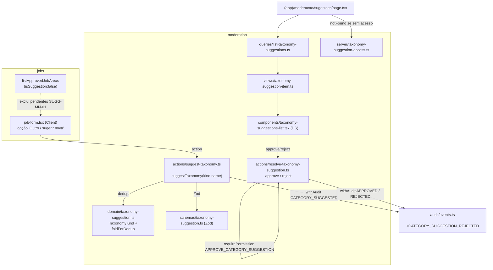

# USP-019 — Sugerir nova categoria de serviço ou área de vaga — Design

**Spec**: `.specs/features/moderacao-conteudo/usp-019-sugerir-categoria/spec.md`
**Status**: Draft

> **Adaptar, não re-derivar.** A persistência (`JobArea`/`ServiceCategory` com `isSuggestion`/`suggestedBy`/
> `approvedAt`/`approvedBy`/`name @unique`), a permissão (`APPROVE_CATEGORY_SUGGESTION`) e 2 dos 3 eventos de
> auditoria (`CATEGORY_SUGGESTED`, `CATEGORY_APPROVED`) **já existem** no código (ver spec §Upstream). Este
> design **não os re-decide** — descreve o fluxo que os costura: uma action genérica por `TaxonomyKind`, o
> dedup normalizado, a fila de pendentes e a superfície de aprovação, tudo dentro dos padrões canônicos
> (sequência de Server Action, `withAudit`, View Model, DS AD-014). Decisões de projeto aplicáveis:
> **AD-013** (taxonomia seedável / `isSuggestion=false` = aprovada; aprovação por moderação, não pelo seed),
> **AD-009** (status/estado mora na entidade, não em `content_items`; histórico no `audit_log`), **AD-014** (DS).

## 0. Decisão de arquitetura — onde mora o código

O fluxo é uma **governança de taxonomia**: um cidadão sugere, um detentor de `APPROVE_CATEGORY_SUGGESTION`
(inerente ao COORDINATOR + delegável) revisa. Isso é vizinho da moderação de conteúdo, já hospedada em
`@/modules/moderation` (fila, `canAccessModerationQueue`, rotas `(app)/moderacao/*`, `withAudit`).

**Escolha:** todo o novo código de sugestão vive em `@/modules/moderation` — **sem** criar um 12º módulo de
domínio. Criar `src/modules/taxonomy/` seria uma mudança estrutural que exigiria RFC/ADR (CLAUDE.md — "Root
`src/` structure is closed"); não há ganho no MVP. A entrada UI (formulário de vaga) permanece em `jobs` e
importa a action via o barrel `@/modules/moderation`. A query de leitura aprovada (`listApprovedJobAreas`)
permanece em `jobs` (já filtra `isSuggestion:false`).

## 1. Architecture Overview

Uma **camada fina genérica sobre dois delegates Prisma idênticos**. `JobArea` e `ServiceCategory` têm forma
idêntica (`id, name, isSuggestion, approvedAt, approvedBy, suggestedBy, createdAt`, `name @unique`). Um
seletor keyed em `TaxonomyKind` (`JOB_AREA | SERVICE_CATEGORY`) escolhe o delegate certo (`tx.jobArea` vs
`tx.serviceCategory`) e os metadados de auditoria (`entityType`). Três Server Actions (`suggest`, `approve`,
`reject`) seguem a sequência canônica; a leitura da fila é um View Model por papel; a UI usa o DS.

Nenhuma tabela nova, nenhum estado paralelo: o "status" da sugestão é derivado das colunas já existentes —
**pendente** = `isSuggestion=true AND approvedAt IS NULL`; **aprovada** = `isSuggestion=false`; **rejeitada**
= a linha deixa de existir (DELETE; histórico no `audit_log`). Isso é exatamente AD-009 (estado na entidade,
trilha no audit) aplicado à taxonomia.

## 2. Code Reuse Analysis

### Existing Components to Leverage

| Componente | Localização | Como usar |
| --- | --- | --- |
| `withAudit(event, fn, ctx)` | `src/modules/audit/withAudit.ts` | Envolve create/update/delete + grava audit **na mesma tx**; rollback se o audit falhar (SUGG-MN-04). |
| `AuditEvent.CATEGORY_SUGGESTED` / `CATEGORY_APPROVED` | `src/modules/audit/events.ts:103-104` | Eventos de sugerir/aprovar (já no catálogo). |
| `requirePermission('APPROVE_CATEGORY_SUGGESTION')` | `src/modules/identity/server/require-permission.ts` | Passo 2 canônico de approve/reject; retorna `ActionResult`, nunca lança (SUGG-MN-02). |
| `getCurrentPerson()` | `src/modules/identity/server/session.ts` | Ator autenticado no `suggestTaxonomy` (action retorna `ActionResult` ⇒ **não** usar `requireActivePerson`, que redireciona). |
| `checkPermission` / delegação | `src/modules/identity/domain/permissions.ts` | `APPROVE_CATEGORY_SUGGESTION` é inerente ao COORDINATOR e delegável. |
| `canAccessModerationQueue` (padrão) | `src/modules/moderation/server/moderation-access.ts` | Molde do gate de página → `notFound()` (SUGG-06). Novo helper análogo p/ `APPROVE_CATEGORY_SUGGESTION`. |
| `(app)/moderacao/page.tsx` (padrão) | `src/app/(app)/moderacao/page.tsx` | Molde da rota `force-dynamic` + `requireActivePerson` + `notFound()`. |
| `decide.ts` (padrão) | `src/modules/moderation/actions/decide.ts` | Molde de action: Zod → `requirePermission` → efeito; `ActionResult`. |
| `listApprovedJobAreas` (`isSuggestion:false`) | `src/modules/jobs/queries/list-approved-job-areas.ts` | Fonte da não-selecionabilidade (SUGG-MN-01); `list-approved-job-areas.int.test.ts` é o teste negativo. |
| `job-form.tsx` (select de área) | `src/modules/jobs/components/job-form.tsx:159-172` | Ponto de entrada "Outro / sugerir nova" (SUGG-07). |
| DS: `Card`/`Badge`/`Button`/`FormSectionTitle` | `src/shared/ui` (barrel) | UI da fila + do input de sugestão (AD-014). |
| Guarda estática (`node:fs`) | `src/modules/companies/__tests__/no-external-verify.test.ts` | Padrão de teste-guarda (não usado aqui salvo se preciso; o dedup/non-select são cobertos por int test). |
| `ActionResult` / `fail(code,…)` | `src/shared/errors.ts` | `VALIDATION` / `UNAUTHENTICATED` / `FORBIDDEN` / `NOT_FOUND` / **`CONFLICT`** (ver Tech Decisions: `DUPLICATE`→`CONFLICT`). |

### Integration Points

| Sistema | Método de integração |
| --- | --- |
| Catálogo de auditoria | Adicionar 1 constante `CATEGORY_SUGGESTION_REJECTED` a `events.ts` (mudança de código, `audit_log.action` é string — **sem migração de schema**). |
| RBAC | Reusa `APPROVE_CATEGORY_SUGGESTION` (já em `ROLE_PERMISSIONS[COORDINATOR]` + `DELEGABLE_PERMISSIONS`). |
| Formulário de vaga (`jobs`) | `job-form.tsx` ganha a opção "Outro" e chama `suggestTaxonomy({kind:'JOB_AREA', name})` via barrel `@/modules/moderation`. |
| Select de áreas aprovadas | `listApprovedJobAreas` **já** exclui pendentes — nenhuma mudança, só um teste que trava a exclusão. |

## 3. Components

### `domain/taxonomy-suggestion.ts` (puro, sem IO)
- **Purpose**: Tipos e regra de dedup normalizado (sem IO).
- **Location**: `src/modules/moderation/domain/taxonomy-suggestion.ts`
- **Interfaces**:
  - `enum TaxonomyKind { JOB_AREA, SERVICE_CATEGORY }` (ou union de string literais).
  - `foldForDedup(name: string): string` — `trim` + colapsar espaços internos + `toLowerCase` + remover
    acentos (`normalize('NFD').replace(/\p{Diacritic}/gu,'')`). Determinístico, sem locale surpresa.
  - `TAXONOMY_NAME_MIN = 2`, `TAXONOMY_NAME_MAX = 60`.
- **Dependencies**: nenhuma. **Reuses**: —

### `schemas/taxonomy-suggestion.ts` (Zod)
- **Purpose**: Validação de entrada das actions (SUGG edge de tamanho/vazio → `VALIDATION`).
- **Location**: `src/modules/moderation/schemas/taxonomy-suggestion.ts`
- **Interfaces**:
  - `suggestTaxonomySchema` = `{ kind: TaxonomyKind, name: string.trim().min(2).max(60) }`.
  - `resolveTaxonomySuggestionSchema` = `{ kind: TaxonomyKind, id: string.uuid(), reason?: string.max(280) }`.
- **Reuses**: `zod` (stack).

### `actions/suggest-taxonomy.ts`
- **Purpose**: Criar uma sugestão pendente, não-selecionável, deduplicada, auditada.
- **Location**: `src/modules/moderation/actions/suggest-taxonomy.ts` (`'use server'`)
- **Interfaces**: `suggestTaxonomy(input): Promise<ActionResult<{ id: string }>>`.
- **Sequência**:
  1. `suggestTaxonomySchema.safeParse` → `fail('VALIDATION')` (edge vazio/curto/longo).
  2. `getCurrentPerson()`; se `null` → `fail('UNAUTHENTICATED')` (qualquer Pessoa ATIVA pode sugerir; sem gate de papel).
  3. `withAudit('CATEGORY_SUGGESTED', async (tx, audit) => { … })`:
     - dedup **dentro da tx**: `tx.<delegate>.findMany({ select:{ name:true }, take:500 })`; se algum
       `foldForDedup(name)` casar o `foldForDedup(input.name)` → **lançar** um erro sentinela (`DuplicateError`)
       ⇒ rollback, sem audit (SUGG-MN-03).
     - `tx.<delegate>.create({ data:{ name: cleaned, isSuggestion:true, suggestedBy: person.id } })`.
     - `audit.entityType='job_area'|'service_category'`, `audit.entityId=created.id`, `audit.after=created`.
  4. `try/catch` externo mapeia: `DuplicateError` → `fail('CONFLICT', 'Essa área já existe ou já foi sugerida.')`;
     `Prisma P2002` (corrida de mesmo casing) → mesmo `CONFLICT` (sem 500); outros → `fail('INTERNAL')`.
- **Dependencies**: `withAudit`, `getCurrentPerson`, `prisma` (via tx), domain, schema.
- **Reuses**: molde `decide.ts`.

### `actions/resolve-taxonomy-suggestion.ts`
- **Purpose**: Aprovar (promove) ou rejeitar (remove) uma sugestão pendente.
- **Location**: `src/modules/moderation/actions/resolve-taxonomy-suggestion.ts` (`'use server'`)
- **Interfaces**:
  - `approveTaxonomySuggestion(input): Promise<ActionResult<{ id: string }>>`
  - `rejectTaxonomySuggestion(input): Promise<ActionResult<{ id: string }>>`
- **Sequência (ambas)**: Zod → `requirePermission('APPROVE_CATEGORY_SUGGESTION')` (`!ok` ⇒ retorna authz — SUGG-MN-02) → `withAudit(...)`:
  - **approve** (`CATEGORY_APPROVED`): `tx.<delegate>.update({ where:{ id, isSuggestion:true }, data:{ isSuggestion:false, approvedAt:new Date(), approvedBy: person.id } })`; se `id` inexistente/já resolvido → `P2025` ⇒ `fail('NOT_FOUND')`. `audit.before/after` preenchidos.
  - **reject** (`CATEGORY_SUGGESTION_REJECTED`): `before = tx.<delegate>.findUnique({ where:{ id } })`; se `null` ou `isSuggestion=false` → `fail('NOT_FOUND')`; senão `tx.<delegate>.delete({ where:{ id } })`; `audit.before = before` (before-state no log — SUGG-MN-05). `reason` (se houver) → `audit.justification` (opcional; **não** entra em `JUSTIFICATION_REQUIRED_EVENTS`).
- **Dependencies**: `requirePermission`, `withAudit`, `prisma` (via tx). **Reuses**: molde `decide.ts`.

### `queries/list-taxonomy-suggestions.ts` + `views/taxonomy-suggestion-item.ts`
- **Purpose**: Fila de pendentes de **ambos** os tipos, com autor + data (SUGG-06).
- **Location**: `src/modules/moderation/queries/list-taxonomy-suggestions.ts`, `.../views/taxonomy-suggestion-item.ts`
- **Interfaces**:
  - `listTaxonomySuggestions(): Promise<TaxonomySuggestionItem[]>` — dois `findMany({ where:{ isSuggestion:true, approvedAt:null }, select:{ id, name, suggestedBy, createdAt }, take:200 })` (áreas + categorias), join do nome do autor (`Person.fullName`), mescla ordenado por `createdAt desc`.
  - `interface TaxonomySuggestionItem { id; kind: TaxonomyKind; name; suggestedByName: string|null; createdAt: Date }`.
- **Dependencies**: `prisma`. **Reuses**: padrão View Model de `moderation/views`.

### `server/taxonomy-suggestion-access.ts`
- **Purpose**: Gate de acesso à página da fila (SUGG-06 — 404 se sem acesso).
- **Location**: `src/modules/moderation/server/taxonomy-suggestion-access.ts`
- **Interfaces**: `canApproveTaxonomySuggestions(person): Promise<boolean>` — `isCoordinator(person)` **ou** delegação ativa de `APPROVE_CATEGORY_SUGGESTION`. Molde exato de `canAccessModerationQueue`.
- **Dependencies**: `prisma`, `isCoordinator`. **Reuses**: `moderation-access.ts`.

### `components/taxonomy-suggestions-list.tsx` (DS)
- **Purpose**: Renderizar a fila + botões aprovar/rejeitar (client), chamando as actions.
- **Location**: `src/modules/moderation/components/taxonomy-suggestions-list.tsx`
- **Interfaces**: `TaxonomySuggestionsList({ items })`. Cada item em `Card`; `Badge` p/ o `kind` (área vs serviço); `Button` "Aprovar"/"Rejeitar" (variante `danger` p/ rejeitar). Estados de submit/erro via `ActionResult`.
- **Dependencies**: `@/shared/ui` (`Card`/`Badge`/`Button`), actions via barrel. **Reuses**: padrão de `ModerationQueue`.

### `(app)/moderacao/sugestoes/page.tsx`
- **Purpose**: Rota da fila (Server, `force-dynamic`).
- **Location**: `src/app/(app)/moderacao/sugestoes/page.tsx`
- **Interfaces**: `requireActivePerson()` → `canApproveTaxonomySuggestions(person)` `? :` `notFound()`; `listTaxonomySuggestions()` → `<TaxonomySuggestionsList items=…/>`. `export const dynamic = 'force-dynamic'`.
- **Reuses**: molde de `(app)/moderacao/page.tsx`.

### `jobs/components/job-form.tsx` (modificar)
- **Purpose**: Entrada "Outro / sugerir nova" no select de área (SUGG-07).
- **Delta**: opção sentinela `"__suggest__"` no `<select id="areaId">`; ao selecioná-la, revela um input de texto livre (DS `Input`) + botão "Sugerir área"; submit chama `suggestTaxonomy({kind:'JOB_AREA', name})`; feedback (pendente/duplicata) via `ActionResult`. **Não** altera o submit da vaga (a sugestão é um sub-fluxo à parte; o campo `areaId` continua exigido para publicar).
- **Reuses**: `Input`/`Button` do DS; `suggestTaxonomy` via `@/modules/moderation`.

## 4. Data Models

**Nenhum modelo novo. Nenhuma migração de schema.** As colunas já existem (`prisma/schema.prisma:30-56`).
Semântica derivada (sem coluna de status):

| Estado | Predicado sobre a linha |
| --- | --- |
| Pendente | `isSuggestion = true AND approvedAt IS NULL` |
| Aprovada (selecionável) | `isSuggestion = false` |
| Rejeitada | linha ausente (DELETE); histórico em `audit_log` |

Única mudança de "dado": **catálogo de eventos** — `audit/events.ts` ganha
`CATEGORY_SUGGESTION_REJECTED: 'CATEGORY_SUGGESTION_REJECTED'` (string; não requer migração — `audit_log.action`
é coluna string). **Fora** de `JUSTIFICATION_REQUIRED_EVENTS` (motivo é opcional — spec Assumptions).

## 5. Error Handling Strategy

| Cenário | Tratamento | Código `ActionResult` | Impacto ao usuário |
| --- | --- | --- | --- |
| Nome vazio / < 2 / > 60 / só espaços | Zod `safeParse` falha | `VALIDATION` | Mensagem de campo no form. |
| Nome normaliza p/ existente (caso/acento) | dedup fold dentro da tx ⇒ rollback | `CONFLICT` | "Essa área já existe ou já foi sugerida." |
| Corrida de mesmo casing exato | `Prisma P2002` capturado | `CONFLICT` | Igual acima; **sem 500**. |
| Aprovar/rejeitar sem permissão | `requirePermission` retorna `!ok` | `FORBIDDEN` / `UNAUTHENTICATED` | "Você não tem permissão…"; **nenhuma** mudança de estado (SUGG-MN-02). |
| Aprovar/rejeitar `id` inexistente ou já resolvido | `P2025` / `findUnique==null` / `isSuggestion=false` | `NOT_FOUND` | "Sugestão não encontrada." |
| Sugestão pendente referenciada por FK (defensivo) | `Prisma P2003` no delete capturado | `CONFLICT` | Não deveria ocorrer (não-selecionável); evita 500. |
| Falha ao gravar audit | `withAudit` faz rollback da tx inteira | `INTERNAL` | Operação não persiste (SUGG-MN-04). |
| Acesso à página `/moderacao/sugestoes` sem permissão | `notFound()` | — (404) | Rota não revela existência (SUGG-06). |

## 6. Risks & Concerns

| Concern | Location | Impact | Mitigation |
| --- | --- | --- | --- |
| `name @unique` é **case-sensitive** no Postgres | `schema.prisma:32,48` | "Tecnologia" vs "tecnologia" escapariam do `@unique` | Dedup app-level via `foldForDedup` **antes** do create (SUGG-MN-03); `@unique` é só guarda de último recurso p/ corrida de casing idêntico. |
| Dois delegates Prisma distintos p/ forma idêntica | `prisma.jobArea` / `prisma.serviceCategory` | Duplicação de lógica se copiada | Seletor único `delegateFor(kind, tx)` + `entityType` por kind; uma implementação, testada nos 2 `kind` (SUGG-08). |
| `suggestTaxonomy` chamada de Client Component (`job-form`) | `jobs/components/job-form.tsx` | Import de barrel `@/modules/moderation` pode arrastar `next/*` server-only p/ o bundle | A action é `'use server'` (fronteira RSC serializa); importar **apenas** a action. Se o barrel arrastar server-only, importar por caminho da action com escape-hatch documentado (padrão T-A1/AD-013). Verificar no `build`. |
| DELETE de sugestão referenciada por vaga | `resolve-taxonomy-suggestion.ts` | FK `Job.areaId → JobArea` poderia bloquear | Sugestão pendente **nunca** é selecionável (SUGG-MN-01) ⇒ nenhuma vaga a referencia; delete é seguro. Ainda assim, `P2003` mapeado p/ `CONFLICT` (defesa). |
| Fila mescla 2 tabelas sem paginação unificada | `list-taxonomy-suggestions.ts` | Volume alto degradaria | `take:200` por tabela (poucas dezenas esperadas no MVP); ordenação em memória barata. |

> Nenhum outro concern encontrado nos arquivos tocados.

## 7. Tech Decisions (não óbvias)

| Decisão | Escolha | Rationale |
| --- | --- | --- |
| Onde mora o código | Módulo `moderation` (não novo módulo) | Governança de taxonomia é vizinha da moderação; evita RFC/ADR de 12º módulo (CLAUDE.md src fechado). |
| Código de erro de duplicata | `DUPLICATE` (spec) mapeia p/ **`CONFLICT`** | `ActionErrorCode` (`shared/errors.ts`) não tem `DUPLICATE`; `CONFLICT` é o código estável existente. Mensagem PT-BR carrega a semântica. |
| Guarda do ator no `suggestTaxonomy` | `getCurrentPerson()` + `fail('UNAUTHENTICATED')` (não `requireActivePerson`) | `requireActivePerson` **redireciona** (serve páginas); Server Action **nunca** lança/redireciona — retorna `ActionResult` (CLAUDE.md). |
| Rejeição = DELETE | `tx.delete` sob `withAudit`, before-state no log | Schema não tem colunas de rejeição; histórico vive no `audit_log` (AD-009). Libera o nome p/ nova sugestão legítima; sem migração. |
| Dedup dentro da tx | fold-read via `tx` antes do create | Fecha a janela entre ler e escrever; casing idêntico ainda cai no `@unique` (P2002→CONFLICT). |
| Novo evento de auditoria | `CATEGORY_SUGGESTION_REJECTED` em `events.ts` | `CATEGORY_SUGGESTED`/`CATEGORY_APPROVED` já existem; só falta o de rejeição. String ⇒ sem migração. Fora de `JUSTIFICATION_REQUIRED_EVENTS` (motivo opcional). |
| Genérico por `TaxonomyKind` | 1 action serve `JOB_AREA` e `SERVICE_CATEGORY` | Simetria e reuso p/ quando `services` existir (Fase 3+); entrada UI de serviço fica fora de escopo, mas a lógica é testada nos 2 kind. |

> **Decisões de projeto:** nenhuma nova constante de projeto — consome AD-013/AD-009/AD-014 e a infra RBAC/audit
> existente. **Nada a acrescentar em `STATE.md`.** (A escolha "sugestão de taxonomia mora em `moderation`" é
> local a esta feature; se virar convenção p/ futuros catálogos, promover a `AD-NNN` então.)
