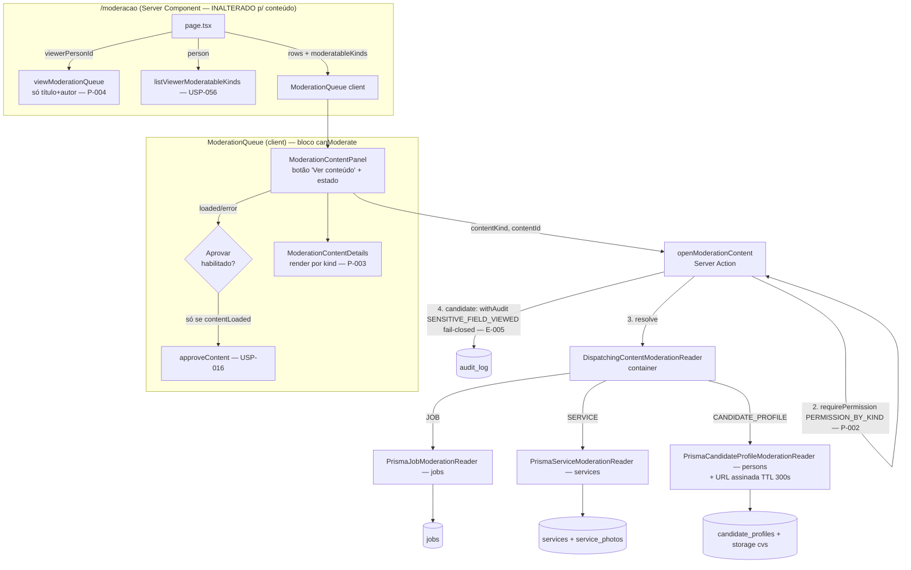

# USP-066 — Ver conteúdo integral do rascunho na fila de moderação — Design

**Spec**: `.specs/features/moderacao-conteudo/usp-066-ver-conteudo-rascunho/spec.md`
**Status**: Draft

> **💠 Upstream design (adapt, don't re-derive).** Conforma a: FSM de moderação e `transitionContent` como única
> via de status (ADR-0011 / USP-016 / P-005); **adapter por `ContentKind` no `shared/container.ts`** (memória
> "status mora na entidade; conteúdo novo = adapter por `ContentKind`") — espelha o `DispatchingContentStatusRepository`
> já registrado; View Models por papel (ADR-0010); auditoria append-only + evento `SENSITIVE_FIELD_VIEWED` já no
> catálogo (`audit/events.ts`, ADR-0010 conv. 3); Storage privado com URL assinada TTL 300s (ADR-0005); Design System
> `@/shared/ui` sem dep de Dialog (AD-014 / DS-MN-05); gating por `ContentKind` da USP-056 (`viewerModeratableKinds` +
> `PERMISSION_BY_KIND`). **STATE.md `## Decisions` lidas — nenhuma decisão ativa (AD-021..AD-029) conflita.** Sem
> `AD-NNN` novo: leitura por adapter e audit-on-read **conformam** aos padrões existentes (AD-009/AD-018/AD-022), não
> estabelecem convenção nova. Sem migração, sem entidade nova, sem dependência nova.

---

## Architecture Overview

A USP-016/056 entregou a **lista** (`viewModerationQueue`) e a **decisão** (`decide.ts` → `transitionContent`). Esta
USP acrescenta uma **leitura sob demanda do conteúdo integral** de um item, servida por uma nova Server Action que
despacha por `ContentKind` a um reader registrado no container — sem tocar o write-path de status nem a query da lista.

**Decisão central de arquitetura — carga sob demanda, não em lote no render.** O precedente `VerificationPanel`
(USP-017) carrega o detalhe da Empresa no render do `page.tsx` (batch). Aqui isso é **proibido por P-004**: conteúdo
integral (com fotos e URL assinada) de N itens no render degradaria a fila. A carga acontece **quando o moderador abre
o item** (`ModerationContentPanel` → Server Action `openModerationContent`). Esse único desenho reconcilia três
requisitos ao mesmo tempo:
- **E-001** (exibir inline, sem sair da fila) — o painel renderiza dentro do card, como o `VerificationPanel`.
- **P-004** (não carregar tudo no render) — `page.tsx` não toca conteúdo; o painel só carrega no clique.
- **P-002** (row restrita não vaza no Flight) — a row crua **nunca** entra no payload do `page.tsx`; a action só a
  carrega **após** `requirePermission(PERMISSION_BY_KIND[kind])`, para o kind que o viewer pode moderar. É mais forte
  que "select condicional ao papel": é **leitura condicional ao papel** — a row restrita não é sequer consultada.



**Fluxo por expectation:**
- **E-002/E-003/E-004** — a action despacha ao reader do kind, que faz o `select` do conteúdo integral e devolve o
  `ModerationContentView` (union por kind). Candidato inclui URL assinada do CV (TTL 300s).
- **E-005** — para `CANDIDATE_PROFILE`, a action envolve o serviço do conteúdo em `withAudit('SENSITIVE_FIELD_VIEWED')`
  (fail-closed): auditoria falha ⇒ conteúdo não é entregue.
- **E-006 / P-001** — o painel reporta `loaded | error` ao `ModerationQueue`; **Aprovar** só habilita com `loaded`;
  `error` mostra aviso e mantém Aprovar desabilitado, **devolver/rejeitar** seguem habilitados.
- **P-005** — a action é read-only de status: nenhum caminho novo de escrita de `status`/`publicationStatus`.

---

## Code Reuse Analysis

### Existing Components to Leverage

| Componente | Localização | Como usar |
|---|---|---|
| `DispatchingContentStatusRepository` + registro no container | `src/modules/moderation/adapters/dispatching-content-status-repository.ts`; `src/shared/container.ts:134-145` | **Espelhar** exatamente para o `DispatchingContentModerationReader` (mapa por `ContentKind` + adapters por módulo dono). |
| `ContentStatusRepository` (port) + `createToken` | `src/modules/moderation/ports/content-status.port.ts` | **Padrão** para `content-moderation-reader.port.ts` (interface + `CONTENT_MODERATION_READER_TOKEN`). |
| `PERMISSION_BY_KIND` | `src/modules/moderation/domain/moderation-permissions.ts` | **Fonte única** do gate por kind (P-002) — mesma que `decide.ts` e `listViewerModeratableKinds` já usam; a action reusa. |
| `requirePermission` + sequência da Server Action | `src/modules/identity` · `src/modules/moderation/actions/decide.ts` | **Template** de `openModerationContent`: Zod → `requirePermission` → (…) → `ActionResult`, nunca `throw`. |
| `withAudit` / `recordAuditEvent` + `SENSITIVE_FIELD_VIEWED` | `src/modules/audit/withAudit.ts` · `src/modules/audit/events.ts:126` | **Já pronto**: evento no catálogo (sem justificativa exigida); audit-on-read fail-closed. |
| Padrão audit-on-read (precedente) | `src/modules/jobs/queries/list-job-applicants.ts:173-196` | **Referência de contrato**: `SENSITIVE_FIELD_VIEWED` com `context.viewedFields` ao servir dado de candidato. |
| Resolução de URL assinada de CV | `src/modules/persons/views/view-candidate-for-employer.ts` (resolve CV assinado) · `list-job-applicants.ts:26` (`resolveCvUrl`) · `SIGNED_URL_TTL_SECONDS=300` (`shared/lib/supabase/storage-buckets.ts`) | **Reusar** a resolução de CV do módulo `persons` no reader de candidato (`createSignedUrl(path, 300)`, degrada a `null` em erro). |
| `buildServicePhotoUrl` | `src/modules/services/domain/photo-url.ts` | Fotos do serviço (bucket público `provider-photos`) — URL direta do CDN (não assinada). |
| `VerificationPanel` + gating de Aprovar por `verifyReady` (mapa) | `src/modules/moderation/components/moderation-queue.tsx:64-68,228-233` + `verification-panel.tsx` | **Padrão** de detalhe inline no card **e** de gating do botão por prontidão reportada via callback — replicado para `contentState`. |
| `ModerationQueue` (`canModerate`, `viewerModeratableKinds`) | `src/modules/moderation/components/moderation-queue.tsx:138-174` | **Ponto de integração**: painel dentro do ramo `canModerate`; gate de Aprovar combinado com o gate existente da checklist (USP-017). |
| `viewJobDetail` / `viewServiceDetail` (shape/formatação) | `src/modules/jobs/views/job-detail.view.ts` · `src/modules/services/views/service-detail.view.ts` | **Referência de campos** a exibir "como será publicado" — os readers de moderação reproduzem a seleção, **sem** o filtro `ACTIVE` e **sem** anonimização de papel (moderador vê o rascunho integral). |
| `@/shared/ui` (`Button`, `Badge`, `Card`, `Label`) | `src/shared/ui` | Primitivos DS para o painel e o detalhe (sem Dialog — DS-MN-05). |

### Integration Points

| Sistema | Método de integração |
|---|---|
| `jobs` / `services` / `candidate_profiles` (Prisma) | `findUnique` por `contentId` **dentro de cada adapter** (owning module), `select` explícito só dos campos de E-002/E-003/E-004. Sem migração (todos os campos já existem). |
| `shared/container.ts` | **Novo binding** `CONTENT_MODERATION_READER_TOKEN → DispatchingContentModerationReader({JOB, SERVICE, CANDIDATE_PROFILE})`. Import profundo (padrão do arquivo, evita ciclo). |
| Supabase Storage (`cvs`) | `createSupabaseStorageClient().from('cvs').createSignedUrl(path, SIGNED_URL_TTL_SECONDS)` — só quando o item de candidato é aberto (nunca em lote — P-004). |
| `audit_log` | `withAudit('SENSITIVE_FIELD_VIEWED', …)` na action, só para candidato. Inalterado no schema (append-only). |
| `moderation/index.ts` (barrel) | Exportar `openModerationContent` + o tipo `ModerationContentView` (consumidos por teste de integração via barrel). |

---

## Components

### 1. `ModerationContentView` (tipo) + `ContentModerationReader` (port) — T1

- **Purpose**: Contrato de leitura de conteúdo por `ContentKind` (union discriminada) e a porta que o resolve.
- **Location**: `src/modules/moderation/views/moderation-content.ts` (tipo) · `src/modules/moderation/ports/content-moderation-reader.port.ts` (port + token)
- **Interfaces**:
  - `type ModerationContentView =`
    `{ kind: 'JOB'; title; description?; requirements?; salary?; salaryRange?; workRegime?; contractType?; educationLevelRequired?; location?; area?; region?; companyName? }`
    `| { kind: 'SERVICE'; title; description?; category?; serviceArea?; availability?; priceRange?; photos: string[] }`
    `| { kind: 'CANDIDATE_PROFILE'; headline?; educationLevel?; educationArea?; experience?; skills?; courses?; cvUrl: string | null }`
  - `interface ContentModerationReader { readContent(kind: ContentKind, contentId: string): Promise<ModerationContentView | null> }`
  - `const CONTENT_MODERATION_READER_TOKEN = createToken<ContentModerationReader>('ContentModerationReader')`
- **Dependencies**: `ContentKind`, `createToken`.
- **Reuses**: shape do `content-status.port.ts`; campos espelham `viewJobDetail`/`viewServiceDetail`/`CandidateProfile`.

### 2. `PrismaJobModerationReader` — T2

- **Purpose**: Ler o conteúdo integral de uma vaga `IN_MODERATION` (E-002).
- **Location**: `src/modules/jobs/adapters/prisma-job-moderation-reader.ts`
- **Interfaces**: `readContent(_kind, jobId): Promise<ModerationContentView | null>` (retorna `{ kind: 'JOB', … }` ou `null` se não achar).
- **Select**: `title, description, requirements, salary, salaryMin, salaryMax, salaryVisible, workRegime, contractType, educationLevelRequired, location, area:{name}, region:{name}, company:{razaoSocial, nomeFantasia}`. Faixa salarial = `salaryMin/Max` (ou `salary` legado) respeitando `salaryVisible`; `companyName` = nome fantasia/razão social (identidade pública — premissa §6). **REVISADO (A1/PR#294)**: `where` inclui `status: IN_MODERATION` explícito (`findFirst`, não `findUnique`) — a premissa original ("o item já veio `IN_MODERATION` da fila") não protegia contra um `contentId` arbitrário vindo do cliente; ver §6 da spec.
- **Dependencies**: `prisma`, `ContentModerationReader`/`ModerationContentView` (import do port de `moderation` — mesma direção de `PrismaJobStatusRepository`).
- **Reuses**: seleção de campos de `viewJobDetail` (sem anonimização/ACTIVE).

### 3. `PrismaServiceModerationReader` — T3

- **Purpose**: Ler o conteúdo integral de um serviço `IN_MODERATION` (E-003).
- **Location**: `src/modules/services/adapters/prisma-service-moderation-reader.ts`
- **Interfaces**: `readContent(_kind, serviceId): Promise<ModerationContentView | null>` → `{ kind: 'SERVICE', … }`.
- **Select**: `title, description, category:{name}, region:{name}, availabilityDescription, priceMin/Max, priceUnit, photos:{storagePath, position (orderBy asc)}`. `serviceArea` = `region.name` (premissa §6); `photos` = `photos.map(buildServicePhotoUrl)` (CDN público).
- **Dependencies**: `prisma`, `buildServicePhotoUrl`, port de `moderation`.
- **Reuses**: seleção de `viewServiceDetail`; `buildServicePhotoUrl`.

### 4. `PrismaCandidateProfileModerationReader` — T4

- **Purpose**: Ler o perfil de candidato `IN_MODERATION` + URL assinada do CV (E-004).
- **Location**: `src/modules/persons/adapters/prisma-candidate-profile-moderation-reader.ts`
- **Interfaces**: `readContent(_kind, personId): Promise<ModerationContentView | null>` → `{ kind: 'CANDIDATE_PROFILE', …, cvUrl }`.
- **Select**: `headline, educationLevel, educationArea, experienceText, skillsText, coursesText, cvStoragePath`. `cvUrl` = URL assinada de `cvStoragePath` (TTL 300s) reusando a resolução de CV já existente no módulo `persons` (`viewCandidateForEmployer`); degrada a `null` em erro/ausência (nunca lança — E-006 fica a cargo da action).
- **Dependencies**: `prisma`, resolução de CV assinado (`createSupabaseStorageClient` + `SIGNED_URL_TTL_SECONDS`), port de `moderation`.
- **Reuses**: resolução de URL assinada de `view-candidate-for-employer` / `list-job-applicants`.

### 5. `DispatchingContentModerationReader` + registro no container — T5

- **Purpose**: Despachar `readContent` ao reader do `ContentKind`; kind sem reader → `null` (E-006 gracioso).
- **Location**: `src/modules/moderation/adapters/dispatching-content-moderation-reader.ts` · registro em `src/shared/container.ts`
- **Interfaces**: `constructor(private byKind: Partial<Record<ContentKind, ContentModerationReader>>)`; `readContent(kind, id)` → `this.byKind[kind]?.readContent(kind, id) ?? Promise.resolve(null)`.
- **Registro**: `container.register(CONTENT_MODERATION_READER_TOKEN, () => new DispatchingContentModerationReader({ [ContentKind.JOB]: new PrismaJobModerationReader(), [ContentKind.SERVICE]: new PrismaServiceModerationReader(), [ContentKind.CANDIDATE_PROFILE]: new PrismaCandidateProfileModerationReader() }))`. `CV` isolado **sem** entrada → `null` (fixture vazio em prod — premissa §6).
- **Dependencies**: imports profundos (padrão do container, eslint-disable), `ContentKind`.
- **Reuses**: registro idêntico ao do `DispatchingContentStatusRepository`.

### 6. `openModerationContent` (Server Action) + schema — T6

- **Purpose**: Servir o conteúdo de um item sob demanda, com gate de permissão (P-002), audit-on-read de candidato (E-005) e falha graciosa (E-006), sem write-path de status (P-005).
- **Location**: `src/modules/moderation/actions/open-content.ts` (`'use server'`) · `src/modules/moderation/schemas/open-content.ts` (`openContentSchema`: `{ contentKind: nativeEnum(ContentKind), contentId: string().uuid() }`)
- **Interfaces**: `openModerationContent(input): Promise<ActionResult<ModerationContentView>>`
- **Sequência**:
  1. `openContentSchema.safeParse` → `fail('VALIDATION', …)` se inválido.
  2. `const authz = await requirePermission(PERMISSION_BY_KIND[kind]); if (!authz.ok) return authz;` — **P-002** (retorno de erro **sem** nenhum campo de conteúdo).
  3. `const reader = container.resolve(CONTENT_MODERATION_READER_TOKEN); const view = await reader.readContent(kind, contentId);`
  4. `if (!view) return fail('NOT_FOUND', 'Não foi possível carregar o conteúdo deste item.');` — **E-006**.
  5. Se `kind === CANDIDATE_PROFILE`: `await withAudit('SENSITIVE_FIELD_VIEWED', async (_tx, audit) => { audit.entityType = 'candidate_profile'; audit.entityId = contentId; audit.context = { viewedFields: [...], hasCv: view.cvUrl != null }; }, { actorPersonId: authz.data.person.id })` — **E-005**, **fail-closed** (se lançar, capturar e `return fail(...)`, conteúdo não entregue).
  6. `return ok(view)`.
- **Dependencies**: `requirePermission`, `container`, `PERMISSION_BY_KIND`, `withAudit`, `ActionResult`/`ok`/`fail`.
- **Reuses**: sequência de `decide.ts`; audit-on-read de `list-job-applicants.ts`. **Barrel**: exporta `openModerationContent`.

### 7. `ModerationContentDetails` (apresentacional) — T7

- **Purpose**: Renderizar o `ModerationContentView` por kind; **conteúdo longo integral** (P-003 — sem truncar sem sinalizar).
- **Location**: `src/modules/moderation/components/moderation-content-details.tsx` (componente puro, sem IO)
- **Interfaces**: `ModerationContentDetails({ view }: { view: ModerationContentView })` — `switch(view.kind)` → seções JOB / SERVICE / CANDIDATE_PROFILE. CV = link (`view.cvUrl`) que abre em nova aba; ausente → nota "CV não anexado". Fotos = `` do CDN. Texto longo renderizado por completo (`whitespace-pre-wrap`), sem clamp silencioso.
- **Dependencies**: `@/shared/ui`, `ModerationContentView`.
- **Reuses**: tokens do DS; layout de campos do detalhe público.

### 8. `ModerationContentPanel` (client) — T8

- **Purpose**: Carga sob demanda (E-001) + estado + gatilho de audit; reportar prontidão ao card (E-006/P-001) sem auto-carregar (P-004).
- **Location**: `src/modules/moderation/components/moderation-content-panel.tsx` (`'use client'`)
- **Interfaces**: `ModerationContentPanel({ contentKind, contentId, onStateChange }: { contentKind; contentId; onStateChange: (state: 'loaded' | 'error' | 'idle') => void })`
- **Comportamento**: estado `idle | loading | loaded | error`. Botão **"Ver conteúdo"** (`useTransition`) → `openModerationContent({ contentKind, contentId })` → `ok` ⇒ guarda `view`, estado `loaded`, `onStateChange('loaded')`, renderiza `<ModerationContentDetails view=… />`; `!ok` ⇒ estado `error`, aviso PT-BR (`role="alert"`), `onStateChange('error')`. **Não** dispara em `useEffect`/mount (P-004). Recarregar permitido após erro.
- **Dependencies**: `openModerationContent` (import direto no módulo), `ModerationContentDetails`, `@/shared/ui`.
- **Reuses**: padrão `useTransition`/estado por item do `ModerationQueue`.

### 9. `ModerationQueue` — integração + gating de Aprovar — T9

- **Purpose**: Renderizar o painel por item (bloco `canModerate`) e habilitar **Aprovar** só com conteúdo carregado (E-006/P-001), preservando os gates existentes (checklist USP-017; `viewerModeratableKinds` USP-056; P-004 no `page.tsx`).
- **Location**: `src/modules/moderation/components/moderation-queue.tsx` (modificar) — `page.tsx` **não** muda (conteúdo é client-on-demand; é essa a garantia estrutural de P-004).
- **Mudança**:
  - Novo estado `const [contentState, setContentState] = useState<Record<string, 'idle'|'loaded'|'error'>>({})`; callback `setContentReady(id, state)` (espelha `setReady`/`verifyReady`).
  - No ramo `canModerate`, antes dos controles de ação: `<ModerationContentPanel contentKind={row.contentKind} contentId={row.contentId} onStateChange={(s) => setContentReady(row.contentId, s)} />`.
  - Aprovar: `disabled={rowPending || (needsChecklist && !verifyReady[id]) || contentState[id] !== 'loaded'}` + `title` explicando "Abra o conteúdo antes de aprovar." quando não carregado. **Devolver/Rejeitar inalterados** (seguem habilitados mesmo em erro/idle — E-006).
- **Dependencies**: `ModerationContentPanel`, `ContentKind`.
- **Reuses**: estrutura de render e o padrão de mapa-de-prontidão já usado para o `VerificationPanel`.

---

## Data Models

**Nenhum novo model Prisma, nenhuma migração.** Todos os campos de E-002/E-003/E-004 já existem
(`jobs`, `services`+`service_photos`, `candidate_profiles.cv_storage_path`). Novo **tipo de aplicação** apenas:

```typescript
// src/modules/moderation/views/moderation-content.ts
export type ModerationContentView =
  | { kind: 'JOB'; title: string; description: string | null; requirements: string | null;
      salaryRange: string | null; workRegime: string | null; contractType: string | null;
      educationLevelRequired: string | null; location: string | null; area: string | null;
      region: string | null; companyName: string | null }
  | { kind: 'SERVICE'; title: string; description: string | null; category: string | null;
      serviceArea: string | null; availability: string | null; priceRange: string | null; photos: string[] }
  | { kind: 'CANDIDATE_PROFILE'; headline: string | null; educationLevel: string | null;
      educationArea: string | null; experience: string | null; skills: string | null;
      courses: string | null; cvUrl: string | null };
```

Campos lidos (sem migração): `Job.{title,description,requirements,salary,salaryMin,salaryMax,salaryVisible,workRegime,contractType,educationLevelRequired,location,area,region,company}` · `Service.{title,description,category,region,availabilityDescription,priceMin,priceMax,priceUnit,photos}` · `ServicePhoto.{storagePath,position}` · `CandidateProfile.{headline,educationLevel,educationArea,experienceText,skillsText,coursesText,cvStoragePath}`.

---

## Error Handling Strategy

| Cenário | Tratamento | Impacto ao usuário |
|---|---|---|
| Conteúdo não encontrado / reader ausente (kind `CV`) | Reader → `null`; action → `fail('NOT_FOUND')` | E-006: painel mostra aviso; Aprovar desabilitado; devolver/rejeitar seguem |
| Falha ao gerar URL assinada do CV | Resolução degrada a `cvUrl: null` (não lança); demais campos exibidos | Perfil visível; nota "CV indisponível"; Aprovar **habilitado** (o conteúdo textual carregou — E-006 só barra falha de carga do item) |
| Auditoria (`SENSITIVE_FIELD_VIEWED`) falha p/ candidato | `withAudit` lança → capturado → `fail(...)`; conteúdo **não** entregue (fail-closed) | E-005/E-006: aviso; Aprovar desabilitado |
| Viewer sem permissão para o kind (P-002) | `requirePermission` nega → `fail` **sem** campos de conteúdo | Painel só aparece em `canModerate`; se acionado, erro sem PII |
| `contentId` inválido / kind inválido | Zod → `fail('VALIDATION')` | Aviso genérico; sem carga |
| Fila renderizada com N itens (P-004) | Painel **não** auto-carrega; page não toca conteúdo | Fila rápida; conteúdo só ao abrir cada item |

---

## Risks & Concerns

| Concern | Localização | Impacto | Mitigação |
|---|---|---|---|
| Gating novo de Aprovar quebra testes existentes que aprovam sem carregar conteúdo | `components/__tests__/moderation-queue.test.tsx` | Falso-vermelho na suíte | **Mudança de comportamento intencional** (AC-066-5/P-001): T9 atualiza esses casos p/ carregar o conteúdo antes de aprovar (mock da action) — **não** é enfraquecimento, é o novo AC. Documentado no `Done when` de T9. |
| Regressão do gate da checklist da USP-017 (Aprovar de vaga de Empresa não verificada) | `moderation-queue.tsx:228` | Aprovar de vaga sem checklist | Combinar os gates com `&&` (checklist **e** conteúdo carregado); T9 preserva os casos de `verifyReady`. |
| Reader de candidato carrega dado sensível fora de um viewer autorizado se chamado direto | `persons/adapters/…` | Vazamento de PII | O reader **só** é alcançado após `requirePermission` na action (P-002 autoritativo). Reader não tem gate próprio de propósito (fronteira única). Guard estático de Server Actions já cobre a action. |
| **REVISADO (A1/PR#294)** — reader lê por `id`/`personId` sem filtro de status, então `requirePermission` sozinho não impede ler conteúdo fora do que a fila lista (PII+URL de CV de perfil `ACTIVE`/`DRAFT`/`ARCHIVED`, p.ex.) | 3 readers (`jobs`/`services`/`persons`) | Minimização violada (ADR-0010/LGPD) mesmo com o gate de permissão correto | Os 3 readers passam a `findFirst` com `status`/`publicationStatus: IN_MODERATION` explícito (índices já existentes) — a fronteira de "o que pode ser lido" deixa de ser só a permissão do kind e passa a incluir o estado, espelhando o `where` de `viewModerationQueue`. |
| **REVISADO (A2/PR#294)** — `ContentKind.CV` sem reader registrado: o gate de Aprovar (`contentState !== 'loaded'`) não distingue "kind sem reader" de "carga falhou", então um item `CV` nunca sai de `error` e Aprovar fica desabilitado **para sempre** | `moderation-queue.tsx` + `shared/container.ts` | Beco sem saída — viola a invariante "nenhum item que a fila lista pode ficar permanentemente não-aprovável" | Novo `CONTENT_KINDS_WITH_READER` (fonte única entre o dispatcher e o gate): só kinds com reader real exigem conteúdo carregado antes de Aprovar; `CV` não renderiza `ModerationContentPanel` (nada de conteúdo além do `title`, já no card) e não é mais gateado por um carregamento impossível. |
| `page.tsx` acidentalmente pré-carregar conteúdo em lote (regressão P-004) | `app/(app)/moderacao/page.tsx` | Fila degradada + row no Flight | Desenho mantém `page.tsx` sem qualquer chamada ao reader/action; teste-sensor de P-004 em T9 (render de N itens ⇒ 0 chamadas de `openModerationContent`). |
| `ModerationContentView` do tipo colidir de nome com o componente | tipos/componentes | Confusão | Tipo = `ModerationContentView`; componente = `ModerationContentDetails` (nomes distintos). |
| Anonimização de papel dos detail views públicos não se aplica ao moderador | `job-detail.view.ts`/`service-detail.view.ts` | Moderador ver menos que o publicado | Readers de moderação **não** reusam a anonimização — leem o rascunho integral (E-001 "como será publicado"). |

> Nenhum outro concern nos arquivos tocados.

---

## Tech Decisions (only non-obvious ones)

| Decisão | Escolha | Racional |
|---|---|---|
| Quando carregar o conteúdo | **Sob demanda** (Server Action ao "Ver conteúdo"), não em lote no render | Único desenho que satisfaz E-001 **e** P-004 **e** P-002 ao mesmo tempo (row restrita nunca entra no Flight da página). Diverge do `VerificationPanel` (batch no render) de propósito — lá P-004 não existe. |
| Como ler por tipo | **Adapter por `ContentKind`** despachado no container (espelha `DispatchingContentStatusRepository`) | Padrão do repo (memória de projeto; a leitura de conteúdo novo é por adapter registrado). Mantém `moderation` desacoplado de `jobs`/`services`/`persons` (DI), mesma direção de coupling já usada. |
| Read-only na action vs. write | Server Action (não query) porque candidato **audita** ao servir | `withAudit` precisa de tx + ator; audit-on-read é a razão de ser Server Action (JOB/SERVICE passam pela mesma action p/ uniformidade e gate único). |
| Audit-on-read | `withAudit('SENSITIVE_FIELD_VIEWED')` **fail-closed**, ao servir (não read-inside-tx) | E-005 pede registro do acesso, não atomicidade; precedente `list-job-applicants.ts`. Refina AC-066-4. |
| Gating de Aprovar | Mapa `contentState[id]` reportado pelo painel via callback (espelha `verifyReady`) | Reusa o padrão de prontidão já existente no card; combina com o gate da checklist (USP-017) via `&&`. |
| `CV` (kind isolado) sem reader | Sem entrada no dispatcher → `null` → E-006 gracioso **na leitura**; **REVISADO (A2/PR#294)**: o gate de Aprovar não pode depender de `contentState==='loaded'` para um kind sem reader (nunca chegaria lá) — `CONTENT_KINDS_WITH_READER` desacopla os dois | `_moderation_fixture` vazio em prod; conteúdo de candidato (incl. CV) vem por `CANDIDATE_PROFILE`; a invariante "nenhum item listado pode ficar permanentemente não-aprovável" vale mesmo assim. |
| `page.tsx` sem mudança | Painel client importa a action direto (como `decide.ts` em `moderation-queue.tsx`) | Garantia estrutural de P-004: a página não tem como carregar conteúdo. |
| **REVISADO (A1/PR#294)** — escopo da leitura por reader | `findFirst` com `status`/`publicationStatus: IN_MODERATION` explícito nos 3 readers, em vez de confiar que "o item já chega da fila" | `contentId` vem do cliente; a Server Action é um endpoint, não pode assumir a origem da chamada. |
| **REVISADO (A4/PR#294)** — `ip`/`userAgent` do audit de candidato | Capturados via `headers()`/`clientIp` **antes** do `withAudit` (mesmo preâmbulo de `list-job-applicants.ts`), não mais omitidos quando "não há helper" | ADR-0004 passo 2 exige a captura; é a mitigação documentada do Risco 1 do ADR-0005 para a URL assinada de CV. |

> **Project-level decisions:** nenhuma — todas as escolhas conformam a padrões vigentes (ADR-0011/ADR-0010/ADR-0005/
> AD-009/AD-014/DS-MN-05, memória do adapter-por-`ContentKind`). **Sem `AD-NNN` novo.**

---

## Assumptions

Ver **spec §6** (premissas registradas, todas com dono `agent` — não disparam Entry Gate). Resumo dos itens que mais
condicionam o desenho: (a) carga sob demanda reconcilia E-001+P-004+P-002; (b) "Empresa" = identidade pública (CNPJ/
verificação seguem no `VerificationPanel`); (c) "área de atendimento" = `region.name`; (d) `CV` isolado sem model real
→ servido por `CANDIDATE_PROFILE`; (e) audit-on-read fail-closed em vez de read-inside-tx.
