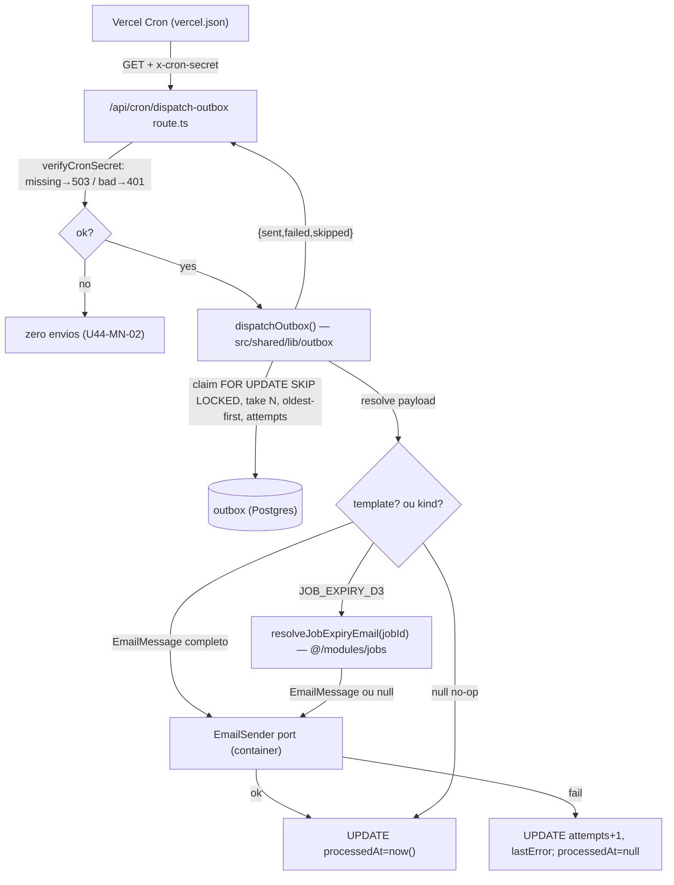

# USP-044 Design — Dispatcher assíncrono do Outbox de e-mail (ICE adapter)

**Spec:** `.specs/features/notificacoes-email/usp-044-notificacoes-email/spec.md`
**Status:** Draft
**Sizing:** **Large** (piso ICE — USP com intent+expectations e must-nots P-003/P-007; jamais Small/Medium)

> **ICE mode — este design RESOLVE ponteiros, não desenha arquitetura nova.** O padrão está congelado em **ADR-0020** (Atomicidade transacional e outbox) + **TD §4.6** (catálogo de outbox) + **TD §4.4** (`POST /api/cron/dispatch-outbox`). Se a implementação contradisser um ADR/TD, é re-entrada em `architecture-planning-idsd`, não decisão local.

---

## Estado atual verificado (o que JÁ existe — não reimplementar)

| Peça | Local | Nota |
|---|---|---|
| Porta `EmailSender` + `EMAIL_SENDER_TOKEN` + união `EmailMessage` (8 templates) | `src/shared/lib/email/email-sender.port.ts` | `send(EmailMessage): Promise<{ok,id?}>`; nunca lança. |
| Adapter `ResendEmailSender` (render exaustivo da união) | `src/shared/lib/email/resend-email-sender.ts` | injetável com `ResendClient` fake no teste. |
| Wiring DI `EMAIL_SENDER_TOKEN → new ResendEmailSender()` | `src/shared/container.ts` l.81-83 | dispatcher resolve **a porta**, nunca o concreto. |
| Model Prisma `Outbox` (`topic`/`payload`/`processedAt`/`attempts`/`lastError`/`createdAt`, `@@index([processedAt, createdAt])`) | `prisma/schema.prisma` l.918-929 | criado em AD-007/USP-013; migração `20260615114823_usp013_outbox`. **Sem coluna de claim/backoff** ⇒ design usa só estas colunas. |
| 6 sítios de enqueue (`topic:'email'`) | ver tabela abaixo | escrevem linhas que **ninguém drena** hoje. |
| Precedente de cron | `src/app/api/cron/expire-jobs/route.ts`, `.../auth-attempts-retention/route.ts` | GET, `dynamic='force-dynamic'`, `verifyCronSecret`, `childLogger`, `NextResponse.json`. |
| Guarda de segredo `verifyCronSecret` (missing→503, unauthorized→401) | `src/shared/lib/cron-secret.ts` | reuso direto. |
| Env `RESEND_API_KEY`, `EMAIL_FROM`, `CRON_SECRET` (opcional) | `src/shared/env.ts` l.29-30,68 | `CRON_SECRET` ausente ⇒ 503 fail-closed já funciona. |
| Agendas de cron | `vercel.json` `"crons"` | adicionar entrada nova para `dispatch-outbox`. |

### Sítios de enqueue e forma do payload (o universo que o dispatcher enxerga)

| Sítio | Local | Payload gravado | Forma |
|---|---|---|---|
| Encaminhamento | `src/modules/referrals/actions/create-referral.ts:187` | `referral-notification` | **`EmailMessage` completo** (`to` já resolvido) |
| Candidatura | `src/modules/jobs/actions/apply-to-job.ts:120` | `application-confirmation` | **`EmailMessage` completo** |
| Add responsável | `src/modules/companies/actions/add-responsible.ts:154` | `responsible-link-pending` | **`EmailMessage` completo** |
| Remove responsável | `src/modules/companies/actions/remove-responsible.ts:135` | `responsible-removed` | **`EmailMessage` completo** |
| Manifestação | `src/modules/services/actions/manifest-interest.ts:162` | `service-interest-notification` | **`EmailMessage` completo** |
| Expiração D-3 (unitário + lote) | `src/modules/jobs/actions/enqueue-expiry-reminder.ts:40`, `run-job-expiration.ts:117` | `{ kind:'JOB_EXPIRY_D3', jobId }` | **payload leve** — exige hidratação |

**Consequência de design:** 5 templates chegam prontos (passthrough); **apenas `JOB_EXPIRY_D3` precisa ser hidratado** carregando a vaga + o responsável. E **não há template `job-expiry` na união hoje** — precisa ser criado (T1). Os templates de auth (`welcome`, `password-reset`, `credential-claim-welcome`) **nunca entram no Outbox** (enviados síncronos — ver Decisão D-1).

---

## ICE-ID Coverage — o que esta unidade cobre e o que fica de fora (nada some em silêncio)

| ID ICE | Assunto | Nesta unidade | Onde vive de verdade |
|---|---|---|---|
| **E-001** | disparo pós-commit dos eventos enfileirados | ✅ **núcleo** | dispatcher (T3) |
| **P-003** | não disparar antes do commit | ✅ garantido | dispatcher só lê `processedAt IS NULL` **committado**; o enqueue-em-tx (já feito) é quem satisfaz na origem |
| **P-007** | não enviar órfão de rollback; idempotência | ✅ garantido | rollback apaga a linha (origem, já feito) + claim idempotente (T3) |
| E-004 / P-004 | opt-out granular por categoria | ⛔ **deferido** | exige `persons.email_prefs` (**inexistente** — verificado) + decisão de produto sobre quais dos 6 tipos são "informativos". Nenhum sítio de enqueue depende disso. TD §4.6 prevê "worker filtra por `email_prefs`" como trabalho futuro. |
| E-006 / AC-044-8 | N parametrizável do lembrete de CV | ⛔ **deferido** | **não há sítio de enqueue** de `email.cv_reminder` (verificado). Fora do dreno. |
| E-002 / E-005 / P-001 / P-006 | SPF/DKIM/DMARC, quota, bounce/spam | ⛔ **a montante / operacional** | ADR-0019 (SMTP gerenciado, Fase 0) + TD §8.3 (alertas). Não é código do dreno. |
| E-003 / P-002 / P-008(templates) | minimização de PII no corpo | ⛔ **nos templates + gate D-002** | templates já existem; revisão DPO é gate operacional. O dreno só reforça P-008 **no log** (U44-MN-04). |

> A rastreabilidade dos IDs deferidos permanece nos arquivos ICE; esta unidade não os fecha e não finge paridade.

---

## Architecture Overview

Padrão **transactional outbox** (ADR-0020, Opção A). O efeito externo não-revertível (e-mail) foi enfileirado **dentro da transação de domínio** pelos 6 sítios acima; esta unidade adiciona o **worker pós-commit** que o ADR-0020 nomeia mas nunca foi materializado.

---

## Components / Interfaces (resolvendo TD §4.4/§4.5/§4.6)

### 1. `dispatchOutbox()` — motor do dreno  *(novo)*
- **Local:** `src/shared/lib/outbox/dispatch-outbox.ts`
- **Assinatura:** `dispatchOutbox(deps?): Promise<{ sent: number; failed: number; skipped: number; claimed: number }>` — `deps` opcional injeta `EmailSender` (fake no teste) e o resolver de payload; default resolve via `container`.
- **Responsabilidade:** claim + resolução + envio + marcação, isolado por linha. Depende **da porta** `EmailSender` (nunca `ResendEmailSender`), do resolver de payload, e de `prisma`.
- **Reusa:** `prisma` singleton, `childLogger`, `EMAIL_SENDER_TOKEN`.

### 2. Resolução de payload  *(novo, dentro do motor ou arquivo irmão)*
- `resolveOutboxEmail(payload): Promise<EmailMessage | null>`:
  - tem `template` válido (type-guard/Zod sobre a união) → retorna como `EmailMessage` (passthrough);
  - `kind === 'JOB_EXPIRY_D3'` → delega ao hidratador de `jobs`;
  - senão → lança/retorna erro tratado como falha da linha (vira poison ao atingir o cap).
- **`null` = no-op gracioso** (destinatário/entidade ausente): marca `processedAt`, conta `skipped`.

### 3. `resolveJobExpiryEmail(jobId)` — hidratador de `JOB_EXPIRY_D3`  *(novo, no módulo dono)*
- **Local:** `src/modules/jobs/queries/resolve-job-expiry-email.ts` (barrel `@/modules/jobs`), registrado no `container.ts` (padrão "despacho por tipo no container", precedente `dispatching-content-status-repository.ts` / STATE AD).
- **Assinatura:** `resolveJobExpiryEmail(jobId: string): Promise<EmailMessage | null>` — carrega vaga (título + empresa fantasia) + o **responsável** da Empresa com `emailLogin`; monta `{ template:'job-expiry', to, data }`. Retorna `null` se vaga inexistente/sem responsável com e-mail (no-op AC-044-D5). **Layering:** mantém a hidratação no módulo de domínio; `shared` depende de um resolver injetado, não de `jobs`.
- **Reusa:** relações `Job → Company → person_company_grants → Person.emailLogin` (USP-012/013); `select` explícito, `take` na busca de responsáveis.

### 4. Template `job-expiry` + extensão da união  *(novo)*
- **Local:** `src/shared/lib/email/templates/job-expiry.ts` + variante na união em `email-sender.port.ts` + `case 'job-expiry'` no `render()` de `resend-email-sender.ts`.
- `JobExpiryEmailData { empresaNome: string; vagaTitulo: string; diasRestantes: number }` (mínimo, sem PII de terceiro — E-003/P-002). Corpo PT-BR alinhado ao portal. Coberto pelo catálogo TD §4.6 (`email.job_expiring`, USP-024) — **pointed by card**, não inventado.

### 5. Rota de cron `dispatch-outbox`  *(novo)*
- **Local:** `src/app/api/cron/dispatch-outbox/route.ts` — **clona `expire-jobs`**: `export const dynamic='force-dynamic'`; `GET(request)`; `verifyCronSecret(request, env.CRON_SECRET)` (missing→503, unauthorized→401, **zero envios** = U44-MN-02); `childLogger({ module:'cron', job:'dispatch-outbox' })`; chama `dispatchOutbox()`; `NextResponse.json({ ok:true, sent, failed, skipped })`; `catch → 500`.
- **`vercel.json`:** nova entrada em `"crons"` (ver Decisão D-4 sobre cadência).

---

## Data Models

Nenhuma mudança de schema. Usa **exclusivamente** as colunas existentes de `Outbox` (`processedAt`, `attempts`, `lastError`, `createdAt`, `payload`, `topic`) — ver l.918-929 do schema. O índice `@@index([processedAt, createdAt])` já serve a seleção `processedAt IS NULL ORDER BY createdAt`.

---

## Concurrency-safety mechanism (invariante central — U44-MN-01)

**Estratégia de claim: `SELECT ... FOR UPDATE SKIP LOCKED` por linha, dentro de transação curta, envio dentro do lock.**

Fluxo por ciclo:
1. Selecionar candidatos: `SELECT id FROM outbox WHERE topic='email' AND processed_at IS NULL AND attempts < $MAX ORDER BY created_at ASC LIMIT $BATCH` (via `prisma.$queryRaw`).
2. Para **cada** id, uma **transação curta própria**:
   `BEGIN; SELECT ... FROM outbox WHERE id=$id AND processed_at IS NULL FOR UPDATE SKIP LOCKED;`
   - Sem linha (outra execução já a segura) → **skip** silencioso.
   - Com linha → resolve payload → `EmailSender.send(...)`:
     - `ok` → `UPDATE processed_at=now()` na **mesma tx** → `COMMIT` (claim+send+mark atômicos).
     - `fail` → `UPDATE attempts=attempts+1, last_error=$err` → `COMMIT` (`processed_at` continua nulo).
     - `null` (no-op) → `UPDATE processed_at=now()` → `COMMIT`, conta `skipped`.

**Por que satisfaz U44-MN-01:** `SKIP LOCKED` garante que duas execuções concorrentes reivindicam **conjuntos disjuntos** de linhas — nenhuma linha é enviada duas vezes. A garantia é **de nível de banco (o lock)**, não um pré-check de aplicação — exatamente o que **L-010** exige que o teste de concorrência exercite (o teste força overlap real e afirma "cada linha enviada no máximo 1×" contra o DB, não contra o shape do `ActionResult`).

**Trade-off aceito (documentado):** com o envio **dentro** do lock, o modelo é *at-most-once por reivindicação* + *at-least-once sob crash* (se o processo cai após o SMTP e antes do `COMMIT`, o próximo ciclo pode reenviar). Para e-mails informativos, at-least-once (raro reenvio pós-crash) é preferível a at-most-once (perda silenciosa). O must-not é **concorrência**, e SKIP LOCKED o cobre integralmente; a duplicação pós-crash é evento raro e aceito.

---

## Retry, backoff e poison (U44-MN-03)

- **Cap:** `MAX_ATTEMPTS` (assunção D-3 = 5). A cláusula `attempts < $MAX` na seleção **exclui** a linha poison — ela nunca mais é reivindicada, sem ser re-tentada para sempre. Fica com `processedAt` nulo, fora do fluxo (não há coluna "dead" no schema; a exclusão por `attempts` é limpa e não exige migração).
- **Backoff:** = **cadência do cron**. Cada linha falha é re-tentada no próximo tick agendado (D-4). Backoff exponencial fino exigiria coluna `nextAttemptAt`/`updatedAt` (mudança de schema) — **deferido** e documentado; não bloqueia o must-not (o cap já impede retry infinito).
- **Isolamento:** cada linha roda em `try/catch` + transação própria; a falha de uma **nunca** aborta o laço do lote — as demais são processadas normalmente. Poison + isolamento juntos = U44-MN-03.

---

## Mixed-payload resolution (o ponto que o orquestrador destacou)

- **`EmailMessage` completo** (5 tipos): discriminado por `template` presente e válido → passthrough direto à porta.
- **`{ kind:'JOB_EXPIRY_D3', jobId }`:** hidratado por `resolveJobExpiryEmail` (carrega vaga + responsável, monta `EmailMessage` `job-expiry`). Entidade ausente / responsável sem e-mail → `null` = no-op gracioso (AC-044-D5) — marca processado, **não** re-tenta.
- **Malformado** (nem `template` conhecido nem `kind` conhecido): tratado como falha → `attempts`/`lastError` → poison ao atingir o cap. Nunca derruba o lote.

---

## Error Handling Strategy

| Cenário | Tratamento | Efeito |
|---|---|---|
| `EmailSender.send` retorna `{ok:false}` (Resend down) | `attempts+1`, `lastError`, `processedAt` nulo | retry no próximo tick; conta `failed` |
| Hidratação sem destinatário/entidade | `processedAt=now()`, log `skipped` | no-op gracioso; conta `skipped` |
| Payload malformado | falha da linha (attempts/lastError) | vira poison ao atingir o cap; não bloqueia lote |
| Linha poison (`attempts≥MAX`) | excluída da seleção | nunca re-tentada, isolada |
| `CRON_SECRET` ausente | rota responde `503`, `dispatchOutbox` não é chamado | zero envios (U44-MN-02) |
| Segredo ausente/errado | rota responde `401`, sem processamento | zero envios (U44-MN-02) |
| Erro inesperado no laço | `try/catch` do route → `500` + `log.error` | ciclo seguinte reprocessa pendentes |
| Crash no meio de um envio | próximo ciclo pode reenviar (at-least-once) | aceito p/ e-mail informativo |

---

## Tech Decisions & Assumptions (autônomo — cada ambiguidade resolvida aqui)

| # | Decisão / Assunção | Escolha | Racional |
|---|---|---|---|
| **D-1** | Fluxos de auth continuam **síncronos**? | **Sim.** `registerPerson`, `request-password-reset`, `verify-credential-claim` seguem chamando `emailSender.send(...)` inline (templates `welcome`/`password-reset`/`credential-claim-welcome`). | Feedback de UX imediato; esses templates **nunca** entram no Outbox (confirmado — não estão entre os 6 sítios); converter adiciona latência+risco. Escopo USP-044 = só o dreno assíncrono. |
| **D-2** | Novo evento de `audit_log` "e-mail enviado"? | **Não.** A própria linha `Outbox` (`processedAt`/`attempts`/`lastError`) + logs `pino` (metadado) são o ledger de envio. | Catálogo `@/modules/audit/events` **não** tem evento de e-mail (verificado); `audit_log` é para mudança de estado de domínio (append-only, ADR-0023). Inventar evento seria território de ADR e não é apontado pelo card. Satisfaz L-004 (metadado, sem corpo). |
| **D-3** | Constantes de lote/cap | `BATCH_SIZE=50`, `MAX_ATTEMPTS=5` (constantes de módulo). | Lote limitado (paginação obrigatória) sem estourar tempo de função; cap conservador. Ajustáveis; não são contrato. |
| **D-4** | Cadência do cron | `"* * * * *"` (a cada minuto) em `vercel.json`, para honrar **L-001** (≤60s). | Precedente `expire-jobs` é horário, mas L-001 pede ≤60s de latência de e-mail. **Assunção:** o plano Vercel precisa permitir cron por minuto (ADR-0010/ADR-0019 — custo); se o plano limitar, cai para a maior frequência disponível — decisão operacional, sinalizada. |
| **D-5** | Verbo HTTP da rota | **GET** (não o `POST` da notação TD §4.4). | Vercel Cron dispara **GET**; ambos os crons existentes são GET. A notação "POST" do TD antecede a convenção GET estabelecida; seguir o precedente que funciona (micro-decisão que a implementação força, não contradiz a intenção do TD). |
| **D-6** | Nome da rota | **`dispatch-outbox`** (não `dispatch-emails`). | Card l.725 + TD §4.4/§4.7 nomeiam `POST /api/cron/dispatch-outbox`. Reusa a família de rotas `/api/cron/*` existente (**L-011** — não abrir novo prefixo). |
| **D-7** | Opt-out `email_prefs` (E-004/P-004) | **Fora desta unidade.** | Coluna inexistente (verificado); nenhum sítio de enqueue depende; TD §4.6 a prevê como trabalho futuro do worker. Registrado como deferido, sem fingir paridade. |
| **D-8** | Local do motor | `src/shared/lib/outbox/` (concern outbox), consumindo a porta `mailer`. | TD §2.5 lista `shared` como dono de `outbox` **e** `mailer` como concerns distintos. |

---

## Must-nots (primeira classe — cada uma com teste negativo obrigatório em `tasks.md`)

1. **U44-MN-01** — sem duplo-envio sob concorrência (exercita o lock real, L-010) → T3 (int. concorrência).
2. **U44-MN-02** — rota fail-closed (503/401, zero envios) → T4 (route test).
3. **U44-MN-03** — linha poison não re-tentada além do cap **e** não bloqueia o lote → T3 (int. poison/isolamento).
4. **U44-MN-04** — nunca logar corpo/PII em claro (só metadado) → T3 (asserção de log).
5. **P-003 / P-007** — sem e-mail antes do commit / sem órfão de rollback → garantidos pelo design (lê só committado; rollback já apaga a linha) + idempotência do claim.

---

## Lessons aplicadas (confirmadas, escopo do módulo)

- **L-010** (concorrência mascarada por pré-check): o teste de concorrência de T3 afirma no **estado do DB / contagem de chamadas do fake**, forçando overlap real, provando o `SKIP LOCKED` — não um pré-check de app. O dispatcher **não tem** pré-check de app que pudesse mascarar.
- **L-011** (reusar família de rotas antes de novo prefixo): a rota entra em `/api/cron/*` (família existente), não num prefixo novo — Decisão D-6.
