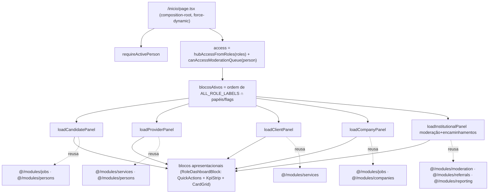

# USP-067 — Painel `/inicio` por papel — Design

**Spec**: `.specs/features/painel-area-logada/usp-067-painel-por-papel/spec.md`
**Status**: Draft

## Decisões upstream conformadas (não re-decididas)

- **AD-027/AD-028** (casca `(app)`): `(app)/layout.tsx` é o composition-root da casca; `AppShell` provê sidebar/topbar/bottomNav; **a página provê seu próprio `<main>`**. Esta feature **não** toca a casca — muda só `(app)/inicio/page.tsx` e adiciona `(app)/inicio/_components/**`.
- **AD-030/AD-031** (moderação): alcance do moderador é escopado à fila; leitura só após `requirePermission`; PII nunca no payload Flight. O painel **não** serve conteúdo de moderação (só a lista via `viewModerationQueue`, que já é PII-free por `viewStaffPersonNames`).
- **ADR-0010 / P2 / RSC-Flight** (privacidade): cross-role só via View Models; campo restrito nunca no `select`.
- **AD-019/AD-022** (raiz de composição): a **página** busca as dimensões cross-módulo e passa aos apresentacionais; módulos não cross-importam barrels em runtime — evita ciclo de import.
- **USP-049** (`buildHubLinks`/`hubAccessFromRoles`/`canAccessModerationQueue`): fonte única de acesso do painel.

Nenhuma decisão desta feature contradiz uma AD ativa — portanto **conforma**, não supersede. (Nenhum `AD-NNN` novo é criado aqui; se o Verifier/dono confirmar as reconciliações A-01..A-18 no UAT, elas viram nota de decisão do orquestrador — não é papel do Planner criar AD.)

---

## Architecture Overview

Página `(app)/inicio/page.tsx` reescrita de **hub de atalhos** para **painel por papel**, mantendo-se a **raiz de composição** (Server Component `async`, `force-dynamic`). Fluxo:

**Camadas:**
1. **Leituras** — vivem em `queries/` dos módulos donos (reuso quando existe; query fina nova quando GAP). Nunca em `app/`.
2. **Loaders por bloco** — funções `async` **na própria página** (`page.tsx`) ou num arquivo co-localizado server-only em `(app)/inicio/`, que orquestram as leituras + derivações puras + `try/catch → fallback`. São a raiz de composição.
3. **Apresentacionais** — Server Components em `(app)/inicio/_components/**` (tokens-only), recebendo dados prontos. Um conjunto de **primitivas** (`KpiStrip`, `DashboardCard`, `DashboardRow`, `QuickActions`, `CounterGrid`) reaproveitadas por todos os blocos; um componente `RoleDashboardBlock` por papel (ou um genérico dirigido por dados).
4. **Helpers puros** — derivações (contagens por `contentKind`, "em análise", janela de 7 dias, ordenação de papéis, mapas de rótulo) num módulo puro **medido pela cobertura** (ver Risks).

**Client Components** só onde já existem botões de ação interativos (`ApplyToJobButton`, `CancelApplicationButton`) — reusados como estão; o resto é Server.

---

## Code Reuse Analysis

### Reuso direto (existe, exportado no barrel) — NENHUMA leitura nova

| Necessidade | Símbolo (barrel) | Assinatura / retorno relevante | Privacidade |
| ----------- | ---------------- | ------------------------------ | ----------- |
| Vagas abertas (count) · pessoas/empresas ativas (parcial) | `getHomeIndicators` (`@/modules/reporting`) | `(): Promise<{activeJobs, activeCandidates, verifiedCompanies}>` | count-only, PII-free |
| Vagas que combinam (CANDIDATE) | `searchJobs` (`@/modules/jobs`) | `(filters, viewer): Promise<{items,total,page,pageSize}>` — filtro `areaId`, anonimiza por viewer | View Model `viewJobForVisitor` |
| Minhas candidaturas (CANDIDATE) | `listPersonApplications` (`@/modules/jobs`) | `(personId): Promise<PersonApplicationRow[]>` — `take 50`, própria data | own data |
| Candidatar-se / retirar | `applyToJob` / `cancelApplication` (+ `ApplyToJobButton`/`CancelApplicationButton`) | Server Actions `ActionResult<...>` | self-scoped |
| Interessados (PROVIDER, card + KPI total) | `listProviderInterests` (`@/modules/services`) | `(viewer, page): Promise<ActionResult<{interests: ProviderInterestView[], total,...}>>` — `take 20`, **audit-on-read** | View Model `viewClientForProvider` |
| Meus serviços (PROVIDER) | `listProviderServices` + `viewProviderServiceRow` (`@/modules/services`) | `(personId): Promise<ProviderServiceRow[]>` — `take 100` | own data |
| Corrigir e reenviar serviço | `submitServiceForModeration` (`@/modules/services`) | `ActionResult<{serviceId,status}>` | self |
| Categorias de serviço (CLIENT KPI/link) | `listServiceCategories` (`@/modules/services`) | `(): Promise<{id,name}[]>` — `take 200` | ref data |
| Busca de serviços (CLIENT KPI proxy / "solicitar novamente") | `searchServices` / `manifestInterest` (`@/modules/services`) | `(filters, viewer): Promise<{items,total,...}>` / `ActionResult<...>` | View Model / self |
| Últimos serviços solicitados (CLIENT) | `listPersonServiceInterests` (`@/modules/services`) | `(personId): Promise<PersonServiceInterestRow[]>` — `take 50` | own data |
| Minhas vagas (COMPANY) | `listCompanyJobs` + `viewCompanyJobRow` (`@/modules/jobs`) | `(companyId): Promise<CompanyJobRow[]>` — `take 100` | own company |
| Resolver empresas do responsável | `listPersonCompanyGrants` (`@/modules/companies`) | `(personId): Promise<PersonCompanyGrantRow[]>` — filtra `RESPONSIBLE/ACTIVE` | own grants |
| Corrigir e reenviar vaga | `submitJobForModeration` (`@/modules/jobs`) | `ActionResult<...>` | self |
| Fila de moderação (card + KPIs derivados) | `viewModerationQueue` (`@/modules/moderation`) | `({viewerPersonId}): Promise<ModerationQueueItem[]>` — `take 100`, oldest-first, PII-free (`authorName` via `viewStaffPersonNames`) | staff View Model |
| Guard de acesso à fila | `canAccessModerationQueue` (`@/modules/moderation`) | `(person): Promise<boolean>` (React `cache`) | — |
| Encaminhamentos no mês / aguardando (KPI) | `reportReferrals` (`@/modules/reporting`) | `({gte,lt}): Promise<{totalCreated, outcome:{...withoutResult}}>` | agregado |
| Registrar resultado (ação) | rota `/encaminhamentos/[id]/resultado` (`registerReferralResult`) | Server Action | RBAC `REGISTER_REFERRAL_RESULT` |
| Sessão + papéis + ordem | `requireActivePerson`, `describeActiveRoles`, `ALL_ROLE_LABELS`, `hubAccessFromRoles`, `buildHubLinks` (`@/modules/identity`) | — | — |
| Empresas verificadas (BOARD KPI) | `getHomeIndicators().verifiedCompanies` | count-only | PII-free |

### Leituras novas (GAP) — thin, read-only, no módulo dono, `select` explícito + `take`, sem migração

| # | Query nova | Módulo/arquivo | Assinatura → retorno | Nota |
| - | ---------- | -------------- | -------------------- | ---- |
| N1 | `getCandidateProfileStatus` | `persons/queries/get-candidate-profile-status.ts` | `(personId): Promise<ContentStatus \| null>` (`select: { publicationStatus }`) | + mapa `CANDIDATE_STATUS_LABELS` (PT-BR) no domain; A-04 |
| N2 | `getProviderProfileStatus` | `persons/queries/get-provider-profile-status.ts` | `(personId): Promise<ContentStatus \| null>` | A-04 (ProviderProfile é dono `persons`) |
| N3 | `countActiveServicesByCategory` | `services/queries/count-active-services-by-category.ts` | `(): Promise<{categoryId,name,count}[]>` via `groupBy(['categoryId'], where:{status:ACTIVE})` + join `listServiceCategories` | A-06; 1 query, sem N+1 |
| N4 | `countCompanyApplications` | `jobs/queries/count-company-applications.ts` | `(companyId): Promise<{total,active}>` via `application.count` sobre `job.companyId` | A-07; count-only, PII-free |
| N5 | `listCompanyRecentApplications` | `jobs/queries/list-company-recent-applications.ts` | `(companyId): Promise<{jobId,jobTitle,appliedAt}[]>` — `take 5`, `orderBy appliedAt desc`, **sem** `candidate` no `select` | A-08 / **PNL-MN-02** |
| N6 | `listRecentReferrals` | `referrals/queries/list-recent-referrals.ts` | `(): Promise<RecentReferralRow[]>` — `orderBy createdAt desc`, `take 5`, reusa a shape de `PersonReferralRow` (título vaga, empresa, nome referido/pessoa, `result`, data). `select` sem PII sensível | A-10 |
| N7 | `countActivePersons` | `reporting/queries/count-active-persons.ts` (ou estende `home-indicators`) | `(): Promise<number>` (`Person.count({status:'ATIVO'})`) | A-12; count-only |
| N8 | estender `select` de `listPersonApplications` | `jobs/queries/list-person-applications.ts` | + `job.status` na `select`; `PersonApplicationRow` ganha `jobStatus` | A-01 ("em análise" derivado). **Mudança de contrato de leitura existente** — cobrir com teste. |

### Helpers puros novos (medidos pela cobertura) — `src/modules/**` ou arquivo puro

- Derivações: `countQueueByKind(items)`, `deriveCandidateApplicationKpis(rows)` ("total ativas" / "em análise" = ativa ∧ `jobStatus=ACTIVE`), `countRecentWithin7Days(rows)` (A-15), `orderActiveRolePanels(roles, access)` (ordem `ALL_ROLE_LABELS`, A-17), `CANDIDATE_STATUS_LABELS`/`PROVIDER_STATUS_LABELS`.
- **Onde:** preferir `identity/domain/` (para ordenação de painéis) e o módulo dono do dado (para as derivações e mapas), para que a cobertura os meça e não se importe barrel server-only nos testes (ver Risks R2).

### Integration Points

| Sistema | Método de integração |
| ------- | -------------------- |
| Casca `(app)` | Página renderiza dentro do `AppShell` (via layout); provê o próprio `<main>` — **sem** editar a casca (diff zero em `_components/app-*`). |
| `buildHubLinks`/`access` | A página recomputa `access` (mesmo trecho da casca) e usa as flags para gate de blocos/cards (PNL-MN-04). |
| Rotas de ação | Todas as ações rápidas apontam para rotas/Server Actions já entregues (Fases 2-8). |

---

## Components

### Primitivas apresentacionais (`(app)/inicio/_components/`)

- **`KpiStrip` / `Kpi`** — faixa de indicadores. `KpiStrip({ items: {label, value, tone?}[] })`. Tokens-only. Server.
- **`DashboardCard`** — card com header (ícone+título+sub), corpo (rows **ou** estado vazio), rodapé (`footHref?`, `footLabel`, `countHint`). Se `footHref` ausente, omite o link (A-11). Server.
- **`DashboardRow`** — linha de lista: mark/badge, título, sub, meta[], `actions: ReactNode` (botões). Server; recebe botões (Client) como `ReactNode` quando interativos.
- **`QuickActions`** — bloco de botões de ação rápida por papel. `QuickActions({ actions: {label, href, variant, icon?}[] })`. Server (links) — ações que mutam usam os botões-Client existentes.
- **`CounterGrid`** — grid de contadores clicáveis (CLIENT "prestadores por tipo de serviço"): `{ counters: {value,label,href}[] }`.
- **`RoleDashboardBlock`** — envolve saudação/ações/KPIs/cards de um papel. Data-driven (recebe o view-model do bloco pronto do loader).
- **`nav-icons`** — reusa o registry SVG inline existente (`(app)/_components/nav-icons.tsx`) — **sem** nova lib de ícones (PNL-MN-08 / precedente USP-062).

### Loaders (raiz de composição, server-only, em `(app)/inicio/`)

- `loadCandidatePanel(person)`, `loadProviderPanel(person)`, `loadClientPanel(person)`, `loadCompanyPanel(person)`, `loadInstitutionalPanel(person, access)` — cada um: chama as leituras (reuso + N1..N8), aplica os helpers puros, `try/catch → fallback` por dimensão (espelha `loadIndicators`), devolve um view-model do bloco. **Não** importam Prisma; só barrels dos módulos (permitido no server; a página é o único ponto que cruza módulos).
- Assinatura de retorno: um `RoleBlockView` por papel `{ greeting, quickActions[], kpis[], cards[] }` — os apresentacionais nunca decidem visibilidade/acesso.

### Página `(app)/inicio/page.tsx` (reescrita)

- `requireActivePerson()` → `access = { ...hubAccessFromRoles(roles), moderation: await canAccessModerationQueue(person) }`.
- Calcula os papéis ativos na ordem de `ALL_ROLE_LABELS` (A-17) e chama, em `Promise.all`, os loaders dos blocos aplicáveis (gate por flag/paper).
- Renderiza saudação + os `RoleDashboardBlock` em ordem. Institucional (fila/encaminhamentos) é um bloco único alimentado por `access.moderation` (ações) ∪ `roles ∈ {SOCIAL_ASSISTANT, BOARD}` (read-only) ∪ `access.referral/reports`.
- **Read-only vs. ações**: o loader institucional recebe `canModerate = access.moderation` e `canRegisterReferralResult = roles∩{COORDINATOR,SOCIAL_ASSISTANT}` (ou delegação) e só então injeta ações — os apresentacionais recebem `actions` já filtradas (PNL-MN-03).

---

## Data Models (if applicable)

**Nenhum model novo, nenhuma migração (PNL-MN-06).** Só um campo a mais no `select` de `listPersonApplications` (N8) e uma shape de leitura nova `RecentReferralRow` (projeção, não tabela). Tipos novos são interfaces de retorno das queries N1..N8 e os view-models de bloco (`RoleBlockView`, `KpiItem`, `DashboardCardView`, `DashboardRowView`).

---

## Error Handling Strategy

| Cenário | Tratamento | Impacto ao usuário |
| ------- | ---------- | ------------------ |
| Leitura de um módulo lança/erra | Loader do bloco captura por dimensão (`try/catch`) e devolve vazio/neutro (padrão `loadIndicators`) | Card mostra estado vazio; resto do painel intacto |
| Rota-alvo inexistente/inacessível | Loader omite `footHref` e quick-actions bloqueadas (A-11/PNL-MN-04) | Sem link "ver lista completa"; sem beco |
| DB indisponível no build | Página é `force-dynamic` (não pré-renderiza); em runtime, fallback por bloco | Painel degrada, não 500 |
| `listProviderInterests` retorna `ActionResult` de falha (ex.: auditoria falha) | Tratar `ok:false` como bloco vazio (não propagar) | Card vazio; sem crash |

---

## Risks & Concerns

| Concern | Location | Impact | Mitigation |
| ------- | -------- | ------ | ---------- |
| **PII de terceiro no payload Flight** (candidato/cliente) | loaders COMPANY/PROVIDER + `page.tsx` | Vazamento LGPD (a row crua vaza mesmo se o componente não exibe) | Cross-role só via `viewCandidateForEmployer`/`viewClientForProvider`; **N5 não seleciona `candidate`**; PNL-MN-01/02 com teste negativo sobre o payload renderizado. |
| **`listProviderInterests` audita on-read** (`SENSITIVE_FIELD_VIEWED` por cliente) | card PROVIDER no painel | Cada carga de `/inicio` de um prestador grava N eventos de auditoria (barulho) — porém é o comportamento correto (mesmo da página de manifestações) | Aceito: o card **mostra** os interessados (precisa do dado), então a leitura auditada é legítima; chamar 1× serve KPI-total + card. Documentado; Implementer não deve duplicar a chamada. |
| **`/moderacao` gated para AS/BOARD** | card de fila read-only | Link "ver fila completa" levaria a 404/forbidden | Omitir o link para não-`canAccessModerationQueue` (A-11/PNL-MN-03). |
| **Cobertura de branch cai ao importar barrels em testes** (lição MEMORY `coverage-gate-branch-loading-drop`) | testes das queries/helpers novos | Testes que importam barrels puxam módulos não-medidos ao grafo v8 (sem `all:true`) e derrubam branch global <65% | Helpers puros testados por import **direto** do arquivo (não barrel); queries testadas por integração (`*.int.test.ts`, fora do gate de cobertura unit). Flag ao Implementer. |
| **`reportReferrals` é gated a COORDINATOR/BOARD**; SOCIAL_ASSISTANT usa-o para KPIs | loader institucional AS | `reportReferrals` em si não tem guard interno (pura), mas semanticamente é relatório operacional | Uso é count agregado PII-free; AS já vê encaminhamentos. Sem exposição indevida. |
| **Múltiplas empresas por responsável** | KPIs/cards COMPANY | Agregar errado ou N+1 | `countCompanyApplications` por empresa em `Promise.all` sobre os grants (≤ poucos); `listCompanyJobs` idem; cap de 5 nas linhas. |
| **`getHomeIndicators` aplica `applyMinimumDisplay` no consumo da home** | KPIs do painel | Se reusar o helper de exibição, contadores <5 viram "Em breve" | Painel **não** aplica `applyMinimumDisplay` (A-18) — usa o valor cru de `getHomeIndicators`. |
| **Casca não pode regredir** | `page.tsx` | Editar a casca por engano | Diff restrito a `inicio/`; guard estático já existente varre `(app)/_components/**` — não tocar. |

---

## Tech Decisions (only non-obvious ones)

| Decisão | Escolha | Rationale |
| ------- | ------- | --------- |
| Onde vivem as leituras novas | `queries/` do módulo dono (jobs/services/persons/referrals/reporting) | CLAUDE.md/PNL-MN-05: nunca query em `app/`; dono do dado é dono da leitura. |
| Raiz de composição | A página `page.tsx` orquestra; loaders server-only co-localizados | Precedente `visao-consolidada` (AD-019/AD-022) evita ciclo de import; casca já usa o mesmo trecho `access`. |
| "Candidaturas recentes" (COMPANY) sem identidade | Linha por vaga + navegação à superfície auditada | ADR-0010/RSC-Flight + auditoria on-read não podem ser burladas no painel (PNL-MN-02). |
| Ações da fila são navegacionais | Link para `/moderacao`, sem decisão inline | Aprovar inline exige `openModerationContent→approve` (USP-066/AD-031), pesado no render (A-09). |
| KPIs de moderação derivam da fila carregada | `countQueueByKind(items)` | Bate exatamente com o card; evita o mismatch de status de `reportModerationQueue` (A-14). |
| Sem `applyMinimumDisplay` no painel | valor cru | Painel é privado; o piso "Em breve <5" é para a home pública anônima (A-18). |

> **Project-level decisions:** nenhuma decisão aqui cria convenção nova que future features devam seguir além do já estabelecido (composição-root, View Models, tokens-only). Portanto **nada é acrescentado a `STATE.md ## Decisions` pelo Planner**; a confirmação das reconciliações A-01..A-18 é do dono no UAT (a criação de AD, se houver, é do orquestrador).
