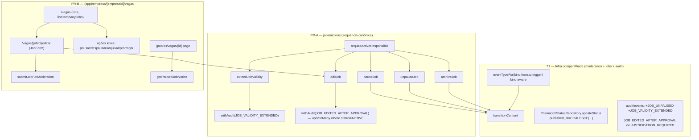

# USP-023 — Editar vaga (pausar, arquivar, renovar) — Design

**Spec**: `.specs/features/vagas/usp-023-editar-vaga/spec.md`
**Status**: Draft

> **Adaptar, não re-derivar.** Consome a máquina de estados de `@/modules/moderation` (ADR-0011/AD-009), o
> padrão de Server Action de `jobs` (USP-020) e o Design System (AD-014). Decisões de projeto vinculantes lidas
> em `.specs/project/STATE.md`: **AD-009** (status na entidade `Job`, adapter por `ContentKind` no container),
> **AD-011/AD-012** (busca/detalhe filtram on-read `status='ACTIVE' AND validUntil>=hojeSP AND company.isVerified`).
> Nenhuma decisão ativa é contrariada; nenhuma nova convenção é criada (portanto **nada a acrescentar em STATE.md**).

## 0. Estado atual (fonte da verdade = código)

| Peça | Local | Fato |
| --- | --- | --- |
| Actions de vaga existentes | `jobs/actions/create-job-draft.ts`, `submit-job-for-moderation.ts` | Só `createJobDraft` (`withAudit(JOB_DRAFT_SAVED)`) e `submitJobForModeration` (→ `transitionContent(JOB→IN_MODERATION)`). Sem edit/pause/archive/extend. |
| Gate P-006 | `submit-job-for-moderation.ts` (`isActiveResponsible`, local) | `personCompanyGrant.findFirst({personId, companyId, grantType:'RESPONSIBLE', status:'ACTIVE', revokedAt:null})`. **Não** exportado. |
| FSM | `moderation/domain/content-status.ts` | `TRANSITIONS[JOB]` já tem `ACTIVE↔PAUSED`, `ACTIVE→DRAFT`, `ACTIVE→ARCHIVED` (todas `AUTHOR_ACTION`, `requiresJustification:false`). Sem aresta a partir de `ARCHIVED` → P-006 garantido pela tabela. |
| `transitionContent` | `moderation/actions/transition-content.ts` | `({contentKind, contentId, to, trigger, justification?, actorPersonId}) → ActionResult<{from,to}>`; resolve `eventTypeFor(to,trigger)` **antes** da tx; se `null` → `fail('INTERNAL')`. |
| `eventTypeFor` | idem (privada, linhas 144-159) | **kind-unaware**; devolve `null` p/ `PAUSED`/`ARCHIVED`/`DRAFT` e p/ `ACTIVE` salvo `MODERATOR_ACTION`. **Bloqueia todas as transições de ciclo de vida.** |
| Adapter de status | `jobs/adapters/prisma-job-status.ts` | `updateStatus` = `tx.job.updateMany({where:{id,status:from},data:{status:to,lastStatusChangeAt}})`, `count===1`. **Não grava `publishedAt`.** |
| Coluna `published_at` | `prisma/schema.prisma` model `Job` | **Já existe** (`published_at DateTime? @db.Timestamptz(6)`), nunca escrita. Sem migração. |
| Catálogo de auditoria | `audit/events.ts` | Já existem `JOB_PAUSED`, `JOB_ARCHIVED`, `JOB_EXPIRED`, `JOB_EDITED_AFTER_APPROVAL`. **Não existem** `JOB_UNPAUSED`, `JOB_VALIDITY_EXTENDED`. `JOB_EDITED_AFTER_APPROVAL` está em `JUSTIFICATION_REQUIRED_EVENTS`. |
| Query owner-scoped | — | **Não existe** "minhas vagas". `searchJobs`/`getActiveJobDetail` são públicas (on-read `ACTIVE`). |
| UI empresa | `app/(app)/empresa/[empresaId]/vagas/nova/page.tsx` | Só criação. `requireActivePerson()` + gate P-006 inline → `notFound()`. **Não há** lista/edição de vagas. |
| Design System | `src/shared/ui/` | `Button`(variants primary/secondary/outline/**danger**)/`Input`/`Label`/`Textarea`/`Card`/`FormCard`/`Badge`/`FormRow`/`StepIcon`/`FormHeader`. **Sem** Dialog/Select/Toast/AlertDialog. Forms existentes (JobForm, EditCompanyForm) hand-roll controles nativos; confirmação destrutiva = overlay `role="dialog"` hand-rolled. |

## 1. Architecture Overview



Cada Server Action segue a sequência canônica de `jobs` (CLAUDE.md): **Zod → `getCurrentPerson()`
(UNAUTHENTICATED) → gate `requireActiveResponsible` (FORBIDDEN, antes de persistir) → `withAudit`/`transitionContent`
→ `ActionResult`**. Nunca `throw`. Nenhuma escreve status via `prisma.update` direto, exceto `editJob` (exceção
documentada §3.5, guardada por U23-MN-07).

## 2. Code Reuse Analysis

### Componentes/utilitários a reusar

| Componente | Local | Como usar |
| --- | --- | --- |
| `transitionContent` | `@/modules/moderation` | pausar/despausar/arquivar dirigem a FSM por aqui (`AUTHOR_ACTION`). |
| `TRANSITIONS[JOB]` / `isValidTransition` | `moderation/domain/content-status.ts` | Arestas já existem; usar como fonte da legalidade da transição. |
| Padrão `createJobDraft` | `jobs/actions/create-job-draft.ts` | Molde exato de `withAudit`/`ActionResult`/`clientIp`/`headers`/dedup. |
| `isActiveResponsible` (local) | `jobs/actions/submit-job-for-moderation.ts` | **Extrair** para gate compartilhado (T2). |
| `validadeStatus`, `MAX_VALIDADE_DIAS` | `jobs/domain/validade.ts` | Validar a nova `validUntil` (E-004). |
| `hojeSaoPaulo()` | `shared/lib/time.ts` | Fronteira temporal America/Sao_Paulo (extend/prorrogação). |
| `getActiveJobDetail` / `viewJobDetail` | `jobs/queries`, `jobs/views` | Detalhe da vaga (P-003) — **não alterar**; adicionar `getPausedJobNotice` ao lado. |
| `JobForm` + `publishJobSchema` | `jobs/components/job-form.tsx`, `jobs/schemas` | Reusar no fluxo de edição (prefill + action `editJob`). |
| `requireActivePerson()` + gate P-006 inline | `app/(app)/empresa/[empresaId]/vagas/nova/page.tsx` | Molde de guarda na borda da rota de gestão. |
| `Button`/`Card`/`Badge`/`Input`/`Textarea` + `role="dialog"` hand-rolled | `@/shared/ui`, `EditCompanyForm` | UI de lista/ações/confirmação sem novos primitivos. |
| `withAudit` | `@/modules/audit` | `audit.before`/`after`/`justification`; PII minimizada; enforcement de justificativa. |

### Integração

| Sistema | Método |
| --- | --- |
| Máquina de estados moderação | `transitionContent` (pause/unpause/archive); `editJob` valida a legalidade da aresta e escreve status na própria tx (exceção §3.5). |
| Busca pública (USP-021) | Nenhuma mudança — `searchJobs` já filtra `status='ACTIVE'`, então `PAUSED`/`ARCHIVED` somem. |
| Detalhe (USP-022) | `getActiveJobDetail` inalterado (retorna `null` p/ não-`ACTIVE`); `page` consulta `getPausedJobNotice` no branch `null`. |
| Auditoria (ADR-0004) | Cada operação grava um evento append-only na mesma tx. |

## 3. Componentes e interfaces

### T1 — Infra compartilhada

- **`eventTypeFor` kind-aware** — `moderation/actions/transition-content.ts`
  - Nova assinatura: `eventTypeFor(contentKind: ContentKind, from: ContentStatus, to: ContentStatus, trigger: TransitionTrigger): AuditEventName | null`.
  - Mapa compartilhado preservado (CONTENT_APPROVED p/ `ACTIVE`+MODERATOR, AWAITING_ADJUSTMENTS, REJECTED, IN_MODERATION, INACTIVATED).
  - Ramo `JOB`: `to=PAUSED → JOB_PAUSED`; `to=ARCHIVED → JOB_ARCHIVED`; `(to=ACTIVE, from=PAUSED, AUTHOR_ACTION) → JOB_UNPAUSED`; `(to=EXPIRED, SYSTEM_JOB) → JOB_EXPIRED` *(consumido pela USP-024 — incluído já aqui para não fragmentar o refactor)*.
  - Call site: `const event = eventTypeFor(contentKind, from, to, trigger)` (ambos `contentKind` e `from` já em escopo).
- **Catálogo de auditoria** — `audit/events.ts`: **adicionar** `JOB_UNPAUSED`, `JOB_VALIDITY_EXTENDED`; **remover** `JOB_EDITED_AFTER_APPROVAL` de `JUSTIFICATION_REQUIRED_EVENTS` (D2).
- **`PrismaJobStatusRepository.updateStatus`** — `jobs/adapters/prisma-job-status.ts`: quando `to===ACTIVE`, gravar `published_at = COALESCE(published_at, now())` preservando a concorrência otimista. Implementar via `tx.$executeRaw(Prisma.sql\`UPDATE jobs SET status=${to}::"content_status", last_status_change_at=now(), published_at=COALESCE(published_at, now()) WHERE id=${contentId}::uuid AND status=${from}::"content_status"\`)` e retornar `affected === 1`; demais destinos mantêm o `updateMany` atual. (D3/E-005/P-001.)

### T2 — Gate compartilhado

- **`requireActiveResponsible(personId, companyId): Promise<boolean>`** — `jobs/server/require-active-responsible.ts` (server-only, ADR-0030 pattern), exportado via barrel. Extrai o `isActiveResponsible` de `submit-job-for-moderation.ts`; refatorar o submit para consumi-lo.

### T3–T6 — Server Actions (`jobs/actions/`), retorno `ActionResult`

| Action | Assinatura | Fluxo | Auditoria |
| --- | --- | --- | --- |
| `pauseJob` | `(input:{jobId}) → ActionResult<{jobId,status}>` | Zod → getCurrentPerson → gate → `transitionContent(JOB,PAUSED,AUTHOR_ACTION)` | `JOB_PAUSED` (via transitionContent) |
| `unpauseJob` | `(input:{jobId}) → ActionResult<{jobId,status}>` | idem → `transitionContent(JOB,ACTIVE,AUTHOR_ACTION)` (from=PAUSED) | `JOB_UNPAUSED` |
| `archiveJob` | `(input:{jobId}) → ActionResult<{jobId,status}>` | idem → `transitionContent(JOB,ARCHIVED,AUTHOR_ACTION)` | `JOB_ARCHIVED` |
| `extendJobValidity` | `(input:{jobId, validUntil}) → ActionResult<{jobId,validUntil}>` | Zod (`validadeStatus`) → getCurrentPerson → gate → precondição `status=ACTIVE` → `withAudit(JOB_VALIDITY_EXTENDED)` `updateMany({where:{id,status:ACTIVE},data:{validUntil,...}})` (`count===1`) | `JOB_VALIDITY_EXTENDED` (before/after `validUntil`) |
| `editJob` | `(input: editJobSchema) → ActionResult<{jobId,status:'DRAFT'}>` | §3.5 | `JOB_EDITED_AFTER_APPROVAL` (before/after campos) |

> Gate resolve `jobId → companyId` carregando a vaga (`prisma.job.findUnique select {companyId,status}`) — `NOT_FOUND`
> se ausente — e então `requireActiveResponsible(person.id, job.companyId)` → `FORBIDDEN`. Precede toda escrita (P-005).

### 3.5. `editJob` — exceção arquitetural documentada (D1)

`editJob` precisa gravar campos **e** mudar `ACTIVE→DRAFT` atomicamente; `transitionContent` não expõe hook de
campos. Portanto:

1. Zod (`editJobSchema` = subconjunto editável de `publishJobSchema` + `jobId`).
2. `getCurrentPerson()` → UNAUTHENTICATED.
3. Carrega a vaga (`select {companyId, status, ...camposAtuais}`); `NOT_FOUND` se ausente.
4. `requireActiveResponsible(person.id, job.companyId)` → FORBIDDEN.
5. Precondição: `job.status === ACTIVE` (senão retorna erro determinístico `CONFLICT`/`INVALID_STATE`). *(A legalidade da aresta `ACTIVE→DRAFT` é a da FSM; a precondição `status=ACTIVE` no `where` é o guard efetivo.)*
6. `withAudit(AuditEvent.JOB_EDITED_AFTER_APPROVAL, async (tx, audit) => { const r = await tx.job.updateMany({ where:{ id, status:'ACTIVE' }, data:{ ...campos, status:'DRAFT', lastStatusChangeAt:new Date() } }); if (r.count !== 1) throw <conflict>; audit.entityType='JOB'; audit.entityId=id; audit.before={ ...camposAntigos, status:'ACTIVE' }; audit.after={ ...campos, status:'DRAFT' }; }, ctx)`.
7. Retorna `{ jobId, status:'DRAFT' }`. A **UI** encadeia `submitJobForModeration({jobId})` (`DRAFT→IN_MODERATION`).

**Guarda U23-MN-07:** teste estático garante que nenhuma escrita de `Job.status` ocorre fora de
`PrismaJobStatusRepository` e deste `editJob`, e que este `editJob` só escreve status com `status:'ACTIVE'` no `where`.

### T7 — Detalhe de vaga pausada (P-003)

- **`getPausedJobNotice(id: string): Promise<{ paused: true } | null>`** — `jobs/queries/get-paused-job-notice.ts`:
  `prisma.job.findFirst({ where:{ id, status:'PAUSED', company:{ isVerified:true } }, select:{ id:true } })` → `{paused:true}` senão `null`. Sem PII.
- Página `(public)/vagas/[id]/page.tsx`: quando `getActiveJobDetail` devolve `null`, chama `getPausedJobNotice`;
  `paused` ⇒ estado "vaga temporariamente pausada" (sem botão candidatar); senão ⇒ estado "vaga encerrada" (atual).

### T8 — Lista de gestão (owner-scoped)

- **`listCompanyJobs(companyId: string): Promise<CompanyJobRow[]>`** — `jobs/queries/list-company-jobs.ts`:
  `prisma.job.findMany({ where:{ companyId }, orderBy:[{status:'asc'},{createdAt:'desc'}], take:100, select:{ id, title, status, validUntil, publishedAt, lastStatusChangeAt } })`. View leve `viewCompanyJobRow` (status, título, validade, contagem de candidaturas se disponível). Dado da própria Empresa → sem anonimização (CLAUDE.md).
- Rota `app/(app)/empresa/[empresaId]/vagas/page.tsx` (Server Component, `force-dynamic`): `requireActivePerson()` + gate P-006 inline (`personCompanyGrant.findFirst` → `notFound()`), depois `listCompanyJobs(empresaId)`. Lista com `Card`/`Badge` de status + ações contextuais.

### T9 — Fluxo de edição + ações leves (UI)

- `app/(app)/empresa/[empresaId]/vagas/[jobId]/editar/page.tsx`: guarda idêntica; prefill via query dos campos atuais; renderiza `JobForm` em "modo edição" cujo submit chama `editJob` e, em sucesso, `submitJobForModeration({jobId})`.
- Ações leves na lista (T8): botões `Button` → chamam `pauseJob`/`unpauseJob`/`extendJobValidity`; **arquivar** usa `Button variant="danger"` + confirmação hand-rolled (padrão `EditCompanyForm`). `router.refresh()` no sucesso.

## 4. Data Models

Nenhuma migração. Reusa `Job.status`/`Job.publishedAt`/`Job.validUntil`/`Job.lastStatusChangeAt` (todas
existentes). `editJobSchema`/`pauseJobSchema`/`unpauseJobSchema`/`archiveJobSchema`/`extendJobValiditySchema`
são schemas Zod novos em `jobs/schemas/` (sem impacto de banco).

```typescript
// jobs/schemas — novos (Zod)
const jobIdSchema = z.object({ jobId: z.string().uuid() });
// pause/unpause/archive = jobIdSchema
const extendJobValiditySchema = z.object({
  jobId: z.string().uuid(),
  validUntil: z.string().refine(isDate),   // validado contra validadeStatus (futura ≤ 180d) no action
});
const editJobSchema = /* subconjunto editável de publishJobSchema */ .extend({ jobId: z.string().uuid() });
```

## 5. Error Handling Strategy

| Cenário | Tratamento | Impacto no usuário |
| --- | --- | --- |
| Não-responsável (P-005) | gate → `fail('FORBIDDEN')` antes de escrever | Erro determinístico; nada muda |
| Vaga inexistente | `fail('NOT_FOUND')` | "vaga não encontrada" |
| Transição inválida (ex.: pausar vaga já `PAUSED`, reativar `ARCHIVED`) | `transitionContent` → `INVALID_TRANSITION`; `editJob`/`extend` → `count!==1` → `CONFLICT` | "esta ação não é permitida para o status atual" |
| Concorrência (2 ações simultâneas) | `updateMany where status=from` `count===1`; perdedor → `INVALID_TRANSITION`/`CONFLICT` | mensagem "item já atualizado" |
| Validade inválida na prorrogação | Zod/`validadeStatus` → `VALIDATION` | erro no campo data |
| `eventTypeFor` sem mapeamento (regressão) | `fail('INTERNAL')` + log `no-audit-event` | genérico "não foi possível concluir" — **evitado** por T1 |

## 6. Risks & Concerns

| Concern | Location | Impact | Mitigation |
| --- | --- | --- | --- |
| Tornar `eventTypeFor` kind-aware muda uma função compartilhada por CV/SERVICE/CANDIDATE_PROFILE | `moderation/actions/transition-content.ts:144` | Regressão nas transições de outros kinds | Preservar o mapa compartilhado idêntico; ramo JOB só aditivo; specs existentes de `transition-content` como testes de preservação (verdes). |
| `editJob` escreve status fora de `transitionContent` (exceção à regra CLAUDE.md) | `jobs/actions/edit-job.ts` | Precedente de bypass da FSM | Guarda estática U23-MN-07 + teste de concorrência; `where status=ACTIVE` é o único ponto e a única aresta legal. |
| Correção do `published_at` no adapter afeta o fluxo de aprovação da USP-020 (compartilhado) | `jobs/adapters/prisma-job-status.ts` | Mudança de comportamento em ativação já existente | É a realização do comportamento **pretendido** (comentário do schema "preenchido na 1ª ativação"); `COALESCE` é idempotente; teste `published-at.int.test.ts` cobre 1ª ativação vs. re-ativação. |
| `raw SQL` no adapter precisa castar o enum `content_status` corretamente | idem | Erro de tipo Postgres | Usar `::"content_status"` e `::uuid`; teste de integração em DB real (Supabase local). |
| DS não tem Dialog/Select/Toast/AlertDialog | `src/shared/ui` | Tentação de criar primitivos (foundation, fora do escopo) | Reusar padrão in-repo (`EditCompanyForm` hand-rolled); documentado na spec (Assumptions). |
| Alterar o `page.tsx` do detalhe (tocado pelo refactor Fase 2 da USP-022) | `app/(public)/vagas/[id]/page.tsx` | Colisão com o restyle da USP-022 | Mudança **aditiva** (branch `null → getPausedJobNotice`); preserva o contrato/anonimização testado da USP-022 (U22-MN-*). |

> Nenhum concern de segurança novo além dos acima; a autorização é reforçada (gate único) e a auditoria ampliada.

## 7. Tech Decisions (não óbvias)

| Decisão | Escolha | Rationale |
| --- | --- | --- |
| Onde vive a correção do `published_at` | No adapter `PrismaJobStatusRepository`, não no fluxo de edição | Único ponto de escrita de status; todo caminho de ativação herda E-005/P-001 sem duplicação (D3). |
| `editJob` dentro ou fora do `transitionContent` | Fora (exceção documentada), com guarda estática | `transitionContent` não muta campos; atomicidade conteúdo+status exige uma tx (D1). |
| `extendJobValidity` como transição ou metadata | Metadata (`withAudit`, sem FSM) | Vaga segue `ACTIVE`; prorrogação não é mudança de status (E-004). |
| Detalhe de vaga pausada | Query aditiva `getPausedJobNotice`, não estender `getActiveJobDetail` | Preserva o contrato `null`→"encerrada" testado da USP-022 (U22-MN-03) e a anonimização. |
| Novos eventos vs. genéricos | `JOB_UNPAUSED`/`JOB_VALIDITY_EXTENDED` (seguem `JOB_PAUSED`/`JOB_ARCHIVED`) | Consistência com o catálogo `JOB_*` existente; kind-aware evita poluir CV/SERVICE. |

> **Decisões de projeto:** nenhuma nova convenção — consome AD-009/AD-011/AD-012/AD-014. Nada a acrescentar em STATE.md.
> A extensão do catálogo de auditoria (`JOB_UNPAUSED`, `JOB_VALIDITY_EXTENDED`) e a remoção de
> `JOB_EDITED_AFTER_APPROVAL` de `JUSTIFICATION_REQUIRED_EVENTS` são mudanças de código dentro do módulo `audit`
> (o header de `events.ts` sugere ADR para extensão; em modo autônomo, registrado aqui como decisão de design —
> segue o padrão dos `JOB_*` já presentes, sem nova política de auditoria).
</content>
