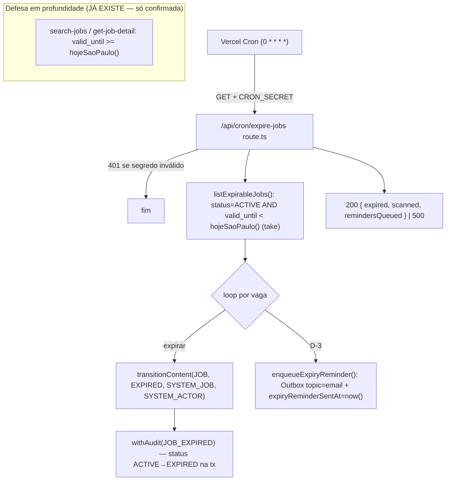

# USP-024 — Expiração automática de vaga — Design

**Spec**: `.specs/features/vagas/usp-024-expiracao-automatica/spec.md`
**Status**: Draft

> **Adaptar, não re-derivar.** Consome a FSM de `@/modules/moderation` (ADR-0011/AD-009), o filtro on-read já
> entregue (AD-011/AD-012), o padrão de cron `auth-attempts-retention`, a `Outbox` (AD-007) e `hojeSaoPaulo()`.
> Decisões de projeto lidas em `.specs/project/STATE.md`. Nenhuma decisão ativa contrariada; **1 migração nova**
> (`Job.expiryReminderSentAt`, só para idempotência do aviso D-3). Nada a acrescentar em STATE.md.

## 0. Estado atual (fonte da verdade = código)

| Peça | Local | Fato |
| --- | --- | --- |
| Enum + FSM | `moderation/domain/content-status.ts` | `ContentStatus.EXPIRED` existe (domínio + Prisma `content_status`); `TRANSITIONS[JOB]` tem `{ACTIVE→EXPIRED, SYSTEM_JOB}`. **Nada a migrar/mudar na FSM.** |
| `eventTypeFor` | `moderation/actions/transition-content.ts` (privada) | Hoje devolve `null` p/ `EXPIRED` → `transitionContent(ACTIVE→EXPIRED)` falha com `INTERNAL`. **A correção kind-aware é entregue pela USP-023/T1** (ramo JOB inclui `EXPIRED→JOB_EXPIRED`). Ver dependência §6. |
| Evento `JOB_EXPIRED` | `audit/events.ts` | **Já existe** no catálogo (não usado ainda). |
| Filtro on-read | `jobs/queries/search-jobs.ts`, `get-job-detail.ts` | Ambos filtram `status='ACTIVE' AND valid_until >= hojeSaoPaulo() AND company.is_verified`. Comentário: "A expiração é resolvida aqui, não pelo job da USP-024." → **defesa em profundidade já pronta.** |
| Adapter status | `jobs/adapters/prisma-job-status.ts` | `updateStatus` = `updateMany({where:{id,status:from},data:{status:to,lastStatusChangeAt}})`, `count===1` (concorrência otimista → idempotência). |
| `validUntil` | `prisma/schema.prisma` model `Job` | `valid_until DateTime? @db.Date` (comentário "on-read >= hoje (USP-024)"). |
| Cron de referência | `app/api/cron/auth-attempts-retention/route.ts` | `GET`, `dynamic='force-dynamic'`, `CRON_SECRET` constante-tempo (`secretsMatch` SHA-256+`timingSafeEqual`), aceita `x-cron-secret` ou `Authorization: Bearer`; **503 fail-closed** se `CRON_SECRET` ausente, **401** se inválido; retorna JSON; `childLogger({module:'cron', job})`. **Sem** `withAudit`, **sem** date-fns-tz (usa SQL `NOW()`). |
| Vercel Cron | `vercel.json` | `crons: [{ path:'/api/cron/auth-attempts-retention', schedule:'0 6 * * *' }]` (UTC). Adicionar 2ª entrada. |
| Env | `shared/env.ts` | `CRON_SECRET` opcional (runtime enforce); validado por Zod fail-fast. |
| `Outbox` | `prisma/schema.prisma` (AD-007) | `topic`/`payload`/`processedAt`/`attempts`/`lastError`. Dispatcher que consome `topic='email'` = **USP-044** (não existe ainda). |
| Domínio de validade | `jobs/domain/validade.ts` | `validadeStatus(validUntil, hojeSP)`, `MAX_VALIDADE_DIAS=180`, compara **datas de calendário** em `America/Sao_Paulo`. |
| `hojeSaoPaulo()` | `shared/lib/time.ts` | Fronteira temporal usada pela busca on-read. |

## 1. Architecture Overview



O job **materializa** o estado que a query já resolve on-read: a query é a fonte da verdade da *visibilidade*
(P-001), o job é a fonte da verdade do *status persistido* (painéis, relatórios, auditoria). Os dois usam a
MESMA fronteira `hojeSaoPaulo()` (P-002).

## 2. Code Reuse Analysis

| Componente | Local | Como usar |
| --- | --- | --- |
| Cron `auth-attempts-retention` | `app/api/cron/auth-attempts-retention/route.ts` | Molde exato: `GET`, `force-dynamic`, auth por `CRON_SECRET`, JSON, `childLogger`. |
| `transitionContent` | `@/modules/moderation` | Materializa `ACTIVE→EXPIRED` (`SYSTEM_JOB`) + `withAudit(JOB_EXPIRED)`; concorrência otimista = idempotência. |
| `eventTypeFor` kind-aware | `moderation/actions/transition-content.ts` | Mapeamento `EXPIRED→JOB_EXPIRED` **entregue pela USP-023/T1**; verificar/garantir (§6). |
| `hojeSaoPaulo()` | `shared/lib/time.ts` | Mesma fronteira da busca (P-002). |
| `validadeStatus` / `MAX_VALIDADE_DIAS` | `jobs/domain/validade.ts` | Base p/ `diasAteExpiracao` (badge E-004). |
| `Outbox` | `prisma` (AD-007) | Enfileira o lembrete D-3 (`topic='email'`); entrega = USP-044. |
| `env.CRON_SECRET` + `secretsMatch` | `shared/env.ts`, cron existente | Autenticação; extrair helper ou replicar inline (§3). |

### Integração

| Sistema | Método |
| --- | --- |
| Busca/detalhe (USP-021/022) | Nenhuma mudança — já ocultam por on-read; o job só materializa o status. |
| Moderação (FSM) | `transitionContent` (`ACTIVE→EXPIRED`, `SYSTEM_JOB`). |
| Auditoria (ADR-0004) | `JOB_EXPIRED` por vaga, na mesma tx da transição. |
| Notificações (USP-044) | `Outbox` `topic='email'` (enqueue aqui; envio lá). |
| Painel da Empresa (USP-023) | Badge "expira em N dias" via `diasAteExpiracao` (render na lista da USP-023/T8). |

## 3. Componentes e interfaces

### T2 — Rota de cron (`app/api/cron/expire-jobs/route.ts`)

- `export const dynamic = 'force-dynamic'`; `export async function GET(request: NextRequest)`.
- **Auth**: replica o contrato de `auth-attempts-retention` — `env.CRON_SECRET` ausente ⇒ **503** (fail-closed);
  segredo (de `x-cron-secret` ou `Authorization: Bearer`) comparado em tempo constante ⇒ **401** se inválido.
  Preferir extrair `verifyCronSecret(request): boolean` para `shared/lib/cron-secret.ts` e usar aqui (não-invasivo;
  refatorar o cron existente para consumi-lo é opcional/fora de escopo, para não regredir um job em produção).
- **Trabalho** (delega ao módulo `jobs`): chama `runJobExpiration()` (abaixo); responde
  `200 { ok:true, expired, scanned, remindersQueued }`; em erro, `log.error` + `500 { ok:false }`.
- **Logging**: `childLogger({ module:'cron', job:'expire-jobs' })` — início/fim + contagens.

### T2 — Caso de uso (`jobs/actions/run-job-expiration.ts`, server-only)

```ts
// Assinatura (retorno para o handler e para os testes)
export interface JobExpirationResult { expired: number; scanned: number; remindersQueued: number; }
export async function runJobExpiration(now = hojeSaoPaulo()): Promise<JobExpirationResult>;
```

Fluxo:
1. `const hoje = now;` (injetável p/ testes de fuso — P-002).
2. **Expiração**: pagina `prisma.job.findMany({ where:{ status:'ACTIVE', validUntil:{ lt: hoje } }, select:{ id:true }, take: BATCH, orderBy:{ id:'asc' } })`; para cada vaga:
   `const r = await transitionContent({ contentKind: ContentKind.JOB, contentId: id, to: ContentStatus.EXPIRED, trigger: 'SYSTEM_JOB', actorPersonId: SYSTEM_ACTOR_ID });`
   contabiliza `expired++` quando `r.ok`; `INVALID_TRANSITION`/`NOT_FOUND` (corrida/já expirada) contam como no-op (não erro). Repete até esvaziar o lote.
3. **Aviso D-3** (P2): pagina `prisma.job.findMany({ where:{ status:'ACTIVE', validUntil: dia D-3 (America/Sao_Paulo), expiryReminderSentAt:null }, take: BATCH })`; para cada, `enqueueExpiryReminder(job)` (grava linha `Outbox` `topic='email'` + `expiryReminderSentAt = now()` numa tx) — idempotente.
4. Retorna as contagens.

> **`SYSTEM_ACTOR_ID`** — `transitionContent`/`withAudit` exigem `actorPersonId`. Design: constante `SYSTEM_ACTOR_ID`
> (UUID fixo) correspondente a uma **Person de sistema** seedada em `prisma/seeds/reference.ts` (idempotente,
> prod-safe — padrão AD-013 WS-A). Task T2 **verifica** se `audit_log.actor_person_id` é FK: se sim, o seed é
> obrigatório; se for coluna livre, a constante basta. (Resolvido no design — owner interno, não bloqueia.)

### T1 — Garantir `eventTypeFor(EXPIRED)` (dependência de infra)

- Se a USP-023/T1 já tornou `eventTypeFor` kind-aware com `(SYSTEM_JOB)EXPIRED→JOB_EXPIRED`, esta task **verifica**
  (teste de integração da transição JOB→EXPIRED verde). Se a USP-024 rodar antes da USP-023, esta task **adiciona**
  o ramo `EXPIRED→JOB_EXPIRED` (idempotente — mesma mudança). Ver §6.

### T3 — Migração + `diasAteExpiracao` (E-003/E-004)

- **Migração** `Job.expiryReminderSentAt DateTime? @map("expiry_reminder_sent_at") @db.Timestamptz(6)` — só para
  idempotência do aviso D-3 (nunca reenfileirar). Sem backfill (nullable).
- **`diasAteExpiracao(validUntil: Date, hojeSP = hojeSaoPaulo()): number`** — `jobs/domain/validade.ts`: dias de
  calendário até a validade em `America/Sao_Paulo` (espelha `validadeStatus`). Base do badge (E-004/P-003).

### T4 — `enqueueExpiryReminder` (E-003 seam)

- `enqueueExpiryReminder(job): Promise<void>` — numa tx: `prisma.outbox.create({ data:{ topic:'email', payload:{ kind:'JOB_EXPIRY_D3', jobId, companyId } } })` + `prisma.job.update({ where:{id}, data:{ expiryReminderSentAt: new Date() } })`. Entrega = USP-044.

### T5 — Badge no painel (E-004)

- Renderizar `diasAteExpiracao` como `Badge` "expira em N dias" na lista de gestão da Empresa (componente da
  **USP-023/T8**). Dep de UI soft sobre USP-023; se o painel não existir, o cálculo puro fica testado e disponível.

### `vercel.json`

```json
{ "path": "/api/cron/expire-jobs", "schedule": "0 * * * *" }
```
Adicionada ao array `crons` (mantendo a de `auth-attempts-retention`). `0 * * * *` = de hora em hora (UTC) → L-001 (≤1h).

## 4. Data Models

Única migração: coluna nullable em `Job`.

```prisma
model Job {
  // ... campos existentes ...
  expiryReminderSentAt DateTime? @map("expiry_reminder_sent_at") @db.Timestamptz(6) // aviso D-3 (USP-024) — idempotência
}
```

`ContentStatus.EXPIRED`, `TRANSITIONS[JOB].ACTIVE→EXPIRED` e `Outbox` já existem — reusados, não criados.

## 5. Error Handling Strategy

| Cenário | Tratamento | Impacto |
| --- | --- | --- |
| `CRON_SECRET` ausente | `503` fail-closed (não roda) | job não executa (config) |
| Segredo inválido | `401`, zero transições (U24-MN-06) | disparo negado |
| Vaga já `EXPIRED` / corrida | `transitionContent` → `INVALID_TRANSITION` → no-op (não conta como erro) | idempotência (U24-MN-07) |
| Falha de uma transição isolada | loga o item, continua o lote; contabiliza; se a rota inteira estourar → `500` | alerta via logs Vercel Cron + Sentry (L-003) |
| Sem vagas vencidas | `200 { expired:0 }` | normal |
| `eventTypeFor(EXPIRED)` não mapeado (regressão) | `transitionContent` → `INTERNAL` | **evitado** por T1 (garante o mapeamento) |

## 6. Risks & Concerns

| Concern | Location | Impact | Mitigation |
| --- | --- | --- | --- |
| **Dependência de infra USP-023/T1** (`eventTypeFor` kind-aware p/ `EXPIRED`) | `moderation/actions/transition-content.ts` | Se a USP-024 rodar antes da USP-023, `EXPIRED` volta `null`→`INTERNAL` | T1 desta USP **verifica ou adiciona** o ramo `EXPIRED→JOB_EXPIRED` (idempotente); mesma mudança das duas USPs. Flag para o orquestrador: rodar USP-023 antes, ou T1 aqui é auto-suficiente. |
| Ator de sistema para `withAudit` | `run-job-expiration.ts` | FK `actor_person_id` inexistente ⇒ falha da tx | T2 verifica o constraint; seed de Person de sistema em `seeds/reference.ts` (idempotente). |
| Fronteira de fuso divergente entre job e query | `run-job-expiration.ts` vs `search-jobs.ts` | Vaga "sumida da busca" mas ainda `ACTIVE` por horas, ou vice-versa | AMBOS usam `hojeSaoPaulo()`; teste de fuso trava `hoje(job) === hoje(query)` (P-002). |
| Job pesado bloqueando (lote grande) | `run-job-expiration.ts` | Timeout da rota | `take` obrigatório (project-guideline); volume MVP <30 vagas; transições por-item (sem tx global). |
| Reenvio duplicado do aviso D-3 | `enqueueExpiryReminder` | Spam de e-mail | `expiryReminderSentAt` marcado na mesma tx do enqueue (U24-MN-07). |
| Duplicar `secretsMatch` vs. refatorar o cron existente | `shared/lib/cron-secret.ts` | DRY vs. risco de regressão no job em produção | Extrair helper e usar **só** na rota nova; refactor do cron existente fica opcional/fora de escopo. |
| E-004 depende do painel da USP-023 | UI | Sem painel, badge não tem onde pintar | Cálculo puro `diasAteExpiracao` entregue+testado; render acompanha a USP-023 (mesma unidade Fase 2). |

## 7. Tech Decisions (não óbvias)

| Decisão | Escolha | Rationale |
| --- | --- | --- |
| Materializar `EXPIRED` por cron vs. só on-read | Ambos (defesa em profundidade) | On-read garante visibilidade (P-001); cron materializa status p/ painéis/relatórios/auditoria (E-001). |
| Mecanismo do job | Route Handler + Vercel Cron (clone do existente) | Único mecanismo de cron do projeto (ADR-0002); reusa auth `CRON_SECRET` + runbook. |
| Cadência | `0 * * * *` (hourly) | L-001 (≤1h) com custo trivial; on-read cobre o intervalo. |
| Idempotência da expiração | FSM + `where status=ACTIVE` (sem coluna nova) | Concorrência otimista já garante no-op na 2ª passada (ADR-0011 R3). |
| Idempotência do aviso D-3 | Coluna `expiryReminderSentAt` | Evita reenfileirar a cada execução horária; única migração da USP. |
| Ator da auditoria | `SYSTEM_ACTOR_ID` (Person de sistema seedada) | `withAudit` exige `actorPersonId`; ator de sistema mantém a trilha coerente (ADR-0004). |
| Observabilidade | Logs estruturados + Vercel Cron logs + Sentry (sem tabela de heartbeat) | Dashboard "última execução" é relatório (USP-042); evita infra sobre-dimensionada. |

> **Decisões de projeto:** nenhuma nova convenção — consome AD-007/AD-009/AD-011/AD-012 + padrão de cron
> existente. A migração `expiryReminderSentAt` e a Person de sistema seedada são aditivas e locais.
</content>
