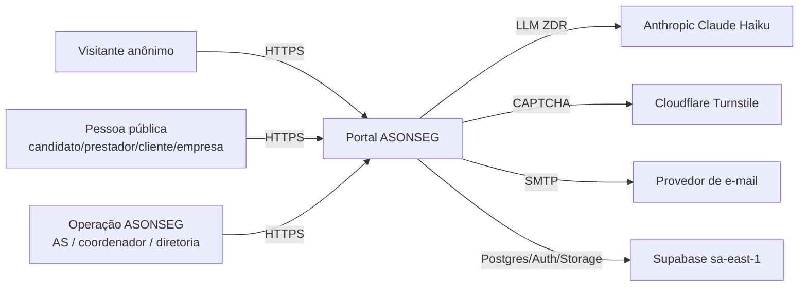
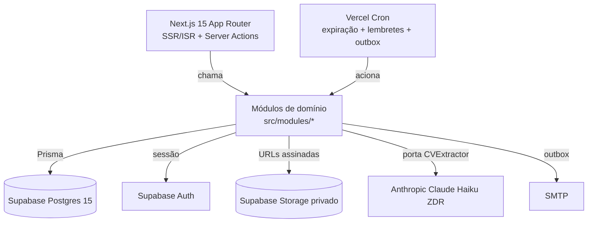
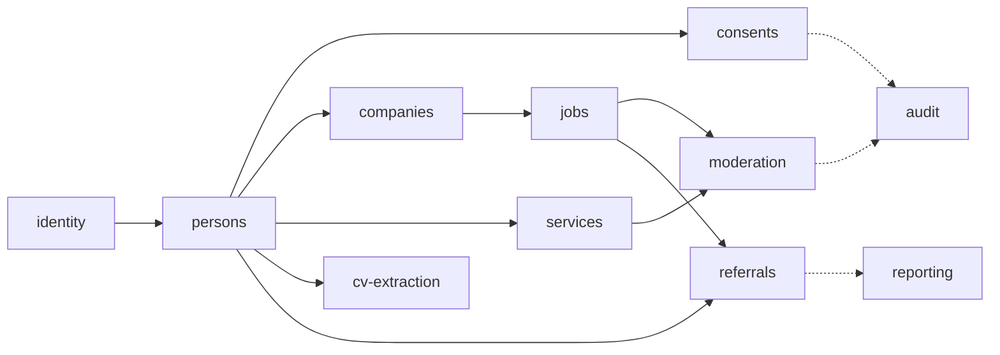

# Documento de Arquitetura — Portal Empregabilidade e Serviços ASONSEG

**Versão:** 1.1
**Data:** 2026-05-29
**Status:** Aprovado
**Arquiteto responsável:** Arquiteto Bravi
**Aprovação:** PO Bravi (proposta aceita em 2026-05-28; pendências resolvidas em 2026-05-29)

**Documentos relacionados:**
- [Project Guideline](./project-guideline.md) — padrões e convenções
- [Technical Design Document](./technical-design.md) — como implementar
- [ADRs](./adrs/) — registros das decisões arquiteturais (negócio 0001–0018, técnicos 0019–0030)
- [Matriz de Conexões](../ice-portal-asonseg/matriz-conexoes.md) — índice por-USP (camada ICE)

---

## 1. Sumário Executivo

O Portal ASONSEG conecta a comunidade de Florianópolis a vagas e serviços locais, preservando o papel institucional da ASONSEG via **encaminhamento** e qualidade via **moderação humana pré-publicação**. A solução é um **monolito modular fullstack** em **Next.js 15 (App Router)** com **Prisma + Postgres (Supabase, sa-east-1)**, deploy na **Vercel**, mutações via **Server Actions**. A diretriz dominante é **custo operacional mínimo** (ADR-0010): sem microsserviços, sem mensageria pesada, base única. O MVP também entrega a **fundação compartilhada** do sistema ASONSEG — Pessoa unificada, papéis compostos, consentimentos LGPD por finalidade e auditoria imutável. Custo de infra estimado em **~US$ 50–90/mês**. Onze módulos de domínio cobrem identidade, cadastros, moderação, vagas, serviços, encaminhamento social, extração de CV via IA (com ZDR) e relatórios.

---

## 2. Contexto e Motivação

### 2.1. Problema de Negócio

Não há, na comunidade atendida (Canasvieiras, Jurerê, Ingleses e adjacências), um canal estruturado que conecte candidatos a vagas e prestadores a clientes locais. Os canais informais geram ineficiência e impedem a ASONSEG de exercer seu papel de ponte institucional entre famílias atendidas e o mercado de trabalho/serviços. O Portal é a prioridade institucional imediata (Release 1); a Frente 4 (Estoque/Fito) foi reposicionada para o Release 2.

### 2.2. Objetivos

- Estabelecer canal estruturado de empregabilidade e serviços para a comunidade local.
- Preservar o papel institucional ativo da ASONSEG via **encaminhamento** com badge.
- Operar com qualidade controlada via **moderação humana pré-publicação**.
- Construir a **fundação compartilhada** (Pessoa, papéis, LGPD, auditoria) que barateia o Release 2.
- Conformidade LGPD desde o dia 1 (consentimento por finalidade, auditoria imutável).

### 2.3. Restrições e Premissas

| Tipo | Item |
|---|---|
| Restrição de custo | TCO mínimo (ADR-0010); sem microsserviços/mensageria pesada/múltiplas bases |
| Restrição regulatória | LGPD — múltiplos titulares e finalidades; dado em `sa-east-1` |
| Restrição organizacional | Sem time dedicado de SRE → serviços gerenciados; PT-BR único idioma |
| Restrição de stack | Next.js 15 + Prisma + Supabase + shadcn/ui (CLAUDE.md) |
| Premissa | Volume baixo: 200–500 candidatos, 50–200 vagas, 30–100 empresas, 50–150 prestadores no 1º ano |
| Premissa | Tráfego anônimo de busca pública é o único componente sujeito a picos |

### 2.4. Fora do Escopo

❌ Família como entidade estruturada (Release 2 — só ficha socioeconômica declarativa no MVP)
❌ Gestão de status de candidatura / Kanban (V2)
❌ Sistema de denúncia formal (escalonamento manual via USP-018 no MVP)
❌ Convite por e-mail para responsável de Empresa (Pessoa precisa estar pré-cadastrada)
❌ Consulta automática à Receita Federal (CNPJ só por dígito verificador)
❌ App mobile nativo, modo offline, múltiplos idiomas, busca semântica/FTS, rating

---

## 3. Visão Geral da Solução

### 3.1. Diagrama de Contexto (C4 Nível 1)



### 3.2. Diagrama de Containers (C4 Nível 2)



Cada container é parte do **mesmo deploy** Next.js (exceto os gerenciados Supabase e os provedores externos). Não há serviços de rede internos — as fronteiras são de **módulo**, não de processo.

### 3.3. Padrão Arquitetural

**Padrão adotado:** Monolito Modular fullstack (Next.js App Router + Server Actions), com Ports & Adapters para dependências externas.

**Justificativa:** Aplicando as lentes **YAGNI/Simplicidade** e **Custo de Mudança**, o volume previsto não justifica complexidade distribuída; o ADR-0010 a proíbe explicitamente. O monolito modular dá **coesão por domínio** e **baixo acoplamento** (fronteiras de módulo + barrel exports) sem o custo operacional de microsserviços. Ports & Adapters isolam LLM, CAPTCHA, e-mail e storage, mantendo o **Custo de Mudança** baixo (provedor trocável).

**Padrão de referência:** estrutura modular descrita no [`project-guideline.md`](./project-guideline.md) §2 — `src/app/`, `src/modules/<dominio>/`, `src/shared/`.

---

## 4. Stack Tecnológica

| Camada | Tecnologia | Justificativa |
|---|---|---|
| Linguagem | TypeScript 5.x strict | Tipagem forte na fundação compartilhada; um runtime front+back |
| Framework | Next.js 15 (App Router, Server Components, Server Actions) | Um deploy, ISR p/ busca pública, mutações sem API REST separada (ADR-0019) |
| Banco | PostgreSQL 15 via Supabase (sa-east-1) | Gerenciado, ACID, dado no Brasil, append-only via REVOKE (ADR-0023) |
| ORM | Prisma 5.x | `$transaction` p/ atomicidade (ADR-0020); isola SQL |
| Auth | Supabase Auth (e-mail/senha, sem RLS) | Autorização na camada de app (ADR-0022) |
| Storage | Supabase Storage privado | CV/fotos com URL assinada (ADR-0028) |
| Validação | Zod 3.x | Entrada de Server Actions + whitelist do retorno LLM (ADR-0027) |
| UI | shadcn/ui + Tailwind + Radix; React Hook Form | Acessível (WCAG AA), baixo letramento digital |
| IA | Anthropic Claude Haiku (ZDR) via porta CVExtractor | ZDR obrigatório (ADR-0018/0027), PT-BR, custo baixo |
| CAPTCHA | Cloudflare Turnstile | Grátis, acessível, privacy-friendly (ADR-0029) |
| E-mail | SMTP gerenciado (Resend/SES) via outbox | Transacional pós-commit (ADR-0020) |
| Infra/CI | Vercel + Vercel Cron; GitHub Actions | ISR/Cron nativos; deploy simples (ADR-0019) |
| Datas | date-fns + date-fns-tz (`America/Sao_Paulo`) | Expiração on-read consistente (ADR-0026) |
| Observabilidade | pino (logs estruturados) + alertas | Job falho, quota SMTP, lockouts (RNF 6.6) |
| Testes | Vitest (unit/integração) + Playwright (E2E) | DoD do PRD §8.4 |

---

## 5. Decisões Arquiteturais (ADRs)

ADRs de negócio (0001–0018, via po-bravi-idsd) e técnicos (0019–0030, esta fase) compartilham o espaço de numeração.

| # | Título | Status | Resumo |
|---|---|---|---|
| ADR-0019 | [Stack, plataforma e ambientes](./adrs/0019-stack-plataforma-e-ambientes.md) | Aceita | Next.js 15 + Supabase + Vercel sob custo mínimo |
| ADR-0020 | [Atomicidade transacional e outbox](./adrs/0020-atomicidade-transacional-e-outbox.md) | Aceita | `$transaction` única + e-mail via outbox pós-commit |
| ADR-0021 | [Unicidade sob concorrência](./adrs/0021-unicidade-sob-concorrencia.md) | Aceita | `UNIQUE` no DB + 409 determinístico |
| ADR-0022 | [Visibilidade por View Models](./adrs/0022-visibilidade-view-models-e-anonimizacao.md) | Aceita | View Models por papel + anonimização no serializer |
| ADR-0023 | [Log append-only](./adrs/0023-log-append-only-auditoria-e-consentimentos.md) | Aceita | Auditoria e consentimentos append-only (REVOKE) + hash + cripto |
| ADR-0024 | [Máquina de estados de moderação](./adrs/0024-maquina-de-estados-de-moderacao.md) | Aceita | `transitionContent` única via de mudança de status |
| ADR-0025 | [Cascata de revogação](./adrs/0025-cascata-de-revogacao-de-consentimento.md) | Aceita (semântica pendente) | Matriz finalidade→efeitos + on-read |
| ADR-0026 | [Expiração on-read + job](./adrs/0026-expiracao-on-read-e-job-agendado.md) | Aceita | On-read (verdade) + job (convergência) + alerta |
| ADR-0027 | [Porta CVExtractor + LLM ZDR](./adrs/0027-porta-cvextractor-llm-zdr.md) | Aceita | Porta + Claude Haiku ZDR + whitelist de campos |
| ADR-0028 | [Sanitização de PII e upload](./adrs/0028-sanitizacao-de-pii-texto-livre-e-upload.md) | Aceita | Sanitizer + validação de upload + storage privado |
| ADR-0029 | [Anti-abuso](./adrs/0029-anti-abuso-rate-limit-captcha-lockout.md) | Aceita | Turnstile + lockout (email+IP) + rate limit + anti-enumeração |
| ADR-0030 | [Revalidação por requisição](./adrs/0030-revalidacao-de-status-e-permissao-por-requisicao.md) | Aceita | Status/permissões revalidados a cada request (janela curta) |

---

## 6. Bounded Contexts e Módulos

### 6.1. Visão Geral



### 6.2. Classificação de Subdomínios

| Módulo | Tipo | Responsabilidade |
|---|---|---|
| `identity` | Core (fundação) | Credencial, login, sessão, reivindicação, recuperação (ADR-0011/0030) |
| `persons` | Core (fundação) | Pessoa unificada, papéis compostos, ficha socioeconômica (ADR-0011/0012) |
| `consents` | Core (fundação) | 8 finalidades, append-only, revogação em cascata (ADR-0013/0023/0025) |
| `referrals` | **Core (diferencial)** | Encaminhamento institucional → candidatura com badge (ADR-0016) |
| `moderation` | **Core (diferencial)** | Máquina de estados pré-publicação, validação de Empresa (ADR-0015/0024) |
| `companies` | Supporting | Empresa sem login, vínculo N:N responsável, verificação (ADR-0014) |
| `jobs` | Supporting | Vagas, busca, expiração, candidaturas (ADR-0026) |
| `services` | Supporting | Serviços, busca, manifestações de interesse |
| `reporting` | Supporting | Relatórios operacionais, home com indicadores |
| `cv-extraction` | Generic | Extração de CV via LLM (comprado pronto, ZDR — ADR-0027) |
| `audit` | Generic (transversal) | Log imutável append-only de eventos sensíveis (ADR-0023) |

### 6.3. Padrões de Integração Entre Módulos

| De | Para | Padrão | Protocolo | Síncrono/Assíncrono |
|---|---|---|---|---|
| qualquer | `audit` | `withAudit(event, tx)` | chamada em-processo na mesma transação | Síncrono |
| qualquer write | `consents` | `requireActiveConsent` | chamada em-processo | Síncrono |
| `referrals` | `jobs` | gera candidatura | chamada em-processo (transação) | Síncrono |
| `jobs`/`services` | `moderation` | `transitionContent` | chamada em-processo (transação) | Síncrono |
| `cv-extraction` | LLM externo | porta CVExtractor | HTTPS (ZDR) | Assíncrono (job ≤30s) |
| qualquer | e-mail | outbox | tabela + worker pós-commit | Assíncrono |

Comunicação **sempre via barrel export** (`@/modules/<nome>`), nunca por deep path. Sem eventos de rede; "eventos de domínio" são chamadas em-processo dentro da transação ou linhas de outbox.

---

## 7. Contratos de API (Preliminares)

O MVP **não expõe API REST pública versionada** — as mutações são **Server Actions** e as leituras são Server Components/queries. O detalhamento (assinaturas, schemas Zod, retornos) está no TDD §4.4. Endpoints HTTP existem apenas para: webhooks/validação de CAPTCHA, rotas de Cron, e health check.

### 7.1. Superfícies principais (Server Actions)

| Superfície | Ação | Auth |
|---|---|---|
| `identity` | registrar, login, reivindicar credencial, recuperar senha | pública / sessão |
| `persons` | ativar papel, inativar Pessoa, ficha socioeconômica | sessão + papel |
| `companies` | cadastrar Empresa, gerir responsáveis, editar | sessão + vínculo |
| `jobs`/`services` | publicar, editar, candidatar, manifestar | sessão + papel |
| `moderation` | `transitionContent` (aprovar/devolver/rejeitar/inativar) | permissão delegada |
| `referrals` | encaminhar, registrar resultado | permissão delegada |
| `consents` | aceitar, visualizar, revogar | sessão |

### 7.2. Rotas HTTP (mínimas)

| Endpoint | Origem | Autenticação |
|---|---|---|
| `POST /api/cron/expire-jobs` | Vercel Cron | secret de cron |
| `POST /api/cron/dispatch-outbox` | Vercel Cron | secret de cron |
| `GET /api/health` | uptime monitor | pública |

### 7.3. Eventos (em-processo / outbox)

| Evento | Mecanismo | Consumidores |
|---|---|---|
| `person.created`, `role.activated`, `content.transitioned`, `referral.created` | `withAudit` (mesma transação) | `audit` |
| `email.welcome`, `email.moderation_decision`, `email.application`, ... | outbox → worker | provedor SMTP |

**Versionamento:** não há contrato HTTP público a versionar no MVP; mudanças de Server Action seguem o versionamento do código.

---

## 8. Requisitos Não-Funcionais

| NFR | Requisito | Como atender | Como medir |
|---|---|---|---|
| **Performance** | Operações interativas ≤ 2s p95 | Volume baixo + índices + queries com `take`/`select` | APM/logs por ação |
| **Performance** | Home ≤ 1.5s p95 | ISR + cache (TTL 600s) + revalidação on-demand + indicadores agregados | RUM/uptime |
| **Escalabilidade** | Absorver picos de tráfego anônimo | ISR/CDN da Vercel na busca pública (ADR-0019/0026) | Load test pré go-live |
| **Disponibilidade** | 99% no horário 8h–21h | Vercel + Supabase gerenciados; manutenção 21h–8h | Uptime externo |
| **Segurança** | bcrypt via Supabase Auth (cost 10, gerenciado), lockout, TLS, cripto em repouso | ADR-0023/0028/0029/0030 | Pentest; revisão |
| **Observabilidade** | Eventos críticos logados + alertas | pino + alerta (job falho, quota SMTP 80%, lockouts) | Cobertura de alertas |
| **LGPD** | Consentimento por finalidade, revogação, ZDR, minimização | ADR-0013/0023/0025/0027/0028 | Auditoria de consentimento |
| **Compliance** | Retenção indefinida com base institucional; direito de acesso em 15 dias | ADR-0008; export manual auditado | Log de export |

---

## 9. Estratégia de Dados

### 9.1. Persistência

**Banco principal:** PostgreSQL 15 (Supabase). Relacional/ACID atende a fundação compartilhada (Pessoa↔papéis↔consentimentos↔Empresa N:N) e às garantias de unicidade/atomicidade (ADR-0020/0021).

### 9.2. Estratégia de Schema

- **Migrations:** forward-only, versionadas (Supabase CLI / Prisma migrate).
- **Naming:** tabelas `snake_case` plural, colunas `snake_case`.
- **Soft vs hard delete:** **soft** (status terminal) por padrão — retenção indefinida (ADR-0008); sem DELETE físico de Pessoa/conteúdo/consentimento.
- **Append-only:** `audit_log` e `consents` com `REVOKE UPDATE, DELETE` (ADR-0023).
- **Timestamps:** `timestamptz` (UTC), conversão `America/Sao_Paulo` na fronteira.

### 9.3. Cache

- **Busca pública / home:** ISR + cache **TTL 600s** + **revalidação on-demand** na aprovação/expiração de conteúdo (D-012/QP-004 **resolvido**).
- **Status/permissões:** revalidação por request, cache opcional ≤30s (ADR-0030).
- **Consistência:** verificação **on-read** garante que conteúdo expirado/revogado nunca aparece, independentemente do cache/job (ADR-0025/0026).

### 9.4. Fluxo de Dados (exemplo: candidatura)

```mermaid
sequenceDiagram
    participant C as Candidato
    participant SA as Server Action
    participant DB as Postgres
    participant OB as Outbox
    participant W as Worker
    C->>SA: candidatar-se(vaga)
    SA->>SA: Zod + requirePermission + requireActiveConsent
    SA->>DB: BEGIN; INSERT candidatura (UNIQUE); revela contato; withAudit
    SA->>OB: INSERT email.application (mesma transação)
    SA->>DB: COMMIT
    SA-->>C: { ok: true }
    W->>OB: lê pós-commit
    W->>C: e-mail de confirmação
```

---

## 10. Riscos Técnicos

| # | Risco | Probabilidade | Impacto | Mitigação |
|---|---|---|---|---|
| R-01 | Gate D-002 (8 termos) bloqueia ~17 USPs em produção (D-001/DPO já resolvido — Angélica) | Média | Alto | Atividade de Fase 0 redige+aprova os termos antes da USP-043; feature flags por finalidade; agregados-sem-PII primeiro |
| R-02 | ZDR do provedor LLM não confirmado | Média | Alto | Porta CVExtractor + flag desliga extração; fallback manual (best-effort) |
| R-03 | Vazamento de PII por canal lateral (JSON-LD/OG/API) | Média | Alto | Anonimização no serializer (ADR-0022) + testes de visibilidade por papel |
| R-04 | Semântica da cascata de revogação indefinida (dono do intent) | Média | Médio | Matriz declarativa validada com DPO antes da USP-043; mecanismo on-read pronto |
| R-05 | Job de expiração falha silenciosamente | Baixa | Médio | Verificação on-read (independe do job) + alerta de heartbeat (ADR-0026) |
| R-06 | Server Actions acoplarem UI e domínio | Média | Médio | Disciplina de módulos + barrel + review (project-guideline §2) |

---

## 11. Estimativa de Custo de Infraestrutura

### 11.1. Custo Mensal Estimado

| Recurso | Especificação | Custo mensal |
|---|---|---|
| Vercel | Plano Pro (deploy + ISR + Cron) | ~US$ 20 |
| Supabase | Plano Pro (Postgres + Auth + Storage + backup) | ~US$ 25 |
| Anthropic Claude Haiku | Extração de CV, best-effort, baixo volume | ~US$ 1–5 |
| Cloudflare Turnstile | CAPTCHA | US$ 0 |
| SMTP (Resend/SES) | E-mail transacional, free tier → tier baixo | US$ 0–20 |
| **Total estimado** | | **~US$ 50–90/mês (~R$ 300–500)** |

### 11.2. Alternativa Mais Barata Considerada

Container único (Fly.io/Render) + Supabase, sem Vercel: ~US$ 30–50/mês de infra. **Trade-off:** economia de ~US$20/mês ao custo de operar ISR/cache/deploy manualmente — várias horas/mês de DevOps. Não recomendado dado o time enxuto (ADR-0019, Opção B).

### 11.3. Crescimento Projetado

Se o tráfego anônimo crescer muito (divulgação ampla — QP-009), o custo sobe principalmente na Vercel (bandwidth/edge). Mitigação: ISR + cache curto já dimensionados; reavaliar CDN dedicada se o p95 da busca degradar.

---

## 12. Plano de Implementação (Visão Macro)

| Fase | Conteúdo | Duração estimada |
|---|---|---|
| Fase 0 | Setup (Supabase CLI, Vercel, CI/CD); resolver D-006/D-007 + **redigir e aprovar os 8 termos (D-002)** antes da USP-043; D-001/D-008/D-009/D-011/D-012 já resolvidos; checklists validadas | 1–2 semanas |
| Fase 1 | Fundação: `identity`, `persons`, `consents`, `audit` (USP-001–008, **045**, 043) | 3–4 semanas |
| Fase 2 | Cadastros + Empresa + moderação: `companies`, `moderation`, `jobs`, `services` (USP-009–032) | 4–5 semanas |
| Fase 3 | Social + IA + relatórios: `referrals`, `cv-extraction`, `reporting`, e-mail (USP-033–044) | 3–4 semanas |
| Lançamento | Hardening, load test, validação dos gates LGPD, go-live | 1–2 semanas |

Detalhe das fases por-USP no TDD §5 e na matriz de conexões (coluna "Fase").

---

## 13. Itens Pendentes e Premissas

### 13.1. Premissas — resolvidas em 2026-05-29

✅ **ACs de login (USP-004)** — **VALIDADO** pelo PO: o padrão coerente com §6.3 (e-mail+senha, lockout 5/15min, sessão 12h) é o comportamento esperado.
✅ **Reativação de Pessoa** — **CRIADA como USP-045** (Reativar Pessoa), fluxo **inverso da USP-007**: reabilita login, preserva histórico, **não** restaura permissões delegadas (ADR-0030). Intent/expectations a gerar pela `po-bravi-idsd`; já registrada na matriz e no plano (Fase 1).
✅ **TTL da home** — **DEFINIDO** (D-012/QP-004 resolvido): **TTL 600s + revalidação on-demand** na aprovação/expiração de conteúdo.

### 13.2. Decisões Adiáveis (não bloqueantes)

- ✅ **Retenção de logs operacionais (QP-008)** — **DEFINIDA: 2 anos.**
- Detalhamento dos relatórios prioritários (D-005/QP-005) — refinável em sprints.
- Limites concretos de rate limit por rota (ADR-0029) — calibráveis pós-medição.

### 13.3. Gates de Negócio — status atualizado em 2026-05-29

✅ **D-001 (DPO designado)** — **RESOLVIDO: diretora Angélica designada DPO.** Desbloqueia USP-036/037/039/040/042/043 e a inativação por titular (USP-007), condicionado aos termos (D-002).
🟡 **D-002 (8 termos jurídicos por finalidade)** — **EM ANDAMENTO:** atividade de Fase 0 criada para **redigir o rascunho dos 8 termos e submetê-los à aprovação (DPO + jurídico) antes do início da USP-043** (e das demais USPs com consentimento). Permanece bloqueante até a aprovação.
✅ **Semântica da cascata de revogação (USP-043)** — **OWNER CONFIRMADO:** DPO (Angélica) + jurídico definem a matriz finalidade→efeitos antes da USP-043; o mecanismo on-read já está pronto (ADR-0025).
✅ **D-011/QP-001 (verificação de identidade — USP-003)** — **RESOLVIDO:** a diretoria definiu o processo como **verificação manual feita pela assistente social**.
✅ **Checklists Fase 0** (verificação de Empresa USP-017, conformidade legal de vaga USP-020, serviços proibidos USP-029) — **VALIDADAS.**

### 13.4. Pontos para Reavaliação Futura

- Se volume de busca anônima superar muito a previsão, reavaliar CDN dedicada.
- Se a moderação virar gargalo (MP10 alto), reavaliar moderação assistida por IA (V2).
- Se o sistema crescer além do MVP, reavaliar extração de `audit`/`reporting` para leitura dedicada.

---

## 14. Histórico de Revisões

| Versão | Data | Autor | Mudança |
|---|---|---|---|
| 1.0 | 2026-05-28 | Arquiteto Bravi | Versão inicial aprovada (modo ICE/IDSD) |
| 1.1 | 2026-05-29 | Arquiteto Bravi | Pendências resolvidas: DPO designada (Angélica), TTL home 600s+on-demand, retenção de logs 2 anos, verificação de identidade manual pela AS, checklists validadas, USP-004 validada; criada USP-045 (Reativar Pessoa) |
