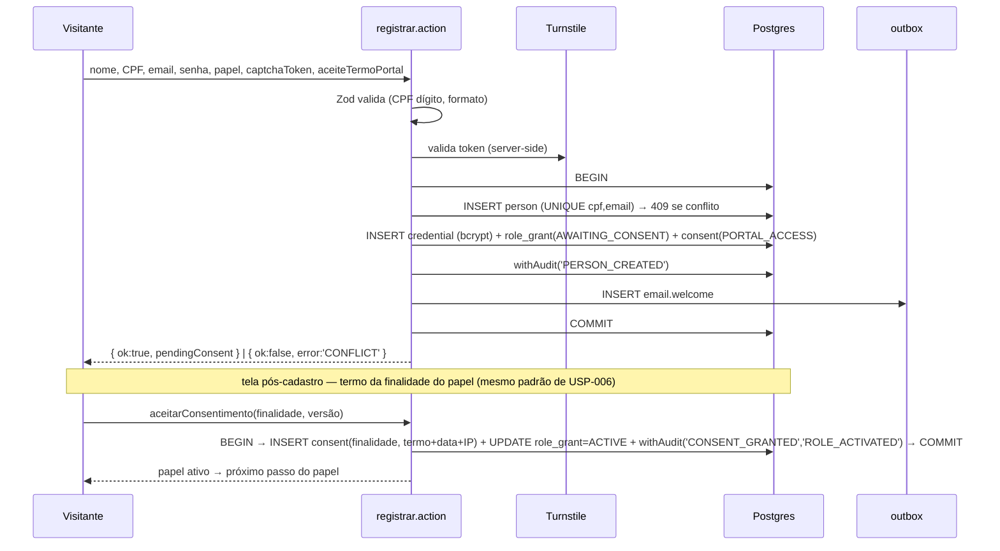
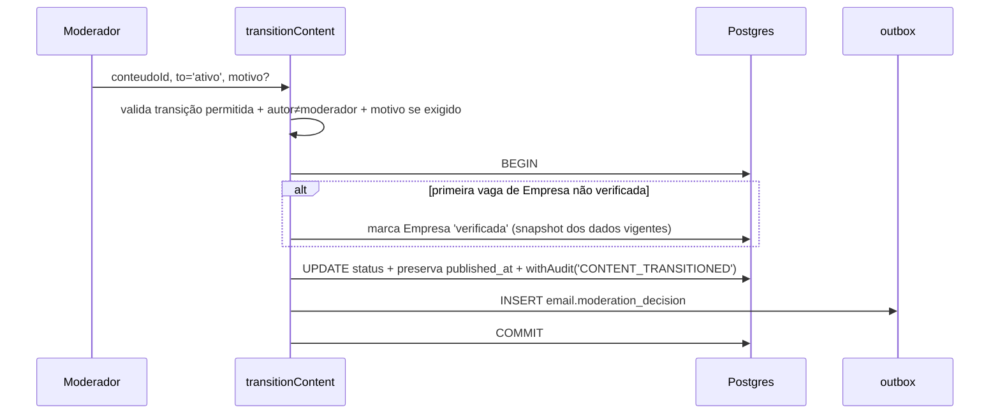

# Technical Design Document — Portal Empregabilidade e Serviços ASONSEG

**Versão:** 1.1
**Data:** 2026-05-30
**Status:** Aprovado
**Tech Lead:** a definir
**Arquiteto:** Arquiteto Bravi

**Documentos relacionados:**
- [Documento de Arquitetura](./architecture-document.md) — visão arquitetural e ADRs
- [Project Guideline](./project-guideline.md) — padrões e convenções
- [ADRs](./adrs/) — decisões (negócio 0001–0018, técnicos 0019–0030)
- [Matriz de Conexões](../ice-portal-asonseg/matriz-conexoes.md) — índice por-USP que aponta para este TD
- [Registro de Decisões Pendentes](./pending-decisions.md) — 25 decisões externas (jurídico, DPO, diretoria, coordenador, sponsor) a solicitar **antes da 1ª atividade que as consome** (consultado no planejamento de cada sprint)

**Revisões:**
- **v1.1 (2026-05-30):** incorpora decisões da camada ICE (resolução dos `❓` de USP-001 a USP-044) sem alterar ADRs. Adições incrementais — schema (`company_responsibles.status`, nova tabela `company_responsible_requests`, `service_interests.lido_em`, `ficha_social` com composição familiar numérica + justificativa auditada, `persons.email_prefs`, `referral_results.fonte`), endpoints (`companies.solicitarInclusaoResponsavel`/`aprovarSolicitacao`/`negarSolicitacao`/`aceitarVinculoResponsavel`, `services.marcarManifestacaoLida`, `persons.atualizarPreferenciasEmail`), eventos de auditoria adicionais, extensão da FSM de moderação (transição `arquivado → rascunho|ativo` no ADR-0024 — inativação reversível sem prazo pelo coordenador). Parâmetros tunáveis com valores propostos: validade máx. de vaga 180 dias; contador de candidaturas visível ≥3; lembrete de serviço pausado 30 dias; lembrete de resultado de encaminhamento 30 dias; lembrete de manifestação sem resposta 7 dias; resumo profissional de encaminhamento ≥50 caracteres; rate limit de candidatura >20/semana → alerta; rate limit de manifestação >10/semana → alerta; home oculta contadores <5; rotação leve dos top 10 na busca de serviços.
- **v1.0 (2026-05-28):** versão inicial aprovada.

---

## 1. Contexto

O Portal ASONSEG é a fundação compartilhada + o produto Release 1 do sistema ASONSEG. Domínio social de empregabilidade: conecta candidatos a vagas e prestadores a clientes, com a ASONSEG como ponte institucional (encaminhamento) e curadora de qualidade (moderação humana). Stakeholders: público (candidato, empresa-responsável, prestador, cliente), operação ASONSEG (assistente social, coordenador, diretoria) e o sistema. PT-BR, online-only, PWA + web responsivo. Este TD detalha **como** implementar; o **que/por quê** está no documento de arquitetura.

## 2. Declaração do Problema e Motivação

A comunidade depende de canais informais; a ASONSEG não consegue exercer seu papel de ponte de forma rastreável. Tecnicamente, o desafio é entregar uma fundação de identidade unificada + LGPD rigorosa (consentimento por finalidade, auditoria imutável, visibilidade conservadora) ao **menor custo operacional** (ADR-0010), sem comprometer as restrições absolutas (cripto em repouso, log imutável, HTTPS, backup). O sistema precisa proteger dado pessoal por padrão e revelar só por ação afirmativa, sob concorrência e múltiplos papéis.

## 3. Escopo

### 3.1. ✅ Dentro do Escopo

Fundação (Pessoa, papéis compostos, login único, consentimentos por finalidade, auditoria) · cadastros públicos · Empresa sem login (N:N) · moderação pré-publicação · vagas + candidaturas + busca ativa · serviços + manifestações · encaminhamento institucional + resultado · ficha socioeconômica + visão consolidada · extração de CV via IA (ZDR) · home com indicadores + relatórios CSV/PDF · notificações por e-mail. **45 USPs (USP-001–044 + USP-045 reativar Pessoa).**

### 3.2. ❌ Fora do Escopo

Família estruturada (R2) · gestão de status de candidatura · denúncia formal · convite por e-mail · consulta à Receita · WhatsApp/push · busca semântica/FTS · app nativo · offline · rating · mensageria interna · pagamentos · múltiplos idiomas.

---

## 4. Solução Técnica

### 4.1. Visão Geral da Arquitetura

Monolito modular Next.js 15 (App Router) + Prisma/Postgres (Supabase) + Vercel. Detalhe arquitetural no `architecture-document.md` §3–§6. Aqui detalhamos componentes, fluxos, contratos, schemas, eventos e integrações.

### 4.2. Componentes e Responsabilidades

| Módulo | Componentes principais | Responsabilidade |
|---|---|---|
| `identity` | actions: registrar, login, reivindicarCredencial, recuperarSenha; adapter Supabase Auth | Credencial, sessão, lockout, reset, reivindicação (ADR-0030/0029) |
| `persons` | Pessoa, PapelGrant, FichaSocial; views por papel | Pessoa unificada, papéis compostos, ficha socioeconômica |
| `consents` | Consent (append-only), revocationCascade | 8 finalidades, aceite, revogação on-read (ADR-0013/0025) |
| `companies` | Empresa, ResponsavelVinculo | Empresa sem login, N:N, verificação, invariante ≥1 responsável (ADR-0014) |
| `moderation` | `transitionContent`, fila, validação de Empresa | Máquina de estados pré-publicação (ADR-0015/0024) |
| `jobs` | Vaga, Candidatura, busca, expiração | Vagas, candidaturas, expiração on-read (ADR-0026) |
| `services` | Servico, Manifestacao | Serviços, manifestações de interesse |
| `referrals` | Encaminhamento, Resultado | Encaminhamento → candidatura com badge (ADR-0016) |
| `cv-extraction` | porta `CVExtractor`, adapter Claude | Extração de CV via LLM (ZDR, whitelist — ADR-0027) |
| `audit` | `withAudit`, catálogo de eventos | Log append-only de eventos sensíveis (ADR-0023) |
| `reporting` | queries agregadas, export CSV/PDF, home | Indicadores e relatórios (visibilidade por papel) |
| `shared` | container DI, env, outbox, mailer, logger, time | Infra transversal |

### 4.3. Fluxo de Dados (sequence diagrams)

**Auto-cadastro (USP-001) — atomicidade + unicidade + outbox (consentimento da finalidade lazy, em 2ª transação):**



> Invariante preservado (ADR-0020): o papel só vai a `ACTIVE` na **mesma transação** que persiste o consentimento da finalidade — aqui, a 2ª transação. A 1ª cria a Pessoa autenticável (PORTAL_ACCESS) com o papel em `AWAITING_CONSENT`. Se o aceite da finalidade nunca vier, a Pessoa existe mas o papel não ativa.

**Encaminhamento (USP-037) — operação composta atômica:**

```mermaid
sequenceDiagram
    participant E as Encaminhador
    participant SA as encaminhar.action
    participant DB as Postgres
    participant OB as outbox
    E->>SA: pessoaId, vagaId, resumo?, motivo?
    SA->>SA: requirePermission('encaminhar') + requireActiveConsent(pessoa, finalidade8)
    SA->>SA: pré-cond: vaga ativa (on-read); resumo obrigatório se sem CV
    SA->>DB: BEGIN
    SA->>DB: ativa papel candidato (se ausente)
    SA->>DB: INSERT encaminhamento + INSERT candidatura(via_encaminhamento=true)
    SA->>DB: withAudit('REFERRAL_CREATED')
    SA->>OB: INSERT email.referral
    SA->>DB: COMMIT
    SA-->>E: { ok:true }
```

**Moderação (USP-016/017) — transição + verificação de Empresa:**



### 4.4. Contratos de API Detalhados

> Mutações = Server Actions (`'use server'`), retorno `ActionResult<T> = { ok:true, data } | { ok:false, error }`. Entrada validada por Zod. `pessoaId` sempre da sessão. Erros: `VALIDATION | CONFLICT | FORBIDDEN | CONSENT_REQUIRED | NOT_FOUND | PRECONDITION`.

**`identity`**
- `registrar(input)` — `{nome, cpf, email, senha, papeis[], captchaToken, aceites[]}` → `{ pessoaId }` | `CONFLICT`. (USP-001)
- `login(email, senha)` → `{ sessao }` | genérico (anti-enumeração); lockout 5/15min `(email,IP)`. (USP-004)
- `recuperarSenha(email)` → sempre `{ ok:true }` (genérico, timing normalizado); token único 24h. (USP-005)
- `redefinirSenha(token, novaSenha)` → invalida token + todas as sessões (`session_epoch++`). (USP-005)
- `iniciarReivindicacao(cpfOuId, emailDesejado)` → `{ solicitacaoId }`; `confirmarReivindicacao(solicitacaoId)` (requer permissão item 9). (USP-003)

**`persons`**
- `ativarPapel(finalidade, dadosFaltantes)` → ativa papel + consent na mesma transação. (USP-006/009/010/011)
- `inativarPessoa(pessoaId)` — pré-cond: não é único responsável de Empresa; encaminhamento de Pessoa sem CPF **alerta** AS/coordenador (não bloqueia). (USP-007/USP-002)
- `reativarPessoa(pessoaId)` — inverso de USP-007: reabilita login, preserva histórico, **não** restaura permissões delegadas (volta zerada); exige re-aceite dos consentimentos suspensos para reativar os papéis vinculados; reativador com permissão ≥ a do inativador. (USP-045)
- `salvarFichaSocial(pessoaId, dados)` — requer papel AS + consent finalidade 6; **justificativa textual obrigatória (≥20 chars)** registrada via `withAudit`. Aceita campos numéricos `qtd_criancas | qtd_adultos | qtd_idosos` + observação textual opcional (composição familiar semi-estruturada). (USP-036)
- `atualizarPreferenciasEmail(prefs)` — opt-out granular por tipo de e-mail informativo (lembretes, vagas similares); transacionais críticos sempre enviados. (USP-044)

**`companies`**
- `cadastrarEmpresa(input)` → Empresa + vínculo + papel + consent finalidade 5 (transação). `CONFLICT` se CNPJ duplicado; oferece `solicitarInclusaoResponsavel`. (USP-012)
- `solicitarInclusaoResponsavel(cnpj, justificativa?)` → cria solicitação em `company_responsible_requests` (status `pendente`, expira em 7 dias) + e-mail ao(s) responsável(is) atual(is) via outbox. (USP-012)
- `aprovarSolicitacao(id)` / `negarSolicitacao(id)` — decisão do(s) responsável(is) atual(is); aprovação cria vínculo `pendente` em `company_responsibles` (aceite explícito da Pessoa solicitante via `aceitarVinculoResponsavel`). Expiração silenciosa após 7 dias = NEGADO. (USP-012)
- `adicionarResponsavel(empresaId, cpfOuEmail)` — Pessoa pré-cadastrada; busca retorna **binário** ("encontrada / não encontrada") sem PII; cria vínculo `pendente` aguardando aceite. (USP-013)
- `aceitarVinculoResponsavel(empresaId)` — Pessoa adicionada confirma o vínculo (`pendente` → `ativo`); rate limit anti-enumeração no fluxo de busca (ADR-0029). (USP-013)
- `removerResponsavel(empresaId, pessoaId)` — bloqueia se deixaria Empresa órfã. (USP-014)
- `editarEmpresa(empresaId, dados)` — editar **CNPJ/razão social/nome fantasia** rebaixa `verificada=false` na mesma transação e oculta on-read as vagas ativas da Empresa até nova verificação; editar descrição/contato apenas re-modera o conteúdo, sem rebaixar. (USP-015)

**`jobs` / `services`**
- `publicarVaga(input)` / `editarVaga` / `pausarVaga` / `prorrogarVaga` / `arquivarVaga` — via `transitionContent`. Validade da vaga **≤ 180 dias** no submit (tunável, validação Zod); prorrogação livre (sem limite, sem alerta). (USP-020/023)
- `buscarVagas(filtros, page)` — on-read (ativo + validade ≥ hoje + Empresa verificada); 2-3 filtros prioritários visíveis (área + regime/local); View Model anônimo vs autenticado. (USP-021/022)
- `candidatar(vagaId)` — UNIQUE (candidato,vaga ativa); revela contato; e-mail; **alerta** operacional ao coordenador quando candidato ultrapassa >20 candidaturas/semana (ADR-0029, tunável). (USP-025)
- `cancelarCandidatura(id)` — cancelamento silencioso (sem e-mail); preserva timestamp da 1ª; o candidato some da lista de ativas mas o histórico já visto pela Empresa permanece (view model on-read filtra apenas novos acessos). Revogação do consentimento da finalidade 2 cancela candidaturas ativas em cascata, sem notificação à Empresa. (USP-026/USP-025)
- `listarCandidatos(vagaId)` — contador de candidaturas visível apenas com **≥3** candidaturas; badge "encaminhada via ASONSEG" no histórico. (USP-027)
- `buscarCandidatos(filtros)` — pré-condição: **Empresa precisa ter ≥1 vaga ativa** (proporcionalidade LGPD finalidade 2); View Model sem PII até candidatura; relevância = match exato + filtros (semântica V2). (USP-028)
- `publicarServico(input, comoPFouEmpresa)` — escolha PF vs Empresa atômica; unidade do serviço em **enum fechado** (catálogo D-007); a UI alerta o prestador PF sobre exposição pública do nome. (USP-029/USP-030)
- `buscarServicos(filtros)` — slider livre de preço + granularidade de **bairro** (catálogo D-007 cobre); **rotação leve dos top 10** a cada carregamento (anti-bias entre prestadores, `ORDER BY` com seed). (USP-030)
- `manifestarInteresse(servicoId)` — ativa papel cliente + consentimento + manifestação + e-mail numa transação; UNIQUE (cliente,serviço ativo); **alerta** operacional ao coordenador quando cliente ultrapassa >10 manifestações/semana de um mesmo prestador. (USP-033)
- `cancelarManifestacao(id)` — silenciosa (sem e-mail); histórico já visto permanece em ambos os painéis; apenas novos acessos bloqueados. (USP-034)
- `marcarManifestacaoLida(id)` — prestador marca manifestação como lida (campo `lido_em`); status detalhado de fluxo de resposta fica para V2. (USP-035)

**`referrals`**
- `encaminhar(pessoaId, vagaId, resumo, motivo?)` — resumo profissional obrigatório **≥50 caracteres** (validação Zod, tunável); ao publicar/moderar a vaga durante o encaminhamento, o sistema avisa e salva o encaminhamento como **rascunho**; e-mail ao candidato com template "você foi encaminhada por X da ASONSEG porque ...". (USP-037)
- `registrarResultado(encaminhamentoId, resultado, observacao, fonte)` — novo registro append-only (versionado, ADR-0023); `fonte` em enum fechado: `pessoa | empresa | terceiro`; lembrete por e-mail ao encaminhador **30 dias** após o encaminhamento sem resultado registrado. (USP-038)

**`moderation`**
- `transitionContent(conteudoId, to, ctx)` — única via de mudança de status. FSM estendida (ADR-0024): **`arquivado → rascunho|ativo`** permitido pelo coordenador (inativação reversível sem prazo); transição preserva `published_at` original; conteúdo inativado pós-publicação não cancela candidaturas/manifestações existentes (preservadas como histórico; conteúdo ocultado on-read). Histórico de rejeições da Empresa visível ao moderador (sem aprovação dupla). UI da 1ª vaga = decisão única (checklist + aprovar). Motivo de devolução ≥20 chars (texto livre + lista opcional de motivos comuns). (USP-016/017/018/023)

**`consents`**
- `aceitarConsentimento(finalidade, versaoTermo)` / `listarConsentimentos()` / `revogarConsentimento(finalidade)` (cascata + on-read). (USP-043)

**`reporting`**
- `indicadoresHome()` — agregados sem PII, ISR/cache curto (TTL 600s + revalidação on-demand). **Política de exibição mínima:** contadores com valor < 5 são substituídos por "Em breve" + texto qualitativo (N tunável). (USP-041)
- `relatorio(tipo, filtros)` + `exportar(formato)` — View Model por papel; export auditado. Relatório de fila de moderação visível a coordenador + Pessoa com permissão delegada "moderar" (ADR-0001 estendido). Relatório de encaminhamentos exibe taxa de "sem resultado registrado" lado a lado com taxa de sucesso. CSVs exportados carregam **cabeçalho `Dados pessoais — uso restrito` + nome do exportador + data**. Relatórios com PII liberados em produção apenas após D-002. (USP-042)

**Rotas HTTP:** `POST /api/cron/expire-jobs`, `POST /api/cron/dispatch-outbox` (secret), `GET /api/health`.

### 4.5. Modelo de Dados (DB schemas)

> Postgres 15, `snake_case`, `timestamptz` UTC. `audit_log` e `consents` com `REVOKE UPDATE, DELETE` (ADR-0023). Índices parciais para unicidade de estado "ativo" (ADR-0021).

```
persons
  id pk · nome · cpf (UNIQUE, nullable p/ exceção AS) · cpf_excecao bool · cpf_excecao_motivo
  email (UNIQUE, nullable) · status (ativo|inativo) · session_epoch int
  data_nascimento · bairro · cidade · created_at · updated_at
  email_prefs jsonb DEFAULT '{}'  -- opt-out granular por tipo de e-mail informativo (USP-044)
                                  -- ex.: {cv_reminder:false, similar_jobs:false}; transacionais críticos ignoram este flag
  -- exceção de CPF só por AS/diretoria (USP-002)

credentials
  id pk · person_id fk→persons (UNIQUE) · senha_hash (bcrypt) · primeiro_acesso bool
  -- Pessoa sem credencial não loga por nenhuma rota (USP-002/P-002)

role_grants            -- papéis compostos da Pessoa (ADR-0011)
  id pk · person_id fk · papel (enum: candidato|prestador|cliente|empresa_responsavel|
         beneficiario|voluntario|coordenador|assistente_social|diretoria)
  ativo bool · created_at
  UNIQUE (person_id, papel) WHERE ativo

permission_grants      -- permissões delegadas (ADR-0001 estendido)
  id pk · person_id fk · permissao (enum fechado, namespace 'portal:') · area
  concedido_por fk→persons · created_at · revogado_at
  -- catálogo fechado; concessão fora dele é impossível (USP-008/P-003)

consents               -- APPEND-ONLY (REVOKE UPDATE,DELETE) (ADR-0013/0023)
  id pk · person_id fk · finalidade (enum 1..8) · versao_termo · aceite_em · ip
  status (ativo|revogado) · revogacao_de fk→consents (nullable) · hash_integridade
  -- revogação = novo INSERT status=revogado apontando para o anterior (USP-043/P-009)

ficha_social           -- dados sensíveis, cripto em repouso (ADR-0028)
  id pk · person_id fk · renda_aprox · beneficio_social · situacao_moradia
  composicao_qtd_criancas int · composicao_qtd_adultos int · composicao_qtd_idosos int
  composicao_observacao text  -- texto livre opcional; estrutura reduzida antes da Família estruturada (R2)
  updated_at  -- acesso só AS/diretoria (USP-036); justificativa textual ≥20 chars
              -- obrigatória em cada edição, registrada em audit_log via withAudit (ADR-0023)

companies              -- sem login (ADR-0014)
  id pk · cnpj (UNIQUE) · razao_social · nome_fantasia · setor · descricao · endereco
  telefone · status (ativa|inativa) · verificada bool · verificada_em · verificada_por

company_responsibles   -- vínculo N:N
  id pk · person_id fk · company_id fk · tipo ('responsavel')
  status (pendente|ativo|removido) DEFAULT 'pendente'  -- pendente até aceite explícito da Pessoa (USP-013)
  data_inicio (preenchido no aceite) · data_fim · pendente_desde · aceito_em
  UNIQUE (person_id, company_id) WHERE status IN ('pendente','ativo')
  -- invariante: toda Empresa tem ≥1 responsável ATIVO (USP-014/P-001) — vínculos pendentes não contam

company_responsible_requests   -- solicitação de inclusão como responsável (USP-012)
  id pk · company_id fk · requester_person_id fk · justificativa
  status (pendente|aprovada|negada|expirada) · created_at · expira_em (created_at + 7 days)
  decidida_em · decidida_por fk→persons (nullable; null em 'expirada')
  UNIQUE (company_id, requester_person_id) WHERE status='pendente'
  -- worker diário marca como 'expirada' (= NEGADO silencioso); aprovação cria company_responsibles status='pendente'

content_items          -- supertipo lógico p/ máquina de estados (ADR-0024)
  id pk · tipo (vaga|cv_perfil|servico) · status (rascunho|em_moderacao|aguardando_ajustes|
         ativo|pausado|expirado|rejeitado|arquivado)
  autor_person_id fk · empresa_id fk (nullable) · published_at (preservado em re-aprovação)
  created_at · updated_at
  -- FSM estendida (v1.1): transição arquivado → rascunho|ativo permitida ao coordenador,
  -- sem prazo (USP-018 inativação reversível); preserva published_at original; conteúdo
  -- inativado pós-publicação NÃO cancela candidaturas/manifestações (preservadas; oculto on-read)

content_transitions    -- histórico de moderação (auditável)
  id pk · content_id fk · de_status · para_status · moderador_id fk · motivo · created_at

jobs                   -- 1:1 com content_item tipo vaga
  content_id fk · titulo · area · descricao · requisitos · beneficios · salario
  regime · local · validade (date)  -- busca filtra on-read validade >= now (USP-024)

applications           -- candidatura
  id pk · candidato_id fk · job_content_id fk · status (ativa|cancelada)
  via_encaminhamento bool · encaminhamento_id fk (nullable) · created_at
  UNIQUE (candidato_id, job_content_id) WHERE status='ativa'  -- (USP-025/USP-026)

services               -- 1:1 com content_item tipo servico
  content_id fk · titulo · categoria · descricao · valor · unidade · regioes · disponibilidade
  como (pf|empresa) · prestador_person_id fk · empresa_id fk (nullable)

service_interests      -- manifestação de interesse
  id pk · cliente_id fk · service_content_id fk · status (ativa|cancelada) · created_at
  lido_em timestamptz  -- prestador marca como lida (USP-035); null = não lida
  UNIQUE (cliente_id, service_content_id) WHERE status='ativa'

referrals              -- encaminhamento (ADR-0016)
  id pk · pessoa_id fk · job_content_id fk · encaminhador_id fk · motivo · resumo_profissional
  created_at  -- gera application via_encaminhamento

referral_results       -- APPEND-ONLY versionado (USP-038/P-003)
  id pk · referral_id fk · resultado (contratado|nao_selecionado|em_analise|sem_resposta)
  observacao · fonte (pessoa|empresa|terceiro)  -- enum fechado; obrigatório junto com a observação (USP-038)
  created_at  -- nova linha por atualização; nunca UPDATE/DELETE

service_photos · cv_files  -- metadados; binário em Supabase Storage privado (URL assinada)

audit_log              -- APPEND-ONLY (REVOKE UPDATE,DELETE) (ADR-0023)
  id pk · evento (enum catálogo) · ator_person_id fk · entidade · entidade_id
  detalhe_json (minimizado) · created_at

outbox                 -- efeitos colaterais pós-commit (ADR-0020)
  id pk · tipo (email.*) · payload_json · status (pendente|enviado|erro) · tentativas
  created_at · enviado_at

catalogs               -- áreas/categorias/regiões (diretoria) + sugestões pendentes (USP-019)
  id pk · tipo (area|categoria|regiao) · nome · status (ativo|pendente) · sugerido_por
```

Referências cruzadas de schema↔USP estão na matriz de conexões (coluna **Schemas: ... (TD §4.5)**).

### 4.6. Eventos de Domínio (payloads)

> Não há eventos de rede. "Eventos" são (a) entradas de `audit_log` gravadas via `withAudit` na mesma transação, e (b) linhas de `outbox` despachadas pós-commit.

**Catálogo de auditoria (`audit_log.evento`):**
`PERSON_CREATED` · `CREDENTIAL_CLAIMED` · `LOGIN_SUCCESS` · `LOGIN_BLOCKED` · `PASSWORD_RESET` · `ROLE_ACTIVATED` · `PERSON_INACTIVATED` · `PERSON_REACTIVATED` · `PERMISSION_GRANTED` · `PERMISSION_REVOKED` · `COMPANY_CREATED` · `COMPANY_VERIFIED` · `RESPONSIBLE_ADDED` · `RESPONSIBLE_REMOVED` · `RESPONSIBLE_REQUEST_CREATED` · `RESPONSIBLE_REQUEST_APPROVED` · `RESPONSIBLE_REQUEST_NEGATED` · `RESPONSIBLE_REQUEST_EXPIRED` · `RESPONSIBLE_LINK_ACCEPTED` · `CONTENT_TRANSITIONED` · `APPLICATION_CREATED` · `APPLICATION_CANCELLED` · `INTEREST_CREATED` · `INTEREST_READ` · `REFERRAL_CREATED` · `REFERRAL_RESULT_RECORDED` · `FICHA_SOCIAL_UPDATED` · `EMAIL_PREFS_UPDATED` · `CONSENT_GIVEN` · `CONSENT_REVOKED` · `CONSOLIDATED_VIEW_ACCESSED` · `REPORT_EXPORTED`. Payload: `{ ator, entidade, entidade_id, detalhe_minimizado, ts }`. Justificativa textual de operações sensíveis (ex.: edição de ficha social, devolução em moderação) entra em `detalhe_minimizado`.

**Catálogo de outbox (`outbox.tipo`):**
`email.welcome` (USP-001) · `email.password_reset` (USP-005) · `email.moderation_decision` (USP-016) · `email.application_confirmed` (USP-025) · `email.interest_notified` (USP-033) · `email.referral_informed` (USP-037) · `email.responsible_request_created` (USP-012) · `email.responsible_link_pending` (USP-013) · `email.job_expiring` (USP-024) · `email.cv_reminder` (USP-044) · `email.referral_pending_result` (USP-038, 30 dias) · `email.interest_pending_reply` (USP-035, 7 dias) · `email.service_pause_reminder` (USP-032, 30 dias). Payload mínimo, sem PII de terceiro além do necessário; corpo nunca logado. Worker filtra envio conforme `persons.email_prefs` para tipos informativos (USP-044); transacionais críticos (welcome, password_reset, moderation_decision, application_confirmed, interest_notified, referral_informed, responsible_*) sempre enviados.

### 4.7. Integrações Externas

| Integração | Endpoint/SDK | Auth | Contrato | Tratamento de erro |
|---|---|---|---|---|
| Supabase Postgres | Prisma | connection string (secret) | SQL via Prisma | retry curto; falha → 500 logado |
| Supabase Auth | SDK | service/anon keys | sessão e-mail/senha | erro genérico (anti-enumeração) |
| Supabase Storage | SDK | service key | upload privado + URL assinada | falha de upload aborta anexo |
| Anthropic Claude (ZDR) | porta `CVExtractor` → `@anthropic-ai/sdk` | API key (secret) | prompt restrito → JSON; whitelist Zod | best-effort: falha → form vazio (USP-040/P-003) |
| Cloudflare Turnstile | siteverify | secret | token → ok/score | token inválido → bloqueia submit |
| SMTP (Resend/SES) | API/SMTP | secret | outbox → envio | retry no worker; alerta quota ≥80% |

---

## 5. Plano de Implementação

> Fases coerentes com o `architecture-document.md` §12. Cada USP referencia sua fase na matriz (coluna **Fase**).

| Fase | USPs | Conteúdo | Pré-requisitos / gates |
|---|---|---|---|
| **Fase 0** | — | Setup Supabase CLI + Vercel + CI/CD; `shared/` (env, container, outbox, mailer, logger); migrations base com REVOKE; **redigir e aprovar os 8 termos (D-002)** | D-006, D-007 pendentes; **D-008/D-009/D-011/D-012 resolvidos**; checklists validadas; D-002 em redação/aprovação |
| **Fase 1** | 001–008, **045**, 043, 044(parcial) | Fundação: `identity`, `persons`, `consents`, `audit`; auth, lockout, reivindicação (verificação manual pela AS), papéis, ficha social, consentimentos, **reativação de Pessoa (USP-045)**, e-mail base | **D-002** para liberar produção dos fluxos com consentimento (D-001/DPO já resolvido — Angélica) |
| **Fase 2** | 009–032 | Cadastros + Empresa + moderação + vagas + serviços: `companies`, `moderation`, `jobs`, `services`; busca pública on-read; candidaturas/manifestações | checklists Fase 0; D-008 p/ extração de CV (USP-009/040) |
| **Fase 3** | 033–042 | Social + IA + relatórios: `referrals`, `cv-extraction`, `reporting`; visão consolidada; home; export CSV/PDF | D-002 (termos) p/ ficha social/encaminhamento/relatórios com PII (D-001/DPO já resolvido) |
| **Lançamento** | — | Hardening, load test (tráfego anônimo), validação dos gates LGPD, go-live | todos os gates BLOQUEANTES resolvidos |

**Dependências de sequência:** USP-043 (consentimentos) é upstream de quase tudo → primeiro da Fase 1. USP-001/004 (cadastro/login) bloqueiam tudo autenticado. USP-016 (moderação) bloqueia visibilidade de vaga/CV/serviço. USP-012 (Empresa) bloqueia vaga/busca de candidato/serviço PJ.

---

## 6. Estratégia de Testes

### 6.1. Testes Unitários
Regras puras de `domain/` (validação de CPF/CNPJ, transições de moderação, matriz de cascata de revogação, regras de visibilidade dos View Models). Meta 90% em `domain/`.

### 6.2. Testes de Integração
Server Actions sensíveis com banco real (test container/Supabase local) cobrindo: happy path, falha Zod, permissão negada, consentimento ausente, concorrência (duplo submit → 1 linha + 409). Adapters externos mockados (LLM, SMTP, Turnstile). Meta 80%.

### 6.3. Testes E2E (Playwright)
Top 8 fluxos: (1) auto-cadastro→login; (2) ativar papel candidato + CV; (3) publicar vaga→moderar→buscar→candidatar; (4) publicar serviço→buscar→manifestar; (5) encaminhar Pessoa→badge na lista; (6) consentimento + revogação→papel desativado; (7) anonimização da Empresa para anônimo; (8) ficha social invisível ao coordenador.

### 6.4. Critérios de Cobertura
Meta geral 70%; CI falha < 65%. Testes de visibilidade por papel são obrigatórios para cada View Model.

---

## 7. Segurança

### 7.1. Autenticação e Autorização
Supabase Auth (e-mail/senha) faz o hash com **bcrypt** (cost factor **10**, default gerenciado pelo provedor — **não configurável pela aplicação**; a senha em claro nunca passa pelo nosso código). _Não assumir cost ≥12: o Supabase Auth não expõe o cost factor; novos usuários por senha sempre usam bcrypt (argon2 só é aceito na leitura de hashes importados)._ Sessão 12h. Lockout 5/15min por `(email,IP)`. Autorização na app: `requirePermission` (papel + permissão delegada do catálogo fechado) revalidado a cada request (ADR-0030). `pessoaId` sempre da sessão (anti-IDOR).

### 7.2. Criptografia em Trânsito e Repouso
TLS em tudo. Cripto em repouso (Supabase) + cripto de coluna para `ficha_social`, `consents` e referência de CV. CV/fotos em Storage **privado** com URL assinada curta (ADR-0028).

### 7.3. Tratamento de PII
View Models por papel; anonimização no serializer (cobre API/SEO/OG/JSON-LD); sanitização de PII em texto livre; whitelist no retorno do LLM; e-mail minimizado; logs sem PII (ADR-0022/0028).

### 7.4. Compliance (LGPD)
Consentimento por finalidade append-only com versão+data+IP+hash; revogação on-read com cascata; ZDR no LLM; retenção indefinida com base institucional; direito de acesso manual em 15 dias com export auditado (ADR-0008/0013/0023/0025/0027).

---

## 8. Observabilidade e Monitoramento

### 8.1. Logs Estruturados
pino JSON: `timestamp, level, context, message, correlationId, pessoaId?, empresaId?`. Sem PII (§11.1 do guideline).

### 8.2. Métricas
Técnicas (latência por ação, taxa de erro, tamanho/retry do outbox, uso/custo da API LLM) + negócio (MP1–MP10).

### 8.3. Alertas
Job de expiração sem heartbeat; quota SMTP ≥80%; **bounce rate / spam complaint** acima do limiar do provedor (USP-044, dashboards/webhooks Resend/SES); volume anômalo (login bloqueado, candidatura/manifestação em massa, scraping); **fila de moderação >10 itens pendentes OU item há >48h** (USP-016); custo LLM acima do limite. Limiares operacionais (>20 candidaturas/semana, >10 manifestações/semana, contadores na home <5, etc.) registrados em `auth_attempts`/`audit_log` e disparam alerta ao coordenador.

### 8.4. Health Checks
`GET /api/health` → Postgres, Auth, Storage, provedores críticos.

---

## 9. Plano de Rollback

### 9.1. Triggers de Rollback
Erro crítico pós-deploy (auth quebrada, vazamento de visibilidade detectado, taxa de erro 5xx acima do limite, job de expiração falhando).

### 9.2. Procedimento
Deploy atômico na Vercel → **rollback para o deploy anterior** (instantâneo). Migrations são forward-only: para reverter schema, criar migration compensatória (nunca editar migration aplicada). Outbox preserva e-mails pendentes (idempotência por id).

### 9.3. Validação Pós-Rollback
Health check verde; smoke test dos 8 fluxos E2E críticos; checagem dos alertas; verificação de que nenhuma visibilidade indevida persiste.

---

## 10. Riscos Técnicos

| # | Risco | Prob. | Impacto | Mitigação |
|---|---|---|---|---|
| RT-01 | Gates D-001/D-002 bloqueiam ~17 USPs | Alta | Alto | Feature flags por finalidade; agregados-sem-PII primeiro |
| RT-02 | ZDR do LLM não confirmado | Média | Alto | Porta CVExtractor + flag + fallback manual |
| RT-03 | Vazamento de PII por canal lateral | Média | Alto | Anonimização no serializer + testes por papel |
| RT-04 | Semântica da cascata indefinida | Média | Médio | Matriz declarativa validada com DPO; mecanismo on-read pronto |
| RT-05 | Job de expiração falha silencioso | Baixa | Médio | On-read + alerta de heartbeat |
| RT-06 | Acoplamento UI↔domínio via Server Actions | Média | Médio | Disciplina de módulos + barrel + review |
| RT-07 | Pico de tráfego anônimo acima da previsão | Baixa | Médio | ISR + cache curto; reavaliar CDN |

---

## 11. Métricas de Sucesso

MP1–MP10 (PRD §4) instrumentadas via `reporting`. Metas absolutas finais pendentes do sponsor (D-004/QP-007). Propostas confirmadas pelo dono do intent (ratificação do sponsor pendente):
- **MP10** (tempo médio envio → decisão da moderação) ≤ 72h.
- **USP-001:** cadastro ≤3 min do clique inicial à autenticação; conclusão ≥70% dos que iniciam.
- **USP-009:** cadastro de candidato ≤5 min com CV / ≤10 min sem CV; aprovação na 1ª revisão ≥70%.
- **USP-003:** ≤7 dias entre solicitação de reivindicação e ativação; métrica de % de pré-cadastradas pela AS que reivindicam em 6 meses.
- **USP-016:** % de aprovação na 1ª revisão + nº de devoluções por motivo (top 3).
- **USP-017:** nº de Empresas rejeitadas na verificação inicial / nº de tentativas.
- **USP-018:** nº de inativações pós-publicação / mês (sinal de qualidade da moderação inicial).
- **USP-027:** indicador "CV preenchido com extração automática" visível na lista de candidatos (transparência, não métrica agregada).
- **USP-035:** tempo médio de resposta do prestador a manifestações (MP7 indireto).
- **USP-038:** % de encaminhamentos sem resultado registrado (responsabilidade do coordenador).
- **USP-040:** nº de extrações/mês, custo/extração, limite por candidato/dia (telemetria ADR-0027).
- **USP-041:** painel da diretoria acompanha MP4 + MP5 + MP10 + taxa de reprovação.
- **USP-044:** nº de logins bloqueados/dia (sinal anti-bot/ataque, retenção `auth_attempts` 90 dias).

## 12. Dependências Externas

> Visão consolidada das dependências históricas (D-NNN / QP-NNN do PRD). O detalhamento **operacional por decisão pendente** — com owner, gatilho, fase e marcador ICE — vive no [Registro de Decisões Pendentes](./pending-decisions.md) (25 decisões, consultado no planejamento de cada sprint).

DPO (D-001 — **resolvido:** diretora Angélica), termos jurídicos das 8 finalidades (D-002 — **em andamento:** rascunho + aprovação na Fase 0, antes da USP-043), provedor LLM com ZDR (D-008 — **decisão técnica:** Anthropic Claude Haiku com ZDR via porta `CVExtractor`, ADR-0027; confirmação contratual operacional pendente), provedor CAPTCHA (D-009 — resolvido: Turnstile), meios de verificação de identidade (D-011/QP-001 — **resolvido:** verificação manual pela AS via **canal seguro — telefone/videochamada**), política de cache + exibição mínima da home (D-012/QP-004 — **resolvido:** TTL 600s + revalidação on-demand; contadores < 5 viram "Em breve", N tunável), retenção de logs operacionais (QP-008 — **resolvido:** 2 anos), retenção de `auth_attempts` (resolvido: 90 dias, env `AUTH_ATTEMPTS_RETENTION_DAYS`). **Gates ainda pendentes para Fase 0:** catálogo de áreas/categorias/regiões com nível de bairro (D-007), catálogo final de permissões delegáveis (D-006/QP-006), lista dos 3-5 relatórios prioritários (D-005/QP-005), checklist de verificação de Empresa (USP-017), checklist de conformidade legal mínima de vaga (USP-020), checklist de moderação de serviços (USP-029), metas absolutas finais do sponsor (D-004/QP-007), treinamento dos encaminhadores (USP-027/USP-037).

## 13. Glossário

Ver PRD §11 (Pessoa, Papel, Empresa, Empresa verificada, Candidatura, Manifestação, Encaminhamento, Ficha socioeconômica, Moderação pré-publicação, Consentimento por finalidade, Visão consolidada, Permissão delegável, Reivindicação de credencial, Extração de CV via IA).

## 14. Alternativas Consideradas

Registradas nos ADRs técnicos (cada um lista Opções A/B/C). Destaques: monolito modular vs microsserviços (ADR-0019, monolito vence por ADR-0010); outbox vs broker (ADR-0020, outbox); UNIQUE+409 vs lock (ADR-0021, UNIQUE); View Models vs RLS vs filtro no template (ADR-0022, View Models); on-read+job vs só job vs só on-read (ADR-0026, defesa em profundidade).
