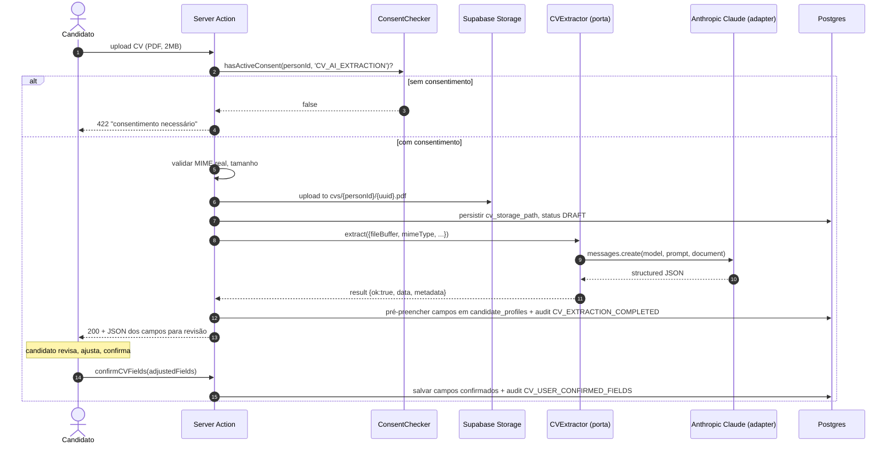

# ADR-0012 (Técnico) — Extração de CV via LLM com abstração de provedor (Anthropic Claude no MVP)

- **Status:** Aceito
- **Data:** 2026-05-22
- **Decisores:** Bravi Arquiteto/Tech Lead, Bravi PO
- **Tags:** ia | integracao | lgpd | abstracao | dx
- **Resolve:** QP-002 (provedor de LLM para extração de CV) e D-008 do PRD MVP Portal

## Contexto e Problema

ADR-0018 de negócio determina que o sistema extrai automaticamente os campos do CV via IA generativa quando o candidato faz upload (USP-040). Critérios principais: validação humana obrigatória do resultado, provedor com Zero Data Retention preferencial, fallback gracioso quando extração falha.

A escolha técnica deste ADR é **dupla**:

1. **Qual provedor LLM usar no MVP** — Anthropic Claude, OpenAI Enterprise, AWS Bedrock, Google Vertex AI.
2. **Como modelar a integração** — chamada direta SDK do provedor escolhido vs. interface abstrata com adaptador.

A escolha do provedor inicial foi resolvida na conversa de planejamento: **Anthropic Claude direto via API**. Mas a Bravi quer flexibilidade declarada para trocar de vendor sem refactor profundo — isso é requisito **explícito** que o cliente formulou.

## Drivers de Decisão

- **Critério obrigatório de Zero Data Retention** (ADR-0018 de negócio) — provedor não pode reter o CV após o processamento
- **Suporte robusto a português brasileiro nativo** — CVs vêm em PT-BR
- **Custo recorrente coerente com diretriz de custo mínimo** (ADR-0010 de negócio estendido) — volume baixo do MVP, mas crescimento previsível
- **Familiaridade do time da Bravi** — Nei e equipe já operam Claude no dia a dia (reduz risco de implementação)
- **Capacidade de troca de provedor sem refactor profundo** — declarado pelo cliente como requisito explícito
- **Latência aceitável** (≤ 30s p95 conforme PRD §6.1) com fallback gracioso quando excede

## Opções de Provedor Consideradas (resumo)

**Anthropic Claude API direta** — escolhida.
- ZDR como default para Anthropic API; suporte PT-BR excelente; Claude Haiku é custo-eficiente; familiaridade da Bravi
- Custo: ~US$ 0.005-0.05 por extração de CV; em volume MVP (~500 CVs/ano), total US$ 5-30/mês

**OpenAI Enterprise** — descartada para MVP.
- ZDR exige tier Enterprise (caro); custo significativamente maior; sem ganho qualitativo proporcional

**AWS Bedrock (Claude, Llama, Titan)** — candidato a V2.
- ZDR nativo na AWS; bom se o projeto migrar para AWS; complexidade extra (conta AWS, IAM, configuração) sem ganho imediato

**Google Vertex AI (Gemini)** — candidato a V2.
- Funciona; menos familiar; sem ganho específico

## Opções de Modelagem da Integração

### Opção A — Chamada direta ao SDK do provedor no código de aplicação

**Descrição:** `import Anthropic from '@anthropic-ai/sdk'` em código da Server Action de extração.

- **Prós:** simples, direto
- **Contras:** trocar provedor = caçar todas as chamadas e refatorar; testes precisam mockar o SDK em vários lugares

### Opção B — Interface `CVExtractor` + adapter por provedor (escolhida)

**Descrição:** porta (interface) tipada em `src/modules/cv-extraction/ports/cv-extractor.ts`; adapter Claude em `src/modules/cv-extraction/adapters/anthropic-claude.ts`. Code consumidor depende **apenas da porta**, nunca do SDK direto. Troca de provedor = novo adapter, atualização do binding em `src/shared/container.ts`.

- **Prós:** trocar provedor é trivial (escrever novo adapter); testes mockam a porta; aderente ao princípio Port-Adapter (Hexagonal); requisito declarado do cliente atendido
- **Contras:** mais código no início (interface + adapter); abstração precisa cobrir as features que efetivamente usamos sem ser leaky

## Decisão

### Provedor inicial

**Anthropic Claude API** — modelo `claude-haiku-4-5-20251001` para extração (rápido, barato, suficiente para extração estruturada). Pode-se usar `claude-sonnet-4-6` se Haiku se mostrar insuficiente em qualidade.

### Modelagem da integração

**Opção B — Interface + Adapter** com a seguinte estrutura:

```typescript
// src/modules/cv-extraction/ports/cv-extractor.ts

export interface CVExtractor {
  readonly providerName: string         // 'anthropic-claude', 'openai', 'bedrock-claude', etc.
  readonly modelName: string             // ex: 'claude-haiku-4-5-20251001'
  readonly providerVersion: string       // versão semântica do adapter — para auditoria

  extract(input: CVExtractionRequest): Promise<CVExtractionResult>
}

export type CVExtractionRequest = {
  personId: string                        // para audit + tracking
  fileBuffer: Buffer                      // conteúdo do CV
  mimeType: 'application/pdf' | 'application/msword' | 'application/vnd.openxmlformats-officedocument.wordprocessingml.document'
  fileName: string                        // para logging
}

export type CVExtractionResult =
  | { ok: true; data: ExtractedCVFields; metadata: ExtractionMetadata }
  | { ok: false; error: { code: 'TIMEOUT' | 'PROVIDER_ERROR' | 'PARSE_ERROR' | 'UNSUPPORTED_FORMAT'; message: string } }

export type ExtractedCVFields = {
  educationLevel: string | null
  educationArea: string | null
  experienceText: string | null           // narrativa de experiência
  skillsText: string | null
  coursesText: string | null
  primaryAreaOfInterest: string | null    // tentativa de mapear para catálogo de áreas
}

export type ExtractionMetadata = {
  durationMs: number
  tokensInput?: number
  tokensOutput?: number
  costEstimateCents?: number              // estimativa de custo dessa chamada
}
```

### Adapter Anthropic Claude

```typescript
// src/modules/cv-extraction/adapters/anthropic-claude-extractor.ts

import Anthropic from '@anthropic-ai/sdk'
import type { CVExtractor, CVExtractionRequest, CVExtractionResult } from '../ports/cv-extractor'

export class AnthropicClaudeExtractor implements CVExtractor {
  readonly providerName = 'anthropic-claude'
  readonly modelName = 'claude-haiku-4-5-20251001'
  readonly providerVersion = '1.0.0'

  private client: Anthropic
  constructor(apiKey: string) {
    this.client = new Anthropic({ apiKey })
  }

  async extract(input: CVExtractionRequest): Promise<CVExtractionResult> {
    const started = Date.now()
    try {
      const response = await this.client.messages.create({
        model: this.modelName,
        max_tokens: 2000,
        messages: [{
          role: 'user',
          content: [
            { type: 'document', source: { type: 'base64', media_type: input.mimeType, data: input.fileBuffer.toString('base64') } },
            { type: 'text', text: PROMPT_EXTRACT_CV_PT_BR },
          ],
        }],
      })
      const parsed = parseStructuredOutput(response)        // valida via Zod schema
      return {
        ok: true,
        data: parsed,
        metadata: {
          durationMs: Date.now() - started,
          tokensInput: response.usage.input_tokens,
          tokensOutput: response.usage.output_tokens,
          costEstimateCents: computeCost(response.usage),
        },
      }
    } catch (err) {
      // ... mapear para erros tipados
    }
  }
}
```

### Binding em container DI simples

```typescript
// src/shared/container.ts

import { AnthropicClaudeExtractor } from '@/modules/cv-extraction/adapters/anthropic-claude-extractor'
import { env } from './env'

export const cvExtractor: CVExtractor = new AnthropicClaudeExtractor(env.ANTHROPIC_API_KEY)
// futuro: trocar para new OpenAIExtractor(...) ou new BedrockExtractor(...) é local — sem outras mudanças
```

Server Actions consomem **só a porta**:

```typescript
import { cvExtractor } from '@/shared/container'

// dentro de Server Action de upload de CV
const result = await cvExtractor.extract({ personId, fileBuffer, mimeType, fileName })
```

### Prompt versionado

Prompt vive em `src/modules/cv-extraction/prompts/extract-cv-pt-br.ts` com versão semântica em comentário no topo. Mudança de prompt = bump de `providerVersion` no adapter para que extrações futuras tenham metadata de versão coerente. Prompt instruí o LLM a:

- Extrair apenas os campos solicitados em JSON estruturado
- Mapear área de interesse para o catálogo de áreas (passado no prompt como contexto)
- Retornar `null` em campos não encontrados em vez de inventar
- **Não** retornar dados que não estavam no CV (anti-hallucination)

Parsing do retorno é validado via Zod schema — adapter falha tipado se LLM retornar JSON malformado.

### Tratamento de payload sensível e LGPD

- **Pré-condição:** consentimento ativo para finalidade `CV_AI_EXTRACTION` (ADR-T-0009 finalidade 7). Server Action recusa se ausente.
- **Termo da finalidade 7** menciona explicitamente o nome do provedor LLM atual — versão atualiza se trocar de provedor (`v1` Anthropic, `v2` Bedrock, etc.). Re-aceite exigido na próxima extração após troca.
- **Zero Data Retention** — Anthropic API não treina em dados de clientes nem retém prompts além do necessário para a resposta. Configuração padrão; sem opt-in adicional necessário (confirmar termos vigentes na Fase 0).
- **Audit log:** evento `CV_EXTRACTION_REQUESTED` antes do envio (sem o conteúdo do CV no log — apenas referência); `CV_EXTRACTION_COMPLETED` ou `CV_EXTRACTION_FAILED` após retorno (com metadata de duração/tokens/custo, sem conteúdo).
- **Nunca logamos o conteúdo do CV** em logs operacionais (pino) — apenas referência (`person_id`, `storage_path`).
- **Persistência do output:** campos extraídos vão para `candidate_profiles` (já criptografados em repouso pelo Supabase); o raw response do LLM **não** é persistido (alinhado com a postura de minimização).

### Fluxo end-to-end



### Fallback gracioso

Quando `extract` retorna `{ok: false}`:

- AC-040-3: campos ficam vazios; UI mostra mensagem amigável "extração não foi possível — preencha manualmente"
- Audit log: `CV_EXTRACTION_FAILED` com `error.code` para análise posterior
- Sem retry automático no MVP (fail-fast — candidato decide se quer tentar de novo manualmente)

## Consequências

**Positivas:**
- Troca de provedor é trivial — novo adapter + binding atualizado
- Audit log e métricas (`durationMs`, custo) por extração permitem entender custo real ao longo do tempo
- LGPD coberta — finalidade dedicada + termo cita o provedor + sem retenção do CV no LLM + sem persistência de raw response
- Familiaridade da Bravi com Claude reduz risco de implementação

**Negativas (trade-offs aceitos):**
- Custo recorrente em US$ — em volume modesto, US$ 5-30/mês; cabe no orçamento
- Latência variável (5-30s) — UI precisa lidar com loading state explícito; em casos extremos, candidato pode preferir cancelar e preencher manualmente
- Dependência de provedor externo — fallback gracioso resolve

**Neutras / a monitorar:**
- Se custo subir além do esperado, avaliar Claude Haiku → modelo ainda mais barato (Sonnet 4 talvez), ou Bedrock (preço por volume), ou parser híbrido (parser estruturado primeiro + LLM como fallback)

## Riscos e Mitigações

**Risco 1 — Anthropic muda termos de retenção** e ZDR deixa de ser default. **Mitigação:** revisão semestral dos termos por jurídico (D-002 incluí esse acompanhamento); se mudança ocorrer, re-versionar termo da finalidade 7 e re-pedir consentimento; trocar de provedor é viável (justamente o motivo da abstração).

**Risco 2 — Candidato valida sem revisar** e dados extraídos errados entram (RP-007 do PRD). **Mitigação:** UI enfatiza revisão (highlights nos campos "preenchidos automaticamente"); texto instruindo revisão; audit log `CV_USER_CONFIRMED_FIELDS` documenta a confirmação.

**Risco 3 — Custo recorrente excede expectativa** se volume crescer abruptamente. **Mitigação:** rate limit em uploads de CV (3 por candidato por dia); monitoramento de custo no audit log permite alerta automático em escala futura.

**Risco 4 — LLM "alucina" e inventa campos não presentes no CV.** **Mitigação:** prompt instruí explicitamente a retornar `null` quando não encontrar; revisão humana obrigatória pega o problema; Zod schema valida o formato.

## Referências

- ADR-0018 de negócio (Extração de CV via IA generativa)
- ADR-0013 de negócio (Consentimentos por finalidade — finalidade 7)
- ADR-T-0009 (consentimentos LGPD por finalidade)
- ADR-T-0005 reescrito (storage do CV)
- PRD MVP Portal USP-009, USP-040, §6.7
- QP-002, D-008 (resolvidos por este ADR)
- Anthropic terms of service vigente — confirmar ZDR antes do go-live
- Lentes do arquiteto: Custo de Mudança, Compliance by Design, Acoplamento & Coesão
