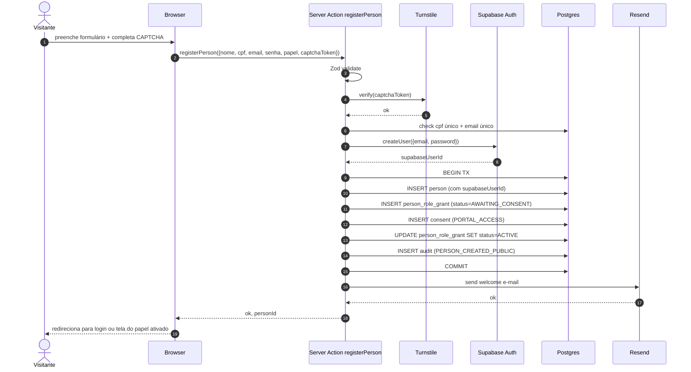
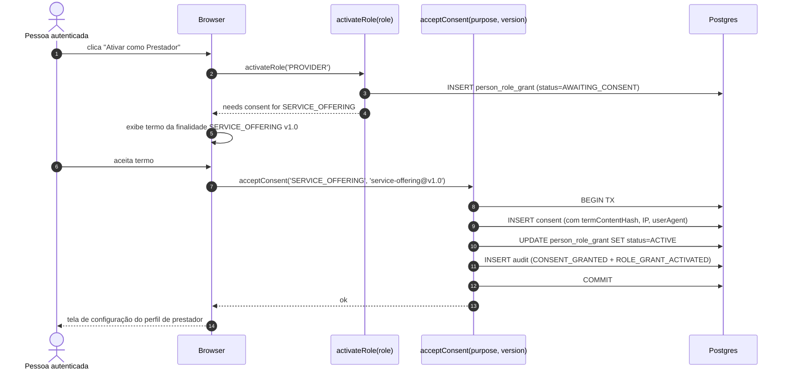
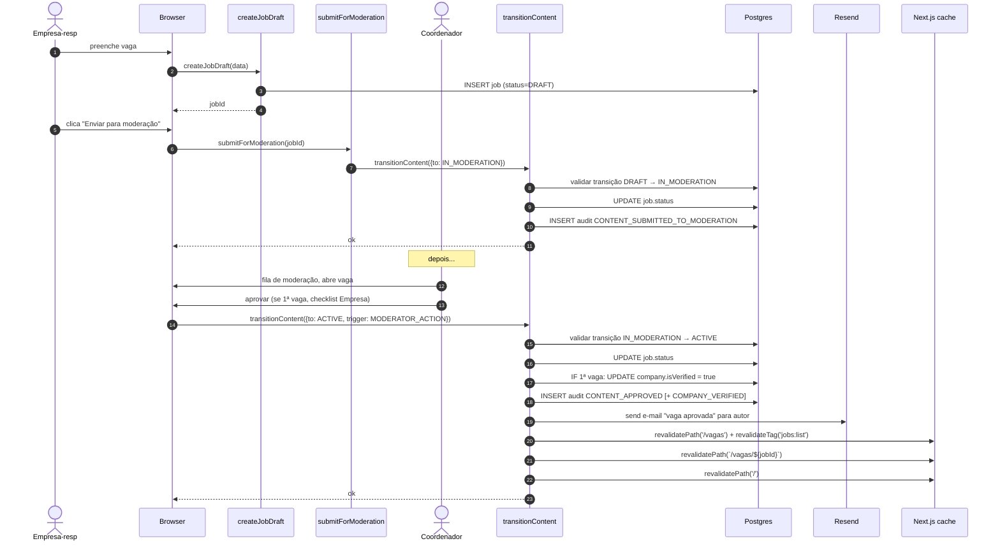
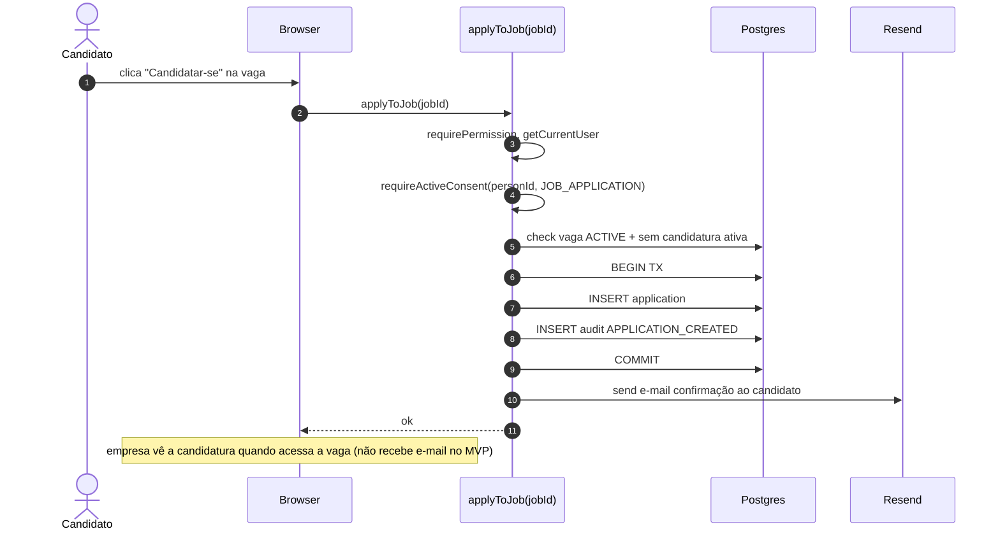
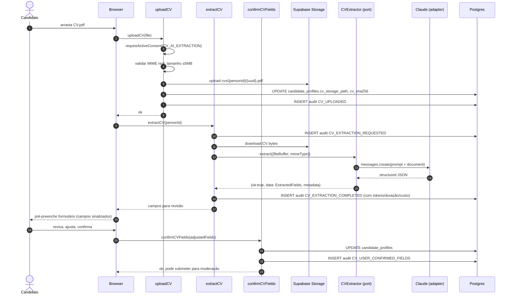

# ASONSEG — Technical Design Document

**Projeto:** Portal Empregabilidade e Serviços (Release 1 — MVP)
**Versão:** 2.0
**Audiência:** Tech Lead, desenvolvedores, QA, DevOps
**Companheiros:** `architecture-document.md` (visão), `project-guideline.md` (convenções), `adrs/*` (decisões)

---

## 1. Contexto e escopo deste documento

Este documento detalha **como** implementar o Portal MVP descrito em `architecture-document.md`. Cobre schema Prisma completo, fluxos críticos como sequence diagrams, integrações externas, plano de fases com entregáveis, estratégia de testes e considerações operacionais.

**In-scope:** decisões de implementação que afetam mais de um módulo, schemas, contratos de integração, sequências de fluxos críticos.
**Out-of-scope:** detalhes que ficam dentro de um único módulo (esses vão nos próprios PRs).

---

## 2. Schema Prisma — visão completa

Trechos canônicos. Ajustes finos durante implementação são esperados; mudanças estruturais exigem ADR.

### 2.1 Identidade — Pessoa, Papéis, Auth

```prisma
model Person {
  id                          String   @id @default(uuid()) @db.Uuid
  supabaseUserId              String?  @unique @map("supabase_user_id") @db.Uuid
  fullName                    String   @map("full_name")
  cpf                         String?  @unique
  cpfExceptionJustification   String?  @map("cpf_exception_justification")
  emailLogin                  String?  @unique @map("email_login")
  phone                       String?
  birthDate                   DateTime? @map("birth_date") @db.Date
  cityId                      String?  @map("city_id") @db.Uuid
  fullAddress                 String?  @map("full_address")
  mustChangePassword          Boolean  @default(true) @map("must_change_password")
  isActive                    Boolean  @default(true) @map("is_active")
  inactivatedAt               DateTime? @map("inactivated_at") @db.Timestamptz
  inactivatedByPersonId       String?  @map("inactivated_by_person_id") @db.Uuid
  inactivationReason          String?  @map("inactivation_reason")
  createdByPersonId           String?  @map("created_by_person_id") @db.Uuid
  createdAt                   DateTime @default(now()) @map("created_at") @db.Timestamptz
  updatedAt                   DateTime @updatedAt @map("updated_at") @db.Timestamptz

  roleGrants                  PersonRoleGrant[]
  candidateProfile            CandidateProfile?
  providerProfile             ProviderProfile?
  clientProfile               ClientProfile?
  socioeconomicRecord         SocioeconomicRecord?
  companyGrants               PersonCompanyGrant[]
  delegatedPermissions        DelegatedPermission[]
  consents                    Consent[]
  applications                Application[]
  serviceInterests            ServiceInterest[]
  referralsReceived           Referral[]            @relation("ReferredPerson")
  referralsCreated            Referral[]            @relation("Referrer")

  @@map("persons")
}

model PersonRoleGrant {
  id                String          @id @default(uuid()) @db.Uuid
  personId          String          @map("person_id") @db.Uuid
  role              Role
  status            RoleGrantStatus @default(ACTIVE)
  activatedAt       DateTime        @default(now()) @map("activated_at") @db.Timestamptz
  activatedBy       String?         @map("activated_by") @db.Uuid
  revokedAt         DateTime?       @map("revoked_at") @db.Timestamptz
  revokedBy         String?         @map("revoked_by") @db.Uuid
  revocationReason  String?         @map("revocation_reason")

  person            Person          @relation(fields: [personId], references: [id])
  @@unique([personId, role, activatedAt])
  @@index([personId, status])
  @@index([role, status])
  @@map("person_role_grants")
}

enum Role {
  CANDIDATE
  PROVIDER
  CLIENT
  COMPANY_RESPONSIBLE
  VOLUNTEER
  COORDINATOR
  SOCIAL_ASSISTANT
  BOARD
  BENEFICIARY              // Release 2
  FAMILY_RESPONSIBLE       // Release 2
}

enum RoleGrantStatus {
  ACTIVE
  REVOKED
  AWAITING_CONSENT
  INACTIVE
}

model DelegatedPermission {
  id          String       @id @default(uuid()) @db.Uuid
  personId    String       @map("person_id") @db.Uuid
  permission  PermissionId
  scopeArea   String?      @map("scope_area")    // área da ASONSEG; null = global
  grantedBy   String       @map("granted_by") @db.Uuid
  grantedAt   DateTime     @default(now()) @map("granted_at") @db.Timestamptz
  revokedAt   DateTime?    @map("revoked_at") @db.Timestamptz
  revokedBy   String?      @map("revoked_by") @db.Uuid

  person      Person       @relation(fields: [personId], references: [id])
  @@index([personId, revokedAt])
  @@map("delegated_permissions")
}

enum PermissionId {
  // Portal — Release 1
  MODERATE_JOB
  MODERATE_CV
  MODERATE_SERVICE
  VALIDATE_COMPANY_FIRST_JOB
  INACTIVATE_PUBLISHED_CONTENT
  REFER_PERSON_TO_JOB
  APPROVE_CATEGORY_SUGGESTION
  REGISTER_REFERRAL_RESULT
  APPROVE_CREDENTIAL_CLAIM
  // Frente 4 — Release 2 (ADR-0001 de negócio)
  EDIT_INVENTORY
  RUN_DISTRIBUTION
  // ...
}

model AuthAttempt {
  id          String   @id @default(uuid()) @db.Uuid
  email       String
  ip          String?  @db.Inet
  success     Boolean
  failureCode String?  @map("failure_code")
  attemptedAt DateTime @default(now()) @map("attempted_at") @db.Timestamptz

  @@index([email, attemptedAt])
  @@index([ip, attemptedAt])
  @@map("auth_attempts")
}

model CredentialClaim {
  id                String   @id @default(uuid()) @db.Uuid
  personId          String   @map("person_id") @db.Uuid
  requestedEmail    String   @map("requested_email")
  verificationMethod String  @map("verification_method")  // 'IN_PERSON' | 'AS_CONFIRMATION' | 'CODE_BY_MAIL'
  status            String   // 'PENDING' | 'VERIFIED' | 'REJECTED'
  verifiedBy        String?  @map("verified_by") @db.Uuid
  verifiedAt        DateTime? @map("verified_at") @db.Timestamptz
  rejectedReason    String?  @map("rejected_reason")
  requestedAt       DateTime @default(now()) @map("requested_at") @db.Timestamptz

  @@map("credential_claims")
}
```

### 2.2 Perfis por papel

```prisma
model CandidateProfile {
  personId             String        @id @map("person_id") @db.Uuid
  headline             String?
  primaryAreaOfInterestId String?    @map("primary_area_of_interest_id") @db.Uuid
  educationLevel       String?       @map("education_level")  // enum textual
  educationArea        String?       @map("education_area")
  experienceText       String?       @map("experience_text") @db.Text
  skillsText           String?       @map("skills_text") @db.Text
  coursesText          String?       @map("courses_text") @db.Text
  availability         String?
  cvStoragePath        String?       @map("cv_storage_path")
  cvSha256             String?       @map("cv_sha256")
  cvUploadedAt         DateTime?     @map("cv_uploaded_at") @db.Timestamptz
  cvLastConfirmedAt    DateTime?     @map("cv_last_confirmed_at") @db.Timestamptz
  publicationStatus    ContentStatus @default(DRAFT) @map("publication_status")
  lastStatusChangeAt   DateTime      @default(now()) @map("last_status_change_at") @db.Timestamptz
  createdAt            DateTime      @default(now()) @map("created_at") @db.Timestamptz
  updatedAt            DateTime      @updatedAt @map("updated_at") @db.Timestamptz

  person               Person        @relation(fields: [personId], references: [id])
  primaryAreaOfInterest JobArea?     @relation(fields: [primaryAreaOfInterestId], references: [id])
  @@index([publicationStatus])
  @@map("candidate_profiles")
}

model ProviderProfile {
  personId          String        @id @map("person_id") @db.Uuid
  headline          String?
  description       String?       @db.Text
  photoStoragePath  String?       @map("photo_storage_path")
  regionId          String?       @map("region_id") @db.Uuid
  publicationStatus ContentStatus @default(DRAFT) @map("publication_status")
  createdAt         DateTime      @default(now()) @map("created_at") @db.Timestamptz
  updatedAt         DateTime      @updatedAt @map("updated_at") @db.Timestamptz

  person            Person        @relation(fields: [personId], references: [id])
  region            Region?       @relation(fields: [regionId], references: [id])
  @@map("provider_profiles")
}

model ClientProfile {
  personId  String   @id @map("person_id") @db.Uuid
  cityId    String?  @map("city_id") @db.Uuid
  createdAt DateTime @default(now()) @map("created_at") @db.Timestamptz

  person    Person   @relation(fields: [personId], references: [id])
  @@map("client_profiles")
}

model SocioeconomicRecord {
  personId                  String   @id @map("person_id") @db.Uuid
  incomeRange               String?  @map("income_range")
  socialBenefit             String?  @map("social_benefit")
  housingSituation          String?  @map("housing_situation")
  declaredFamilyComposition String?  @map("declared_family_composition") @db.Text
  lastUpdatedBy             String   @map("last_updated_by") @db.Uuid
  lastUpdatedAt             DateTime @updatedAt @map("last_updated_at") @db.Timestamptz

  person                    Person   @relation(fields: [personId], references: [id])
  @@map("socioeconomic_records")
}
```

### 2.3 Empresas

```prisma
model Company {
  id                String        @id @default(uuid()) @db.Uuid
  legalName         String        @map("legal_name")
  tradeName         String?       @map("trade_name")
  cnpj              String        @unique
  sector            String?
  description       String?       @db.Text
  address           String?
  phone             String?
  isVerified        Boolean       @default(false) @map("is_verified")
  status            CompanyStatus @default(ACTIVE)
  createdByPersonId String        @map("created_by_person_id") @db.Uuid
  createdAt         DateTime      @default(now()) @map("created_at") @db.Timestamptz
  updatedAt         DateTime      @updatedAt @map("updated_at") @db.Timestamptz

  grants            PersonCompanyGrant[]
  jobs              Job[]
  services          Service[]

  @@index([isVerified, status])
  @@map("companies")
}

enum CompanyStatus {
  ACTIVE
  ARCHIVED
}

model PersonCompanyGrant {
  id         String           @id @default(uuid()) @db.Uuid
  personId   String           @map("person_id") @db.Uuid
  companyId  String           @map("company_id") @db.Uuid
  type       CompanyGrantType @default(RESPONSIBLE)
  startedAt  DateTime         @default(now()) @map("started_at") @db.Timestamptz
  startedBy  String           @map("started_by") @db.Uuid
  endedAt    DateTime?        @map("ended_at") @db.Timestamptz
  endedBy    String?          @map("ended_by") @db.Uuid
  endReason  String?          @map("end_reason")

  person     Person           @relation(fields: [personId], references: [id])
  company    Company          @relation(fields: [companyId], references: [id])

  @@unique([personId, companyId, type, startedAt])
  @@index([personId, endedAt])
  @@index([companyId, endedAt])
  @@map("person_company_grants")
}

enum CompanyGrantType {
  RESPONSIBLE
}
```

### 2.4 Consentimentos LGPD

```prisma
model Consent {
  id              String         @id @default(uuid()) @db.Uuid
  personId        String         @map("person_id") @db.Uuid
  purpose         ConsentPurpose
  termVersion     String         @map("term_version")
  termContentHash String         @map("term_content_hash")
  acceptedAt      DateTime       @default(now()) @map("accepted_at") @db.Timestamptz
  acceptedIp      String?        @map("accepted_ip") @db.Inet
  userAgent       String?        @map("user_agent")
  revokedAt       DateTime?      @map("revoked_at") @db.Timestamptz
  revokedReason   String?        @map("revoked_reason")
  context         Json?

  person          Person         @relation(fields: [personId], references: [id])

  @@unique([personId, purpose, acceptedAt])
  @@index([personId, purpose, revokedAt])
  @@map("consents")
}

enum ConsentPurpose {
  PORTAL_ACCESS
  JOB_APPLICATION
  SERVICE_OFFERING
  SERVICE_HIRING
  COMPANY_REPRESENTATION
  SOCIAL_ASSISTANCE
  CV_AI_EXTRACTION
  SOCIAL_REFERRAL_TO_JOB
}
```

### 2.5 Vagas e candidaturas

```prisma
model Job {
  id                  String        @id @default(uuid()) @db.Uuid
  companyId           String        @map("company_id") @db.Uuid
  createdByPersonId   String        @map("created_by_person_id") @db.Uuid
  title               String
  description         String        @db.Text
  areaId              String        @map("area_id") @db.Uuid
  educationLevelRequired String?    @map("education_level_required")
  contractType        String        @map("contract_type")     // CLT, PJ, MEI, etc.
  workRegime          String        @map("work_regime")        // presencial, híbrido, remoto
  salaryMin           Decimal?      @map("salary_min") @db.Decimal(10, 2)
  salaryMax           Decimal?      @map("salary_max") @db.Decimal(10, 2)
  salaryVisible       Boolean       @default(true) @map("salary_visible")
  benefits            String?       @db.Text
  regionId            String        @map("region_id") @db.Uuid
  validUntil          DateTime      @map("valid_until") @db.Date
  status              ContentStatus @default(DRAFT)
  lastStatusChangeAt  DateTime      @default(now()) @map("last_status_change_at") @db.Timestamptz
  createdAt           DateTime      @default(now()) @map("created_at") @db.Timestamptz
  updatedAt           DateTime      @updatedAt @map("updated_at") @db.Timestamptz

  company             Company       @relation(fields: [companyId], references: [id])
  area                JobArea       @relation(fields: [areaId], references: [id])
  region              Region        @relation(fields: [regionId], references: [id])
  applications        Application[]
  referrals           Referral[]

  @@index([status, validUntil])
  @@index([companyId, status])
  @@index([areaId, regionId, status])
  @@map("jobs")
}

model Application {
  id                String   @id @default(uuid()) @db.Uuid
  jobId             String   @map("job_id") @db.Uuid
  candidatePersonId String   @map("candidate_person_id") @db.Uuid
  appliedAt         DateTime @default(now()) @map("applied_at") @db.Timestamptz
  cancelledAt       DateTime? @map("cancelled_at") @db.Timestamptz
  viaReferralId     String?  @unique @map("via_referral_id") @db.Uuid

  job               Job      @relation(fields: [jobId], references: [id])
  candidate         Person   @relation(fields: [candidatePersonId], references: [id])
  referral          Referral? @relation(fields: [viaReferralId], references: [id])

  @@unique([jobId, candidatePersonId, appliedAt])
  @@index([jobId, cancelledAt])
  @@index([candidatePersonId, cancelledAt])
  @@map("applications")
}

enum ContentStatus {
  DRAFT
  IN_MODERATION
  AWAITING_ADJUSTMENTS
  ACTIVE
  REJECTED
  PAUSED
  EXPIRED
  ARCHIVED
  INACTIVATED
}
```

### 2.6 Serviços e manifestações

```prisma
model Service {
  id                  String        @id @default(uuid()) @db.Uuid
  personId            String        @map("person_id") @db.Uuid       // sempre quem executa
  companyId           String?       @map("company_id") @db.Uuid      // null = PF
  categoryId          String        @map("category_id") @db.Uuid
  title               String
  description         String        @db.Text
  priceMin            Decimal?      @map("price_min") @db.Decimal(10, 2)
  priceMax            Decimal?      @map("price_max") @db.Decimal(10, 2)
  regionId            String        @map("region_id") @db.Uuid
  availabilityDescription String?   @map("availability_description")
  status              ContentStatus @default(DRAFT)
  lastStatusChangeAt  DateTime      @default(now()) @map("last_status_change_at") @db.Timestamptz
  createdAt           DateTime      @default(now()) @map("created_at") @db.Timestamptz
  updatedAt           DateTime      @updatedAt @map("updated_at") @db.Timestamptz

  person              Person         @relation(fields: [personId], references: [id])
  company             Company?       @relation(fields: [companyId], references: [id])
  category            ServiceCategory @relation(fields: [categoryId], references: [id])
  region              Region         @relation(fields: [regionId], references: [id])
  interests           ServiceInterest[]

  @@index([status])
  @@index([categoryId, regionId, status])
  @@map("services")
}

model ServiceInterest {
  id              String    @id @default(uuid()) @db.Uuid
  serviceId       String    @map("service_id") @db.Uuid
  clientPersonId  String    @map("client_person_id") @db.Uuid
  interestedAt    DateTime  @default(now()) @map("interested_at") @db.Timestamptz
  cancelledAt     DateTime? @map("cancelled_at") @db.Timestamptz

  service         Service   @relation(fields: [serviceId], references: [id])
  client          Person    @relation(fields: [clientPersonId], references: [id])

  @@unique([serviceId, clientPersonId, interestedAt])
  @@index([serviceId, cancelledAt])
  @@map("service_interests")
}
```

### 2.7 Encaminhamentos

```prisma
model Referral {
  id                  String   @id @default(uuid()) @db.Uuid
  personId            String   @map("person_id") @db.Uuid               // encaminhada
  jobId               String   @map("job_id") @db.Uuid
  referrerPersonId    String   @map("referrer_person_id") @db.Uuid
  justification       String?
  professionalSummary String?  @map("professional_summary") @db.Text     // obrigatório se Pessoa sem CV
  result              ReferralResult?
  resultObservation   String?  @map("result_observation")
  resultRegisteredBy  String?  @map("result_registered_by") @db.Uuid
  resultRegisteredAt  DateTime? @map("result_registered_at") @db.Timestamptz
  createdAt           DateTime @default(now()) @map("created_at") @db.Timestamptz

  person              Person   @relation("ReferredPerson", fields: [personId], references: [id])
  job                 Job      @relation(fields: [jobId], references: [id])
  referrer            Person   @relation("Referrer", fields: [referrerPersonId], references: [id])
  application         Application?

  @@index([personId])
  @@index([jobId])
  @@map("referrals")
}

enum ReferralResult {
  HIRED
  NOT_SELECTED
  UNDER_REVIEW
  NO_RESPONSE
}
```

### 2.8 Categorias, Áreas, Regiões

```prisma
model JobArea {
  id          String  @id @default(uuid()) @db.Uuid
  name        String  @unique
  isSuggestion Boolean @default(false) @map("is_suggestion")
  approvedAt  DateTime? @map("approved_at") @db.Timestamptz
  approvedBy  String?  @map("approved_by") @db.Uuid
  suggestedBy String?  @map("suggested_by") @db.Uuid
  createdAt   DateTime @default(now()) @map("created_at") @db.Timestamptz

  jobs                  Job[]
  candidateProfiles     CandidateProfile[]
  @@map("job_areas")
}

model ServiceCategory {
  id          String  @id @default(uuid()) @db.Uuid
  name        String  @unique
  isSuggestion Boolean @default(false) @map("is_suggestion")
  approvedAt  DateTime? @map("approved_at") @db.Timestamptz
  approvedBy  String?  @map("approved_by") @db.Uuid
  suggestedBy String?  @map("suggested_by") @db.Uuid
  createdAt   DateTime @default(now()) @map("created_at") @db.Timestamptz

  services    Service[]
  @@map("service_categories")
}

model Region {
  id          String  @id @default(uuid()) @db.Uuid
  name        String  @unique
  cityName    String  @map("city_name")
  state       String  @default("SC")
  isActive    Boolean @default(true) @map("is_active")

  jobs              Job[]
  services          Service[]
  providerProfiles  ProviderProfile[]
  @@map("regions")
}
```

### 2.9 Auditoria

```prisma
model AuditLog {
  id          BigInt   @id @default(autoincrement())
  occurredAt  DateTime @default(now()) @map("occurred_at") @db.Timestamptz
  actorUserId String?  @map("actor_user_id") @db.Uuid
  actorPersonId String? @map("actor_person_id") @db.Uuid
  action      String
  entityType  String?  @map("entity_type")
  entityId    String?  @map("entity_id") @db.Uuid
  before      Json?
  after       Json?
  context     Json?
  ip          String?  @db.Inet
  userAgent   String?  @map("user_agent")
  justification String?

  @@index([entityType, entityId])
  @@index([actorPersonId, occurredAt])
  @@index([action, occurredAt])
  @@map("audit_log")
}
```

🚨 Migration adicional executa `REVOKE UPDATE, DELETE ON audit_log FROM <app_role>;` para garantir append-only (ADR-T-0004).

---

## 3. Sequence Diagrams dos fluxos críticos

### 3.1 Auto-cadastro público (USP-001)



### 3.2 Ativação de papel adicional com consentimento (USP-006)



### 3.3 Publicar e moderar vaga (USP-016, USP-017, USP-020)



### 3.4 Candidatura silenciosa (USP-025)



Empresa vê na lista de candidatos (USP-027) e contato é revelado ali. View Model `viewCandidateForEmployerAfterApplication` registra `SENSITIVE_FIELD_VIEWED` no audit.

### 3.5 Encaminhamento institucional (USP-037)

```mermaid
sequenceDiagram
    autonumber
    actor AS as Assistente Social
    participant UI as Browser
    participant SA as createReferral
    participant DB as Postgres
    participant R as Resend
    participant CDN as Next.js cache

    AS->>UI: ficha consolidada da Pessoa P; escolhe vaga V
    UI->>SA: createReferral({personId: P, jobId: V, professionalSummary?})
    SA->>SA: requirePermission(REFER_PERSON_TO_JOB)
    SA->>DB: check vaga V ACTIVE
    SA->>DB: check P tem CV anexo OU professionalSummary informado
    SA->>DB: BEGIN TX
    SA->>DB: ativar papel CANDIDATE se ausente (com aceite tácito do SOCIAL_REFERRAL_TO_JOB)
    SA->>DB: INSERT referral
    SA->>DB: INSERT application (vinculada ao referral.id via viaReferralId)
    SA->>DB: INSERT audit REFERRAL_CREATED + APPLICATION_CREATED
    SA->>DB: COMMIT
    SA->>R: e-mail informativo à Pessoa P
    SA-->>UI: ok
    Note over UI: empresa vê candidatura com badge "Encaminhado pela ASONSEG"
```

### 3.6 Upload + extração de CV via LLM (USP-040)



Caso de falha: `Ext` retorna `{ok:false}`. `SA2` registra `CV_EXTRACTION_FAILED`. UI mostra mensagem amigável + formulário vazio para preenchimento manual (AC-040-3).

---

## 4. Integrações externas — contratos

| Integração | Tipo | Crítica? | Falha = ? |
|---|---|---|---|
| Supabase Auth | SDK + REST | Sim | Sem login; auto-cadastro falha; UI mostra erro |
| Supabase Postgres | Prisma | Sim | Sistema cai; Sentry alerta |
| Supabase Storage | SDK | Sim | Upload/download de CV/foto falha; UI mostra erro |
| Resend | SDK HTTP | Não | E-mail não envia; logado no Sentry; operação continua |
| Sentry | SDK | Não | Erros não capturados; tolerável |
| Anthropic Claude | SDK HTTP | Não | Extração CV falha; fallback gracioso (AC-040-3) |
| Cloudflare Turnstile | Widget + HTTP | Sim | Auto-cadastro bloqueado; recuperação senha bloqueada |
| Backblaze B2 | rclone CLI no GH Actions | Não | Backup diário falha; alerta humano via job log; Supabase nativo cobre RPO 24h |

🚨 Todas as integrações externas têm **timeout configurado** (default 30s; LLM 60s) e estão **encapsuladas atrás de port-adapter** quando trocar de vendor for plausível (LLM, e-mail, CAPTCHA).

---

## 5. Plano de fases — detalhado

### Fase 0 — Setup e Spikes (1-2 semanas)

**Entregáveis técnicos:**
- Projetos Vercel + Supabase + Resend + Sentry + B2 + Cloudflare provisionados (dev + staging + prod)
- Repo monorepo com estrutura de pastas + boilerplate Next.js + Prisma + Vitest
- Workflow CI básico (`ci.yml`)
- Workflows de backup (`backup-db.yml`, `backup-storage.yml`) — **drill restore obrigatório** antes da Fase 1
- Spike: Pooler do Supabase + Prisma — validar comportamento sob carga
- Spike: Anthropic API com prompt de extração de CV de exemplo (PT-BR realista)
- Spike: Cloudflare Turnstile widget + verify
- Validar elegibilidade Vercel ONG (D-011 análoga)
- Lista inicial de regiões/categorias/áreas (D-007)
- Checklist Empresa-fantasma para coordenador (RP-005)
- Termos de consentimento v1.0 das 8 finalidades em `legal/consent-terms/` (D-002 — aguardando revisão jurídica)

**Critérios de saída:**
- CI passa
- Drill restore executado com sucesso (relatório anexado)
- Spike LLM mostra extração razoável em 3-5 CVs reais
- README com instruções "from zero to running app"

### Fase 1 — Identidade + Consentimentos (3-4 semanas)

**Entregáveis funcionais:**
- USP-001 (auto-cadastro), USP-002 (cadastro AS), USP-003 (reivindicação), USP-004 (login), USP-005 (recuperar senha), USP-006 (papel adicional), USP-007 (inativar Pessoa), USP-008 (delegar permissões), USP-043 (consentimentos por finalidade)

**Entregáveis técnicos:**
- Schemas `persons`, `person_role_grants`, `consents`, `auth_attempts`, `credential_claims`, `delegated_permissions`, `audit_log`
- Migration que faz `REVOKE` no audit_log
- Helpers `getCurrentUser`, `requirePermission`, `requireActiveConsent`, `withAudit`
- Componente `TurnstileWidget` + `turnstile-verifier`
- E-mails de boas-vindas, recuperação senha, ativação papel
- Tela `/conta/consentimentos`

**Testes:**
- Cobertura ≥85% em `identity` e `consents`
- E2E: auto-cadastro happy path + recuperação de senha

### Fase 2 — Empresas + Vagas + Moderação (4-5 semanas)

**Entregáveis funcionais:**
- USP-012 a USP-015 (Empresa), USP-016 a USP-019 (moderação), USP-020 a USP-024 (vagas)

**Entregáveis técnicos:**
- Schema `companies`, `person_company_grants`, `jobs`
- Toggle "atuar como" (cookie + `setActingAsCompany`)
- `transitionContent` + tabela TRANSITIONS para JOB
- Job de expiração `expire-jobs.yml`
- E-mails de moderação (USP-044 parcial)

**Testes:**
- Máquina de estados: cada transição válida + inválida coberta
- E2E: publicar vaga + moderar (aprovar/devolver/rejeitar) + ver na busca pública

### Fase 3 — Candidaturas + Busca + CV Extraction (3-4 semanas)

**Entregáveis funcionais:**
- USP-021 (busca pública vagas), USP-022 (detalhe), USP-025 a USP-028 (candidaturas e busca de candidatos), USP-040 (extração CV)

**Entregáveis técnicos:**
- Schema `applications`, `candidate_profiles`
- ISR + `unstable_cache` + `revalidatePath` orquestrado
- View Models `viewCandidateForEmployer*`, `viewJobAnonymous`/`Authenticated`
- `cv-extraction` module completo (port + adapter Claude + prompt + Zod schema)
- Bucket `cvs` com upload via Server Action
- Tela de revisão de CV pré-preenchido

**Testes:**
- View Models: cada combinação papel-consultante × ação afirmativa
- E2E: candidato faz upload → extração → confirma → empresa busca → vê candidato → candidato candidata → empresa vê contato

### Fase 4 — Serviços + Manifestações (2-3 semanas)

**Entregáveis funcionais:**
- USP-029 a USP-035

**Entregáveis técnicos:**
- Schema `services`, `service_interests`
- Bucket `provider-photos` público + URL direta
- View Models `viewServiceAuthenticated/AfterInterest`, `viewProviderForClient`

### Fase 5 — Ficha social + Encaminhamento + Visão consolidada (2 semanas)

**Entregáveis funcionais:**
- USP-036 (ficha social simplificada), USP-037 (encaminhar), USP-038 (resultado), USP-039 (visão consolidada)

**Entregáveis técnicos:**
- Schema `socioeconomic_records`, `referrals`
- View Model `viewPersonForSocialAssistant` (consolidado)
- Permissões delegáveis novas: `REFER_PERSON_TO_JOB`, `REGISTER_REFERRAL_RESULT`

### Fase 6 — Relatórios + Home + Hardening + LGPD (2-3 semanas)

**Entregáveis funcionais:**
- USP-041 (home), USP-042 (relatórios CSV/PDF), USP-044 (e-mails restantes)

**Entregáveis técnicos:**
- Indicadores agregados em queries com cache
- Geradores CSV streaming + PDF com `@react-pdf/renderer`
- Hardening: revisão CSP, headers de segurança, rate limit refinado
- Revisão LGPD com DPO (D-001)

### Lançamento (1 semana)

- UAT com sponsor ASONSEG
- Runbooks finalizados
- Treinamento de moderadores e AS
- Cutover

---

## 6. Estratégia de testes

| Tipo | Ferramenta | Onde | Cobertura |
|---|---|---|---|
| Unitário | Vitest | `domain/`, view models puros | 90% |
| Integração | Vitest + Postgres efêmero | Server Actions, queries | 80% sensíveis |
| Component | Vitest + Testing Library | Componentes interativos | 70% |
| E2E | Playwright | Fluxos críticos (sec 3) | 100% top 8 fluxos |

🚨 **Fluxos E2E críticos obrigatórios:**
1. Auto-cadastro + ativação de papel candidato + upload CV + extração
2. Empresa cadastra + publica vaga + moderador aprova + visitante anônimo vê vaga
3. Candidato candidata → empresa vê contato
4. AS encaminha Pessoa → badge aparece
5. Pessoa revoga consentimento → papel desativa
6. Coordenador inativa conteúdo publicado → some da busca
7. Vaga expira automaticamente → some da busca
8. Reivindicação de credencial completa

---

## 7. Observabilidade

| Sinal | Onde | Alerta? |
|---|---|---|
| Erros 5xx | Sentry | Sim, e-mail Tech Lead em produção |
| Latência p95 elevada | Vercel Analytics | Manual (revisão semanal) |
| Falha de backup diário | GitHub Actions notification | Sim, e-mail Tech Lead |
| Falha de extração LLM | Sentry warning | Sim, se >5% em 24h |
| Custo LLM por dia | Audit log query | Manual (review mensal) |
| Hit rate ISR | Vercel Analytics | Manual |
| Volume de moderação pendente | Query no Postgres | Manual (dashboard simples) |

---

## 8. Segurança detalhada

- Headers HTTP: CSP, HSTS, X-Frame-Options, X-Content-Type-Options configurados via `next.config.js`
- Cookies HttpOnly + Secure + SameSite=Lax
- Rate limit (Edge Middleware): 10 req/min anônimo, 60 req/min autenticado, 3 cadastros/15min/IP, 5 recuperações de senha/15min/IP (USP-005 — endpoint público que dispara e-mail; ADR-0014)
- Audit log retenção 1 ano (job mensal de purge)
- Audit log nunca inclui senhas, tokens, conteúdo de CV cru

---

## 9. Rollback e recuperação

| Cenário | Procedimento |
|---|---|
| Bug crítico em produção | `vercel rollback` para deploy anterior (instantâneo); investigar; novo PR |
| Migration ruim | `prisma migrate resolve` + reverse SQL manual; restore se necessário |
| Perda total do projeto Supabase | Restore do dump B2 mais recente (runbook); RTO ~2h |
| LLM provedor caiu | Fallback gracioso já implementado; extração temporariamente indisponível |
| Cloudflare Turnstile fora do ar | Auto-cadastro bloqueado; cadastro pode ser feito pela AS via USP-002 como contorno |

---

## 10. Riscos abertos para a Fase 0 confirmar

| Risco | Plano de validação |
|---|---|
| Vercel Hobby aceita ASONSEG (ONG) | Contato direto com Vercel; alternativa: Pro desde início |
| Supabase sa-east-1 latência aceitável | Spike de benchmark com Pooler |
| Anthropic ZDR + custo previsível | Spike com 5 CVs reais; estimar custo extrapolado |
| Termo LGPD multi-finalidade viável legalmente | D-002 — jurídico revisa |
| Time da Bravi tem expertise no stack | Capacitação na Fase 0 se necessário |

---

## 11. Dependências externas mapeadas (PRD §7)

D-001 (DPO), D-002 (termos LGPD), D-003 (sponsor), D-004 (metas MP1-MP10), D-005 (filtros relatórios), D-006 (permissões delegáveis), D-007 (regiões/categorias), D-008 (LLM — endossado este pacote), D-009 (CAPTCHA — endossado), D-010 (estimativa fina — depende deste documento), D-011 (verificação credencial), D-012 (TTL home — endossado 10 min).

---

**Este documento é vivo.** Atualizações ao longo do projeto via PR com label `docs`.
